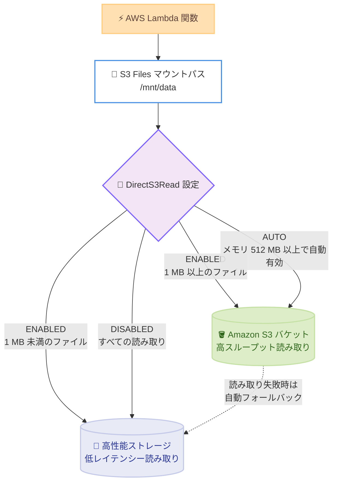

# AWS Lambda - Amazon S3 Files のダイレクトリード設定サポート

**リリース日**: 2026 年 9 月 11 日
**サービス**: AWS Lambda / Amazon S3 Files
**機能**: Amazon S3 Files のダイレクトリード (DirectS3Read) 設定

📊 [このアップデートのインフォグラフィックを見る](https://takech9203.github.io/aws-news-summary/20260911-aws-lambda-direct-read-s3files.html)

## 概要

AWS Lambda が、Amazon S3 Files を利用する際のダイレクトリード (直接読み取り) 設定をサポートしました。Lambda 関数が S3 Files 経由でファイルを読み取る際に、S3 Files の高性能ストレージから読み取るか、S3 バケットから直接読み取るかを明示的に制御できるようになり、ワークロードの特性に合わせて読み取りスループットとレイテンシーを最適化できます。

Amazon S3 Files は、S3 バケット上のオブジェクトを標準的なファイルシステム操作 (読み取り、書き込みなど) でアクセス可能にする共有ファイルシステムです。S3 Files は通常、低レイテンシーの読み取りを高性能ストレージから、大きなサイズの読み取りを S3 バケットから直接提供するよう、各操作を自動的にルーティングします。今回のアップデートにより、この動作を Lambda 関数ごとに明示的に制御できるようになりました。

S3 Files と Lambda を組み合わせてスケーラブルなデータ処理パイプラインやステートフルなエージェントワークロードを構築しているユーザーにとって、パフォーマンスチューニングの選択肢が広がる重要なアップデートです。

**アップデート前の課題**

このアップデート以前は、ダイレクトリードの動作をユーザーが制御できませんでした。

- ダイレクトリード (S3 バケットからの直接読み取り) は、メモリ 512 MB 以上の Lambda 関数でのみ自動的に有効化され、ユーザーによる制御手段がなかった
- メモリ 512 MB 未満の関数では、大きなファイルの読み取りでもダイレクトリードによる高スループットを利用できなかった
- 低レイテンシーを最優先したい場合でも、条件を満たすとダイレクトリードが自動適用され、すべての読み取りを高性能ストレージ経由に固定できなかった

**アップデート後の改善**

今回のアップデートにより、メモリ設定にかかわらずダイレクトリードを明示的に制御できるようになりました。

- ダイレクトリードを有効化すると、メモリ 512 MB 未満の関数でも 1 MB 以上のファイルを S3 バケットから直接読み取り、最大スループットを実現できる (1 MB 未満のファイルは引き続き高性能ストレージから読み取り)
- ダイレクトリードを無効化すると、すべての読み取りを高性能ストレージ経由にルーティングし、最小レイテンシーを実現できる
- AWS Management Console、AWS CLI、AWS SDK、AWS CloudFormation から設定可能

## アーキテクチャ図



Lambda 関数が S3 Files のマウントパス経由でファイルを読み取る際、DirectS3Read 設定に応じて読み取り経路が決まります。ENABLED では 1 MB 以上のファイルを S3 バケットから直接読み取り、DISABLED ではすべての読み取りが高性能ストレージを経由します。

## サービスアップデートの詳細

### 主要機能

1. **ダイレクトリードの明示的な有効化 (ENABLED)**
   - メモリ割り当てにかかわらず、Lambda 関数のダイレクトリードを有効化できる
   - 1 MB 以上のファイルは S3 バケットから直接読み取られ、最大スループットを実現
   - 1 MB 未満のファイルは引き続き高性能ストレージから読み取られる
   - ダイレクトリードが失敗した場合、Lambda は自動的にファイルシステム経由の読み取りにフォールバックする

2. **ダイレクトリードの明示的な無効化 (DISABLED)**
   - すべての読み取りを S3 Files の高性能ストレージ経由にルーティング
   - 可能な限り低いレイテンシーでの読み取りを実現
   - 小さなファイルへの頻繁なアクセスなど、レイテンシー重視のワークロードに適する

3. **デフォルト動作の維持 (AUTO)**
   - 従来どおり、メモリ 512 MB 以上の関数でダイレクトリードを自動的に有効化
   - 既存の関数の動作は変更されず、後方互換性が維持される

## 技術仕様

### DirectS3Read 設定値

`DirectS3Read` 設定は Lambda 関数の `FileSystemConfigs` の一部であり、Amazon S3 ファイルシステムにのみ適用されます。

| 設定値 | 動作 |
|--------|------|
| `AUTO` (デフォルト) | メモリ 512 MB 以上の関数でダイレクトリードを有効化 |
| `ENABLED` | メモリ 512 MB 未満の関数を含め、ダイレクトリードを有効化 |
| `DISABLED` | すべての読み取りを高性能ストレージ経由にルーティング |

### 必要な IAM 権限

Lambda 関数の実行ロールには、S3 Files のマウントに加えて、ダイレクトリード用に S3 オブジェクトへの直接アクセス権限が必要です。

| 権限 | 用途 |
|------|------|
| `s3files:ClientMount` | ファイルシステムのマウントに必要 |
| `s3files:ClientWrite` | 読み書きアクセスに必要 (読み取り専用の場合は不要) |
| `s3:GetObject` | S3 バケットからの直接読み取りに必要 |
| `s3:GetObjectVersion` | S3 バケットからの直接読み取りに必要 |

実行ロール用のポリシー例は以下のとおりです。

```json
{
    "Version": "2012-10-17",
    "Statement": [
        {
            "Sid": "S3FilesLambdaAccess",
            "Effect": "Allow",
            "Action": [
                "s3files:ClientMount",
                "s3files:ClientWrite"
            ],
            "Resource": "*"
        },
        {
            "Sid": "S3DirectRead",
            "Effect": "Allow",
            "Action": [
                "s3:GetObject",
                "s3:GetObjectVersion"
            ],
            "Resource": "arn:aws:s3:::amzn-s3-demo-bucket/*"
        }
    ]
}
```

`s3files:ClientMount` と `s3files:ClientWrite` は、マネージドポリシー `AmazonS3FilesClientReadWriteAccess` に含まれています。あわせて、実行ロールにはファイルシステムの VPC に接続するための権限も必要です。

## 設定方法

### 前提条件

1. Lambda 関数と同じアカウント、同じ AWS リージョンに、利用可能な状態の Amazon S3 ファイルシステムとマウントターゲットが存在すること
2. Lambda 関数がマウントターゲットと同じ VPC に接続されていること (関数がデプロイされる各サブネットにマウントターゲットが必要)
3. Lambda 関数とマウントターゲット間で NFS トラフィック (ポート 2049) を許可するセキュリティグループが設定されていること
4. 実行ロールに前述の IAM 権限が付与されていること

### 手順

#### ステップ 1: コンソールでファイルシステム設定を開く

1. Lambda コンソールの関数ページで対象の関数を選択
2. [設定] タブから [ファイルシステム] を選択
3. [ファイルシステムの追加] (既存設定の変更は [編集]) を選択し、[S3 Files] を選択

コンソールから対象の Lambda 関数に S3 Files ファイルシステムをアタッチする画面を開きます。

#### ステップ 2: ファイルシステムとダイレクトリードを設定する

1. **S3 ファイルシステム**: ドロップダウンからファイルシステムを選択
2. **アクセスポイント** (オプション): アクセスポイントを選択 (存在しない場合は Lambda が自動作成)
3. **ローカルマウントパス**: `/mnt/` で始まるマウントパスを指定 (例: `/mnt/data`)
4. **高度な設定** の **Direct S3 Reads** でダイレクトリードの動作を選択
5. [保存] を選択

保存後、次回の関数呼び出し時からファイルシステムがアタッチされ、指定したダイレクトリード設定が適用されます。

#### ステップ 3: 動作を確認する

```bash
# 関数のファイルシステム設定を確認
aws lambda get-function-configuration \
  --function-name my-function \
  --query 'FileSystemConfigs'
```

`get-function-configuration` コマンドで関数の `FileSystemConfigs` を取得し、S3 Files のマウント設定とダイレクトリード設定が意図どおりに反映されているかを確認します。設定は AWS CLI、AWS SDK、AWS CloudFormation からも変更できます。

## メリット

### ビジネス面

- **追加コストなしの性能最適化**: 標準の Lambda および S3 Files の料金のみで利用でき、追加料金なしで読み取り性能をワークロードに最適化できる
- **小メモリ構成でのコスト効率向上**: 従来はダイレクトリードのためにメモリを 512 MB 以上に増やす必要があったが、小さいメモリ設定のままで高スループット読み取りが可能になり、コストを抑えられる
- **幅広いワークロードへの適用**: データ処理パイプラインやステートフルなエージェントワークロードなど、ファイルアクセスパターンが異なるさまざまなワークロードで最適な構成を選択できる

### 技術面

- **読み取り経路の明示的な制御**: スループット重視 (ENABLED) とレイテンシー重視 (DISABLED) をユースケースに応じて使い分けられる
- **自動フォールバックによる可用性**: ダイレクトリードが失敗した場合はファイルシステム経由の読み取りに自動的にフォールバックするため、アプリケーション側での対応が不要
- **後方互換性**: デフォルトの AUTO では従来と同じ動作 (メモリ 512 MB 以上で自動有効化) が維持され、既存の関数に影響しない

## デメリット・制約事項

### 制限事項

- ダイレクトリード設定は Amazon S3 ファイルシステム (S3 Files) にのみ適用され、Amazon EFS のファイルシステム設定には適用されない
- ENABLED でも 1 MB 未満のファイルは高性能ストレージからの読み取りとなり、ダイレクトリードの対象は 1 MB 以上のファイルに限られる
- アジアパシフィック (ニュージーランド)、中東 (バーレーン)、中東 (UAE) の各リージョンでは利用できない

### 考慮すべき点

- ダイレクトリードを利用するには、実行ロールに `s3:GetObject` および `s3:GetObjectVersion` 権限が必要であり、S3 Files のマウント権限だけでは不足する
- S3 Files の利用には VPC 接続、マウントターゲット、NFS トラフィック (ポート 2049) を許可するセキュリティグループの設定が前提となる
- ワークロードの読み取りパターン (ファイルサイズ、アクセス頻度、レイテンシー要件) を把握したうえで ENABLED / DISABLED / AUTO を選択する必要がある

## ユースケース

### ユースケース 1: 小メモリ関数による大容量ファイルのバッチ処理

**シナリオ**: メモリ 256 MB の Lambda 関数で、S3 Files 上の数百 MB のログファイルやデータファイルをシーケンシャルに読み取って処理するデータ処理パイプライン。従来はメモリ 512 MB 未満のためダイレクトリードが利用できなかった。

**実装例**:
```text
DirectS3Read: ENABLED
メモリ: 256 MB
マウントパス: /mnt/data
```

**効果**: メモリを増やすことなく 1 MB 以上のファイルを S3 バケットから直接読み取れるようになり、読み取りスループットが向上する。メモリ料金を抑えたまま大容量ファイルの処理時間を短縮できる。

### ユースケース 2: レイテンシー重視のステートフルなエージェントワークロード

**シナリオ**: AI エージェントが会話状態や中間成果物を S3 Files 上の小さなファイルとして頻繁に読み書きするワークロード。読み取りレイテンシーの安定性が応答時間に直結する。

**実装例**:
```text
DirectS3Read: DISABLED
マウントパス: /mnt/state
```

**効果**: すべての読み取りが高性能ストレージを経由するため、ファイルサイズにかかわらず一貫した低レイテンシーの読み取りを実現できる。

### ユースケース 3: ファイルサイズが混在する既存ワークロードの段階的な最適化

**シナリオ**: 小さな設定ファイルと大きなデータファイルが混在する既存の Lambda ワークロード。まずは現状の動作を維持しつつ、性能測定の結果に応じて設定を最適化したい。

**実装例**:
```text
DirectS3Read: AUTO
メモリ: 1,024 MB
マウントパス: /mnt/mixed
```

**効果**: AUTO では従来どおりメモリ 512 MB 以上でダイレクトリードが有効化されるため、既存の動作を維持できる。性能測定の結果に基づいて ENABLED または DISABLED へ段階的に切り替えることで、リスクを抑えた最適化が可能になる。

## 料金

追加料金はありません。標準の AWS Lambda および Amazon S3 Files の料金が適用されます。

- Lambda: リクエスト数と実行時間 (GB - 秒) に基づく従量課金
- S3 Files: ファイルシステムのストレージとリクエストに基づく課金

詳細は各サービスの料金ページを参照してください。

## 利用可能リージョン

以下を除くすべての AWS 商用リージョン、および AWS GovCloud (US-East)、AWS GovCloud (US-West) で利用可能です。

**除外リージョン**:
- アジアパシフィック (ニュージーランド)
- 中東 (バーレーン)
- 中東 (UAE)

## 関連サービス・機能

- **Amazon S3 Files**: S3 オブジェクトへのファイルシステムアクセスを提供するサービス。本アップデートのダイレクトリード設定の対象
- **Amazon S3**: ダイレクトリード有効時に 1 MB 以上のファイルの読み取り元となるオブジェクトストレージ
- **Amazon VPC**: S3 Files のマウントターゲットへの接続に必要なネットワーク基盤
- **Amazon EFS**: Lambda で利用できるもう 1 つのファイルシステムオプション。ダイレクトリード設定の対象外
- **AWS CloudFormation**: ダイレクトリード設定を含む Lambda 関数のファイルシステム構成をコードで管理可能

## 参考リンク

- 📊 [インフォグラフィック](https://takech9203.github.io/aws-news-summary/20260911-aws-lambda-direct-read-s3files.html)
- [公式発表 (What's New)](https://aws.amazon.com/about-aws/whats-new/2026/09/aws-lambda-direct-read-s3files/)
- [ドキュメント: Configuring Amazon S3 Files access (AWS Lambda)](https://docs.aws.amazon.com/lambda/latest/dg/configuration-filesystem-s3files.html)
- [ドキュメント: How S3 Files delivers performance (Amazon S3)](https://docs.aws.amazon.com/AmazonS3/latest/userguide/s3-files-performance.html#s3-files-performance-how)
- [料金ページ: AWS Lambda](https://aws.amazon.com/lambda/pricing/)

## まとめ

AWS Lambda が Amazon S3 Files のダイレクトリード設定をサポートし、メモリ割り当てにかかわらず読み取り経路 (S3 バケット直接読み取りまたは高性能ストレージ経由) を明示的に制御できるようになりました。追加料金なしで利用でき、スループット重視とレイテンシー重視のどちらのワークロードにも最適化が可能です。S3 Files を Lambda と組み合わせて利用している場合は、ワークロードの読み取りパターンを確認し、ENABLED / DISABLED / AUTO のいずれが適しているかを検証することを推奨します。
