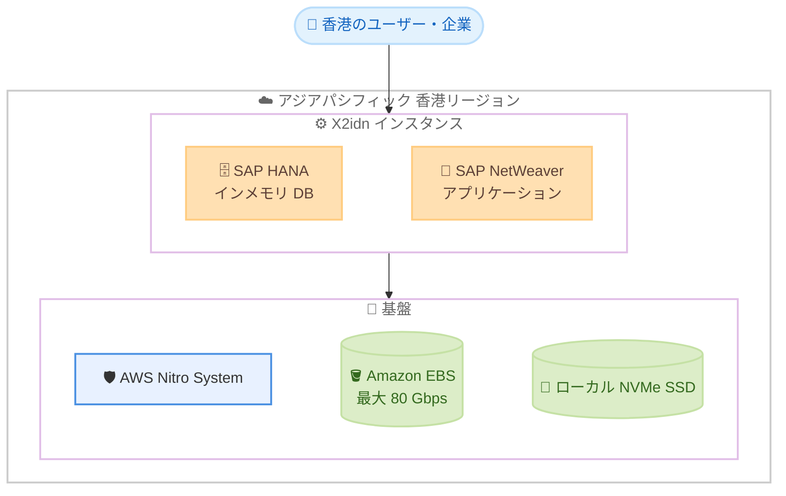

# Amazon EC2 - X2idn インスタンスがアジアパシフィック (香港) リージョンで利用可能に

**リリース日**: 2026 年 9 月 11 日
**サービス**: Amazon EC2
**機能**: メモリ最適化 X2idn インスタンスのアジアパシフィック (香港) リージョン対応

📊 [このアップデートのインフォグラフィックを見る](https://takech9203.github.io/aws-news-summary/20260911-ec2-x2idn-asia-pacific-hong-kong.html)

## 概要

メモリ最適化型の Amazon EC2 X2idn インスタンスが、アジアパシフィック (香港) リージョンで利用可能になりました。X2idn インスタンスは第 3 世代 Intel Xeon スケーラブルプロセッサ (Ice Lake、全コアターボ最大 3.5 GHz) を搭載し、AWS Nitro System 上に構築されたメモリ集約型ワークロード向けのインスタンスです。前世代の X1 インスタンスと比較して性能が向上しています。

X2idn インスタンスは SAP 認定を取得しており、Business Suite on HANA、SAP S/4HANA、Data Mart Solutions on HANA、Business Warehouse on HANA、SAP BW/4HANA、および SAP NetWeaver ワークロード (任意のデータベース) の実行が可能です。香港リージョンでミッションクリティカルな SAP 環境やインメモリデータベースを運用する企業にとって、選択肢が拡大するアップデートです。

**アップデート前の課題**

このアップデート以前は、香港リージョンにおいて以下の課題がありました。

- 香港リージョンでは X2idn インスタンスが利用できず、大容量メモリを必要とする SAP HANA などのワークロードでは旧世代の X1 インスタンスや他のインスタンスファミリーを選択する必要があった
- 最新世代のメモリ最適化インスタンスを利用するには、香港以外のリージョンにワークロードを配置する必要があり、データレジデンシー要件やレイテンシー要件を満たせない場合があった
- X1 世代と比較した価格性能比や EBS 帯域幅の改善を、香港リージョンのワークロードで享受できなかった

**アップデート後の改善**

今回のアップデートにより、以下が可能になりました。

- 香港リージョンで X2idn インスタンス (最大 2,048 GiB メモリ、128 vCPU) を起動できるようになった
- 香港のデータレジデンシー要件を満たしながら、SAP 認定済みの最新世代メモリ最適化インスタンスで SAP S/4HANA などの基幹システムを運用できるようになった
- X1 インスタンスと比較して最大 50% 優れたコンピューティング価格性能比と、4 倍以上の EBS スループット (最大 80 Gbps) を香港リージョンで活用できるようになった

## アーキテクチャ図



香港リージョンで X2idn インスタンス上に SAP HANA や SAP NetWeaver を配置し、AWS Nitro System、Amazon EBS、ローカル NVMe SSD を組み合わせて高性能なメモリ集約型ワークロードを実行する構成例です。

## サービスアップデートの詳細

### 主要機能

1. **第 3 世代 Intel Xeon スケーラブルプロセッサ搭載**
   - Ice Lake 世代のプロセッサを搭載し、全コアターボ周波数は最大 3.5 GHz
   - X1 インスタンスと比較して最大 50% 優れたコンピューティング価格性能比を実現
   - SAP HANA ワークロードでは、同等の X1 インスタンスと比較して最大 45% 高い SAPS 性能を提供

2. **AWS Nitro System による高効率な仮想化**
   - 仮想化機能を専用ハードウェアにオフロードし、ホストリソースのほぼすべてをインスタンスに提供
   - セキュリティと性能の両面で従来のハイパーバイザー方式より優れた基盤を提供

3. **SAP 認定インスタンス**
   - Business Suite on HANA、SAP S/4HANA、Data Mart Solutions on HANA、Business Warehouse on HANA、SAP BW/4HANA の実行が認定済み
   - SAP NetWeaver ワークロードは任意のデータベース (anyDB) で認定済み

4. **大容量メモリとローカル NVMe ストレージ**
   - vCPU あたり 16 GiB のメモリ比率で、最大 2,048 GiB のメモリを提供
   - すべてのサイズでローカル NVMe SSD インスタンスストレージを搭載
   - 最大 100 Gbps のネットワーク帯域幅と最大 80 Gbps の EBS 帯域幅 (X1 の 4 倍以上) を提供

## 技術仕様

### X2idn インスタンスサイズ

| インスタンスサイズ | vCPU | メモリ (GiB) | インスタンスストレージ | ネットワーク帯域幅 | EBS 帯域幅 |
|------|------|------|------|------|------|
| x2idn.16xlarge | 64 | 1,024 | 1 x 1900 NVMe SSD | 50 Gbps | 40 Gbps |
| x2idn.24xlarge | 96 | 1,536 | 2 x 1425 NVMe SSD | 75 Gbps | 60 Gbps |
| x2idn.32xlarge | 128 | 2,048 | 2 x 1900 NVMe SSD | 100 Gbps | 80 Gbps |
| x2idn.metal | 128 | 2,048 | 2 x 1900 NVMe SSD | 100 Gbps | 80 Gbps |

### その他の特徴

| 項目 | 詳細 |
|------|------|
| プロセッサ | 第 3 世代 Intel Xeon スケーラブルプロセッサ (Ice Lake、全コアターボ最大 3.5 GHz) |
| メモリ比率 | vCPU あたり 16 GiB (16:1) |
| EFA サポート | x2idn.32xlarge で Elastic Fabric Adapter に対応 |
| ベアメタル | x2idn.metal で非仮想化環境を提供 |

## 設定方法

### 前提条件

1. AWS アカウントを保有していること
2. アジアパシフィック (香港) リージョンが AWS アカウントで有効化されていること (2019 年 3 月 20 日以降に作成されたアカウントでは、香港リージョンはオプトインが必要)
3. X2idn インスタンスの vCPU 数に対応するサービスクォータが確保されていること

### 手順

#### ステップ1: 香港リージョンで利用可能な X2idn インスタンスタイプを確認する

```bash
aws ec2 describe-instance-type-offerings \
  --region ap-east-1 \
  --filters "Name=instance-type,Values=x2idn.*" \
  --query "InstanceTypeOfferings[].InstanceType" \
  --output table
```

香港リージョン (ap-east-1) で提供されている X2idn インスタンスタイプの一覧を取得し、利用可能なサイズを確認します。

#### ステップ2: X2idn インスタンスを起動する

```bash
aws ec2 run-instances \
  --region ap-east-1 \
  --instance-type x2idn.16xlarge \
  --image-id ami-xxxxxxxxxxxxxxxxx \
  --key-name my-key-pair \
  --subnet-id subnet-xxxxxxxx \
  --security-group-ids sg-xxxxxxxx \
  --ebs-optimized
```

香港リージョンで x2idn.16xlarge インスタンスを起動します。SAP HANA 用途では、SAP 認定の AMI や AWS Launch Wizard for SAP の利用を推奨します。

#### ステップ3: インスタンスの状態を確認する

```bash
aws ec2 describe-instances \
  --region ap-east-1 \
  --filters "Name=instance-type,Values=x2idn.16xlarge" \
  --query "Reservations[].Instances[].{ID:InstanceId,State:State.Name,AZ:Placement.AvailabilityZone}" \
  --output table
```

起動したインスタンスの ID、状態、アベイラビリティゾーンを一覧表示し、正常に起動していることを確認します。

## メリット

### ビジネス面

- **データレジデンシー要件への対応**: 香港国内にデータを保持する必要がある金融機関や企業が、最新世代のメモリ最適化インスタンスで SAP 基幹システムを運用可能
- **コスト最適化**: X1 と比較して最大 50% 優れた価格性能比により、SAP HANA などの大規模ワークロードの運用コストを削減
- **ライセンスコスト削減**: 大容量サイズへのワークロード集約により、コア単位のソフトウェアライセンス費用を最適化

### 技術面

- **高い SAP 性能**: 同等の X1 インスタンスと比較して最大 45% 高い SAPS 性能を SAP HANA ワークロードで実現
- **高速なストレージアクセス**: 最大 80 Gbps の EBS 帯域幅 (X1 の 4 倍以上) とローカル NVMe SSD により、データベースの読み書き性能が向上
- **低レイテンシー**: 香港および周辺地域のユーザーに近い場所でワークロードを実行し、応答性能を改善

## デメリット・制約事項

### 制限事項

- 今回の発表で追加されたのはアジアパシフィック (香港) リージョンのみで、他の未対応リージョンでは引き続き利用できない
- X2idn のメモリ比率は 16:1 であり、より高いメモリ比率 (32:1) が必要な場合は X2iedn などの選択が必要
- 最小サイズが x2idn.16xlarge (64 vCPU、1,024 GiB) であり、小規模ワークロードにはオーバースペックとなる場合がある

### 考慮すべき点

- 香港リージョンはオプトインリージョンであるため、2019 年 3 月 20 日以降に作成されたアカウントでは事前の有効化が必要
- リージョンごとに料金が異なるため、香港リージョンでの X2idn の料金を事前に確認することを推奨
- 大型インスタンスの起動には vCPU ベースのサービスクォータの引き上げが必要になる場合がある

## ユースケース

### ユースケース1: SAP S/4HANA 基幹システムの香港リージョンでの運用

**シナリオ**: 香港に拠点を置く企業が、データレジデンシー要件を満たしながら SAP S/4HANA を AWS 上で運用したい。

**実装例**:
```
1. 香港リージョン (ap-east-1) を AWS アカウントで有効化
2. AWS Launch Wizard for SAP を使用して x2idn.32xlarge 上に SAP HANA をデプロイ
3. マルチ AZ 構成で高可用性を確保し、AWS Backup でバックアップを構成
```

**効果**: SAP 認定インスタンス上で基幹システムを香港国内に配置し、コンプライアンス要件と性能要件を両立できる。

### ユースケース2: X1 インスタンスからの移行によるコスト最適化

**シナリオ**: 香港リージョンで X1 インスタンス相当の大容量メモリワークロードを運用しており、価格性能比を改善したい。

**実装例**:
```
1. 既存ワークロードのメモリ使用量と vCPU 使用率を CloudWatch で分析
2. 同等メモリ容量の X2idn サイズを選定 (例: 2,048 GiB なら x2idn.32xlarge)
3. メンテナンスウィンドウでインスタンスタイプを変更し、性能を検証
```

**効果**: 最大 50% 優れたコンピューティング価格性能比と 4 倍以上の EBS スループットにより、コストと性能の両面で改善が見込める。

### ユースケース3: 大規模インメモリ分析基盤の構築

**シナリオ**: 金融データのリアルタイム分析のため、テラバイト級のインメモリデータベースを香港で稼働させたい。

**実装例**:
```
1. x2idn.24xlarge (1,536 GiB) 上にインメモリデータベースを構築
2. ローカル NVMe SSD を一時データやログ領域として活用
3. 最大 75 Gbps のネットワーク帯域幅でデータ取り込みパイプラインと接続
```

**効果**: 大容量メモリと高速ストレージにより、大規模データセットの低レイテンシー分析を単一インスタンスで実現できる。

## 料金

X2idn インスタンスは、オンデマンド、Savings Plans、リザーブドインスタンス、スポットインスタンスの各購入オプションで利用できます。料金はリージョンおよびインスタンスサイズにより異なります。アジアパシフィック (香港) リージョンでの最新の料金は、Amazon EC2 料金ページを参照してください。

## 利用可能リージョン

今回の発表により、X2idn インスタンスはアジアパシフィック (香港) リージョン (ap-east-1) で新たに利用可能になりました。その他の利用可能リージョンは [AWS のリージョン別サービス一覧](https://aws.amazon.com/about-aws/global-infrastructure/regional-product-services/)を参照してください。

## 関連サービス・機能

- **AWS Nitro System**: X2idn の基盤となる仮想化技術。ハードウェアオフロードにより高い性能とセキュリティを提供
- **AWS Launch Wizard for SAP**: SAP HANA ベースのワークロードを AWS のベストプラクティスに沿って自動デプロイするサービス
- **Amazon EBS**: X2idn は最大 80 Gbps の EBS 帯域幅に対応し、io2 Block Express などの高性能ボリュームと組み合わせ可能
- **Elastic Fabric Adapter (EFA)**: x2idn.32xlarge で利用可能な高性能ネットワークインターフェイス

## 参考リンク

- 📊 [インフォグラフィック](https://takech9203.github.io/aws-news-summary/20260911-ec2-x2idn-asia-pacific-hong-kong.html)
- [公式発表 (What's New)](https://aws.amazon.com/about-aws/whats-new/2026/09/ec2-x2idn-asia-pacific-hong-kong/)
- [Amazon EC2 X2i インスタンス製品ページ](https://aws.amazon.com/ec2/instance-types/x2i/)
- [Amazon EC2 料金ページ](https://aws.amazon.com/ec2/pricing/on-demand/)
- [SAP on AWS](https://aws.amazon.com/sap/)

## まとめ

メモリ最適化型の EC2 X2idn インスタンスがアジアパシフィック (香港) リージョンで利用可能になり、SAP HANA をはじめとするメモリ集約型ワークロードを香港国内で最新世代インスタンス上に構築できるようになりました。香港リージョンで X1 インスタンスや他リージョンの X2idn を利用している場合は、価格性能比 (最大 50% 向上) と EBS スループット (4 倍以上) の改善を踏まえ、移行の検討を推奨します。
