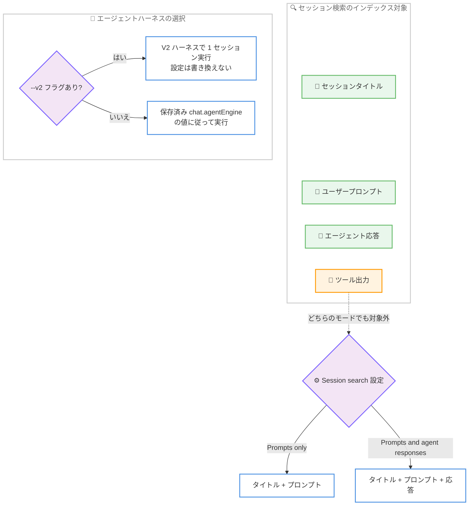

# Kiro - セッション検索スコープ、V2 ハーネスフラグ、設定メニューのキーボード操作統一

**リリース日**: 2026 年 9 月 11 日
**サービス**: Kiro (CLI)
**機能**: Session Search Scope, V2 Harness Flag, and Unified Settings Keyboard (Kiro CLI 2.21.4)

📊 [このアップデートのインフォグラフィックを見る](https://takech9203.github.io/aws-news-summary/20260911-kiro-changelog-2026-09-11.html)

## 概要

2026 年 9 月 11 日、AWS が提供する AI 搭載 IDE「Kiro」の CLI バージョン 2.21.4 がリリースされました。本バージョンでは、セッション検索の対象範囲を選択できる設定、単一の実行のみ V2 エージェントハーネスを利用する `--v2` フラグ、そしてすべての設定メニューで統一されたキーボード操作という 3 つの主要な改善が導入されました。

V3 のセッション検索は、セッションタイトルとユーザーのプロンプトに加えてエージェントの応答もインデックス化するようになり、「自分が何を聞いたか」だけでなく「Kiro が何を答えたか」からも過去のセッションを見つけられるようになりました。また、`--v2` フラグにより、デフォルト設定を変更することなく一時的に V2 エージェントハーネスで 1 セッションだけ実行できます。さらに、`/settings` をはじめとするすべての設定メニューが同じキー操作で統一され、操作の学習コストが下がりました。

**アップデート前の課題**

このアップデート以前には、以下の課題や制限がありました。

- セッション検索はユーザーのプロンプトのみが対象であり、エージェントの応答内容からセッションを探すことができなかった
- V2 エージェントハーネスを一時的に試すには、保存済みの `chat.agentEngine` 設定を書き換える必要があり、実行後に元へ戻す手間があった
- 設定メニューごとにキーボード操作が異なり、メニューによって操作方法を覚え直す必要があった

**アップデート後の改善**

今回のアップデートにより、以下が可能になりました。

- セッション検索の対象を「プロンプトのみ」と「プロンプトとエージェント応答」から選択でき、エージェントの回答内容からもセッションを検索できるようになった
- `--v2` フラグで保存済み設定を書き換えずに 1 回の実行だけ V2 ハーネスを利用できるようになった
- すべての設定メニュー (`/settings`、Display、Status line、Theme、`/verbosity`) が同じキーボード操作で統一された

## アーキテクチャ図



セッション検索のインデックス対象の切り替えと、`--v2` フラグによるハーネス選択の優先順位を示しています。ツール出力はどちらの検索モードでもインデックス化されません。

## サービスアップデートの詳細

### 主要機能

1. **セッション検索スコープの選択**
   - V3 では `/sessions` の検索が、セッションタイトル、ユーザーのプロンプト、エージェントの応答をインデックス化する
   - 「自分が何を聞いたか」だけでなく「Kiro が何を答えたか」からセッションを見つけられる
   - `/settings` を開いて「Session search」を選択すると、「Prompts only」(プロンプトのみ) と「Prompts and agent responses」(プロンプトとエージェント応答) を切り替えられる
   - ツール出力はどちらのモードでもインデックス化されない
   - ローカルインデックスが現在プロンプトのみを対象としている場合、`/sessions` は再構築の前に一度だけ確認を求める

2. **単一実行のための V2 エージェントハーネス選択フラグ**
   - `--v2` を渡すと、1 セッションだけ V2 エージェントハーネスで実行できる
   - `kiro-cli` と `kiro-cli chat` の両方で動作する
   - 保存済みの `chat.agentEngine` の値より優先されるが、その値を上書きしないため、デフォルト設定は変更されない

3. **設定メニューのキーボード操作統一 (Improvements)**
   - すべての設定メニューが同じキー操作に応答する
   - Up / Down キーで行間を移動する
   - Right または Enter キーで値の変更、オプションの選択、サブメニューの展開を行う
   - Left キーで値を逆方向に変更し、Esc キーで前の画面に戻る
   - 対象は `/settings`、Display、Status line、Theme、`/verbosity` の各メニュー

4. **その他の改善 (Improvements)**
   - **応答インジケーター**: エージェントのカラーの小さなドットが各エージェント応答の目印として表示される
   - **Verbosity プレビュー**: `/verbosity` 内で `Ctrl+X` を押すと、プレビューが hidden、mini、expanded の順に切り替わる

5. **修正 (Fixes)**
   - ターンが失敗した場合、そのターンが保持していた承認待ちや質問のプロンプトが自動的に閉じられ、対応するツールカードがキャンセル済みとしてマークされる。これにより、ストリームやバックエンドの障害発生時に、応答不能なリクエスト上ではなくプロンプトに戻れる。Crew セッションや実行中の Spec タスクが保持するプロンプトは開いたまま維持される
   - `--resume-id`、`/chat`、またはセッションピッカーでタンジェントセッションを再開した際に、ステータスラインに `↯ tangent-N` チップが表示される

## 技術仕様

### セッション検索スコープ

| 項目 | 詳細 |
|------|------|
| 対象バージョン | Kiro CLI 2.21.4 (V3) |
| 検索モード | Prompts only / Prompts and agent responses |
| インデックス対象 | セッションタイトル、ユーザープロンプト、(モードにより) エージェント応答 |
| インデックス対象外 | ツール出力 (どちらのモードでも対象外) |
| 設定場所 | `/settings` → Session search |
| インデックス再構築 | 既存インデックスがプロンプトのみの場合、`/sessions` 実行時に一度だけ確認 |

### V2 ハーネスフラグ

| 項目 | 詳細 |
|------|------|
| フラグ | `--v2` |
| 対象コマンド | `kiro-cli` および `kiro-cli chat` |
| 適用範囲 | 単一セッション (1 回の実行) のみ |
| 設定との関係 | 保存済み `chat.agentEngine` より優先されるが、値は上書きしない |

### 設定メニューのキーボード操作

| キー | 動作 |
|------|------|
| Up / Down | 行間の移動 |
| Right / Enter | 値の変更、オプションの選択、サブメニューの展開 |
| Left | 値を逆方向に変更 |
| Esc | 前の画面に戻る |
| Ctrl+X | `/verbosity` 内でプレビューを hidden → mini → expanded と切り替え |

## 設定方法

### 前提条件

1. Kiro CLI がインストールされていること
2. Kiro CLI 2.21.4 以降にアップデートされていること
3. セッション検索スコープの切り替えは V3 のセッション検索が対象であること

### 手順

#### ステップ 1: セッション検索スコープを切り替える

```bash
# Kiro CLI のチャット内で設定メニューを開く
/settings
```

`/settings` を開き、「Session search」を選択して「Prompts only」と「Prompts and agent responses」を切り替えます。既存のローカルインデックスがプロンプトのみを対象としている場合、次回の `/sessions` 実行時に再構築の確認が一度だけ表示されます。

#### ステップ 2: エージェント応答からセッションを検索する

```bash
# セッション一覧と検索を開く
/sessions
```

`/sessions` の検索でキーワードを入力すると、設定したスコープに応じて、プロンプトだけでなくエージェントの応答内容からもセッションを検索できます。

#### ステップ 3: V2 ハーネスで単一セッションを実行する

```bash
# V2 エージェントハーネスで 1 セッションのみ実行する
kiro-cli --v2

# chat サブコマンドでも利用可能
kiro-cli chat --v2
```

`--v2` フラグを付けて起動すると、そのセッションのみ V2 エージェントハーネスで実行されます。保存済みの `chat.agentEngine` の値は上書きされないため、次回以降の実行は元のデフォルト設定のまま動作します。

## メリット

### ビジネス面

- **過去の知見の再利用性向上**: エージェントの回答内容からセッションを検索できるため、過去に得た解決策や説明を素早く再発見でき、同じ調査を繰り返す時間を削減できる
- **移行リスクの低減**: `--v2` フラグにより、デフォルト設定を変更せずに V2 ハーネスの挙動を安全に検証でき、チームでのハーネス移行判断を段階的に進められる
- **学習コストの削減**: 設定メニューの操作が統一されたことで、新しいメンバーでも迷わず設定変更ができる

### 技術面

- **検索インデックスの柔軟な制御**: インデックス対象を「プロンプトのみ」に絞ることで、必要に応じてインデックスの範囲を最小限に保てる
- **設定の非破壊的な一時切り替え**: `--v2` は保存済み設定より優先されるが上書きしないため、設定ファイルの手動編集や復元作業が不要
- **一貫した TUI 操作体系**: `/settings`、Display、Status line、Theme、`/verbosity` のすべてが同じキーバインドで動作し、ターミナル上での操作性が向上

## デメリット・制約事項

### 制限事項

- ツール出力はどちらの検索モードでもインデックス化されないため、ツールの実行結果からセッションを検索することはできない
- `--v2` フラグの効果は単一セッション (1 回の実行) に限定され、恒久的な切り替えには `chat.agentEngine` 設定の変更が必要
- セッション検索スコープの選択は V3 のセッション検索が対象

### 考慮すべき点

- 検索スコープを「Prompts and agent responses」へ切り替えた場合、既存インデックスがプロンプトのみのときは `/sessions` 実行時にインデックスの再構築が発生する
- エージェント応答をインデックスに含めると検索対象が広がる一方、ヒット件数が増えるため、検索キーワードの工夫が必要になる場合がある

## ユースケース

### ユースケース 1: エージェントの回答内容から過去のセッションを再発見する

**シナリオ**: 数週間前に Kiro がデータベース接続エラーの解決策を提示してくれたが、自分のプロンプトにはエラー名を書いておらず、質問文からはセッションを見つけられない。

**実装例**:
```
/settings で Session search を「Prompts and agent responses」に設定
/sessions でエラー名や解決策のキーワードを検索
```

**効果**: エージェントが回答に含めたキーワードからセッションを特定でき、過去の解決策をすぐに参照できる。

### ユースケース 2: デフォルト設定を維持したまま V2 ハーネスを検証する

**シナリオ**: 普段は V3 (または保存済みのハーネス設定) で作業しているが、特定のタスクで V2 ハーネスの挙動を比較検証したい。設定ファイルの書き換えと復元は避けたい。

**実装例**:
```bash
kiro-cli chat --v2
```

**効果**: 1 セッションだけ V2 ハーネスで実行され、`chat.agentEngine` の保存値は変更されないため、検証後の設定復元作業が不要になる。

### ユースケース 3: 統一されたキー操作で設定を素早く調整する

**シナリオ**: ペアプログラミング中にテーマや表示の詳細度を頻繁に切り替えるが、メニューごとに操作が異なると手が止まってしまう。

**実装例**:
```
/settings → Up/Down で項目移動、Right/Enter で変更、Esc で戻る
/verbosity → Ctrl+X でプレビューを hidden / mini / expanded に切り替え
```

**効果**: すべての設定メニューを同じキー操作で扱えるため、設定変更の所要時間が短縮され、作業の流れを妨げない。

## 利用可能リージョン

Kiro はグローバルに提供されるサービスであり、リージョンの制約はありません。

## 関連サービス・機能

- **Kiro IDE**: Kiro CLI と同じエコシステムを構成する AI 搭載 IDE。スペック駆動開発やエージェントフックなどの機能を提供
- **Kiro CLI セッション管理**: `/sessions` によるセッションの一覧、検索、再開機能。今回のアップデートで検索スコープの選択が可能になった
- **Kiro Crew**: 複数エージェントによる協調作業機能。ターン失敗時のプロンプト処理では Crew セッションが保持するプロンプトは開いたまま維持される

## 参考リンク

- 📊 [インフォグラフィック](https://takech9203.github.io/aws-news-summary/20260911-kiro-changelog-2026-09-11.html)
- [Kiro Changelog - CLI 2.21.4](https://kiro.dev/changelog/cli/2-21-4/)
- [Kiro Changelog](https://kiro.dev/changelog/)
- [Kiro CLI セッション管理ドキュメント](https://kiro.dev/docs/cli/chat/session-management)
- [Kiro CLI コマンドリファレンス](https://kiro.dev/docs/reference/cli-commands)

## まとめ

Kiro CLI 2.21.4 は、エージェント応答を含むセッション検索、デフォルト設定を変更しない `--v2` ハーネスフラグ、統一された設定メニューのキーボード操作という、日々の CLI 利用の快適さを高めるアップデートです。過去のセッションから知見を再利用する機会が多いユーザーは、まず `/settings` で Session search のスコープを確認し、必要に応じて「Prompts and agent responses」へ切り替えることを推奨します。
