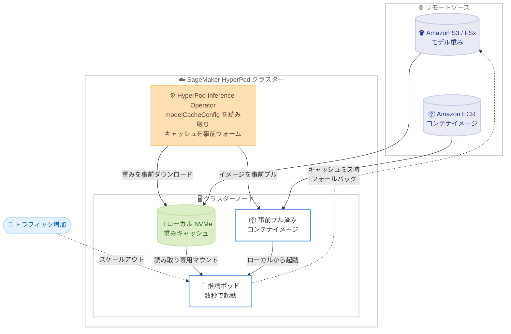

# Amazon SageMaker HyperPod - モデルキャッシング機能による推論オートスケーリングの高速化

**リリース日**: 2026 年 9 月 11 日
**サービス**: Amazon SageMaker HyperPod
**機能**: モデルキャッシング (Model Caching) による推論のコールドスタート削減

📊 [このアップデートのインフォグラフィックを見る](https://takech9203.github.io/aws-news-summary/20260911-sgm-hyperpod-model-caching-inf.html)

## 概要

Amazon SageMaker HyperPod が、推論ワークロード向けの最適化機能であるモデルキャッシングをサポートしました。モデルの重みファイルとコンテナイメージをクラスターノードに事前ロードすることで、推論ポッドの起動時間を数分から数秒に短縮します。チャットアシスタント、エージェントパイプライン、RAG、ドキュメント分析など、大規模 LLM 推論を運用するユーザーにとって、スケールアウト時のコールドスタートという大きなボトルネックを解消するアップデートです。

本機能は 2 つの独立したキャッシュ機構で構成されます。重みキャッシュ (weightsCache) はモデルの重みをノードのローカル NVMe ストレージに事前配置し、ポッドが Amazon S3 や Amazon FSx からネットワーク経由でダウンロードする代わりに高速なローカルストレージから読み込めるようにします。イメージキャッシュ (imageCache) は推論サーバーのコンテナイメージをノードに事前プルし、コールドイメージプルを回避します。ウォームキャッシュのないノードにポッドがスケジュールされた場合は、元のソースから自動的に取得するフォールバック動作により、デプロイの信頼性が維持されます。

AWS のベンチマーク (57 GB ~ 145 GB のモデル) では、スケールアウトが約 60% 高速化し、イメージキャッシュにより 2 分超のイメージプル時間が削減 (97% 削減) されることが示されています。HyperPod Inference Operator の `InferenceEndpointConfig` または `JumpStartModel` リソースに `modelCacheConfig` を追加するだけで有効化でき、キャッシュのライフサイクルはオペレーターが自動管理します。

**アップデート前の課題**

- スケールアウトのたびに、新しいポッドがコンテナイメージのプルとモデル重みのダウンロード (S3 または FSx から) を完了するまでトラフィックを処理できなかった
- 大規模モデルでは、重みのダウンロードだけで数十分かかる場合があり、急激なトラフィック増加に追従できなかった
- 同一ノード上の複数ポッドがそれぞれリモートソースから重みをダウンロードするため、冗長なネットワーク転送が発生していた

**アップデート後の改善**

- モデル重みをノードローカルの NVMe に事前配置し、ポッドが数秒で起動できるようになった (スケールアウトが約 60% 高速化)
- コンテナイメージの事前プルにより、2 分超のイメージプル時間を 97% 削減できるようになった
- キャッシュミス時は元のソースへ自動フォールバックするため、キャッシュ未整備でもデプロイが停止しない
- `modelCacheConfig` を追加するだけで有効化でき、キャッシュの作成・削除をオペレーターが自動管理する

## アーキテクチャ図



HyperPod Inference Operator がモデル重みとコンテナイメージをノードへ事前配置し、スケールアウト時に新しいポッドがローカルキャッシュから数秒で起動する流れを示しています。ウォームキャッシュのないノードでは、リモートソースへ自動フォールバックします。

## サービスアップデートの詳細

### 主要機能

1. **重みキャッシュ (weightsCache)**
   - モデルの重みファイルをノードローカルの NVMe ストレージ (デフォルト: `/opt/dlami/nvme`) に事前配置する
   - 推論ポッドはキャッシュされた重みを読み取り専用でマウントし、リモートダウンロードを省略する
   - デプロイごとに分離されたキャッシュディレクトリを使用するため、同一ノード上の複数デプロイが干渉しない
   - キャッシュがウォームになったノードにはラベルが付与され、優先的なノードアフィニティによりポッドがウォームノードへ優先スケジュールされる

2. **イメージキャッシュ (imageCache)**
   - 推論サーバーのコンテナイメージを対象ノードへ事前プルする
   - 新しいポッドはコールドイメージプルを待たずに起動できる (ベンチマークで 2 分超のプル時間を 97% 削減)
   - 重みキャッシュとは独立しており、単独でも組み合わせても利用できる

3. **自動フォールバックとライフサイクル管理**
   - ウォームキャッシュのないノードにポッドがスケジュールされた場合は、元のモデルソースから直接ロードする
   - ノード交換後は、オペレーターが新ノードのキャッシュを再ウォームするまで既存のウォームノードがトラフィックを処理する
   - デプロイ削除時には、オペレーターがキャッシュ済みの重みファイルをノードから自動的にクリーンアップする

4. **幅広いモデルソースへの対応**
   - SageMaker JumpStart のデプロイ (オープンウェイトモデル・ゲート付きモデルの両方) に対応
   - Amazon S3 または Amazon FSx 上のカスタムモデルにも対応

## 技術仕様

### modelCacheConfig の設定項目

| フィールド | デフォルト | 説明 |
|------|------|------|
| `weightsCache.enabled` | `false` | ノードローカルの重みキャッシュを有効化するかどうか。`true` の場合、オペレーターが重みを事前配置しポッドにマウントする |
| `weightsCache.hostPath` | `/opt/dlami/nvme` | キャッシュされた重みの保存先ホストパス。255 文字以内の空でない絶対パスが必要 |
| `imageCache.enabled` | `false` | コンテナイメージキャッシュを有効化するかどうか。`true` の場合、オペレーターがイメージを対象ノードへ事前プルする |

### ベンチマーク結果

| 項目 | 結果 |
|------|------|
| 対象モデルサイズ | 57 GB ~ 145 GB |
| スケールアウト時間 | 約 60% 高速化 |
| イメージプル時間 | 2 分超を削減 (97% 削減) |

### 設定例

```yaml
spec:
  # ... モデルソース、ワーカー、TLS の設定 ...
  modelCacheConfig:
    weightsCache:
      enabled: true
      hostPath: /opt/dlami/nvme
    imageCache:
      enabled: true
```

## 設定方法

### 前提条件

1. **ローカル NVMe ストレージを持つインスタンスタイプ**: 重みキャッシュは設定された `hostPath` にローカル NVMe ストレージが存在することを前提とする。EBS のみのインスタンスはサポートされない
2. **十分な NVMe 容量**: デプロイごとに独立したキャッシュディレクトリを使用するため、同一ノード上の複数デプロイはそれぞれストレージを消費する
3. **対応バージョンの Inference Operator**: `modelCacheConfig` フィールドが認識されない場合は、Inference Operator アドオンを最新バージョンに更新する

### 手順

#### ステップ 1: modelCacheConfig の追加

```yaml
spec:
  modelCacheConfig:
    weightsCache:
      enabled: true
      hostPath: /opt/dlami/nvme
    imageCache:
      enabled: true
```

`InferenceEndpointConfig` または `JumpStartModel` リソースの `spec` に `modelCacheConfig` ブロックを追加します。重みキャッシュとイメージキャッシュは独立して有効化できます。

#### ステップ 2: キャッシュのウォーム状態を確認

```bash
kubectl get nodes --show-labels | grep "cache-ready"
```

キャッシュがウォームになったノードには、重みキャッシュの場合は `inference.sagemaker.aws.amazon.com/weights-cache-ready.`、イメージキャッシュの場合は `inference.sagemaker.aws.amazon.com/image-cache-ready.` というプレフィックスのラベルが付与されます。出力がない場合、まだキャッシュがウォームになったノードはありません。

#### ステップ 3: ポッドのキャッシュマウントを確認

```bash
kubectl describe pod {inference-pod-name} -n {namespace}
```

推論ポッドがホストローカルのキャッシュパスを読み取り専用でマウントしていることを確認します。hostPath ボリュームが存在しない場合、そのポッドはリモートストレージから重みをロードしています。

#### ステップ 4: オペレーターログの確認

```bash
kubectl logs -n hyperpod-inference-system deployment/hyperpod-inference-controller-manager | grep -i "cache"
```

Inference Operator のログから、キャッシュのウォームアップ処理やエラーの有無を確認します。

## メリット

### ビジネス面

- **応答性の高いスケーリング**: トラフィック急増時に数秒でポッドを追加でき、ユーザー体験の劣化を防止できる
- **コスト効率の向上**: コールドスタートを見越した過剰なプロビジョニングが不要になり、必要な時に必要な分だけスケールできる
- **大規模モデルほど効果が大きい**: 57 GB ~ 145 GB クラスのモデルで約 60% のスケールアウト高速化が実証されており、モデルサイズが大きいほど効果が増す

### 技術面

- **ネットワーク転送の削減**: 同一ノード上のポッドがローカル NVMe から重みを読み込むため、S3 / FSx への冗長なダウンロードが不要になる
- **運用負荷ゼロのライフサイクル管理**: キャッシュの作成、ノードラベル付与、削除時のクリーンアップまでオペレーターが自動管理する
- **信頼性を損なわないフォールバック**: キャッシュミス時は元のソースから取得するため、ポッドがスタックしたり失敗したりするリスクがない

## デメリット・制約事項

### 制限事項

- 重みキャッシュにはローカル NVMe ストレージを持つインスタンスタイプが必要 (EBS のみのインスタンスは非対応)
- キャッシュ可能なモデルの最大サイズは、インスタンスタイプの NVMe 空き容量に制限される
- `modelCacheConfig` に対応したバージョンの HyperPod Inference Operator が必要

### 考慮すべき点

- キャッシュのウォームアップ時間は、モデルサイズとリモートソースへのネットワークスループットに依存する
- 同一ノードに複数のキャッシュ済みデプロイを配置するとディスク圧迫が発生する可能性があるため、インスタンスグループの分離やデプロイ数の調整を検討する
- ノード交換後は新ノードのキャッシュ再ウォームが完了するまで、優先スケジューリングの対象にならない

## ユースケース

### ユースケース 1: トラフィック変動の大きいチャットアシスタント

**シナリオ**: 業務時間帯にトラフィックが集中するチャットアシスタントで、大規模 LLM (100 GB 超) を HyperPod 上でサービングしている。従来はスケールアウトに数十分かかり、ピーク時に応答遅延が発生していた。

**実装例**:
```yaml
spec:
  modelCacheConfig:
    weightsCache:
      enabled: true
      hostPath: /opt/dlami/nvme
    imageCache:
      enabled: true
```

**効果**: 重みとイメージの両方をキャッシュすることで、スケールアウト時間を約 60% 短縮し、ピーク時のトラフィック増加に数秒~数分で追従できる。

### ユースケース 2: 頻繁にスケールするエージェントパイプライン

**シナリオ**: エージェントワークフローや RAG パイプラインで推論リクエストが断続的に発生し、ポッドのスケールイン・スケールアウトが頻繁に繰り返される。推論サーバーのコンテナイメージが大きく、イメージプルが起動のボトルネックになっている。

**実装例**:
```yaml
spec:
  modelCacheConfig:
    imageCache:
      enabled: true
```

**効果**: イメージキャッシュ単独の有効化により、2 分超のイメージプル時間を 97% 削減し、頻繁なスケールイベントでも安定した起動時間を実現できる。

### ユースケース 3: JumpStart モデルの高速デプロイ

**シナリオ**: SageMaker JumpStart のゲート付きモデルを複数チームで利用しており、デプロイやレプリカ追加のたびに重みのダウンロード待ちが発生している。

**実装例**:
```yaml
apiVersion: inference.sagemaker.aws.amazon.com/v1alpha1
kind: JumpStartModel
spec:
  # ... モデル設定 ...
  modelCacheConfig:
    weightsCache:
      enabled: true
      hostPath: /opt/dlami/nvme
```

**効果**: JumpStart モデル (オープンウェイト・ゲート付きの両方) でも重みキャッシュが機能し、レプリカ追加時の起動を数秒レベルに短縮できる。

## 料金

モデルキャッシング機能自体に追加料金はありません。SageMaker HyperPod のクラスターリソース (インスタンス料金など) に対する標準の課金が適用されます。キャッシュはノードのローカル NVMe ストレージを使用するため、追加のストレージ料金は発生しません。詳細は [Amazon SageMaker の料金ページ](https://aws.amazon.com/sagemaker/pricing/) を参照してください。

## 利用可能リージョン

Amazon SageMaker HyperPod が利用可能なすべての AWS リージョンで一般提供されています。

## 関連サービス・機能

- **SageMaker HyperPod Inference Operator**: モデルキャッシングを管理する Kubernetes オペレーター。`InferenceEndpointConfig` や `JumpStartModel` リソースを通じて推論エンドポイントをデプロイする
- **Amazon SageMaker JumpStart**: 事前学習済みモデルのカタログ。JumpStart モデルのデプロイでもモデルキャッシングを利用できる
- **Amazon S3 / Amazon FSx**: モデル重みのリモートソース。キャッシュミス時のフォールバック先としても機能する
- **Amazon ECR**: 推論サーバーコンテナイメージのソース。イメージキャッシュにより事前プルされる

## 参考リンク

- 📊 [インフォグラフィック](https://takech9203.github.io/aws-news-summary/20260911-sgm-hyperpod-model-caching-inf.html)
- [公式発表 (What's New)](https://aws.amazon.com/about-aws/whats-new/2026/09/sgm-hyperpod-model-caching-inf/)
- [ドキュメント: Model weights caching and image caching](https://docs.aws.amazon.com/sagemaker/latest/dg/sagemaker-hyperpod-model-deployment-model-caching.html)
- [Amazon SageMaker HyperPod](https://aws.amazon.com/sagemaker/ai/hyperpod/)
- [料金ページ](https://aws.amazon.com/sagemaker/pricing/)

## まとめ

SageMaker HyperPod のモデルキャッシングは、大規模 LLM 推論の最大のボトルネックであったコールドスタートを、重みとイメージの事前配置により解消するアップデートです。`modelCacheConfig` の追加だけで有効化でき、フォールバックにより信頼性も維持されるため、HyperPod で推論ワークロードを運用しているユーザーは、まずローカル NVMe を持つインスタンスタイプであることを確認したうえで有効化を検討することを推奨します。
