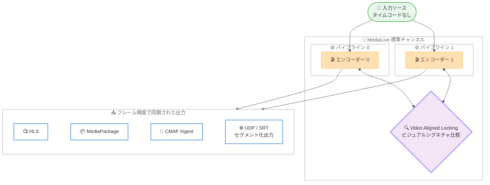

# AWS Elemental MediaLive - Video Aligned Locking (タイムコード不要のフレーム精度パイプラインロック)

**リリース日**: 2026 年 9 月 12 日
**サービス**: AWS Elemental MediaLive
**機能**: Video Aligned Locking (映像アライメントによるパイプラインロック)

📊 [このアップデートのインフォグラフィックを見る](https://takech9203.github.io/aws-news-summary/20260912-medialive-pipeline-locking.html)

## 概要

AWS Elemental MediaLive が、ソースにタイムコードが埋め込まれていなくてもフレーム精度でビデオパイプラインを同期できる新機能「Video Aligned Locking」をサポートしました。この機能は、映像のビジュアルシグネチャ (視覚的特徴量) を使用して複数のビデオストリーム間で特定のフレームを自動的に識別・整列させることで、パイプライン間のフレーム精度のロックを実現します。

パイプラインロック (出力ロック) は、標準チャンネルの 2 本のパイプライン、またはリンクされたクロスリージョンのシングルパイプラインチャンネル間で、出力をフレーム単位で一致させる仕組みです。従来のロック手法はソースの埋め込みタイムコードに依存していましたが、タイムコードは伝統的な放送コンテンツでは一般的である一方、一般的なデジタルストリーミングワークフローでは利用できない、または管理が困難なケースが多くありました。Video Aligned Locking により、こうしたタイムコードのないソースでも、標準パイプラインチャンネルおよびリンクされたクロスリージョンシングルパイプラインチャンネルでフレーム精度の入力切り替えが可能になります。

対象ユーザーは、ライブ配信の冗長構成 (デュアルパイプライン) やリージョン間のディザスタリカバリ構成を運用する放送事業者・ライブ配信事業者で、特にタイムコードを持たないソース (エンコーダー出力、コントリビューションフィードなど) を扱うデジタルストリーミングワークフローに有効です。

**アップデート前の課題**

- ビデオ出力間でフレーム精度のロックを実現するには、専用ハードウェアへの投資や、複雑な外部同期ワークフローの管理が必要だった
- MediaLive のパイプラインロックはソースタイムコード方式に依存しており、埋め込みタイムコードのないソースでは高精度な同期が保証されなかった (エポックロックモードでは埋め込みタイムコードが必須)
- タイムコードは高度に制作された従来型の放送コンテンツでは標準的だが、一般的なデジタルストリーミングワークフローでは利用できないことが多く、管理も困難だった

**アップデート後の改善**

- ビジュアルシグネチャの比較により、ソースタイムコードなしでパイプライン間のフレーム精度ロックが可能になった
- 専用ハードウェアや外部同期ワークフローが不要になり、MediaLive のチャンネル設定のみでフレーム精度の同期を実現できるようになった
- 標準パイプラインチャンネルに加え、リンクされたクロスリージョンシングルパイプラインチャンネルでもフレーム精度の入力切り替えが可能になった

## アーキテクチャ図



タイムコードのない入力ソースを 2 本のパイプラインで処理する際に、Video Aligned Locking がエンコーダー間でビジュアルシグネチャを比較し、フレーム単位で整列した出力を生成する構成を示しています。

## サービスアップデートの詳細

### 主要機能

1. **ビジュアルシグネチャによるフレーム整列**
   - エンコーダー間で映像のビジュアルシグネチャを比較し、複数のビデオストリーム間で同一フレームを自動的に識別・整列
   - ソースへの埋め込みタイムコードが不要 (従来のデフォルトであるソースタイムコード方式との選択制)
   - 両方のパイプラインが同一の映像コンテンツを受信していることが同期成功の条件

2. **フレーム精度の入力切り替え**
   - 標準チャンネル (2 パイプライン) でのフレーム精度の入力切り替えに対応
   - リンクされたクロスリージョンのシングルパイプラインチャンネル間でもフレーム精度の切り替えが可能
   - 非対応の入力タイプがアクティブな場合は「オープンループ」(非ロック) モードで処理を継続し、バリデーションエラーは発生しないため、非対応入力を含む入力切り替えワークフローもサポート

3. **ベストエフォートでのロック動作**
   - パイプラインロックはベストエフォートで実行され、ロックできない場合も処理は継続 (障害とはみなされない)
   - 必要条件が再度満たされると、MediaLive は自動的にロックを再開

### 対応出力タイプ

Video Aligned Locking は以下の出力タイプに適用されます。

| 出力タイプ | 対応状況 |
|------|------|
| HLS (Live モード) | 対応 |
| MediaPackage | 対応 |
| CMAF Ingest | 対応 |
| UDP / SRT | 対応 (セグメント化出力のみ) |
| Microsoft Smooth | 非対応 (ソースタイムコード方式のみ対応) |

チャンネルに他のタイプの出力を含めることは可能ですが、それらの出力についてはロックが試行されず、パイプライン間のフレーム精度は保証されません。

## 技術仕様

### パイプラインロックのモードと方式

| 項目 | 詳細 |
|------|------|
| 出力ロックモード | PIPELINE_LOCKING (パイプライン同士をロック)、EPOCH_LOCKING (Unix エポックを基準にロック)、DISABLED |
| パイプラインロック方式 | SOURCE_TIMECODE (デフォルト、埋め込みタイムコードを使用)、VIDEO_ALIGNMENT (ビジュアルシグネチャ比較を使用) |
| VIDEO_ALIGNMENT の利用条件 | 出力ロックモードが PIPELINE_LOCKING の場合のみ選択可能 (EPOCH_LOCKING では利用不可) |
| タイムコード要件 | VIDEO_ALIGNMENT では埋め込みタイムコード不要 |

### 入力要件 (Video Aligned Locking)

以下の入力タイプは Video Aligned Locking と互換性がありません。

| 非対応の入力タイプ | 内容 |
|------|------|
| MP4_FILE、TS_FILE | ファイル入力 |
| URL_PULL (HLS コンテンツ) | HLS 入力 (そもそもチャンネルに HLS 入力が含まれる場合、パイプラインロック自体が停止) |
| RTMP_PULL | RTMP プル入力 |

非対応の入力がアクティブな間はオープンループ (非ロック) で処理が継続され、対応入力に切り替わると同期が再開されます。

### フレームレート要件

入力フレームレートと出力フレームレートの変換は「単純」である必要があります。

- 出力フレームレートが入力フレームレートの整数倍であること (例: 入力 29.97 FPS → 出力 59.94 FPS)
- または、入力フレームレートが出力フレームレートの整数倍であること (例: 入力 60 FPS → 出力 30 FPS)
- 非対応例: 入力 45 FPS → 出力 60 FPS、入力 29.97 FPS → 出力 23.978 FPS

単純な変換に該当しない場合、次の入力に切り替わるまでロックの試行は停止されます。

### API 変更履歴

| 日付 | サービス | 変更内容 |
|------|----------|----------|
| 2026/09/09 | [MediaLive](https://awsapichanges.com/archive/changes/49ca08-medialive.html) | 9 updated api methods - キャプション位置制御や Contextual Metadata Enrichment など (本機能とは直接関連しない変更) |

レポート作成時点の awsapichanges.com のフィード (過去 2 週間) では、Video Aligned Locking に直接対応する API 変更エントリは確認できませんでした。コンソール上では **Output locking settings** 内の **Pipeline locking method** フィールドで SOURCE_TIMECODE / VIDEO_ALIGNMENT を選択します。

## 設定方法

### 前提条件

1. 標準チャンネル (2 パイプライン)、またはリンクされたシングルパイプラインチャンネルを使用していること
2. 出力グループが対応タイプ (HLS Live モード、MediaPackage、CMAF Ingest、セグメント化された UDP / SRT) であること
3. 入力が非対応タイプ (ファイル入力、HLS 入力、RTMP_PULL) でないこと、および入出力のフレームレート変換が単純であること

### 手順

#### ステップ 1: 出力ロックモードの設定

1. チャンネルの作成または編集画面で、ナビゲーションペインから **General settings** を選択し、**Global configuration** を開く
2. **Enable global configuration** を選択する
3. **Output locking mode** で **PIPELINE_LOCKING** を選択する

Video Aligned Locking は PIPELINE_LOCKING モードでのみ利用できます。EPOCH_LOCKING では選択できません。

#### ステップ 2: パイプラインロック方式の選択

1. **Additional settings** を展開する
2. **Output locking settings** 内の **Pipeline locking method** フィールドで **VIDEO_ALIGNMENT** を選択する

ここで VIDEO_ALIGNMENT を選択することで、埋め込みタイムコードの代わりにエンコーダー間のビジュアルシグネチャ比較による同期が有効になります。デフォルトの SOURCE_TIMECODE は、信頼できる埋め込みタイムコードを持つ入力向けです。

#### ステップ 3: 出力グループのフレームレート設定

1. HLS などの出力グループで、ビデオエンコードを含む各出力のコーデック設定を開く
2. **Frame rate** セクションで **Framerate control** を **Specified** に設定する (Initialize_from_source はパイプラインロックと相性が悪いため非推奨)
3. **Framerate numerator** / **Framerate denominator** に、入力フレームレートと単純な変換関係になる値を設定する

UDP / SRT 出力の場合は、追加で **Container settings** のセグメンテーション関連フィールド (Segmentation markers、Segmentation time など) をダウンストリームシステムの推奨値に合わせて設定し、セグメント化出力を構成します。

## メリット

### ビジネス面

- **コスト削減**: フレーム精度のロックのために専用ハードウェアを購入したり、外部同期ワークフローを構築・運用したりする必要がなくなる
- **デジタル配信ワークフローへの適用拡大**: タイムコード管理が難しい一般的なストリーミングワークフローでも、放送品質のフレーム精度同期を実現できる
- **高可用性構成の品質向上**: デュアルパイプラインやクロスリージョン構成でのシームレスなフェイルオーバー・入力切り替えにより、視聴体験の中断を最小化できる

### 技術面

- **タイムコード非依存**: ビジュアルシグネチャによる整列のため、ソース側のタイムコード付与や管理が不要
- **フェイルセーフな動作**: 非対応入力ではオープンループで処理を継続し、バリデーションエラーを発生させないため、多様な入力を混在させた入力切り替えワークフローを構成できる
- **クロスリージョン対応**: リンクされたシングルパイプラインチャンネルによるリージョン間冗長構成でもフレーム精度の入力切り替えが可能

## デメリット・制約事項

### 制限事項

- 出力ロックモードが PIPELINE_LOCKING の場合のみ利用可能 (EPOCH_LOCKING では利用不可)
- 対応出力は HLS (Live モード)、MediaPackage、CMAF Ingest、セグメント化された UDP / SRT のみ (Microsoft Smooth はソースタイムコード方式のみ)
- ファイル入力 (MP4_FILE、TS_FILE)、HLS 入力、RTMP_PULL 入力は非対応。特にチャンネルに HLS 入力が含まれる場合、パイプラインロック自体が停止し、他の入力に切り替えても再開されない
- 入出力フレームレートの変換が「単純」(整数倍の関係) である必要がある

### 考慮すべき点

- 両方のパイプラインが同一の映像コンテンツを受信していることが同期の前提となる
- パイプラインロックはベストエフォートであり、ロックできない状態は障害とはみなされず処理が継続する。同期状態の監視は運用側で考慮が必要
- 非対応入力がアクティブな間はオープンループ (非ロック) となるため、その間の出力はフレーム精度が保証されない
- 信頼できる埋め込みタイムコードが利用できる環境では、従来どおり SOURCE_TIMECODE 方式の利用も選択肢となる

## ユースケース

### ユースケース 1: タイムコードのないライブソースの冗長配信

**シナリオ**: イベント会場からのコントリビューションフィードにタイムコードが埋め込まれておらず、標準チャンネル (2 パイプライン) で HLS 配信の冗長性を確保したい。

**実装例**:
```
1. 標準チャンネルを作成し、SRT または RTP 入力を 2 系統設定
2. Global configuration で Output locking mode を PIPELINE_LOCKING に設定
3. Pipeline locking method を VIDEO_ALIGNMENT に設定
4. HLS 出力グループで Framerate control を Specified に設定し、
   入力と単純な変換関係のフレームレートを指定
```

**効果**: タイムコードなしでも 2 本のパイプライン出力がフレーム精度で一致し、CDN やプレイヤー側でのパイプライン切り替え時にも映像の不連続が発生しない。

### ユースケース 2: クロスリージョンのディザスタリカバリ構成

**シナリオ**: 東京リージョンと大阪リージョンにそれぞれシングルパイプラインチャンネルを配置し、リージョン障害時にもフレーム精度で切り替え可能なライブ配信基盤を構築したい。

**実装例**:
```
1. 2 つのリージョンにシングルパイプラインチャンネルを作成しリンク
2. 両チャンネルで Output locking mode を PIPELINE_LOCKING、
   Pipeline locking method を VIDEO_ALIGNMENT に設定
3. 出力先を MediaPackage に設定し、下流で冗長取り込みを構成
```

**効果**: リージョンをまたいだリンクチャンネル間でもビジュアルシグネチャにより出力が整列し、リージョン切り替え時のフレームずれによる映像・音声の乱れを防止できる。

### ユースケース 3: 複数ソース間のフレーム精度入力切り替え

**シナリオ**: スポーツ中継でメインフィードとバックアップフィードを運用しており、フィード間の切り替えを視聴者に気付かれずに行いたいが、各フィードのタイムコード運用が統一されていない。

**実装例**:
```
1. 標準チャンネルに複数の入力をアタッチし、入力切り替えスケジュールを構成
2. Pipeline locking method を VIDEO_ALIGNMENT に設定
3. 各入力のフレームレートが出力と単純な変換関係になることを確認
```

**効果**: タイムコード運用の統一なしにフレーム精度の入力切り替えを実現できる。非対応入力が混在してもエラーにならず、オープンループで処理が継続されるため柔軟なワークフローを構成できる。

## 料金

今回の発表では、Video Aligned Locking に関する追加料金の記載はありません。MediaLive の料金は、入力 (コーデック、ビットレート、解像度) と出力 (コーデック、フレームレート、解像度) に基づく実行時間課金です。標準チャンネル (2 パイプライン) はシングルパイプラインチャンネルよりも高い料金レートが適用されます。詳細は [MediaLive 料金ページ](https://aws.amazon.com/medialive/pricing/) を参照してください。

## 利用可能リージョン

AWS Elemental MediaLive が利用可能なすべての AWS リージョンで利用できます。

## 関連サービス・機能

- **AWS Elemental MediaPackage**: Video Aligned Locking の対応出力先。フレーム精度で同期された 2 系統の出力を冗長取り込みし、オリジン側での高可用性を実現
- **AWS Elemental MediaConnect**: コントリビューションフィードの伝送に使用され、MediaLive への冗長入力を構成する際に組み合わせて利用
- **AWS Elemental Link / リンクチャンネル**: クロスリージョンのシングルパイプラインチャンネルをリンクする構成で、本機能によるフレーム精度の切り替えが可能

## 参考リンク

- 📊 [インフォグラフィック](https://takech9203.github.io/aws-news-summary/20260912-medialive-pipeline-locking.html)
- [公式発表 (What's New)](https://aws.amazon.com/about-aws/whats-new/2026/09/medialive-pipeline-locking/)
- [ドキュメント: Implementing pipeline locking](https://docs.aws.amazon.com/medialive/latest/ug/pipeline-lock.html)
- [ドキュメント: Requirements for video aligned locking](https://docs.aws.amazon.com/medialive/latest/ug/pipeline-locking-verify-input.html#pipeline-locking-video-alignment-inputs)
- [ドキュメント: Setting up for locking](https://docs.aws.amazon.com/medialive/latest/ug/pipeline-locking-set-up.html)
- [料金ページ](https://aws.amazon.com/medialive/pricing/)

## まとめ

Video Aligned Locking により、タイムコードのないソースでも専用ハードウェアや外部同期ワークフローなしでフレーム精度のパイプライン同期が可能になり、デジタルストリーミングワークフローにおける高可用性構成のハードルが大きく下がりました。デュアルパイプラインやクロスリージョン構成を運用しているチームは、入力タイプとフレームレート要件を確認のうえ、Pipeline locking method の VIDEO_ALIGNMENT への切り替えを検討することを推奨します。
