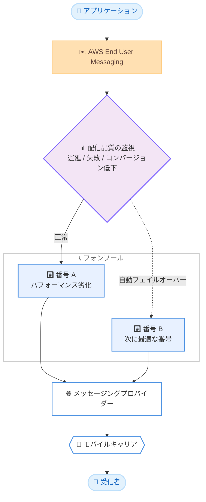

# AWS End User Messaging - フォンプールの自動フェイルオーバーによる SMS 配信性の強化

**リリース日**: 2026 年 9 月 14 日
**サービス**: AWS End User Messaging
**機能**: フォンプールにおける SMS 配信の自動フェイルオーバー

📊 [このアップデートのインフォグラフィックを見る](https://takech9203.github.io/aws-news-summary/20260914-aws-end-user-messaging-improves-deliverability.html)

## 概要

AWS End User Messaging は、フォンプール (Phone Pool) における配信性 (Deliverability) 機能を強化しました。フォンプール経由で SMS を送信しているお客様は、下流の障害によって SMS 配信が影響を受けた場合に、プール内で次に最もパフォーマンスの良い電話番号へ自動的にフェイルオーバーする機能を、追加の操作なしで利用できるようになりました。

SMS の配信は、AWS からメッセージングプロバイダー、そして最終的にモバイルキャリアへとルーティングされる過程で、配信のドロップや遅延の影響を受けることがあります。こうした障害は、配達通知、ワンタイムパスコード (OTP)、リマインダーなど、メッセージングプログラムの中で最も重要かつ時間的制約の厳しいメッセージに影響を及ぼす可能性があります。今回のアップデートにより、AWS End User Messaging が配信遅延、メッセージ失敗、コンバージョン率の低下を監視し、より最適化された配信経路へトラフィックを自動的に再ルーティングします。

既存のフォンプールを利用しているお客様は、この機能の恩恵を受けるために何も対応する必要はありません。フォンプールをまだ利用していない場合は、公式ドキュメントの手順に従ってプールを作成することで利用できます。

**アップデート前の課題**

- SMS 配信経路上のメッセージングプロバイダーやモバイルキャリア側で障害が発生した場合、配信の遅延や失敗を検知して送信元番号を切り替える仕組みを利用者側で用意する必要があった
- OTP や配達通知などの時間的制約が厳しいメッセージが、下流の障害の影響を直接受けるリスクがあった
- 配信パフォーマンスの劣化を検知するには、配信メトリクスの監視と分析を独自に実装する必要があった

**アップデート後の改善**

- フォンプール内で配信パフォーマンスの劣化を AWS が自動検知し、次に最もパフォーマンスの良い番号へ自動的にフェイルオーバーするようになった
- 配信遅延、メッセージ失敗、コンバージョン率の低下といった複数のシグナルに基づいて、より最適化された配信経路へトラフィックが再ルーティングされるようになった
- 既存のフォンプール利用者は追加の設定や操作なしでこの機能を利用できるようになった

## アーキテクチャ図



AWS End User Messaging が配信遅延、メッセージ失敗、コンバージョン率低下を監視し、番号 A の配信品質が劣化した場合にプール内で次に最適な番号 B へ自動的にトラフィックを切り替える流れを示しています。

## サービスアップデートの詳細

### 主要機能

1. **配信品質の自動監視**
   - AWS End User Messaging が SMS の配信状況を継続的に監視する
   - 監視対象のシグナルは、配信遅延、メッセージ失敗、コンバージョン率の低下の 3 つ
   - AWS からメッセージングプロバイダー、モバイルキャリアに至る下流の障害を検知する

2. **プール内の次善番号への自動フェイルオーバー**
   - 配信の劣化を検知すると、フォンプール内で次に最もパフォーマンスの良い番号へトラフィックを自動で再ルーティングする
   - OTP、配達通知、リマインダーなどの時間的制約が厳しいメッセージの到達性を保護する

3. **既存フォンプールへの自動適用**
   - 既存のフォンプール利用者は追加の設定や操作が不要で、自動的にこの機能の恩恵を受けられる
   - フォンプールを利用していない場合は、プールを新規作成することで利用可能

## 技術仕様

### 機能の概要

| 項目 | 詳細 |
|------|------|
| 対象機能 | フォンプール (Phone Pool) |
| 検知シグナル | 配信遅延、メッセージ失敗、コンバージョン率の低下 |
| フェイルオーバー先 | プール内で次に最もパフォーマンスの良い番号 |
| 必要な設定 | 不要 (既存のフォンプールに自動適用) |
| 対象メッセージ | フォンプール経由で送信される SMS |

### フォンプールの作成例

フォンプールを利用していない場合は、AWS CLI で以下のように作成できます。

```bash
# フォンプールを作成する (オリジネーション ID には既存の電話番号などを指定)
aws pinpoint-sms-voice-v2 create-pool \
    --origination-identity "phone-id-example" \
    --iso-country-code "JP" \
    --message-type "TRANSACTIONAL"
```

このコマンドは、指定したオリジネーション ID (電話番号など) を最初のメンバーとしてフォンプールを作成します。作成後、`associate-origination-identity` で追加の番号をプールに関連付けることで、フェイルオーバー先の候補を増やせます。

## 設定方法

### 前提条件

1. AWS End User Messaging SMS を利用可能な AWS アカウント
2. SMS 送信用の電話番号 (フォンプールに関連付けるオリジネーション ID)
3. フォンプールを操作するための IAM 権限 (例: `sms-voice:CreatePool`)

### 手順

#### ステップ1: 既存のフォンプール利用者の場合

対応は不要です。既存のフォンプールには自動フェイルオーバーが自動的に適用されます。

#### ステップ2: フォンプールを新規作成する場合

```bash
# 既存の電話番号を確認する
aws pinpoint-sms-voice-v2 describe-phone-numbers

# フォンプールを作成する
aws pinpoint-sms-voice-v2 create-pool \
    --origination-identity "phone-id-example" \
    --iso-country-code "JP" \
    --message-type "TRANSACTIONAL"
```

最初のコマンドでアカウント内の電話番号を確認し、2 つ目のコマンドでその番号を起点にフォンプールを作成します。詳細な手順は [フォンプール作成のドキュメント](https://docs.aws.amazon.com/sms-voice/latest/userguide/phone-pool-create.html) を参照してください。

#### ステップ3: プールに番号を追加する

```bash
# 追加の電話番号をプールに関連付ける
aws pinpoint-sms-voice-v2 associate-origination-identity \
    --pool-id "pool-id-example" \
    --origination-identity "phone-id-example-2" \
    --iso-country-code "JP"
```

プール内に複数の番号を関連付けることで、障害発生時のフェイルオーバー先の選択肢が増え、配信の冗長性が高まります。

## メリット

### ビジネス面

- **重要メッセージの到達性向上**: OTP、配達通知、リマインダーなど、ビジネス上重要なメッセージが下流の障害の影響を受けにくくなる
- **顧客体験の保護**: 認証コードの遅延や不達によるログイン失敗、購入離脱などの機会損失を軽減できる
- **運用負荷の削減**: 配信劣化の検知と番号切り替えを AWS が自動で行うため、独自の監視・切り替えの仕組みが不要になる

### 技術面

- **設定不要の自動適用**: 既存のフォンプールに対して追加設定なしで有効になり、移行作業が発生しない
- **多面的な劣化検知**: 配信遅延、メッセージ失敗、コンバージョン率低下という複数のシグナルに基づいて劣化を判断する
- **経路レベルの最適化**: 単純な番号のローテーションではなく、次に最もパフォーマンスの良い番号への再ルーティングにより最適な配信経路が選択される

## デメリット・制約事項

### 制限事項

- 自動フェイルオーバーの対象はフォンプール経由の送信に限られる (単一の電話番号で直接送信している場合は対象外)
- フェイルオーバー先はプール内の番号に限られるため、プールに複数の番号が関連付けられていることが実効性の前提となる

### 考慮すべき点

- フェイルオーバーにより送信元番号が変わる可能性があるため、受信者が特定の番号を前提とした運用 (連絡先登録の案内など) をしている場合は影響を考慮する必要がある
- フェイルオーバーの検知条件やしきい値の詳細は公表されていないため、厳密な SLA が必要な場合は自社でも配信メトリクスの監視を併用することが望ましい

## ユースケース

### ユースケース1: ワンタイムパスコードの安定配信

**シナリオ**: EC サイトやモバイルアプリのログイン時に SMS で OTP を送信しており、キャリア側の障害による認証コードの不達がログイン失敗やサポート問い合わせの増加につながっている。

**実装例**:
```bash
# フォンプールを指定して OTP を送信する
aws pinpoint-sms-voice-v2 send-text-message \
    --destination-phone-number "+81901234XXXX" \
    --origination-identity "pool-id-example" \
    --message-body "認証コード: 123456"
```

**効果**: 配信経路の劣化時にプール内の別番号へ自動フェイルオーバーされるため、OTP の到達率が向上し、認証失敗によるユーザー離脱を軽減できる。

### ユースケース2: 配達通知やリマインダーの時間厳守配信

**シナリオ**: 物流サービスで配達予定の通知を SMS で送信しており、通知の遅延が再配達率の増加につながっている。

**実装例**:
```bash
# フォンプール経由で配達通知を送信する
aws pinpoint-sms-voice-v2 send-text-message \
    --destination-phone-number "+81901234XXXX" \
    --origination-identity "pool-id-example" \
    --message-body "本日 14 時から 16 時の間にお荷物をお届けします。"
```

**効果**: 配信遅延を検知した時点でより最適な経路へ切り替わるため、時間的制約の厳しい通知の遅延リスクを低減し、再配達率の改善が期待できる。

### ユースケース3: 単一番号運用からフォンプールへの移行

**シナリオ**: 現在は単一の電話番号で SMS を送信しており、番号単位の障害が配信全体の停止に直結している。

**実装例**:
```bash
# 既存番号を起点にフォンプールを作成し、冗長化する
aws pinpoint-sms-voice-v2 create-pool \
    --origination-identity "phone-id-example" \
    --iso-country-code "JP" \
    --message-type "TRANSACTIONAL"
```

**効果**: フォンプールへ移行することで自動フェイルオーバーの対象となり、番号単位の障害に対する耐性が大幅に向上する。

## 料金

今回の発表では、自動フェイルオーバー機能自体の追加料金についての言及はありません。AWS End User Messaging SMS の利用には、通常どおりメッセージ送信ごとの料金と電話番号のリース料金が発生します。詳細は [料金ページ](https://aws.amazon.com/end-user-messaging/pricing/) を参照してください。

## 利用可能リージョン

AWS End User Messaging が利用可能なすべての AWS リージョンで利用できます。

## 関連サービス・機能

- **Amazon Pinpoint / AWS End User Messaging SMS API (pinpoint-sms-voice-v2)**: フォンプールの作成や SMS 送信に使用する API。今回の機能はこの API で管理するフォンプールに適用される
- **Amazon SNS**: SMS 送信機能を持つ別のサービス。高度な配信性管理や双方向 SMS が必要な場合は AWS End User Messaging の利用が適する
- **Amazon CloudWatch**: SMS 配信メトリクスの監視に利用でき、自動フェイルオーバーと組み合わせて配信状況の可視化に活用できる

## 参考リンク

- 📊 [インフォグラフィック](https://takech9203.github.io/aws-news-summary/20260914-aws-end-user-messaging-improves-deliverability.html)
- [公式発表 (What's New)](https://aws.amazon.com/about-aws/whats-new/2026/09/aws-end-user-messaging-improves-deliverability)
- [AWS End User Messaging SMS ユーザーガイド](https://docs.aws.amazon.com/sms-voice/latest/userguide/what-is-sms-mms.html)
- [フォンプールの作成手順](https://docs.aws.amazon.com/sms-voice/latest/userguide/phone-pool-create.html)
- [料金ページ](https://aws.amazon.com/end-user-messaging/pricing/)

## まとめ

フォンプールの自動フェイルオーバーにより、OTP や配達通知など時間的制約の厳しい SMS の到達性が、利用者側の追加対応なしで強化されます。既存のフォンプール利用者はそのまま恩恵を受けられるため対応は不要ですが、単一番号で SMS を送信している場合は、この機会にフォンプールへの移行を検討することを推奨します。
