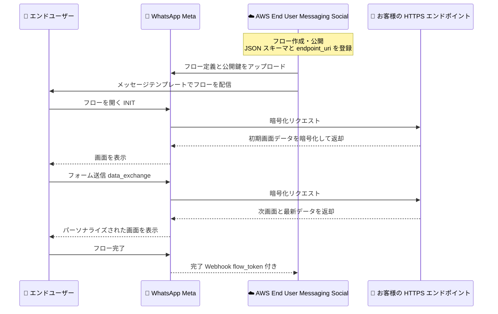

# AWS End User Messaging - WhatsApp Dynamic Flows サポート

**リリース日**: 2026 年 9 月 14 日
**サービス**: AWS End User Messaging Social
**機能**: WhatsApp Dynamic Flows (動的フロー) のサポート

📊 [このアップデートのインフォグラフィックを見る](https://takech9203.github.io/aws-news-summary/20260914-aws-end-user-messaging-whatsapp-dynamic-flows.html)

## 概要

AWS End User Messaging が WhatsApp の Dynamic Flows (動的フロー) をサポートしました。WhatsApp Flows は、予約受付、リード獲得、サインアップ、アンケート、取引などのインタラクティブな体験を、ユーザーが WhatsApp のチャット内で完結できる機能です。ユーザーを外部の Web サイトやフォームにリダイレクトすることなく、チャット内で複数画面のタスクを完了させることができます。

フローは Meta のスターターテンプレート (テキスト入力、日付ピッカー、ドロップダウン、ボタンなどのコンポーネントを含む) から作成することも、ゼロから構築することもできます。「動的」フローの特長は、各画面がリアルタイムでお客様自身の HTTPS エンドポイントを呼び出せる点にあります。これにより、空き状況のライブ表示や、ステップごとのユーザー別パーソナライズが可能になります。

フローは JSON スキーマで定義し、メッセージテンプレートを通じて配信します。作成から公開までのライフサイクル管理は、すべて AWS End User Messaging Social のコンソールまたは API で完結し、Meta のコンソールや API を直接操作する必要はありません。

**アップデート前の課題**

- WhatsApp 上で予約やアンケートなどの複雑な入力を受け付けるには、ユーザーを外部の Web サイトやフォームへ誘導する必要があり、離脱率が高くなりがちだった
- チャットボットの単純な選択肢ベースのやり取りでは、複数画面にわたる構造化されたデータ収集が難しかった
- バックエンドの最新データ (空き状況や在庫など) に基づく画面表示を、会話体験の中に組み込むことが困難だった

**アップデート後の改善**

- 予約受付、リード獲得、サインアップ、アンケート、取引などのタスクを WhatsApp チャット内で完結できるようになった
- 各画面からお客様の HTTPS エンドポイントをリアルタイムに呼び出し、ライブの空き状況表示やユーザーごとのパーソナライズが可能になった
- フローの作成・更新・公開・管理を AWS End User Messaging Social のコンソールと API だけで実行できるようになった

## アーキテクチャ図



エンドユーザーの画面遷移のたびに Meta がお客様の HTTPS エンドポイントを直接呼び出し、暗号化されたリクエスト / レスポンスを交換します。AWS End User Messaging Social はフローの作成・公開・公開鍵アップロードなどのコントロールプレーンを担い、暗号化されたデータ交換の内容にはアクセスしません。

## サービスアップデートの詳細

### 主要機能

1. **チャット内で完結するインタラクティブ体験**
   - 予約受付、リード獲得、サインアップ、アンケート、ショッピングなどの複数画面体験を WhatsApp 内で提供
   - テキスト入力、ラジオボタン、チェックボックス、日付ピッカー、ドロップダウンなどの UI コンポーネントをサポート
   - Meta のスターターテンプレートを利用するか、ゼロから構築可能

2. **Dynamic Flows によるリアルタイムデータ連携**
   - 各画面の `data_exchange` アクションでお客様の HTTPS エンドポイントを実行時に呼び出す
   - 空き状況のライブ表示、サーバーサイドの入力検証、バックエンド判断による画面分岐が可能
   - フロー JSON に `data_api_version` を宣言し、`endpoint_uri` を登録することで有効化

3. **AWS End User Messaging Social での一元管理**
   - フローの作成、更新、公開、プレビュー、非推奨化、削除をコンソールまたは API で実行
   - Meta のコンソールや API を直接使用する必要がない
   - フローは WhatsApp Business Account (WABA) に関連付けて管理

4. **エンドツーエンド暗号化のサポート**
   - Meta はデータ交換リクエストを RSA-2048 公開鍵でエンドツーエンド暗号化
   - PEM 形式の公開鍵を直接アップロードするか、AWS KMS の非対称キー ARN を指定可能
   - KMS モードでは秘密鍵が AWS KMS から出ることはなく、エンドポイントは `kms:Decrypt` で復号

## 技術仕様

### フローの構成要素

| 項目 | 詳細 |
|------|------|
| フロー定義 | JSON スキーマで画面・コンポーネント・ロジックを記述 (最大 10 MB、バージョン 7.3 推奨) |
| フローモード | Static (全画面を JSON で定義) / Dynamic (実行時にエンドポイントからデータ取得) |
| `data_api_version` | Dynamic Flow で必須。サポート値は `"3.0"` と `"4.0"` (推奨) |
| フローカテゴリ | Sign Up、Sign In、Appointment Booking、Lead Generation、Contact Us、Customer Support、Survey、Shopping、Other |
| フロートークン | セッション追跡用の一意な識別子。完了時の Webhook で返却される |
| 配信方法 | メッセージテンプレート経由で配信 |

### エンドポイント要件 (Dynamic Flows)

| 項目 | 詳細 |
|------|------|
| プロトコル | 公開アクセス可能な HTTPS URL、有効な TLS 証明書が必須 |
| 応答時間 | 10 秒以内 (Meta がハードタイムアウトと p90 レイテンシーを監視) |
| リクエスト形式 | 暗号化 JSON ペイロードを含む POST リクエスト |
| レスポンス形式 | Base64 エンコードした暗号化レスポンスを `text/plain` で返却 |
| 処理するリクエストタイプ | ヘルスチェック (`ping`)、`INIT`、`data_exchange`、`BACK` |
| 実装例 | Lambda Function URL、API Gateway + Lambda、ELB + Lambda、EC2 / コンテナなど |

### API変更履歴

| 日付 | サービス | 変更内容 |
|------|----------|----------|
| 2026/09/03 | [AWS End User Messaging Social](https://awsapichanges.com/archive/changes/35b7c0-social-messaging.html) | 2 new 2 updated api methods - WhatsApp Flows のエンドポイントサポート追加。`PutWhatsAppBusinessPublicKey` / `GetWhatsAppBusinessPublicKey` が新規追加、`CreateWhatsAppFlow` / `UpdateWhatsAppFlow` に `endpointUri` と `metaAppId` パラメータが追加 |

### Dynamic Flow JSON の例

```json
{
    "version": "6.0",
    "data_api_version": "3.0",
    "routing_model": {
        "INPUT": ["RESULT"],
        "RESULT": []
    },
    "screens": [
        {
            "id": "INPUT",
            "title": "Welcome",
            "layout": {
                "type": "SingleColumnLayout",
                "children": [
                    {
                        "type": "Form",
                        "name": "input_form",
                        "children": [
                            {
                                "type": "TextInput",
                                "name": "user_name",
                                "label": "Your name",
                                "input-type": "text",
                                "required": true
                            },
                            {
                                "type": "Footer",
                                "label": "Submit",
                                "on-click-action": {
                                    "name": "data_exchange",
                                    "payload": {
                                        "user_name": "${form.user_name}"
                                    }
                                }
                            }
                        ]
                    }
                ]
            }
        }
    ]
}
```

Dynamic Flow では、トップレベルに `data_api_version` を宣言し、画面フッターで `navigate` の代わりに `data_exchange` アクションを使用します。フォームデータがエンドポイントに送信され、エンドポイントが次の画面とその内容を返します。

## 設定方法

### 前提条件

1. AWS End User Messaging Social で WhatsApp Business Account (WABA) と電話番号が登録済みであること
2. Dynamic Flow の場合、公開アクセス可能な HTTPS エンドポイントをデプロイ済みであること
3. RSA-2048 キーペア (PEM) または AWS KMS の非対称 RSA キーを用意していること

### 手順

#### ステップ1: ビジネス公開鍵のアップロード

```bash
# キーペアを生成
openssl genrsa -out private.pem 2048
openssl rsa -in private.pem -pubout -out public.pem

# 公開鍵をアップロード
aws social-messaging put-whatsapp-business-public-key \
    --origination-phone-number-id <PHONE_NUMBER_ID> \
    --business-public-key "$(cat public.pem)"
```

RSA-2048 キーペアを生成し、公開鍵を電話番号に対してアップロードします。AWS End User Messaging Social が公開鍵を Meta にアップロードし、Meta はこの鍵でデータ交換リクエストを暗号化します。秘密鍵はエンドポイント側で復号に使用するため、安全に保管します。AWS KMS を使用する場合は、`--kms-key-arn` で非対称 RSA-2048 KMS キーの ARN を指定します。

#### ステップ2: Dynamic Flow の作成

```bash
aws social-messaging create-whatsapp-flow \
    --id <WABA_ID> \
    --flow-name "my_dynamic_flow" \
    --categories '["APPOINTMENT_BOOKING"]' \
    --flow-json fileb://flow.json \
    --endpoint-uri "https://your-endpoint.example.com/flow"
```

フロー JSON とエンドポイント URI を指定してフローを作成します。フロー JSON には `data_api_version` の宣言が必要です。既存の DRAFT フローへのエンドポイント追加は `update-whatsapp-flow` の `--endpoint-uri` で行えます。

#### ステップ3: Meta アプリのアタッチ (リクエスト検証用)

```bash
aws social-messaging update-whatsapp-flow \
    --id <WABA_ID> \
    --flow-id <FLOW_ID> \
    --meta-app-id "<YOUR_META_APP_ID>"
```

お客様自身の Meta アプリをフローにアタッチします。これにより、Meta が各リクエストに付与する `X-Hub-Signature-256` HMAC ヘッダーをアプリシークレットで検証し、リクエストの発信元が Meta であることを確認できます。この操作は一方向であり、一度アタッチするとサービス側のアプリには戻せない点に注意してください。

#### ステップ4: フローの公開と確認

```bash
# フローを公開
aws social-messaging publish-whatsapp-flow \
    --id <WABA_ID> \
    --flow-id <FLOW_ID>

# 設定を確認
aws social-messaging get-whatsapp-flow \
    --id <WABA_ID> \
    --flow-id <FLOW_ID>
```

フローを公開します。Dynamic Flow の公開時には、Meta がエンドポイントに対して同期的なヘルスチェックを実行します。エンドポイントが応答しない場合や公開鍵が無効な場合、公開はエラー `131000` で失敗するため、事前にエンドポイントが `ping` リクエストに応答することを確認します。公開後はメッセージテンプレートでフローをユーザーに配信できます。

## メリット

### ビジネス面

- **コンバージョン率の向上**: 外部サイトへのリダイレクトが不要になり、ユーザーがチャット内でタスクを完結できるため、離脱を抑制できる
- **リッチな顧客体験**: 空き状況のライブ表示やユーザーごとのパーソナライズにより、静的なフォームでは実現できない体験を提供できる
- **多様なユースケースへの対応**: 予約受付、リード獲得、サインアップ、アンケート、取引など幅広い業務シナリオに単一の仕組みで対応できる

### 技術面

- **AWS での一元管理**: フローのライフサイクル全体を AWS End User Messaging Social のコンソールと API で管理でき、Meta のコンソール操作が不要
- **エンドツーエンド暗号化**: データ交換は Meta とお客様のエンドポイント間で直接暗号化され、AWS KMS 連携により秘密鍵を KMS 外に出さずに運用できる
- **柔軟なエンドポイント実装**: Lambda Function URL、API Gateway、ELB、EC2 / コンテナなど、公開 HTTPS URL を提供できる任意のコンピューティングで実装できる

## デメリット・制約事項

### 制限事項

- Dynamic Flow のエンドポイントは 10 秒以内の応答が必須で、レイテンシーやエラーが継続すると Meta によりスロットリングまたはブロックされる可能性がある
- フロー JSON の最大サイズは 10 MB
- お客様の Meta アプリのアタッチは一方向の操作であり、アタッチ後にサービス側のアプリへ戻すことはできない

### 考慮すべき点

- エンドポイントは公開 HTTPS URL である必要があるため、`X-Hub-Signature-256` の署名検証、`flow_token` の検証、適切な HTTP ステータスコード (421 / 427 / 432) の返却などのセキュリティ実装が重要
- リクエスト発信元の検証にはお客様自身の Meta アプリのアタッチが必要 (デフォルトのサービスアプリではアプリシークレットにアクセスできず検証不可)
- ヘルスチェックの `ping` リクエストには `flow_token` が含まれないため、トークン検証なしで応答する実装が必要

## ユースケース

### ユースケース1: 美容室・クリニックの予約受付

**シナリオ**: 顧客が WhatsApp から予約を取る際に、リアルタイムの空き状況を確認しながら日時とメニューを選択できるようにする。

**実装例**:
```
1. APPOINTMENT_BOOKING カテゴリで Dynamic Flow を作成
2. 日付ピッカーの選択時に data_exchange でエンドポイントを呼び出し
3. Lambda が予約システムの空き枠を照会し、選択可能な時間帯のみをドロップダウンで返却
4. 確定時に予約システムへ登録し、完了 Webhook で確認メッセージを送信
```

**効果**: 電話や外部サイトへの誘導なしで予約が完結し、空き状況の行き違いによるダブルブッキングを防止できる。

### ユースケース2: 金融・保険のリード獲得と適格性判定

**シナリオ**: 商品への問い合わせに対し、チャット内で段階的に情報を収集し、入力内容に応じて次の質問を分岐させる。

**実装例**:
```
1. LEAD_GENERATION カテゴリで Dynamic Flow を作成
2. 各画面の入力をエンドポイントでサーバーサイド検証
3. 年齢や希望条件に応じてバックエンドの判定ロジックで次画面を分岐
4. 収集したリード情報を CRM に登録
```

**効果**: フォーム離脱を減らしつつ、検証済みの高品質なリードデータを CRM に直接連携できる。

### ユースケース3: 購入後アンケートとパーソナライズされた設問

**シナリオ**: 商品購入者に WhatsApp でアンケートを配信し、購入履歴に基づいた設問を動的に表示する。

**実装例**:
```
1. SURVEY カテゴリで Dynamic Flow を作成
2. INIT リクエスト時に flow_token から顧客を特定し、購入商品に応じた設問を返却
3. 回答内容に応じて追加設問を data_exchange で動的に出し分け
4. 回答結果を分析基盤に送信
```

**効果**: 回答者ごとに最適化された設問により回答率と回答品質が向上し、チャット内完結で回収率も高まる。

## 料金

今回の発表では追加料金に関する記載はありません。WhatsApp メッセージングの利用には、AWS End User Messaging の料金に加えて Meta の WhatsApp Business Platform の会話ベース料金が適用されます。詳細は料金ページを参照してください。

## 利用可能リージョン

AWS End User Messaging Social が利用可能なすべてのリージョンで WhatsApp Flows を利用できます。

## 関連サービス・機能

- **AWS End User Messaging Social**: WhatsApp Business Platform との統合を提供するサービス。今回の Dynamic Flows はこのサービスの機能として提供
- **AWS Lambda / Amazon API Gateway**: Dynamic Flow のデータ交換エンドポイントの実装先として推奨されるコンピューティングオプション
- **AWS KMS**: ビジネス公開鍵の管理に非対称 RSA-2048 キーを利用可能。秘密鍵を KMS 外に出さずにデータ交換リクエストを復号できる
- **AWS WAF**: API Gateway と組み合わせてエンドポイントへのアクセス制御を強化可能

## 参考リンク

- 📊 [インフォグラフィック](https://takech9203.github.io/aws-news-summary/20260914-aws-end-user-messaging-whatsapp-dynamic-flows.html)
- [公式発表 (What's New)](https://aws.amazon.com/about-aws/whats-new/2026/09/aws-end-user-messaging-whatsapp-dynamic-flows)
- [ドキュメント: AWS End User Messaging Social User Guide](https://docs.aws.amazon.com/social-messaging/latest/userguide/what-is-service.html)
- [ドキュメント: Managing WhatsApp Flows](https://docs.aws.amazon.com/social-messaging/latest/userguide/managing-flows.html)
- [ドキュメント: Setting up Dynamic Flows](https://docs.aws.amazon.com/social-messaging/latest/userguide/managing-flows-dynamic.html)
- [Meta ドキュメント: Flow JSON リファレンス](https://developers.facebook.com/docs/whatsapp/flows/reference/flowjson)
- [料金ページ](https://aws.amazon.com/end-user-messaging/pricing/)

## まとめ

WhatsApp Dynamic Flows のサポートにより、予約・アンケート・リード獲得などのインタラクティブな体験を WhatsApp チャット内で完結させ、各画面でお客様のバックエンドとリアルタイムに連携できるようになりました。フローの管理が AWS End User Messaging Social に統合されているため、Meta のコンソールを使わずに AWS の運用フローに組み込める点も大きな利点です。WhatsApp を顧客接点として活用している場合は、まず Meta のスターターテンプレートと Lambda Function URL を使った小規模な Dynamic Flow で検証を始めることを推奨します。
