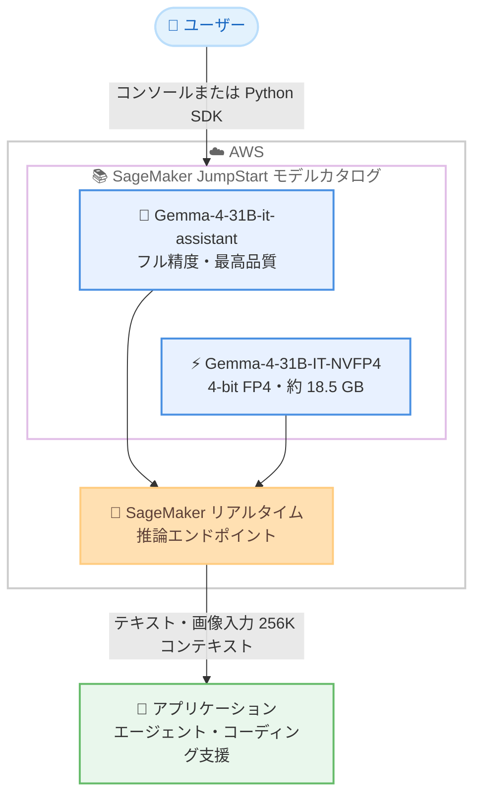

# Amazon SageMaker JumpStart - Gemma-4-31B-it-assistant および Gemma-4-31B-IT-NVFP4 モデルの提供開始

**リリース日**: 2026 年 9 月 14 日
**サービス**: Amazon SageMaker JumpStart
**機能**: Gemma-4-31B-it-assistant (フル精度) と Gemma-4-31B-IT-NVFP4 (4-bit 量子化) の提供開始

📊 [このアップデートのインフォグラフィックを見る](https://takech9203.github.io/aws-news-summary/20260914-gemma-4-31b-it-assistant-gemma-4-31b-it-nvfp4-jumpstart.html)

## 概要

Google DeepMind の **Gemma-4-31B-it-assistant** と、NVIDIA が量子化した **Gemma-4-31B-IT-NVFP4** の 2 つのモデルが Amazon SageMaker JumpStart で利用可能になりました。フラッグシップである 31B パラメータの高密度 (dense) アーキテクチャについて、フル精度版と量子化版の両方を選択できるようになります。

Gemma-4-31B-it-assistant は、マルチモーダル推論、コーディング、エージェントワークフローに向けてチューニングされたアシスタント特化バリアントです。テキストと画像の入力 (動画はフレームシーケンスとして処理) に対応し、256K トークンのコンテキストウィンドウと 140 以上の言語をサポートします。公式発表によると、Arena AI テキストリーダーボードのオープンモデル部門で第 3 位にランクされ、20 倍のサイズのモデルを上回る性能を示しています。

Gemma-4-31B-IT-NVFP4 は、NVIDIA の ModelOpt フレームワークにより 4-bit FP4 精度に量子化されたバージョンです。メモリ使用量は約 18.5 GB (ベースモデル比 68% 削減) に抑えられ、元の品質の 97〜99% を維持しながら約 2.5 倍高速な推論を実現します。コスト効率と高スループットを重視したデプロイに適しています。

**アップデート前の課題**

- 31B クラスの高性能オープンモデルをフル精度で運用するには大容量の GPU メモリが必要で、インフラコストが高くなりがちだった
- 量子化によるコスト削減を行う場合、モデルの変換・検証作業を自身で実施する必要があった
- マルチモーダル対応かつ長コンテキストのオープンモデルを、マネージド環境で迅速にデプロイする選択肢が限られていた

**アップデート後の改善**

- SageMaker JumpStart のモデルカタログから数クリック、または SageMaker Python SDK で両モデルをデプロイできるようになった
- フル精度版と NVFP4 量子化版を、品質要件とコスト要件に応じて使い分けられるようになった
- 量子化済みモデルが公式に提供されるため、自前での量子化作業と品質検証の負担が軽減された

## アーキテクチャ図



SageMaker JumpStart のモデルカタログから、用途に応じてフル精度版または量子化版を選択し、SageMaker 推論エンドポイントとしてデプロイする構成です。

## サービスアップデートの詳細

### 主要機能

1. **Gemma-4-31B-it-assistant (フル精度版)**
   - マルチモーダル推論、コーディング、エージェントワークフロー向けにチューニングされたアシスタントバリアント
   - テキストと画像の入力に対応 (動画はフレームシーケンスとして処理)、出力はテキスト
   - 256K トークンのコンテキストウィンドウと 140 以上の言語をサポート
   - Arena AI テキストリーダーボードのオープンモデル部門で第 3 位 (公式発表時点)
   - ローカルスライディングウィンドウとグローバルアテンションを組み合わせたハイブリッドアテンション設計
   - 自律エージェント構築のためのネイティブ関数呼び出し (function calling) に対応

2. **Gemma-4-31B-IT-NVFP4 (量子化版)**
   - NVIDIA の ModelOpt フレームワークによる 4-bit FP4 量子化
   - メモリ使用量は約 18.5 GB で、ベースモデル比 68% 削減
   - 元の品質の 97〜99% を維持しつつ、約 2.5 倍高速な推論を実現
   - NVIDIA RTX、DGX Spark、データセンター GPU での高スループット運用を想定

3. **SageMaker JumpStart による簡易デプロイ**
   - SageMaker コンソールのモデルカタログから数クリックでデプロイ可能
   - SageMaker Python SDK によるプログラマティックなデプロイにも対応
   - 自身の AWS アカウント内にエンドポイントを構築するため、データが外部に送信されない

## 技術仕様

### モデル比較

| 項目 | Gemma-4-31B-it-assistant | Gemma-4-31B-IT-NVFP4 |
|------|--------------------------|----------------------|
| 提供元 | Google DeepMind | NVIDIA (量子化) |
| パラメータ数 | 31B (dense) | 31B (dense) |
| 精度 | フル精度 | 4-bit FP4 (ModelOpt) |
| メモリ使用量 | ベースモデル相当 | 約 18.5 GB (68% 削減) |
| 推論速度 | 標準 | 約 2.5 倍高速 |
| 品質 | オリジナル | オリジナルの 97〜99% を維持 |
| 入力モダリティ | テキスト + 画像 | テキスト + 画像 |
| コンテキスト長 | 256K トークン | 256K トークン |
| 対応言語 | 140 以上 | 140 以上 |
| 関数呼び出し | ネイティブ対応 | ネイティブ対応 |

### アテンション機構

| 項目 | 詳細 |
|------|------|
| 設計 | ハイブリッドアテンション |
| ローカル | スライディングウィンドウアテンション |
| グローバル | フルグローバルアテンション |
| 効果 | 長コンテキスト処理時のメモリ効率と品質の両立 |

## 設定方法

### 前提条件

1. AWS アカウントを保有していること
2. Amazon SageMaker AI (SageMaker Studio または SageMaker Python SDK) の利用環境があること
3. デプロイ先の GPU インスタンスに対するサービスクォータが確保されていること

### 手順

#### ステップ1: SageMaker JumpStart でモデルを検索

SageMaker Studio を開き、JumpStart のモデルカタログで「Gemma-4-31B」を検索します。フル精度版 (it-assistant) と量子化版 (IT-NVFP4) の 2 つのモデルカードが表示されます。

#### ステップ2: モデルをデプロイ

```python
from sagemaker.jumpstart.model import JumpStartModel

# モデル ID を指定してデプロイ (モデル ID はコンソールのモデルカードで確認)
model = JumpStartModel(model_id="<gemma-4-31b-model-id>")
predictor = model.deploy()
```

SageMaker Python SDK の `JumpStartModel` クラスでモデルを指定し、`deploy()` を呼び出すことで、自身のアカウント内に推論エンドポイントが作成されます。コンソールからの数クリックでのデプロイも可能です。

#### ステップ3: 推論を実行

```python
payload = {
    "inputs": "画像の内容を説明し、改善案を 3 つ提案してください。",
    "parameters": {"max_new_tokens": 512}
}
response = predictor.predict(payload)
print(response)
```

作成したエンドポイントに対してリクエストを送信し、推論結果を取得します。ペイロードの形式はモデルカードのサンプルを参照してください。

## メリット

### ビジネス面

- **インフラコストの削減**: NVFP4 版はメモリ使用量が 68% 小さく約 2.5 倍高速なため、より小さな GPU インスタンスや少ないインスタンス数で同等のスループットを実現できる
- **迅速な検証と本番化**: モデルカタログから数クリックでデプロイできるため、PoC から本番導入までのリードタイムを短縮できる
- **グローバル対応**: 140 以上の言語をサポートし、多言語のカスタマー対応やコンテンツ処理に活用できる

### 技術面

- **品質とコストの選択肢**: 同一アーキテクチャのフル精度版と量子化版を、ユースケースの品質要件に応じて使い分けられる
- **長コンテキストとマルチモーダル**: 256K トークンのコンテキストとテキスト + 画像入力により、大規模ドキュメントや視覚情報を含むタスクに対応できる
- **エージェント構築への適合**: ネイティブ関数呼び出しに対応しており、自律エージェントやツール連携ワークフローを構築しやすい

## デメリット・制約事項

### 制限事項

- 公式発表には利用可能リージョンの明記がないため、利用予定リージョンの SageMaker JumpStart カタログでの提供状況を確認する必要がある
- 出力はテキストのみで、画像や音声の生成には対応していない
- NVFP4 版は品質維持率が 97〜99% とされており、精度が最重要のユースケースではフル精度版との比較検証が必要

### 考慮すべき点

- 31B クラスのモデルはフル精度版では相応の GPU メモリが必要となるため、インスタンスタイプの選定とクォータの事前確認が重要
- SageMaker エンドポイントは稼働時間に応じて課金されるため、利用パターンに応じたスケーリング設定やエンドポイント停止の運用設計が必要
- Gemma モデルのライセンス条件 (Gemma 利用規約) を確認した上で商用利用を判断する必要がある

## ユースケース

### ユースケース1: マルチモーダルドキュメント処理

**シナリオ**: 図表を含む技術文書や帳票をテキストと画像の両方から解析し、要約・構造化データ抽出を行う。

**実装例**:
```python
payload = {
    "inputs": [
        {"type": "image", "image": "<base64_encoded_image>"},
        {"type": "text", "text": "この帳票から品目と金額を JSON で抽出してください。"}
    ],
    "parameters": {"max_new_tokens": 1024}
}
response = predictor.predict(payload)
```

**効果**: 256K トークンの長コンテキストにより、大量のページを一括で処理でき、OCR 後処理のパイプラインを簡素化できる。

### ユースケース2: コスト効率重視の高スループット推論

**シナリオ**: カスタマーサポートの自動応答など、大量のリクエストを低レイテンシで処理する必要があるワークロードに NVFP4 版を採用する。

**実装例**:
```python
model = JumpStartModel(model_id="<gemma-4-31b-it-nvfp4-model-id>")
predictor = model.deploy(
    initial_instance_count=1,
    instance_type="<gpu-instance-type>"
)
```

**効果**: 約 18.5 GB のメモリフットプリントと約 2.5 倍の推論速度により、同一インスタンスでより高いスループットを実現し、推論コストを削減できる。

### ユースケース3: 関数呼び出しを活用した自律エージェント

**シナリオ**: 社内 API やデータベースと連携し、問い合わせ内容に応じてツールを呼び分ける業務エージェントを構築する。

**実装例**:
```python
payload = {
    "inputs": "東京オフィスの今月の経費集計を取得して要約してください。",
    "parameters": {"max_new_tokens": 512},
    "tools": [
        {
            "name": "get_expense_summary",
            "description": "指定オフィス・期間の経費集計を取得する",
            "parameters": {"office": "string", "month": "string"}
        }
    ]
}
```

**効果**: ネイティブ関数呼び出しにより、ツール選択とパラメータ生成をモデルに任せた堅牢なエージェントワークフローを構築できる。

## 料金

SageMaker JumpStart のモデル利用自体に追加料金はなく、デプロイした推論エンドポイントのインスタンス稼働時間に応じた SageMaker AI の標準料金が発生します。NVFP4 版はメモリ要件が小さいため、より低コストなインスタンスの選択によって運用費を抑えられる可能性があります。詳細は SageMaker AI の料金ページを参照してください。

## 利用可能リージョン

公式発表には具体的なリージョンの記載がありません。利用予定リージョンの SageMaker JumpStart モデルカタログで提供状況を確認してください。

## 関連サービス・機能

- **Amazon SageMaker AI**: モデルのデプロイ先となる推論エンドポイントや、ファインチューニングなどの ML ワークフロー基盤を提供
- **Amazon Bedrock**: Gemma 4 ファミリーはサーバーレスの Amazon Bedrock でも提供されており、運用モデルに応じて JumpStart と使い分けが可能
- **Amazon SageMaker Python SDK**: プログラマティックなモデルデプロイと推論リクエストの実行に使用

## 参考リンク

- 📊 [インフォグラフィック](https://takech9203.github.io/aws-news-summary/20260914-gemma-4-31b-it-assistant-gemma-4-31b-it-nvfp4-jumpstart.html)
- [公式発表 (What's New)](https://aws.amazon.com/about-aws/whats-new/2026/01/gemma-4-31b-it-assistant-gemma-4-31b-it-nvfp4-jumpstart/)
- [Amazon SageMaker JumpStart ドキュメント](https://docs.aws.amazon.com/sagemaker/latest/dg/studio-jumpstart.html)
- [Amazon SageMaker AI 料金ページ](https://aws.amazon.com/sagemaker-ai/pricing/)

## まとめ

Gemma 4 のフラッグシップである 31B モデルが、フル精度版と NVFP4 量子化版の 2 つの形態で SageMaker JumpStart に追加されました。マルチモーダル対応、256K コンテキスト、関数呼び出しといった高い機能性と、量子化によるコスト効率の選択肢が揃ったため、オープンモデルの本番活用を検討しているチームはまず NVFP4 版でコストと品質のバランスを検証することを推奨します。
