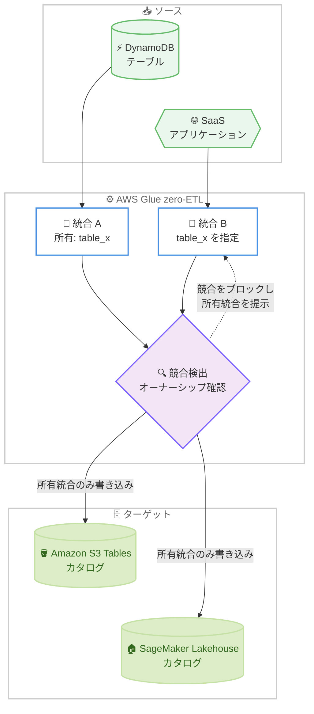

# AWS Glue - zero-ETL 統合のターゲットテーブルプロパティのオーナーシップ管理と競合検出

**リリース日**: 2026 年 9 月 14 日
**サービス**: AWS Glue
**機能**: zero-ETL 統合のターゲットテーブルプロパティのオーナーシップ追跡と競合検出

📊 [このアップデートのインフォグラフィックを見る](https://takech9203.github.io/aws-news-summary/20260914-glue-zero-etl-ownership-conflicts.html)

## 概要

AWS Glue zero-ETL 統合が、ターゲットテーブルプロパティの競合検出と統合オーナーシップの追跡に対応しました。ソーステーブルとターゲットカタログを設定すると、生成されるターゲットテーブルプロパティが所有元の統合 (インテグレーション) に関連付けられます。これにより、2 つの統合が意図せず同じターゲットテーブルを指してしまい、一方の統合がもう一方のデータを上書きする事態を防止できます。

既に別の統合が所有しているターゲットテーブルプロパティに対して、新しい統合を作成または変更しようとすると、AWS Glue は所有元の統合を提示し、別のターゲットを選択するか、既存の統合を変更するよう促します。競合の検出はコンソール、CLI、API のいずれの操作でも一貫して適用され、コンソールでは統合作成ワークフローの「Output settings」ステップで作成前に競合を検出・解決できます。

この機能は Amazon S3 Tables と Amazon SageMaker Lakehouse カタログの両方のターゲットで動作します。複数の zero-ETL 統合を運用するチームは、各ソーステーブルのデータがどこに書き込まれるかを予測可能な形で制御でき、パイプラインの分離性とデータの整合性を高められます。

**アップデート前の課題**

- 以前は複数の統合が同じターゲットリソース上の同じテーブルを指していても検出されず、一方の統合がもう一方の統合のデータを上書きするリスクがあった
- ターゲットテーブルプロパティがどの統合に属しているかを追跡する仕組みがなく、統合が増えるほど構成ミスの発見が困難だった
- 複数チームや複数アカウントで統合を作成する場合、ターゲットの重複を運用ルールや手動確認で防ぐ必要があった

**アップデート後の改善**

- ターゲットテーブルプロパティが所有元の統合に関連付けられ、オーナーシップが明確に追跡されるようになった
- 同じターゲットリソースとソーステーブルの組み合わせに対する 2 つ目の統合の作成を AWS Glue が検出してブロックし、意図しないデータ上書きを防止できるようになった
- コンソールの「Output settings」ステップで統合作成前に競合が可視化され、その場で解決できるようになった
- 新しい `ListIntegrationTableProperties` API により、テーブルプロパティとその所有統合をプログラムから確認できるようになった

## アーキテクチャ図



複数の zero-ETL 統合が同じターゲットリソースとソーステーブルの組み合わせを指定した場合、AWS Glue がオーナーシップを確認して競合を検出し、後から作成される統合をブロックする流れを示しています。

## サービスアップデートの詳細

### 主要機能

1. **統合オーナーシップの追跡**
   - ターゲットテーブルプロパティは「ターゲットリソース ARN」と「ソーステーブル名」の組み合わせで識別される
   - ターゲットリソースは、汎用 S3 ターゲットの場合は AWS Glue データベース、Amazon S3 Tables ターゲットの場合は S3 Tables カタログ
   - 各組み合わせは同時に 1 つの統合にのみ関連付けられ、ソーステーブルのターゲットプロパティは 1 つの統合のみが所有できる

2. **競合の検出とブロック**
   - 同じソーステーブルを同じターゲットリソースに書き込む 2 つ目の統合を作成しようとすると、AWS Glue が競合を検出して作成を防止する
   - 競合発生時は所有元の統合が提示され、別のターゲットの選択、または既存統合の変更 (ソーステーブルの除外など) で解決する
   - コンソール、CLI、API のいずれの操作経路でも同じルールが適用される

3. **コンソールでの競合の可視化**
   - 統合作成ワークフローの「Output settings」ステップで、作成前に競合を検出できる
   - SaaS アプリケーションなどのマルチテーブルソースでは、「Action required」と「Notes」の 2 列で各ソーステーブルの状態を表示
   - Amazon DynamoDB などのシングルテーブルソースでは、同じ情報をインラインアラートで表示

4. **検出対象となる競合条件**
   - 別の統合が既に同じソーステーブルを選択中のターゲットリソースに書き込んでいる
   - 出力テーブル名が、選択中のターゲットリソース上で別のソーステーブル用に既に登録されている
   - 複数のソーステーブルが同じ出力テーブル名にマッピングされている (マルチテーブル SaaS ソースの場合)
   - 出力テーブル名が無効 (小文字・数字・アンダースコアのみ、255 文字以内。S3 Tables カタログではアンダースコア始まり不可)
   - 出力設定への同時変更を検出した場合 (この条件のみブロックせず、最新設定への更新か現状続行かを選択可能)

## 技術仕様

### 競合検出の識別キー

| 項目 | 詳細 |
|------|------|
| 識別キー | ターゲットリソース ARN + ソーステーブル名の組み合わせ |
| ターゲットリソース (汎用 S3) | AWS Glue データベース |
| ターゲットリソース (S3 Tables) | Amazon S3 Tables カタログ |
| 所有可能な統合数 | 1 組み合わせにつき 1 統合のみ |
| 適用される操作経路 | コンソール、CLI、API のすべて |
| 対応ソース | シングルテーブルソース (DynamoDB など)、マルチテーブルソース (SaaS アプリケーション) |

### API 変更履歴

| 日付 | サービス | 変更内容 |
|------|----------|----------|
| 2026/09/14 | [AWS Glue](https://awsapichanges.com/archive/changes/7b8c33-glue.html) | 1 new 3 updated api methods - 新 API `ListIntegrationTableProperties` の追加、`TargetTableConfig` への `IntegrationArn` の追加 |

### ターゲットテーブルプロパティの設定例

```bash
aws glue create-integration-table-properties \
  --resource-arn arn:aws:glue:us-east-1:123456789012:database/my-database \
  --table-name my-source-table \
  --target-table-config '{
      "UnnestSpec": "TOPLEVEL",
      "PartitionSpec": [
          {
              "FieldName": "created_at",
              "FunctionSpec": "day"
          }
      ],
      "TargetTableName": "my_target_table"
  }' \
  --region us-east-1
```

このコマンドは、ターゲットリソース (AWS Glue データベース) とソーステーブルの組み合わせに対してターゲットテーブルプロパティを登録します。今回のアップデートにより、このプロパティは作成した統合に所有され、他の統合からの重複利用が競合として検出されます。

## 設定方法

### 前提条件

1. AWS Glue zero-ETL 統合のソース (Amazon DynamoDB、SaaS アプリケーションなど) が設定済みであること
2. ターゲットリソース (SageMaker Lakehouse の AWS Glue データベース、または Amazon S3 Tables カタログ) が設定済みであること
3. ターゲット IAM ロールの作成と、カタログ RBAC ポリシー (`glue:CreateInboundIntegration`、`glue:AuthorizeInboundIntegration`) の設定が完了していること

### 手順

#### ステップ1: ターゲットリソースへのロール関連付け

```bash
aws glue create-integration-resource-property \
  --resource-arn arn:aws:glue:us-east-1:123456789012:catalog/s3tablescatalog/my-table-bucket \
  --target-processing-properties '{"RoleArn": "arn:aws:iam::123456789012:role/my-target-role"}' \
  --region us-east-1
```

ターゲットリソース (この例では S3 Tables カタログ) に、AWS Glue がデータ書き込みに使用する IAM ロールを関連付けます。

#### ステップ2: ターゲットテーブルプロパティの設定と競合確認

```bash
aws glue create-integration-table-properties \
  --resource-arn arn:aws:glue:us-east-1:123456789012:catalog/s3tablescatalog/my-table-bucket \
  --table-name my-source-table \
  --target-table-config '{"TargetTableName": "my_target_table"}' \
  --region us-east-1
```

ソーステーブルに対するターゲットテーブルプロパティを登録します。同じターゲットリソースとソーステーブルの組み合わせが既に別の統合に所有されている場合、AWS Glue が競合を検出します。コンソールを使用する場合は、統合作成ワークフローの「Output settings」ステップで同じ内容を設定でき、競合があれば「Action required」列またはインラインアラートで通知されます。

#### ステップ3: 統合の作成

```bash
aws glue create-integration \
  --integration-name my-integration \
  --source-arn arn:aws:dynamodb:us-east-1:123456789012:table/my-source-table \
  --target-arn arn:aws:glue:us-east-1:123456789012:catalog/s3tablescatalog/my-table-bucket \
  --region us-east-1
```

ソースとターゲットを指定して zero-ETL 統合を作成します。登録済みのターゲットテーブルプロパティは、この統合に関連付けられて所有されます。競合が検出された場合は、別のターゲットリソースを選択するか、所有元の統合からソーステーブルを除外して解決します。

## メリット

### ビジネス面

- **データ破損リスクの低減**: 統合同士の意図しない上書きを仕組みとして防止できるため、分析基盤のデータ信頼性が向上する
- **チーム間ガバナンスの強化**: 複数チームが同じターゲットカタログを利用する環境でも、所有関係が明確になり運用ルールへの依存を減らせる
- **障害調査コストの削減**: 「どの統合がどのテーブルに書き込んでいるか」が追跡可能になり、データ不整合発生時の原因特定が容易になる

### 技術面

- **作成前の競合検出**: コンソールの「Output settings」ステップで統合作成前に競合を検出でき、作成後の手戻りを防げる
- **一貫した適用**: コンソール、CLI、API のどの経路でも同じ競合検出ルールが適用され、自動化パイプラインでも保護が有効
- **プログラムによる確認**: 新 API `ListIntegrationTableProperties` と `TargetTableConfig` の `IntegrationArn` により、所有関係をプログラムから監査できる
- **非ブロッキングな同時変更検出**: 他ユーザーによる出力設定の同時変更は警告のみで、作業を中断せずに最新設定への更新を選択できる

## デメリット・制約事項

### 制限事項

- 1 つのターゲットリソースとソーステーブルの組み合わせは 1 つの統合のみが所有できるため、同じテーブルを同じターゲットに複数統合で書き込む構成は取れない
- 別の統合に既に所有されているソーステーブルは、競合を解決するまで自分の統合ではレプリケーションされない
- 出力テーブル名には命名制約がある (小文字・数字・アンダースコアのみ、255 文字以内。S3 Tables カタログターゲットではアンダースコア始まり不可)
- zero-ETL 統合のターゲットは作成後に変更できない

### 考慮すべき点

- 既存の統合構成で同一ターゲットへの重複書き込みを (意図的に) 行っている場合、統合の変更時に競合として検出される可能性があるため、構成の見直しが必要
- クロスアカウントのターゲットを使用する場合、ターゲットテーブルプロパティの設定は統合作成前に完了しておく必要がある
- 統合作成後にターゲットテーブルプロパティを変更すると、既存設定と競合する変更 (パーティション列の変更など) ではフルリシンクが発生する可能性がある

## ユースケース

### ユースケース1: 複数チームが共有する S3 Tables カタログの保護

**シナリオ**: データプラットフォームチームが全社共通の Amazon S3 Tables カタログを運用し、各事業部チームがそれぞれ DynamoDB テーブルから zero-ETL 統合でデータを取り込んでいる。チーム間の調整不足により、同じターゲットテーブルに複数の統合が書き込んでしまうリスクがある。

**実装例**:
```
1. 各チームが統合作成時に Output settings で出力テーブル名を指定
2. 既に他チームの統合が所有する組み合わせを指定した場合、
   コンソールが所有元の統合を提示してブロック
3. チームは別の出力テーブル名または別のネームスペースを選択して解決
```

**効果**: 事前のチーム間調整に頼らず、プラットフォーム側の仕組みとしてターゲットの重複を防止でき、共有カタログのデータ整合性を保てる。

### ユースケース2: SaaS マルチテーブルソースの出力マッピング検証

**シナリオ**: SaaS アプリケーションをソースとする zero-ETL 統合で数十のテーブルを SageMaker Lakehouse に同期している。テーブル数が多く、出力テーブル名の重複や命名規則違反が発生しやすい。

**実装例**:
```
1. 統合作成ワークフローの Output settings で全ソーステーブルの一覧を確認
2. 「Action required」「Notes」列で、名前の重複・無効な名前・
   他統合との競合があるテーブルを特定
3. フラグが付いたテーブルのみ出力テーブル名を修正して作成を続行
```

**効果**: 多数のテーブルマッピングを作成前に一括検証でき、作成後に判明する構成ミスとその修正作業を削減できる。

### ユースケース3: IaC パイプラインでの統合構成の監査

**シナリオ**: zero-ETL 統合を CLI / API ベースの IaC パイプラインで管理しており、デプロイ前にターゲットテーブルプロパティの所有状況を自動チェックしたい。

**実装例**:
```bash
# ターゲットリソース上のテーブルプロパティと所有統合を一覧
aws glue list-integration-table-properties \
  --resource-arn arn:aws:glue:us-east-1:123456789012:catalog/s3tablescatalog/my-table-bucket

# 出力の IntegrationArn を確認し、デプロイ対象の統合と
# 競合しないことを CI で検証
```

**効果**: 所有関係をプログラムから監査でき、CI/CD パイプラインの段階で競合を検出して安全にデプロイできる。

## 料金

このアップデート自体に追加料金はありません。AWS Glue zero-ETL 統合の既存の料金体系が適用され、ソースからのデータ取り込み量などに基づいて課金されます。詳細は [AWS Glue の料金ページ](https://aws.amazon.com/glue/pricing/) を参照してください。

## 利用可能リージョン

AWS Glue zero-ETL 統合がサポートされるすべての AWS 商用リージョンおよび AWS GovCloud (US) リージョンで利用可能です。

## 関連サービス・機能

- **Amazon S3 Tables**: zero-ETL 統合のターゲットの 1 つ。S3 Tables カタログがターゲットリソースとして競合検出の識別キーになる
- **Amazon SageMaker Lakehouse**: zero-ETL 統合のターゲットとなるレイクハウスアーキテクチャ。汎用 S3 バケット、S3 Tables、Redshift Managed Storage をストレージとして利用可能
- **Amazon DynamoDB**: zero-ETL 統合の代表的なシングルテーブルソース。コンソールではインラインアラートで競合が通知される
- **AWS Lake Formation**: S3 Tables カタログや SageMaker Lakehouse カタログの権限管理を担う

## 参考リンク

- 📊 [インフォグラフィック](https://takech9203.github.io/aws-news-summary/20260914-glue-zero-etl-ownership-conflicts.html)
- [公式発表 (What's New)](https://aws.amazon.com/about-aws/whats-new/2026/09/glue-zero-etl-ownership-conflicts/)
- [ドキュメント: Configuring a target for a zero-ETL integration](https://docs.aws.amazon.com/glue/latest/dg/zero-etl-target.html)
- [API 変更履歴 (awsapichanges.com)](https://awsapichanges.com/archive/changes/7b8c33-glue.html)
- [料金ページ](https://aws.amazon.com/glue/pricing/)

## まとめ

AWS Glue zero-ETL 統合のターゲットテーブルプロパティにオーナーシップ追跡と競合検出が追加され、複数の統合が意図せず同じターゲットテーブルへ書き込むリスクを仕組みとして防止できるようになりました。複数チームや多数の統合を運用している環境では、共有カタログのデータ整合性を高める重要な保護機能です。既存の統合構成に同一ターゲットへの重複がないかを確認し、新規統合の作成時には「Output settings」ステップや `ListIntegrationTableProperties` API を活用した競合チェックを取り入れることを推奨します。
