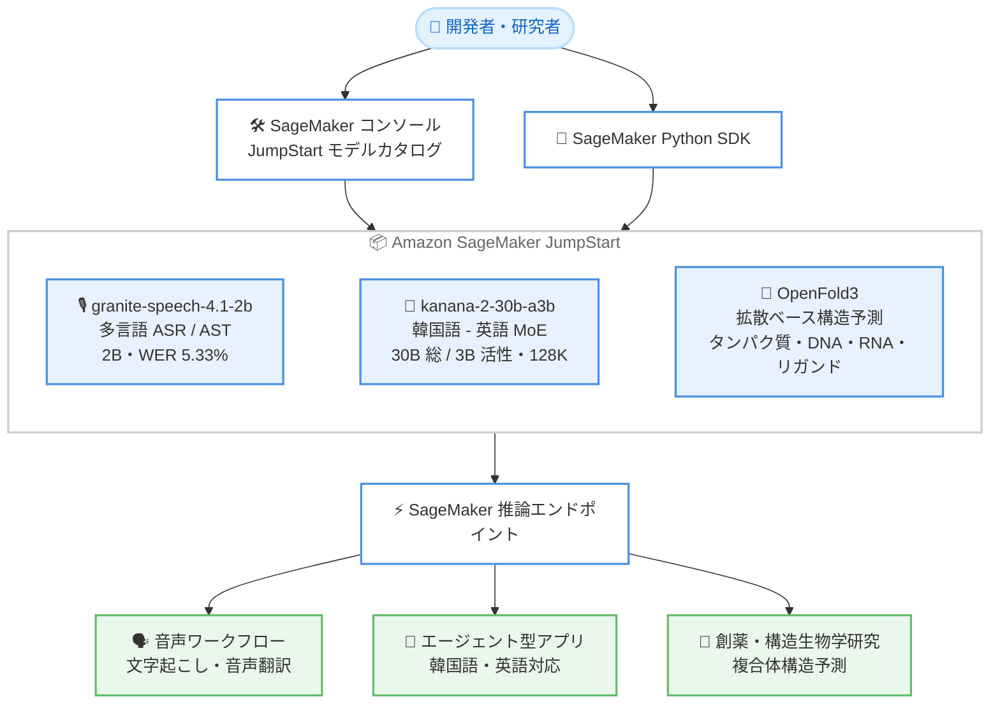

# Amazon SageMaker JumpStart - granite-speech-4.1-2b / kanana-2-30b-a3b-instruct / OpenFold3 の提供開始

**リリース日**: 2026 年 9 月 14 日
**サービス**: Amazon SageMaker JumpStart
**機能**: granite-speech-4.1-2b (多言語音声認識・音声翻訳)、kanana-2-30b-a3b-instruct (韓国語 - 英語バイリンガル MoE モデル)、OpenFold3 (生体分子複合体構造予測モデル)

📊 [このアップデートのインフォグラフィックを見る](https://takech9203.github.io/aws-news-summary/20260914-granite-speech-4.1-2b-edge-kanana-2-30b-a3b-instruct-openfold3-jumpstart.html)

## 概要

AWS は、IBM の granite-speech-4.1-2b、Kakao の kanana-2-30b-a3b-instruct、OpenFold Consortium の OpenFold3 の 3 つのモデルが Amazon SageMaker JumpStart で利用できるようになったことを発表しました。音声、言語、ライフサイエンスという異なる領域をカバーするモデルが同時に追加され、JumpStart のモデルカタログの選択肢がさらに広がりました。

granite-speech-4.1-2b は、英語、フランス語、ドイツ語、スペイン語、ポルトガル語、日本語に対応した 2B (20 億) パラメータの多言語自動音声認識 (ASR) および双方向音声翻訳 (AST) モデルです。単語誤り率 (WER) 5.33%、リアルタイムファクター約 231 を達成し、同サイズ帯で最も効率的な ASR モデルの 1 つとされています。kanana-2-30b-a3b-instruct は、Kakao が開発した韓国語 - 英語バイリンガルモデルで、Multi-head Latent Attention (MLA) と Mixture-of-Experts (MoE) アーキテクチャを組み合わせ、総パラメータ 30B のうちフォワードパスごとに 3B のみを活性化することで高いスループットを実現します。OpenFold3 は、OpenFold Consortium とコロンビア大学 AlQuraishi Lab が開発した拡散ベースのモデルで、タンパク質、DNA、RNA、低分子リガンドを含む全原子レベルの生体分子複合体構造予測に対応します。

3 モデルはいずれも SageMaker コンソールの JumpStart モデルカタログから数クリックで、または SageMaker Python SDK からプログラムでデプロイできます。音声処理パイプラインを構築するエンジニア、韓国語対応のエージェント型アプリケーションを開発するチーム、創薬・構造生物学研究に取り組む研究者が主な対象です。

**アップデート前の課題**

- 日本語を含む多言語の音声認識と双方向音声翻訳を、軽量なオープンモデルで SageMaker 上に簡単にデプロイする選択肢が限られていた
- 韓国語に強いバイリンガルモデルで、長いコンテキストとエージェント型ワークフローに対応したものを JumpStart から利用することが難しかった
- タンパク質単体を超えた多鎖複合体や DNA・RNA・リガンドを含む構造予測を行うには、モデルの入手と実行環境の構築を自前で行う必要があった

**アップデート後の改善**

- 2B パラメータの効率的な ASR / AST モデル granite-speech-4.1-2b を数クリックでデプロイし、文字起こし・翻訳・大規模音声処理を AWS 上で実行できるようになった
- MoE により 3B のみを活性化する高スループットな韓国語 - 英語モデル kanana-2-30b-a3b-instruct を、最大 128K トークンのコンテキストで利用できるようになった
- 拡散ベースの OpenFold3 により、タンパク質・DNA・RNA・低分子リガンドを含む全原子生体分子複合体の構造予測を SageMaker 上で実行できるようになった

## アーキテクチャ図



開発者や研究者は SageMaker コンソールの JumpStart モデルカタログまたは Python SDK から 3 つのモデルをデプロイし、推論エンドポイント経由で音声処理、バイリンガル対話、生体分子構造予測の各ワークロードに利用します。

## サービスアップデートの詳細

### 主要機能

1. **granite-speech-4.1-2b: 多言語音声認識・音声翻訳モデル (IBM)**
   - 英語、フランス語、ドイツ語、スペイン語、ポルトガル語、日本語に対応した多言語自動音声認識 (ASR) と双方向音声翻訳 (AST)
   - 2B パラメータで単語誤り率 (WER) 5.33%、リアルタイムファクター約 231 を達成し、同サイズ帯で最も効率的な ASR モデルの 1 つとされる
   - Apache 2.0 ライセンスで提供され、文字起こし・翻訳・大規模音声処理などのエンタープライズ音声ワークフローに適する

2. **kanana-2-30b-a3b-instruct: 韓国語 - 英語バイリンガル MoE モデル (Kakao)**
   - Multi-head Latent Attention (MLA) と Mixture-of-Experts (MoE) を組み合わせたアーキテクチャ
   - 総パラメータ 30B のうちフォワードパスごとに 3B のみを活性化し、高いスループットを実現
   - 教師ありファインチューニング (SFT) と強化学習によるポストトレーニングを実施
   - YaRN スケーリングにより最大 128K トークンのコンテキスト長をサポート
   - 「コンテキストを理解し、能動的に行動する」AI コラボレーターとしての利用を想定した、指示追従とエージェント型 AI ワークフロー向けの設計

3. **OpenFold3: 全原子生体分子複合体構造予測モデル (OpenFold Consortium)**
   - OpenFold Consortium とコロンビア大学 AlQuraishi Lab が開発
   - 拡散ベースのアーキテクチャにより、タンパク質、DNA、RNA、低分子リガンドを含む全原子レベルの生体分子複合体構造を予測
   - 単一タンパク質の予測を超えて、多鎖複合体や異種生体分子間相互作用の予測に対応
   - コンピュータ支援創薬 (CADD) や、アカデミア・製薬企業の研究用途に適する

4. **簡単なデプロイ**
   - SageMaker コンソールの JumpStart モデルカタログから数クリックでデプロイ可能
   - SageMaker Python SDK を使用したプログラムによるデプロイにも対応

## 技術仕様

### モデル比較

| 項目 | granite-speech-4.1-2b | kanana-2-30b-a3b-instruct | OpenFold3 |
|------|----------------------|---------------------------|-----------|
| 開発元 | IBM | Kakao | OpenFold Consortium / コロンビア大学 AlQuraishi Lab |
| モデルタイプ | 多言語 ASR / 双方向音声翻訳 | バイリンガル指示追従 LLM | 生体分子複合体構造予測 |
| アーキテクチャ | 音声認識・翻訳モデル | MLA + MoE | 拡散ベース |
| パラメータ | 2B | 総 30B / 活性 3B | 記載なし |
| 対応言語・対象 | 英語、フランス語、ドイツ語、スペイン語、ポルトガル語、日本語 | 韓国語、英語 | タンパク質、DNA、RNA、低分子リガンド |
| 性能指標 | WER 5.33%、リアルタイムファクター約 231 | 記載なし | 記載なし |
| コンテキスト長 | - | 最大 128K トークン (YaRN スケーリング) | - |
| ポストトレーニング | - | SFT + 強化学習 | - |
| ライセンス | Apache 2.0 | 公式発表に記載なし | 公式発表に記載なし |
| 提供方法 | Amazon SageMaker JumpStart | Amazon SageMaker JumpStart | Amazon SageMaker JumpStart |

### API変更履歴

今回のアップデートに直接関連する公開 API の変更は確認されませんでした。SageMaker JumpStart へのモデル追加であり、既存の SageMaker デプロイ API を通じて利用します。

## 設定方法

### 前提条件

1. Amazon SageMaker を利用できる AWS アカウント
2. SageMaker Studio ドメインのセットアップ、または SageMaker Python SDK の実行環境
3. モデルのデプロイとエンドポイント作成に必要な IAM 権限
4. 推論エンドポイントに使用するインスタンスタイプのサービスクォータ

### 手順

#### ステップ1: SageMaker コンソールからモデルを選択する

SageMaker コンソールで JumpStart モデルカタログを開き、granite-speech-4.1-2b、kanana-2-30b-a3b-instruct、または OpenFold3 を検索して選択します。コンソール上から数クリックでデプロイを開始できます。

#### ステップ2: SageMaker Python SDK でデプロイする

```python
from sagemaker.jumpstart.model import JumpStartModel

# JumpStart のモデル ID を指定してモデルオブジェクトを作成する
model = JumpStartModel(model_id="<対象モデルの ID>")

# モデルをデプロイし、推論エンドポイントを作成する
predictor = model.deploy()
```

上記のコードは、JumpStart のモデル ID を指定して対象モデルをデプロイし、推論用のエンドポイントを作成します。正確なモデル ID は SageMaker コンソールの JumpStart モデルカタログまたはドキュメントで確認してください。

#### ステップ3: 推論を実行する

デプロイされたエンドポイントに対してリクエストを送信します。granite-speech-4.1-2b には音声データ、kanana-2-30b-a3b-instruct にはテキストプロンプト、OpenFold3 には生体分子の配列情報などを入力し、それぞれ文字起こし・翻訳結果、テキスト応答、予測構造を取得します。詳細は SageMaker JumpStart のドキュメントを参照してください。

## メリット

### ビジネス面

- **音声ワークフローの低コスト化**: 2B パラメータの効率的な ASR / AST モデルにより、大規模モデルに依存せず文字起こしや音声翻訳のコストを抑えられる可能性がある
- **韓国語市場への展開**: 韓国語に強いバイリンガルモデルにより、韓国語圏向けのアプリケーションやサービスを開発しやすくなる
- **創薬研究の加速**: 生体分子複合体の構造予測を AWS 上で実行でき、コンピュータ支援創薬のワークフローを迅速に構築できる

### 技術面

- **効率的な音声認識**: WER 5.33%、リアルタイムファクター約 231 という同サイズ帯で高い効率を持つ ASR 性能を利用できる
- **高スループットな推論**: MoE により総 30B のうち 3B のみを活性化するため、パラメータ規模に対して高いスループットが期待できる
- **長いコンテキスト**: YaRN スケーリングによる最大 128K トークンのコンテキストで、長文ドキュメントや長い対話履歴を扱える
- **全原子・多鎖対応の構造予測**: 単一タンパク質にとどまらず、DNA・RNA・リガンドを含む複合体や異種生体分子間相互作用の予測に対応できる

## デメリット・制約事項

### 制限事項

- モデルのデプロイにはインスタンスの起動が伴うため、エンドポイントの稼働時間に応じた費用が発生する
- 利用可能なリージョンやインスタンスタイプは SageMaker JumpStart の対応状況に依存する (公式発表にリージョンの明記なし)
- kanana-2-30b-a3b-instruct と OpenFold3 のライセンス条件は公式発表に明記されていないため、利用前にモデルカードで確認が必要

### 考慮すべき点

- granite-speech-4.1-2b の対応言語は 6 言語であり、対象言語が含まれるかを事前に確認する必要がある
- kanana-2-30b-a3b-instruct は韓国語 - 英語に最適化されており、他言語での性能は自社ユースケースでの検証が必要
- OpenFold3 の予測結果は研究用途の参考情報であり、実験的検証と組み合わせて利用することを推奨する
- エンドポイントのインスタンスタイプとオートスケーリング設定を、想定されるワークロードに合わせて調整する必要がある

## ユースケース

### ユースケース1: 多言語コールセンターの文字起こしと音声翻訳

**シナリオ**: 日本語や英語を含む多言語の通話音声を文字起こしし、必要に応じて双方向に翻訳するエンタープライズ音声処理パイプラインを構築する。

**実装例**:
```
通話音声 (日本語・英語など 6 言語) → granite-speech-4.1-2b → 文字起こし + 音声翻訳 → 分析・要約パイプライン
```

**効果**: 2B パラメータの効率的なモデルにより、大規模な音声処理を低コストかつ高速 (リアルタイムファクター約 231) に実行できる。

### ユースケース2: 韓国語対応のエージェント型アシスタント

**シナリオ**: 韓国語と英語の両方で指示を理解し、コンテキストを踏まえて能動的にタスクを実行するエージェント型アシスタントを構築する。

**実装例**:
```
ユーザー指示 (韓国語 / 英語) + 長文コンテキスト (最大 128K トークン) → kanana-2-30b-a3b-instruct → タスク実行・応答生成
```

**効果**: MoE による高スループットな推論と 128K トークンのコンテキストにより、大量の業務ドキュメントを参照する韓国語対応エージェントを効率的に運用できる。

### ユースケース3: 創薬におけるタンパク質 - リガンド複合体の構造予測

**シナリオ**: 製薬企業の研究チームが、候補化合物と標的タンパク質の複合体構造を予測し、コンピュータ支援創薬のスクリーニングに活用する。

**実装例**:
```
タンパク質配列 + リガンド情報 (+ DNA / RNA) → OpenFold3 → 全原子複合体構造の予測 → ドッキング解析・候補絞り込み
```

**効果**: 拡散ベースの全原子構造予測により、多鎖複合体や異種生体分子間相互作用を考慮した創薬研究を AWS 上で迅速に進められる。

## 料金

Amazon SageMaker JumpStart 経由でデプロイしたモデルの利用には、推論エンドポイントに使用する SageMaker インスタンスの料金が適用されます。料金はインスタンスタイプと稼働時間に基づいて課金されます。granite-speech-4.1-2b は Apache 2.0 ライセンスで提供されるため、追加のモデルライセンス費用は発生しません。kanana-2-30b-a3b-instruct と OpenFold3 のライセンス条件は、各モデルのモデルカードで確認してください。詳細は Amazon SageMaker の料金ページを参照してください。

## 利用可能リージョン

公式発表では特定のリージョンは明記されていません。利用可能なリージョンは SageMaker JumpStart の対応状況に依存するため、最新の対応リージョンは SageMaker コンソールの JumpStart モデルカタログまたはドキュメントで確認してください。

## 関連サービス・機能

- **Amazon SageMaker Studio**: モデルの検索・デプロイ・管理を行う統合開発環境
- **Amazon SageMaker Python SDK**: プログラムからモデルをデプロイ・推論するためのライブラリ
- **Amazon Bedrock**: 基盤モデルを API 経由で利用する代替アプローチ (フルマネージド型)
- **Amazon Transcribe**: フルマネージドの音声認識サービス (granite-speech-4.1-2b の代替として比較検討の対象)
- **AWS HealthOmics**: ゲノム・オミクスデータの保存・解析サービス (OpenFold3 と組み合わせたライフサイエンスワークフローに関連)

## 参考リンク

- 📊 [インフォグラフィック](https://takech9203.github.io/aws-news-summary/20260914-granite-speech-4.1-2b-edge-kanana-2-30b-a3b-instruct-openfold3-jumpstart.html)
- [公式発表 (What's New)](https://aws.amazon.com/about-aws/whats-new/2026/01/granite-speech-4.1-2b-edge-kanana-2-30b-a3b-instruct-openfold3-jumpstart/)
- [Amazon SageMaker JumpStart ドキュメント](https://docs.aws.amazon.com/sagemaker/latest/dg/studio-jumpstart.html)
- [Amazon SageMaker 料金ページ](https://aws.amazon.com/sagemaker/pricing/)

## まとめ

granite-speech-4.1-2b、kanana-2-30b-a3b-instruct、OpenFold3 の SageMaker JumpStart での提供開始により、日本語対応の効率的な音声認識・音声翻訳、韓国語 - 英語のエージェント型ワークフロー、生体分子複合体の構造予測という 3 つの異なる領域のモデルを、AWS 上に簡単にデプロイできるようになりました。音声処理パイプラインの構築、韓国語圏向けアプリケーションの開発、創薬・構造生物学研究に取り組むチームは、SageMaker JumpStart から各モデルをデプロイし、対象ユースケースでの性能とコストを評価することを推奨します。
