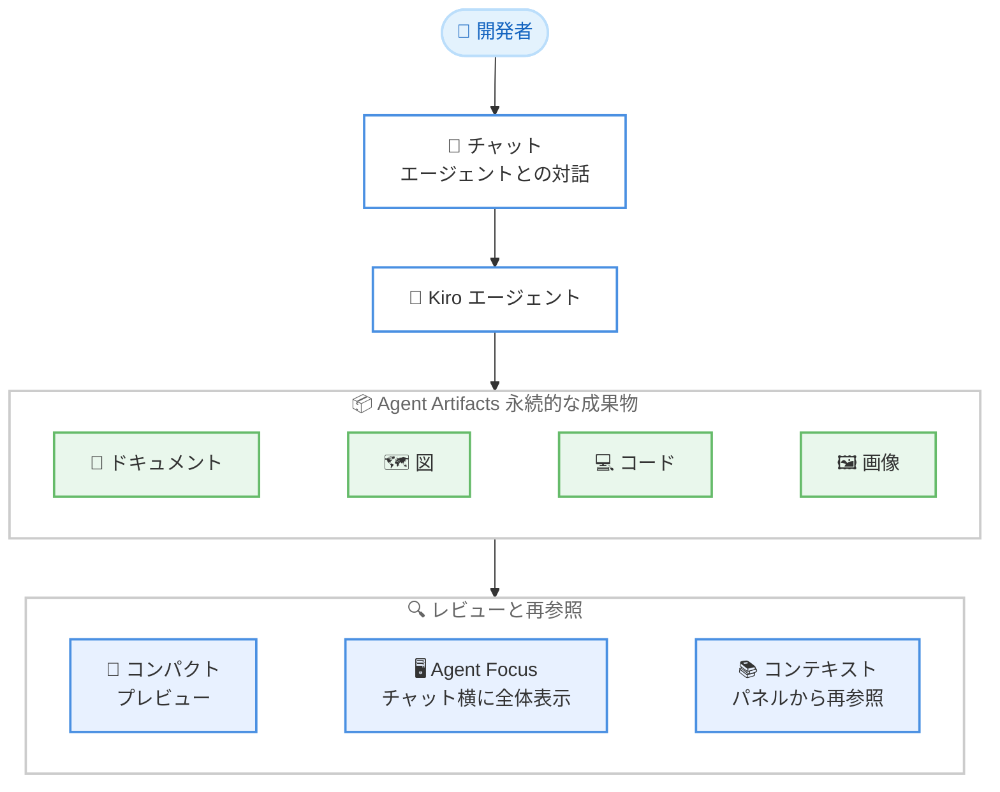

# Kiro - Agent Artifacts とネイティブ ARM64 ビルド (IDE 1.1)

**リリース日**: 2026 年 9 月 14 日
**サービス**: Kiro (AWS が提供する AI 搭載 IDE)
**機能**: Agent Artifacts and Native ARM64 Builds (Kiro IDE 1.1)

📊 [このアップデートのインフォグラフィックを見る](https://takech9203.github.io/aws-news-summary/20260914-kiro-changelog-2026-09-14.html)

## 概要

Kiro IDE 1.1 がリリースされ、エージェントの成果物を永続的な「Artifacts」として扱う機能と、Windows および Linux 向けのネイティブ ARM64 ビルドが追加されました。エージェントが生成したドキュメント、図、コード、画像などをチャットの会話履歴に埋もれさせることなく、レビュー可能で後から参照できる成果物として管理できるようになります。あわせて、エディタ基盤が Code OSS 1.131 に更新されました。

Artifacts は、チャットの会話からコンパクトなプレビューとして開く、Agent Focus でチャットの横に全体を表示してレビューする、Agent Focus のコンテキストパネルから後で再参照する、という 3 つの方法で利用できます。エージェントとの長い対話の中で生成された重要な成果物を見失うことがなくなり、レビューと再利用のワークフローが大幅に改善されます。

また、本リリースにはコンパクト化された会話が適切なコンテキストを保持する改善、MCP 障害の明確化、Hooks の信頼性向上、エンタープライズプロファイルでのリージョンルーティングなど、エージェント利用の信頼性を高める多数の改善が含まれています。

**アップデート前の課題**

- エージェントが生成したドキュメントや図、コードなどの成果物がチャットの会話履歴に埋もれてしまい、後から探して参照することが困難だった
- Windows および Linux の ARM64 環境では x64 エミュレーションに依存する必要があり、ネイティブ性能を発揮できなかった
- ツール一覧を取得できない MCP サーバーが「ツール数ゼロで接続済み」と表示され、障害と正常状態の区別が付きにくかった
- Hook のプロセスが早期終了した場合に出力が失われる、正当な Hook 出力がプロンプトインジェクションと誤判定されるなど、Hooks の動作に信頼性の課題があった
- エンタープライズ ID でサインインした場合、ID プロバイダーの登録リージョンによってはリクエストが選択したプロファイルのリージョンに送信されないことがあった

**アップデート後の改善**

- エージェントの成果物を永続的な Artifacts として生成し、プレビュー表示、Agent Focus での全体レビュー、コンテキストパネルからの再参照が可能になった
- Windows と Linux 向けのネイティブ ARM64 ビルドが提供され、エミュレーションなしでインストールできるようになった
- エディタ基盤が Code OSS 1.131 に更新され、最新のエディタ機能を利用できるようになった
- コンパクト化された会話をシステム指示と要約から再構築し、以降のターンで適切なコンテキストを保持するようになった
- エンタープライズプロファイルで、サービスリクエストが選択したプロファイルのリージョンにルーティングされるようになった

## アーキテクチャ図



エージェントが生成したドキュメント、図、コード、画像などが永続的な Artifacts となり、コンパクトプレビュー、Agent Focus での全体表示、コンテキストパネルからの再参照という 3 つの方法でレビュー・再利用できます。

## サービスアップデートの詳細

### 主要機能

1. **Agent Artifacts (エージェント成果物のレビュー)**
   - エージェントが生成したドキュメント、図、コード、画像などを、チャットの会話履歴に埋もれさせずに永続的な Artifacts として管理
   - チャットの会話からコンパクトなプレビューを開いて内容を素早く確認可能
   - Agent Focus でチャットの横に成果物の全体を表示してレビュー可能
   - Agent Focus のコンテキストパネルから、過去の成果物に後から再アクセス可能

2. **ネイティブ ARM64 ビルド (Windows / Linux)**
   - Windows と Linux 向けにネイティブ ARM64 ビルドを追加
   - x64 エミュレーションに依存せず、ARM64 プラットフォームでネイティブに動作
   - Kiro のダウンロードページからプラットフォームに応じた ARM64 ビルドを選択してインストール

3. **エディタ基盤の更新**
   - エディタ基盤を Code OSS 1.131 に更新

### 改善項目

- **コンパクト化された会話**: システム指示と要約から会話を再構築し、以降のターンで適切なコンテキストを保持
- **MCP のヘルスと権限の明確化**: ツール一覧を取得できない MCP サーバーは「ツール数ゼロで接続済み」ではなく「失敗」として表示。MCP ツールのアノテーションがデフォルトの権限判断に反映されるように改善
- **Hooks の信頼性向上**: プロセスが早期終了しても Hook 出力を保持、正当な Hook 出力をプロンプトインジェクションと誤判定せずに受け入れ、SessionStart Hook のコンテキストを全ターンで一貫して利用可能に
- **プロジェクト規約の認識**: リポジトリの CONTRIBUTING.md にブランチ、コミット、プルリクエストの規約が定義されている場合、Kiro がその指示に従うように改善
- **Agent Focus の継続性向上**: 再起動後も同じウィンドウスタイルとサイズで Agent Focus を再表示。リバート後もチェックポイント履歴のページングが正しく継続
- **エンタープライズプロファイルのルーティング**: エンタープライズ ID でサインインした場合、ID プロバイダーの登録リージョンに関わらず、選択したプロファイルのリージョンにサービスリクエストを送信
- **Windows エンタープライズポリシー**: 管理された Windows ポリシーを VS Code のポリシーパスではなく Kiro のレジストリパスから読み込むように変更

### 修正項目

- UserPromptSubmit Hooks がユーザーメッセージ、Hook 指示、環境コンテキストをモデルに重複送信する問題を修正
- 特定の構成で Agent Focus のコンテキストパネルが Artifacts、Specs、Changed Files を読み込めない問題を修正
- モデル選択が自動のままエフォートレベルを設定するとチャットリクエストが失敗することがある問題を修正
- 狭いチャットレイアウトで要件分析フォームが読みにくく送信しづらくなる問題を修正
- ファイル検索・テキスト検索の失敗が、根本原因を報告せずに空の結果として表示される問題を修正
- サインイン時の背景の後ろにダイアログが開いてしまう問題を修正

## 技術仕様

### IDE 1.1 の主な変更点

| 項目 | 詳細 |
|------|------|
| Agent Artifacts | ドキュメント、図、コード、画像などを永続的な成果物として生成・レビュー・再参照 |
| 表示方法 | コンパクトプレビュー、Agent Focus での全体表示、コンテキストパネルからの再参照 |
| ネイティブ ARM64 ビルド | Windows および Linux 向けに追加 (macOS は従来から Apple Silicon をサポート) |
| エディタ基盤 | Code OSS 1.131 に更新 |
| エンタープライズ対応 | プロファイルのリージョンルーティング、Kiro レジストリパスからの Windows ポリシー読み込み |

## 設定方法

### 前提条件

1. Kiro のアカウント (エンタープライズ機能を利用する場合はエンタープライズ ID)
2. IDE 1.1 以降へのアップデート、または新規インストール

### 手順

#### ステップ 1: Kiro IDE を 1.1 にアップデート

既存ユーザーは Kiro IDE を再起動するか、アップデート通知に従って IDE 1.1 に更新します。

#### ステップ 2: ARM64 環境への新規インストール

Windows または Linux の ARM64 環境に新規インストールする場合は、[Kiro ダウンロードページ](https://kiro.dev/downloads/) からプラットフォームに応じた ARM64 ビルドを選択してダウンロード・インストールします。

#### ステップ 3: Agent Artifacts の利用

エージェントとの対話でドキュメントや図などの成果物を生成すると、Artifacts として保存されます。以下の方法でレビュー・再参照できます。

1. チャットの会話からコンパクトプレビューを開く
2. Agent Focus でチャットの横に成果物の全体を表示する
3. Agent Focus のコンテキストパネルから過去の成果物を再参照する

## メリット

### ビジネス面

- **レビュー効率の向上**: エージェントの成果物が会話履歴に埋もれず、プレビューや Agent Focus で素早くレビューできるため、AI 支援開発のレビューサイクルが短縮される
- **成果物の資産化**: エージェントが生成したドキュメントや図を後から再参照できるため、設計資料や調査結果をチームの資産として活用しやすくなる
- **ARM64 デバイスの活用**: ARM64 搭載の Windows / Linux マシンでネイティブ性能を発揮できるため、省電力な開発マシンの選択肢が広がる

### 技術面

- **コンテキスト保持の改善**: コンパクト化された会話がシステム指示と要約から再構築されるため、長い対話でもエージェントが適切なコンテキストを維持できる
- **MCP 運用の可視性向上**: MCP サーバーの障害が明確に表示され、ツールアノテーションが権限判断に反映されるため、MCP 連携のトラブルシューティングが容易になる
- **Hooks の安定動作**: Hook 出力の保持と誤判定の防止により、自動化ワークフローの信頼性が向上する
- **エンタープライズガバナンス**: 選択したプロファイルのリージョンにリクエストがルーティングされるため、データ所在地に関する組織の要件に対応しやすくなる

## デメリット・制約事項

### 考慮すべき点

- Agent Artifacts のレビュー体験を最大限活用するには、Agent Focus の利用方法に慣れる必要がある
- ネイティブ ARM64 ビルドは Windows と Linux が対象であり、利用中の拡張機能が ARM64 に対応しているかは個別に確認が必要
- エディタ基盤が Code OSS 1.131 に更新されるため、拡張機能の互換性に影響がないかアップデート後に確認することが望ましい

## ユースケース

### ユースケース 1: 設計ドキュメントのレビューと再利用

**シナリオ**: エージェントにアーキテクチャ設計書やシーケンス図を生成させ、チームでレビューしたい。

**実装例**:
```text
1. チャットでエージェントに設計ドキュメントと図の生成を依頼
2. 生成された Artifacts をコンパクトプレビューで確認
3. Agent Focus でチャットの横に全体を表示して詳細をレビュー
4. 後日、コンテキストパネルから同じ成果物を再参照して更新を依頼
```

**効果**: 成果物が会話履歴に埋もれず、レビューと反復的な改善のサイクルが効率化される。

### ユースケース 2: ARM64 開発マシンへの導入

**シナリオ**: ARM64 搭載の Windows ノート PC や Linux サーバー上で Kiro を利用したい。

**実装例**:
```text
1. Kiro ダウンロードページから Windows ARM64 または Linux ARM64 ビルドを選択
2. ネイティブビルドをインストール
3. x64 エミュレーションなしで Kiro を起動
```

**効果**: エミュレーションのオーバーヘッドがなくなり、ARM64 デバイスの性能と電力効率を最大限活用できる。

### ユースケース 3: エンタープライズ環境でのリージョン統制

**シナリオ**: 組織のポリシーにより、AI サービスへのリクエストを特定リージョンに限定したい。

**実装例**:
```text
1. エンタープライズ ID で Kiro にサインイン
2. 組織で選択したプロファイルを利用
3. ID プロバイダーの登録リージョンに関わらず、
   サービスリクエストが選択したプロファイルのリージョンにルーティングされる
```

**効果**: データ所在地やコンプライアンスに関する組織の要件を満たしながら Kiro を利用できる。

## 利用可能リージョン

グローバル (Kiro はグローバルに提供されるサービスです)

## 関連サービス・機能

- **Agent Focus**: エージェントセッションを管理する Kiro の専用ビュー。Artifacts の全体表示と再参照の起点となる
- **MCP (Model Context Protocol)**: 外部ツールとの連携プロトコル。本リリースでサーバー障害の表示とツールアノテーションによる権限判断が改善
- **Hooks**: エージェントの動作を拡張する自動化機能。本リリースで出力の保持と誤判定防止など信頼性が向上
- **Kiro CLI / Kiro Web**: IDE 以外の Kiro 利用形態。本アップデートは IDE 向けのリリース

## 参考リンク

- 📊 [インフォグラフィック](https://takech9203.github.io/aws-news-summary/20260914-kiro-changelog-2026-09-14.html)
- [Kiro Changelog - IDE 1.1](https://kiro.dev/changelog/ide/1-1/)
- [Kiro Changelog](https://kiro.dev/changelog/)
- [Kiro ドキュメント - Artifacts](https://kiro.dev/docs/ide/chat/artifacts/)
- [Kiro ダウンロードページ](https://kiro.dev/downloads/)

## まとめ

Kiro IDE 1.1 は、エージェントの成果物を永続的な Artifacts として扱う新機能により、AI 支援開発におけるレビューと成果物再利用のワークフローを大きく改善するアップデートです。あわせて Windows / Linux のネイティブ ARM64 ビルド、Code OSS 1.131 への基盤更新、MCP・Hooks・エンタープライズ機能の信頼性向上が含まれています。Kiro を利用中の場合は IDE を 1.1 にアップデートし、Agent Focus から Artifacts のレビュー体験を試すことをおすすめします。
