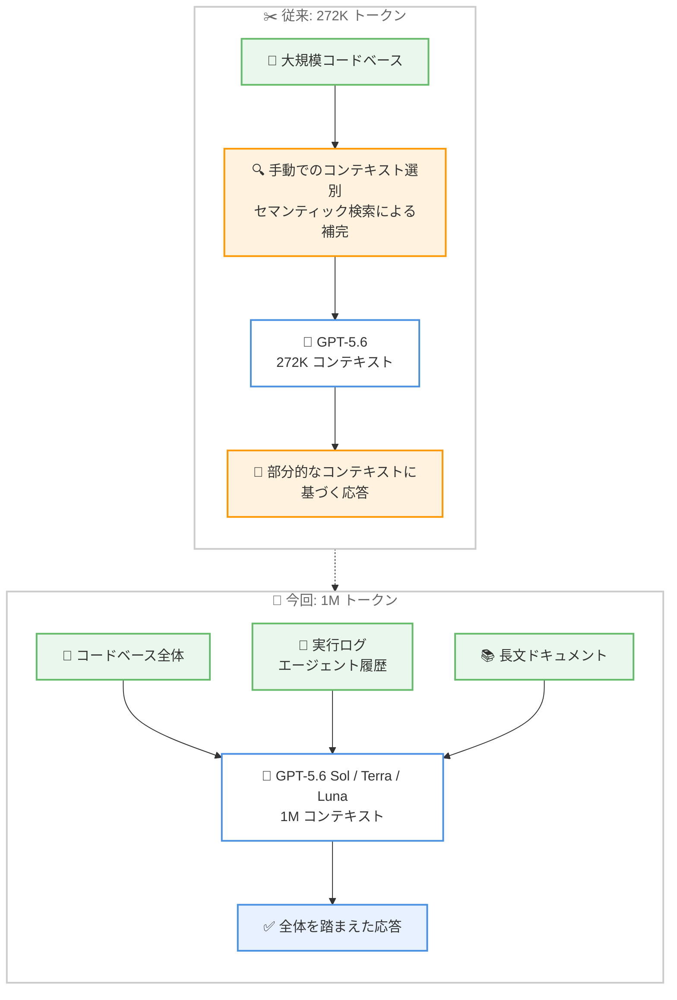

# Kiro - GPT-5.6 モデルの 1M トークンコンテキストウィンドウ対応

**リリース日**: 2026 年 9 月 14 日
**サービス**: Kiro (AWS が提供する AI 搭載 IDE)
**機能**: GPT-5.6 models now support 1 million token context windows in Kiro

📊 [このアップデートのインフォグラフィックを見る](https://takech9203.github.io/aws-news-summary/20260914-kiro-gpt-5-6-1m-context.html)

## 概要

Kiro において、GPT-5.6 Sol、Terra、Luna の 3 モデルが 100 万 (1M) トークンのコンテキストウィンドウに対応しました。従来の 272K トークンから約 3.7 倍への大幅な拡張であり、IDE、CLI、Web のすべてのインターフェースで利用できます。

この拡張により、コードベース全体、長文ドキュメント、長時間にわたるマルチターンのエージェント履歴を、分割 (チャンキング) や要約による情報の欠落なしに、単一のリクエストで処理できるようになりました。ブログでは「単に量が増えるだけでなく、1 回の処理で可能になる仕事の種類が変わる」と説明されており、大規模リポジトリを扱う開発者や、長時間のエージェントタスクを実行するユーザーにとって重要なアップデートです。

**アップデート前の課題**

- 従来の GPT-5.6 モデルのコンテキストウィンドウは 272K トークンに制限されており、大規模なコードベース全体を一度に読み込ませることができなかった
- コードレビューや移行、リファクタリングでは、コンテキストを手動で選別して渡すか、セマンティック検索でモデルの視野外の情報を近似的に補う必要があった
- 長時間のエージェントセッションでは、初期のやり取りが圧縮・要約されてコンテキストから失われ、再プロンプトが必要になることがあった

**アップデート後の改善**

- コードベース全体を対象に、レガシー移行、依存関係マッピング、ファイル横断のアーキテクチャ監査を 1 回のパスで実行できるようになった
- アプリケーション全体とマルチターンの実行ログ、ツール出力を同時に投入でき、複数レイヤーにまたがるバグのエンドツーエンドのデバッグが可能になった
- セッションの全履歴 (コードの反復、コンパイラ出力、ターミナルログ) が視野に残り続けるため、再プロンプトが減り、長時間のタスク完了の信頼性が向上した

## アーキテクチャ図



従来はコードベースの一部を選別してモデルに渡す必要がありましたが、1M トークン対応により、コードベース全体・実行ログ・ドキュメントをそのまま単一リクエストで処理できるようになります。

## サービスアップデートの詳細

### 主要機能

1. **リポジトリスケールの理解**
   - コードレビュー、移行、リファクタリングにおいて、手動でのコンテキスト選別や、モデルの視野外を補うためのセマンティック検索が不要になる
   - レガシー移行、依存関係マッピング、ファイル横断のアーキテクチャ監査を、選別した一部ではなくコードベース全体に対して実行できる

2. **エンドツーエンドのデバッグ**
   - 多くの難しいバグは単一ファイルではなく、API レイヤー、スキーマ、アプリケーション状態の相互作用から発生する
   - 1M コンテキストにより、アプリケーション全体をマルチターンの実行ログやツール出力とともに投入でき、初期のステップをメモリから圧縮して消す必要がない

3. **長時間のエージェントタスク**
   - マルチステップのエージェント作業において、セッションの全履歴 (コードの反復、コンパイラ出力、ターミナルログ) が視野に残り続ける
   - 再プロンプトが減り、長時間の実行におけるタスク完了の信頼性が向上する

## 技術仕様

### 対応モデルとコンテキストウィンドウ

| 項目 | 詳細 |
|------|------|
| 対象モデル | GPT-5.6 Sol、GPT-5.6 Terra、GPT-5.6 Luna |
| コンテキストウィンドウ | 1M (100 万) トークン (従来は 272K トークン) |
| 対応インターフェース | Kiro IDE、Kiro CLI、Kiro Web |
| 対象プラン | Kiro Pro、Pro+、Pro Max、Power |
| 提供形態 | Experimental support として段階的にロールアウト |

## 設定方法

### 前提条件

1. Kiro Pro、Pro+、Pro Max、Power のいずれかのプランを契約していること
2. 1M コンテキストは experimental support として段階的にロールアウトされるため、アカウントに提供が到達していること

### 手順

#### ステップ 1: 最新のモデルを確認する

IDE または CLI を利用している場合は、[ダウンロードページ](https://kiro.dev/downloads/) から Kiro を入手するか、IDE または CLI を再起動して、利用可能な最新モデルを確認します。

#### ステップ 2: Web の場合はブラウザを更新する

Kiro Web を利用している場合は、ブラウザを更新するとモデルセレクターに GPT-5.6 が表示されます。

#### ステップ 3: モデルを選択して利用する

モデルセレクターから GPT-5.6 Sol、Terra、Luna のいずれかを選択し、大規模なコードベースや長時間のエージェントタスクで利用します。

## メリット

### ビジネス面

- **大規模プロジェクトへの適用範囲拡大**: レガシー移行やアーキテクチャ監査など、これまで人手による事前準備が必要だった大規模タスクを AI に任せられる範囲が広がる
- **作業の信頼性向上**: 長時間のタスクで履歴が失われにくくなり、再プロンプトによる手戻りが減ることで、開発の生産性が向上する
- **主要プラットフォームとの整合性**: 料金体系が OpenAI および Amazon Bedrock と同じ 2 段階のコンテキストモデルに準拠しており、コストの見通しを立てやすい

### 技術面

- **チャンキング・要約が不要**: コードベース全体を情報の欠落なしに単一リクエストで処理できる
- **クロスレイヤーのデバッグ**: API レイヤー、スキーマ、アプリケーション状態にまたがるバグを、実行ログとあわせて一度に分析できる
- **エージェント履歴の完全保持**: コードの反復、コンパイラ出力、ターミナルログを含むセッション全体がコンテキストに残る

## デメリット・制約事項

### 制限事項

- 1M コンテキストは experimental support としての段階的ロールアウトであり、すべてのユーザーが即座に利用できるとは限らない
- 対象プランは Kiro Pro、Pro+、Pro Max、Power であり、Free プランは対象外
- 272K トークンを超えるリクエストは、ショートコンテキストレートの 2 倍で課金される

### 考慮すべき点

- Experimental features はグローバルなクロスリージョン推論の対象となるため、データ保護の要件がある場合は[ドキュメント](https://kiro.dev/docs/privacy-and-security/data-protection/#global-cross-region-inference-for-experimental-features)を確認する必要がある
- クレジット消費量はモデルにより異なる (Sol 4.4x、Terra 2.2x、Luna 1.1x) ため、タスクの規模に応じたモデル選択がコスト最適化の鍵となる

## ユースケース

### ユースケース 1: レガシーコードベースの移行

**シナリオ**: 数十万行規模のレガシーアプリケーションを新しいフレームワークへ移行する。従来はモジュールごとにコンテキストを切り出して渡す必要があり、モジュール間の依存関係を見落とすリスクがあった。

**実装例**:
```text
Kiro IDE で GPT-5.6 Terra を選択し、リポジトリ全体を対象に
「このコードベースの依存関係をマッピングし、移行計画を作成して」
と指示する
```

**効果**: コードベース全体を踏まえた依存関係マッピングと移行計画が 1 回のパスで得られ、見落としによる手戻りを削減できる。

### ユースケース 2: 複数レイヤーにまたがるバグの調査

**シナリオ**: API レイヤー、データベーススキーマ、フロントエンドの状態管理の相互作用によって発生する再現困難なバグを調査する。

**実装例**:
```text
アプリケーションのソースコード全体と、複数回の実行ログ・
ツール出力を Kiro のセッションに投入し、GPT-5.6 Sol で
根本原因の分析を依頼する
```

**効果**: 過去のステップを圧縮せずに全体を分析できるため、レイヤー間の相互作用に起因する根本原因を特定しやすくなる。

### ユースケース 3: 長時間のエージェントタスクの実行

**シナリオ**: テストの失敗を修正しながらビルドを繰り返す、長時間のマルチステップタスクを Kiro CLI のエージェントに任せる。

**実装例**:
```text
Kiro CLI で GPT-5.6 Luna を選択し、テスト実行・修正・
再ビルドを繰り返すエージェントタスクを開始する
```

**効果**: コンパイラ出力やターミナルログを含むセッション全体が視野に残るため、再プロンプトなしで長時間のタスクを安定して完了できる。

## 料金

GPT-5.6 の Kiro における料金は、OpenAI および Amazon Bedrock と同じ 2 段階のコンテキストモデルに準拠しています。今回のローンチにあわせて、GPT-5.6 ファミリーのクレジット倍率が更新されました。272K トークンまでのリクエストは、以下のショートコンテキストレートで課金されます。

| モデル | Kiro クレジット倍率 |
|--------|---------------------|
| GPT-5.6 Sol | 4.4x |
| GPT-5.6 Terra | 2.2x |
| GPT-5.6 Luna | 1.1x |

272K トークンを超えるリクエストは、ショートコンテキストレートの 2 倍で課金されます。これは OpenAI および Amazon Bedrock の GPT-5.6 ロングコンテキスト料金と整合しています。詳細は [models ドキュメント](https://kiro.dev/docs/models/)を参照してください。

## 利用可能リージョン

グローバル (Kiro Pro、Pro+、Pro Max、Power の顧客に experimental support として段階的にロールアウト)

## 関連サービス・機能

- **Kiro CLI**: ターミナルから Kiro のエージェント機能を利用でき、今回の 1M コンテキストにも対応
- **Kiro Web**: ブラウザから Kiro を利用でき、ブラウザの更新でモデルセレクターに GPT-5.6 が表示される
- **Amazon Bedrock**: GPT-5.6 のロングコンテキスト料金体系の整合先として言及されており、AWS 上で同モデルファミリーを API から利用できる

## 参考リンク

- 📊 [インフォグラフィック](https://takech9203.github.io/aws-news-summary/20260914-kiro-gpt-5-6-1m-context.html)
- [公式ブログ (Kiro Blog)](https://kiro.dev/blog/gpt-5-6-1m-context/)
- [Kiro Changelog](https://kiro.dev/changelog/)
- [Kiro Models ドキュメント](https://kiro.dev/docs/models/)
- [データ保護に関するドキュメント](https://kiro.dev/docs/privacy-and-security/data-protection/#global-cross-region-inference-for-experimental-features)
- [Kiro 料金ページ](https://kiro.dev/pricing/)

## まとめ

Kiro における GPT-5.6 Sol、Terra、Luna の 1M トークンコンテキスト対応は、コードベース全体の理解、クロスレイヤーのデバッグ、長時間のエージェントタスクといった、これまで分割や要約が必要だった作業を単一リクエストで実行可能にする重要なアップデートです。対象プランのユーザーは、IDE や CLI の再起動、または Web のブラウザ更新で最新モデルの提供状況を確認し、272K トークン超のリクエストが 2 倍レートで課金される点を踏まえてモデルとタスク規模を選択することを推奨します。
