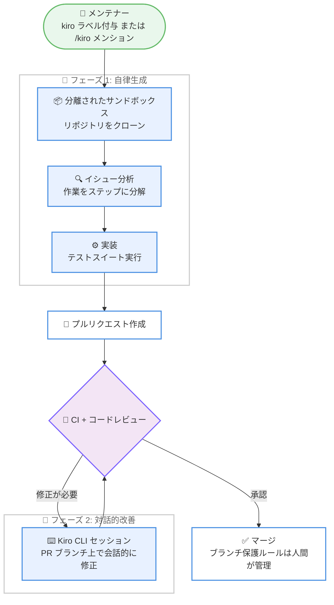

# Kiro - Kiro Web の自律モードによる大規模な技術的負債への取り組み

**リリース日**: 2026 年 9 月 14 日
**サービス**: Kiro
**機能**: Kiro Web 自律モード (Autonomous Mode) の活用事例

📊 [このアップデートのインフォグラフィックを見る](https://takech9203.github.io/aws-news-summary/20260914-kiro-tackling-technical-debt-at-scale-with-autonomous-mode.html)

## 概要

Kiro 公式ブログにて、Kiro Web の自律モード (autonomous mode) を活用して大規模に技術的負債を解消した事例が公開されました。AWS Automated Reasoning Group が、自らメンテナンスするオープンソースの形式検証ツール Kani Rust Verifier と CBMC (C Bounded Model Checker) に Kiro を導入し、2 か月間で 87 件のオープンイシューに対応するプルリクエストを提出した実績が詳細に紹介されています。これは、過去 22 か月間 (約 2 年) にチームが対応した 94 件に迫る規模です。

Kiro Web の自律モードでは、GitHub イシューに `kiro` ラベルを付与する、コメントで `/kiro` にメンションする、または app.kiro.dev でタスクを記述するだけで、Kiro が独立したセキュアなクラウド開発環境でリポジトリをクローンし、イシューの分析、実装、テストスイートの実行、プルリクエストの作成までをエンドツーエンドで実行します。開発者はコードレビューという最も判断力が求められる工程にのみ関与すればよくなります。

本記事は成功事例だけでなく、CI をパスする不正確な修正やアーキテクチャ的に誤った修正といった失敗モード、およびそれらを Kiro CLI による対話的な改善で解決する「2 フェーズワークフロー」についても具体的に解説しており、自律型コーディングエージェントを実運用に導入する際の実践的な知見が得られる内容です。

**アップデート前の課題**

自律モード導入以前、オープンソースメンテナーは以下の課題を抱えていました。

- メンテナンス作業と新機能開発の間でトレードオフを強いられ、2025 年 11 月時点で Kani と CBMC のリポジトリには 916 件のオープンイシューが蓄積していた
- 対話型 AI コーディングアシスタントは個々のタスクを高速化できるが、すべてのステップで開発者が能動的に関与する必要があった
- サブモジュール更新などの定型作業も 2〜3 時間のコンテキストスイッチを要するため、数週間バックログに滞留していた
- ユーザー影響のないファザー発見のクラッシュなどは優先度競争に勝てず、2 年以上放置されるイシューが存在した

**アップデート後の改善**

- イシューへの `kiro` ラベル付与だけで、分析からプルリクエスト作成までをエージェントが自律的に完遂できるようになった
- CBMC リポジトリでは月平均 2 件未満だったイシュー解決数が、導入月の 2025 年 11 月には 60 件へと 30 倍以上に増加した
- 2 年間放置されていた Kani のコンパイラクラッシュ (イシュー #2236) が、人間の作業時間 5 分未満、エージェント作業 2 時間 22 分で修正された
- マージされた Kiro 生成コードによるリグレッションは 0 件を維持している (2026 年 9 月時点で累計 183 件のマージ済み PR)

## アーキテクチャ図



ブログで紹介されている 2 フェーズワークフローです。フェーズ 1 で Kiro の自律エージェントがイシューからプルリクエスト作成までを完遂し、レビューで修正が必要になった場合はフェーズ 2 として Kiro CLI の対話セッションで改善します。Kiro にマージ権限はなく、ブランチ保護ルールをバイパスすることはできません。

## サービスアップデートの詳細

### 主要機能

1. **自律モードによるエンドツーエンドのタスク実行**
   - app.kiro.dev でのタスク記述、GitHub イシューへの `kiro` ラベル付与、コメントでの `/kiro` メンションのいずれかで作業を割り当て可能
   - Kiro は分離されたサンドボックスにリポジトリをクローンし、イシューと関連コードの分析、作業のステップ分解、実装、テストスイート全体の実行、プルリクエスト作成までを自律的に実行
   - 曖昧さに遭遇した場合は推測せず、明確化のための質問を返す

2. **既存ワークフローとの統合とガードレール**
   - Kiro が生成したプルリクエストにも、人間が書いたコードと同一の承認要件 (CI のパス、コードオーナーレビュー) が適用される
   - Kiro はマージ権限を持たず、ブランチ保護ルールをバイパスできない
   - レビューコメントに対して `/kiro fix` (特定コメントへの対応) や `/kiro all` (全コメントへの対応) で追加作業を依頼可能

3. **Kiro CLI による対話的改善 (2 フェーズワークフロー)**
   - レビューで判明した問題は、PR ブランチ上で `kiro-cli` のチャットセッションを開始し、会話を通じて修正を誘導できる
   - メンテナーが判断を提供し、エージェントが実行を担うことで、開発者がエディタや IDE を開くことなくすべての失敗モードを解決できた
   - 自律生成がコールドスタート問題を解消し、対話的改善が非同期のやり取りによる遅延を数時間から数分に短縮する

4. **適したタスクの特性**
   - 受け入れ基準が明確で、影響範囲が限定されたタスクが最適 (依存関係の更新、再現手順が明確なバグ修正、ドキュメント改善など)
   - アーキテクチャ上の判断や横断的なリファクタリングを要するタスクは人間が担当するべきとしている

## 技術仕様

### 定量的な成果 (2025 年 11 月〜12 月、Kani + CBMC)

| 項目 | 詳細 |
|------|------|
| 対応したユニークイシュー数 | 87 件 (過去 22 か月のチーム実績は 94 件) |
| 提出されたプルリクエスト数 | 94 件 |
| PR の内訳 | コードメンテナンス 29%、バグ修正 36%、機能補完 26%、ドキュメント改善 4% |
| PR の状態 (2026 年 9 月時点) | マージ済み 35 件 (37%)、レビュー中 56 件 (60%)、クローズ 3 件 (3%) |
| PR の規模 | 中央値: 5 ファイル・約 110 行、最大: 約 1,000 ファイル |
| 換算実装工数 | 約 200〜280 時間 (1 タスクあたり 2〜3 時間換算の下限値) |
| リグレッション | マージ済みコードで 0 件 |
| CBMC の月間解決イシュー数 | 導入前: 2 件未満 → 2025 年 11 月: 60 件 (30 倍以上) |
| 累計実績 (2026 年 9 月時点) | 公開リポジトリで 400 件超の PR 提出、183 件マージ、約 150 件のイシューに対応 |

### 観測された失敗モード

| 失敗モード | 事例 | 教訓 |
|------------|------|------|
| CI をパスする不正確な修正 | CBMC PR #8892: 回帰テストが `--no-library` を使用しており、対象コードパスが実行されていなかった | CI のパスは必要条件であって十分条件ではなく、レビュアーはテストが修正を検証しているか確認する必要がある |
| アーキテクチャ的に誤った修正 | PR #8703: 172 行の再構築がネストした量化子を破壊。正しい修正は元の場所への 9 行の変更だった | 根本原因ではなく症状に対処するケースがあり、アーキテクチャ知識を持つレビュアーが必要 |
| プラットフォーム固有の失敗 | PR #8894: GCC 拡張として有効な空の構造体を使用し、MSVC モードで失敗 | Kiro は Linux 上で開発するため、プラットフォーム依存の問題がすり抜ける可能性がある |
| フォーマット違反と PR の陳腐化 | PR #7861 は develop ブランチから 1,614 コミット遅れ、リベースが必要になった | ほぼすべての PR に軽微なフォーマット問題があり、コストの複利化を防ぐには迅速なレビューが不可欠 |

## 設定方法

### 前提条件

1. Kiro の有料プランのサブスクリプション (Kiro Web は全有料ユーザーに一般提供)
2. 対象の GitHub リポジトリへの Kiro の連携設定
3. 受け入れ基準が明確で影響範囲が限定されたイシューのバックログ

### 手順

#### ステップ 1: Kiro Web にサインインする

app.kiro.dev/agent にサインインし、対象リポジトリとの連携を設定します。

#### ステップ 2: タスクを割り当てる

以下のいずれかの方法で Kiro に作業を割り当てます。

- app.kiro.dev 上でタスクを記述する
- GitHub イシューに `kiro` ラベルを付与する
- イシューやプルリクエストのコメントで `/kiro` にメンションする

Kiro はサンドボックスでリポジトリをクローンし、分析、実装、テスト実行を経てプルリクエストを作成します。提案されたプラン (計画) に対してコメントで追加のガイダンスを与えることも可能です。ブログの事例では「バグがまだ存在するか先に検証し、解決済みなら再現ケースを回帰テストとして追加せよ」という指示に対して、Kiro がプランを適応させました。

#### ステップ 3: レビューと対話的改善を行う

作成されたプルリクエストを通常のコードレビュープロセスで確認します。修正が必要な場合は以下を利用します。

- レビューコメントへの対応: `/kiro fix` (特定コメント) または `/kiro all` (全コメント)
- 複雑な修正: PR ブランチ上で `kiro-cli` のチャットセッションを開始し、会話を通じて調査・修正・コミットを誘導

## メリット

### ビジネス面

- **バックログ解消スループットの飛躍的向上**: チームの過去実績の約 10 倍のペースで実装作業を生成。2 か月で過去約 2 年分に迫るイシューに対応した
- **開発者の高付加価値業務への集中**: 定型的なメンテナンスをエージェントに委譲することで、開発者はアーキテクチャ判断、複雑なアルゴリズム設計、コミュニティ対応、研究に集中できる
- **コンテキストスイッチの排除**: 数週間滞留していたサブモジュール更新などが、ラベル付与だけで処理されるようになった

### 技術面

- **エンドツーエンドの自律実行**: イシューの読解からプルリクエスト作成までを人間の介在なしで完遂し、レビュー時点で動作するコード・パスするテスト・明確なアプローチ説明が揃っている
- **既存ガバナンスとの両立**: CI、コードオーナーレビュー、ブランチ保護ルールなど既存の品質ゲートをそのまま適用でき、マージ済みコードのリグレッションは 0 件を維持
- **2 フェーズワークフローによる効率的な改善**: 自律生成と Kiro CLI による対話的改善の組み合わせで、総所要時間を開発者がタスクを端から端まで実施する場合より大幅に低く抑えられる

## デメリット・制約事項

### 制限事項

- アーキテクチャ上の判断や横断的なリファクタリングを要するタスクには不向きで、人間が担当する必要がある
- Kiro は Linux 環境で開発するため、MSVC など他プラットフォーム固有の問題がすり抜ける可能性がある
- Kiro Web の利用には有料プランが必要

### 考慮すべき点

- **レビューがボトルネックになる**: Kiro はチームのレビュー能力を上回る速度で PR を生成できる。初期コホートの 60% が 2026 年 9 月時点でもレビュー待ちであり、実現価値はレビューと改善の能力に依存する
- **CI のパスを過信しない**: テストが修正対象のコードパスを実際に検証しているか、レビュアーが確認する必要がある
- **迅速なレビューが必須**: 放置された PR はコンフリクトを蓄積し、リベースコストが複利的に増大する
- 既存ユーティリティを使わずに機能を再実装するケースが観測されており、レビューでの指摘が必要

## ユースケース

### ユースケース 1: 依存関係・サブモジュールの定期更新

**シナリオ**: Kani プロジェクトの charon Git サブモジュールは、翻訳レイヤーの変更が Rust セマンティクスのモデリングに影響し得るため、Dependabot による自動更新ができず、手動更新に 2〜3 時間を要していた。

**実装例**:
```
小さく明確に説明されたコミットで、charon サブモジュールを
インクリメンタルに更新するよう Kiro にタスクを指示
```

**効果**: Kiro が利用可能な更新の分析、更新順序の決定、コミット生成、PR 作成 (PR #4445、#4464) までを自律実行。レビュアーは機械的な更新作業ではなくセマンティックな正しさの確認に集中できる。

### ユースケース 2: 長期滞留したバグ修正

**シナリオ**: ファザーが報告した Kani コンパイラのクラッシュ (イシュー #2236) は、明確な再現手順があるものの、影響ユーザーがいないため優先度競争に勝てず 2 年以上放置されていた。

**実装例**:
```
1. イシューに kiro ラベルを付与
2. Kiro が提示したプランに「まずバグが現存するか検証し、
   解決済みなら再現ケースを回帰テストとして追加」とコメント
```

**効果**: Kiro が 2 時間 22 分で修正と回帰テストを含む PR #4461 を提出。人間の作業時間は 5 分未満で、チームの誰にもコンテキストスイッチが発生せずそのままマージされた。

### ユースケース 3: レビュー指摘への対話的対応

**シナリオ**: 自律生成された PR にフォーマット違反やプラットフォーム固有の問題などレビュー指摘があり、修正が必要になった。

**実装例**:
```
# レビューコメントへの対応を依頼
/kiro fix   # 特定のコメントに対応
/kiro all   # すべてのコメントに対応

# 複雑な修正は PR ブランチ上で CLI セッションを開始
kiro-cli
```

**効果**: 開発者がエディタや IDE を開くことなく、会話を通じてすべての失敗モードを解決。非同期のやり取りによる数時間の遅延が数分に短縮される。

## 料金

Kiro Web は、すべての有料 Kiro ユーザーに一般提供されています。Kiro の料金プランは以下のとおりです (クレジットベースの課金体系)。

| プラン | 月額料金 | 内容 |
|--------|----------|------|
| Kiro Free | $0 | 50 クレジット。オープンウェイトモデルと Claude Sonnet 4.5 へのアクセス |
| Kiro Pro | $20 | 1,000 クレジット。プレミアムモデルへのアクセス、追加クレジット $0.04/クレジット |
| Kiro Pro+ | $40 | 2,000 クレジット。プレミアムモデルへのアクセス、追加クレジット $0.04/クレジット |
| Kiro Pro Max | $100 | 5,000 クレジット。プレミアムモデルへのアクセス、追加クレジット $0.04/クレジット |
| Kiro Power | $200 | 10,000 クレジット。プレミアムモデルへのアクセス |

最新の料金は [Kiro 料金ページ](https://kiro.dev/pricing/) を参照してください。

## 利用可能リージョン

グローバル (Kiro はグローバルに提供されるサービスです)

## 関連サービス・機能

- **Kiro CLI**: PR ブランチ上での対話的改善に使用するコマンドラインツール。自律モードと組み合わせた 2 フェーズワークフローの中核
- **Kiro IDE**: スペック駆動開発をサポートするエージェント型 IDE。macOS、Windows、Linux に対応
- **Kani Rust Verifier / CBMC**: 本事例の対象となった AWS Automated Reasoning Group のオープンソース形式検証ツール。Kani は Firecracker や s2n-quic の CI でも利用されている

## 参考リンク

- 📊 [インフォグラフィック](https://takech9203.github.io/aws-news-summary/20260914-kiro-tackling-technical-debt-at-scale-with-autonomous-mode.html)
- [公式ブログ記事 (Tackling technical debt at scale with autonomous mode in Kiro Web)](https://kiro.dev/blog/tackling-technical-debt-at-scale-with-autonomous-mode/)
- [Kiro Changelog](https://kiro.dev/changelog/)
- [Kiro ドキュメント](https://kiro.dev/docs/)
- [Kiro Web (app.kiro.dev)](https://app.kiro.dev/)
- [Kiro 料金ページ](https://kiro.dev/pricing/)

## まとめ

本事例は、Kiro Web の自律モードが、明確に定義されたイシューのバックログを持つリポジトリにおいて、チームの歴史的スループットの約 10 倍のペースで技術的負債を解消できることを、失敗モードとその対処法まで含めて実証したものです。CI のパスを過信せずレビュー体制を整えること、そして自律生成と Kiro CLI による対話的改善の 2 フェーズワークフローを組み合わせることが成功の鍵となります。整理されたイシューバックログを持つリポジトリのメンテナーは、`kiro` ラベルの付与から数分で試し始めることができます。
