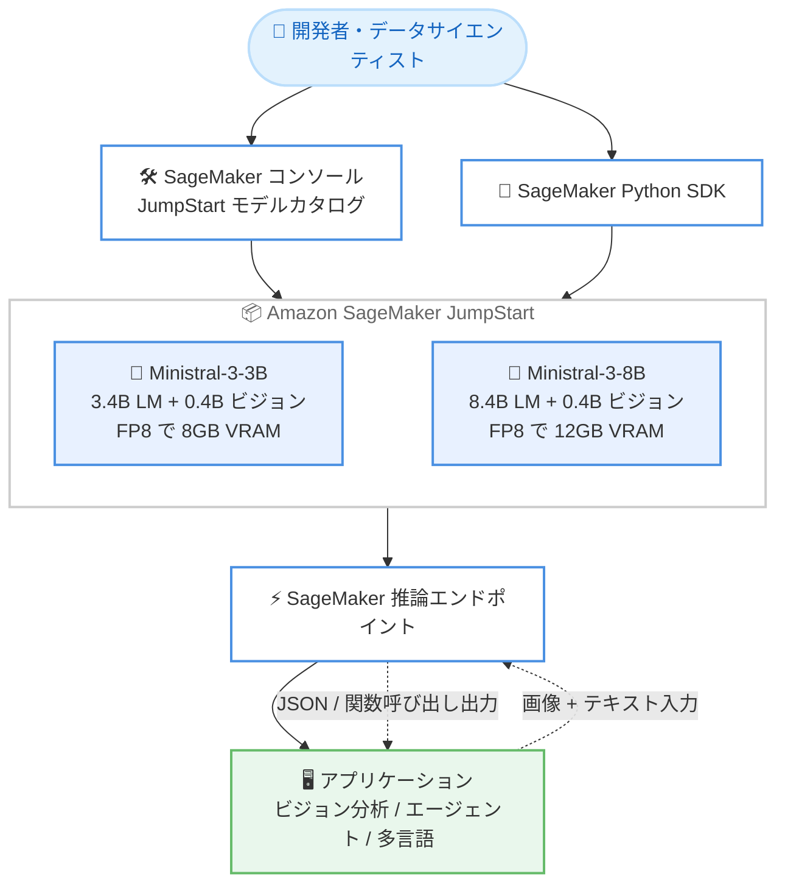

# Amazon SageMaker JumpStart - Ministral-3-3B-Instruct-2512 / Ministral-3-8B-Instruct-2512 の提供開始

**リリース日**: 2026 年 9 月 14 日
**サービス**: Amazon SageMaker JumpStart
**機能**: Ministral-3-3B-Instruct-2512 および Ministral-3-8B-Instruct-2512 (エッジ向けビジョン対応コンパクト言語モデル)

📊 [このアップデートのインフォグラフィックを見る](https://takech9203.github.io/aws-news-summary/20260914-ministral-3-3b-instruct-2512-ministral-3-8B-Instruct-2512-jumpstart.html)

## 概要

AWS は、Mistral AI が開発した Ministral 3 ファミリーのモデル Ministral-3-3B-Instruct-2512 と Ministral-3-8B-Instruct-2512 を Amazon SageMaker JumpStart で利用できるようになったことを発表しました。両モデルは、エッジデプロイやリソース制約のある環境向けに設計された、ビジョン対応のコンパクトな言語モデルです。

Ministral-3-3B-Instruct-2512 は、3.4B (34 億) パラメータの言語モデルと 0.4B (4 億) パラメータのビジョンエンコーダーで構成され、FP8 では 8GB の VRAM に収まる超軽量モデルです。256K トークンのコンテキスト長をサポートし、画像分析、日本語を含む多言語での指示追従、ネイティブの関数呼び出しと構造化 JSON 出力に対応します。Ministral-3-8B-Instruct-2512 は、8.4B (84 億) パラメータの言語モデルと 0.4B のビジョンエンコーダーで構成され、FP8 では 12GB の VRAM に収まります。インターリーブ型スライディングウィンドウアテンションにより高速かつメモリ効率の高い推論を実現し、より大規模な Mistral Small 3.2 24B に匹敵する能力を提供するとされています。

両モデルは Apache 2.0 ライセンスで提供され、SageMaker JumpStart のモデルカタログまたは SageMaker Python SDK から数クリックでデプロイできます。小型モデルによるコスト効率の高い AI アプリケーションを検討している開発者やデータサイエンティストが主な対象です。

**アップデート前の課題**

- 8GB や 12GB クラスの小さな VRAM で動作しつつ、ビジョン機能・長いコンテキスト・関数呼び出しを兼ね備えたモデルの選択肢が SageMaker JumpStart 上で限られていた
- コスト効率とマルチモーダル機能を両立するには、より大規模で運用コストの高いモデルに依存する必要があった
- 日本語を含む多言語対応とエージェント機能を、軽量モデルで実現することが難しかった

**アップデート後の改善**

- FP8 で 8GB / 12GB の VRAM に収まる軽量モデルを、SageMaker JumpStart から数クリックでデプロイできるようになった
- 256K トークンのコンテキスト長と画像理解を備えた小型モデルで、長文ドキュメント処理やビジョン対応アプリケーションを低コストに構築できるようになった
- ネイティブの関数呼び出しと構造化 JSON 出力により、軽量モデルベースのエージェント型システムを実装できるようになった

## アーキテクチャ図



開発者は SageMaker コンソールの JumpStart モデルカタログまたは Python SDK から、用途に応じて 3B / 8B モデルを選択してデプロイし、推論エンドポイント経由でビジョン分析やエージェント機能を利用します。

## サービスアップデートの詳細

### 主要機能

1. **Ministral-3-3B-Instruct-2512: 超軽量マルチモーダルモデル**
   - 3.4B パラメータの言語モデルと 0.4B パラメータのビジョンエンコーダーで構成
   - FP8 では 8GB の VRAM に収まり、超軽量なエッジデプロイに適する
   - 256K トークンのコンテキスト長をサポート

2. **Ministral-3-8B-Instruct-2512: 高効率な上位モデル**
   - 8.4B パラメータの言語モデルと 0.4B パラメータのビジョンエンコーダーで構成
   - FP8 では 12GB の VRAM に収まる
   - インターリーブ型スライディングウィンドウアテンションにより、高速かつメモリ効率の高い推論を実現
   - より大規模な Mistral Small 3.2 24B に匹敵する能力を提供

3. **ビジョン分析と多言語対応**
   - 画像を分析し、視覚的なコンテンツに基づくインサイトを提供
   - 英語、フランス語、スペイン語、ドイツ語、中国語、日本語、韓国語、アラビア語などの多言語での指示追従に対応
   - システムプロンプトへの高い追従性

4. **エージェント機能**
   - ネイティブの関数呼び出し (function calling) をサポート
   - 構造化された JSON 出力に対応し、エージェント型システムへの組み込みが容易

5. **オープンライセンスと簡単なデプロイ**
   - Apache 2.0 ライセンスで提供
   - SageMaker JumpStart のモデルカタログまたは SageMaker Python SDK から数クリックでデプロイ可能

## 技術仕様

### モデル比較

| 項目 | Ministral-3-3B-Instruct-2512 | Ministral-3-8B-Instruct-2512 |
|------|------------------------------|------------------------------|
| 開発元 | Mistral AI | Mistral AI |
| 言語モデルサイズ | 3.4B パラメータ | 8.4B パラメータ |
| ビジョンエンコーダー | 0.4B パラメータ | 0.4B パラメータ |
| 必要 VRAM (FP8) | 8GB | 12GB |
| コンテキスト長 | 256K トークン | 記載なし (3B と同系統のアーキテクチャ) |
| アテンション機構 | - | インターリーブ型スライディングウィンドウアテンション |
| モダリティ | テキスト + 画像 | テキスト + 画像 |
| エージェント機能 | ネイティブ関数呼び出し、構造化 JSON 出力 | ネイティブ関数呼び出し、構造化 JSON 出力 |
| 多言語対応 | 英語、フランス語、スペイン語、ドイツ語、中国語、日本語、韓国語、アラビア語ほか | 同左 |
| ライセンス | Apache 2.0 | Apache 2.0 |
| 提供方法 | Amazon SageMaker JumpStart | Amazon SageMaker JumpStart |

### API変更履歴

今回のアップデートに直接関連する公開 API の変更は確認されませんでした。SageMaker JumpStart へのモデル追加であり、既存の SageMaker デプロイ API を通じて利用します。

## 設定方法

### 前提条件

1. Amazon SageMaker を利用できる AWS アカウント
2. SageMaker Studio ドメインのセットアップ、または SageMaker Python SDK の実行環境
3. モデルのデプロイとエンドポイント作成に必要な IAM 権限
4. 推論エンドポイントに使用するインスタンスタイプのサービスクォータ

### 手順

#### ステップ1: SageMaker コンソールからモデルを選択する

SageMaker コンソールで JumpStart モデルカタログを開き、Ministral-3-3B-Instruct-2512 または Ministral-3-8B-Instruct-2512 を選択します。コンソール上から数クリックでデプロイを開始できます。

#### ステップ2: SageMaker Python SDK でデプロイする

```python
from sagemaker.jumpstart.model import JumpStartModel

# JumpStart のモデル ID を指定してモデルオブジェクトを作成する
model = JumpStartModel(model_id="<ministral-3 モデルの ID>")

# モデルをデプロイし、推論エンドポイントを作成する
predictor = model.deploy()
```

上記のコードは、JumpStart のモデル ID を指定して Ministral 3 モデルをデプロイし、推論用のエンドポイントを作成します。正確なモデル ID は SageMaker コンソールの JumpStart モデルカタログまたはドキュメントで確認してください。

#### ステップ3: 推論を実行する

デプロイされたエンドポイントに対して、テキストや画像を含むリクエストを送信し、ビジョン分析、多言語応答、関数呼び出しによる JSON 出力を取得します。詳細は SageMaker JumpStart のドキュメントを参照してください。

## メリット

### ビジネス面

- **コスト効率**: FP8 で 8GB / 12GB の VRAM に収まる軽量モデルにより、大規模モデルと比較して推論コストを抑えられる可能性がある
- **導入の迅速化**: 数クリックでデプロイでき、AI アプリケーションの開発開始までの時間を短縮できる
- **ライセンスの柔軟性**: Apache 2.0 ライセンスにより、商用利用を含む幅広い用途で活用しやすい

### 技術面

- **軽量マルチモーダル**: 小型モデルでありながら画像とテキストを組み合わせた推論を実現できる
- **長いコンテキスト**: 3B モデルは 256K トークンのコンテキスト長をサポートし、長文ドキュメントの処理に対応できる
- **効率的な推論**: 8B モデルはインターリーブ型スライディングウィンドウアテンションにより、高速かつメモリ効率の高い推論を実現する
- **エージェント統合の容易さ**: ネイティブの関数呼び出しと構造化 JSON 出力により、エージェント型システムへの組み込みが容易

## デメリット・制約事項

### 制限事項

- モデルのデプロイにはインスタンスの起動が伴うため、エンドポイントの稼働時間に応じた費用が発生する
- 利用可能なリージョンやインスタンスタイプは SageMaker JumpStart の対応状況に依存する (公式発表にリージョンの明記なし)
- 軽量モデルであるため、最先端の大規模モデルと比較して高度な推論タスクでは精度に差が生じる可能性がある

### 考慮すべき点

- 3B と 8B のどちらを採用するかは、対象ユースケースでの精度・レイテンシー・コストを評価して判断することを推奨する
- 8B モデルの能力は Mistral Small 3.2 24B に匹敵するとされるが、本番利用前に自社データでの検証が必要
- エンドポイントのインスタンスタイプとオートスケーリング設定を、想定されるトラフィックに合わせて調整する必要がある

## ユースケース

### ユースケース1: コスト効率の高い多言語カスタマーサポート

**シナリオ**: 日本語を含む多言語での問い合わせ対応を、軽量モデルで低コストに実現するチャットアシスタントを構築する。

**実装例**:
```
ユーザーの質問 (多言語) → Ministral-3-3B / 8B → 多言語での回答生成
```

**効果**: 小型モデルによる低い推論コストで、複数言語のユーザーに単一モデルでサービスを提供できる。

### ユースケース2: 画像を含むドキュメントの分析

**シナリオ**: 図表や画像を含む長文ドキュメントから情報を抽出し、要約やインサイトを生成する。

**実装例**:
```
ドキュメント画像 + テキスト (最大 256K トークン) → Ministral-3-3B → 抽出・要約・インサイト
```

**効果**: 256K トークンの長いコンテキストとビジョン機能により、大量のドキュメントを一度に処理し、視覚情報を含めた分析ができる。

### ユースケース3: 軽量エージェント型ワークフローの自動化

**シナリオ**: 関数呼び出しを利用して外部 API やツールを呼び出し、タスクを自律的に実行する軽量エージェントを構築する。

**実装例**:
```
ユーザー指示 → Ministral-3-8B が関数呼び出しを生成 (構造化 JSON) → ツール実行 → 結果を統合して応答
```

**効果**: ネイティブの関数呼び出しと構造化 JSON 出力により、コスト効率の高いエージェント型ワークフローを実装できる。

## 料金

Amazon SageMaker JumpStart 経由でデプロイしたモデルの利用には、推論エンドポイントに使用する SageMaker インスタンスの料金が適用されます。料金はインスタンスタイプと稼働時間に基づいて課金されます。モデル自体は Apache 2.0 ライセンスで提供されるため、追加のモデルライセンス費用は発生しません。詳細は Amazon SageMaker の料金ページを参照してください。

## 利用可能リージョン

公式発表では特定のリージョンは明記されていません。利用可能なリージョンは SageMaker JumpStart の対応状況に依存するため、最新の対応リージョンは SageMaker コンソールの JumpStart モデルカタログまたはドキュメントで確認してください。

## 関連サービス・機能

- **Amazon SageMaker Studio**: モデルの検索・デプロイ・管理を行う統合開発環境
- **Amazon SageMaker Python SDK**: プログラムからモデルをデプロイ・推論するためのライブラリ
- **Amazon Bedrock**: 基盤モデルを API 経由で利用する代替アプローチ (フルマネージド型)
- **Ministral-3-14B-Instruct**: 2026 年 6 月に SageMaker JumpStart で提供開始された同ファミリーの上位モデル

## 参考リンク

- 📊 [インフォグラフィック](https://takech9203.github.io/aws-news-summary/20260914-ministral-3-3b-instruct-2512-ministral-3-8B-Instruct-2512-jumpstart.html)
- [公式発表 (What's New)](https://aws.amazon.com/about-aws/whats-new/2026/01/ministral-3-3b-instruct-2512-ministral-3-8B-Instruct-2512-jumpstart/)
- [Amazon SageMaker JumpStart ドキュメント](https://docs.aws.amazon.com/sagemaker/latest/dg/studio-jumpstart.html)
- [Amazon SageMaker 料金ページ](https://aws.amazon.com/sagemaker/pricing/)

## まとめ

Ministral-3-3B-Instruct-2512 と Ministral-3-8B-Instruct-2512 の SageMaker JumpStart での提供開始により、8GB / 12GB クラスの小さな VRAM で動作するビジョン対応・多言語・エージェント機能付きモデルを、AWS 上に簡単にデプロイできるようになりました。コスト効率の高い AI アプリケーションやエッジ志向のワークロードを検討しているチームは、SageMaker JumpStart から両モデルをデプロイし、対象ユースケースでの精度とコストを比較評価することを推奨します。
