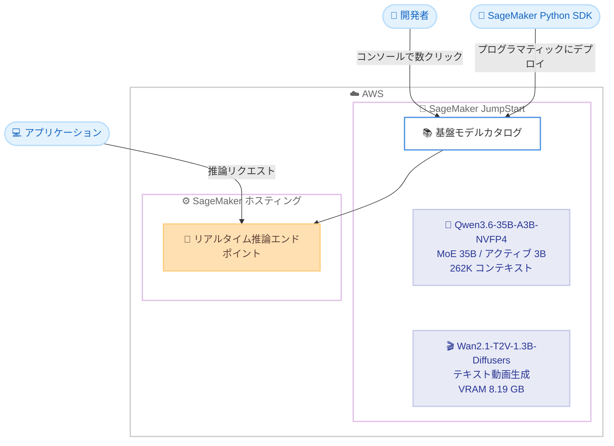

# Amazon SageMaker JumpStart - Qwen3.6-35B-A3B-NVFP4 および Wan2.1-T2V-1.3B-Diffusers モデルの提供開始

**リリース日**: 2026 年 9 月 14 日
**サービス**: Amazon SageMaker JumpStart
**機能**: Qwen3.6-35B-A3B-NVFP4 と Wan2.1-T2V-1.3B-Diffusers の基盤モデルカタログへの追加

📊 [このアップデートのインフォグラフィックを見る](https://takech9203.github.io/aws-news-summary/20260914-qwen3.6-35b-a3b-nvfp4-wan2.1-t2v-1.3B-diffusers-jumpstart.html)

## 概要

Amazon SageMaker JumpStart の基盤モデルカタログに、NVIDIA が量子化した Qwen3.6-35B-A3B-NVFP4 と Alibaba の Wan2.1-T2V-1.3B-Diffusers の 2 つのモデルが追加されました。前者はエージェンティックコーディングと長文コンテキスト推論に特化した Mixture-of-Experts (MoE) 型の大規模言語モデル、後者は軽量なテキスト動画生成 (Text-to-Video) 拡散モデルであり、それぞれ異なるユースケースをカバーします。

Qwen3.6-35B-A3B-NVFP4 は、Alibaba の Qwen3.6-35B-A3B を NVIDIA の ModelOpt フレームワークで NVFP4 形式に量子化したモデルです。総パラメータ数 35B のうちトークンごとに約 3B (256 エキスパート中 8 つ) のみをアクティブ化する MoE アーキテクチャを採用し、262K トークンのコンテキストウィンドウ (YaRN スケーリングにより約 1M トークンまで拡張可能) をサポートします。

Wan2.1-T2V-1.3B-Diffusers は 1.3B パラメータのテキスト動画生成モデルで、Diffusion Transformer と新しい Video VAE をベースにしています。わずか 8.19 GB の VRAM で動作し、RTX 4090 クラスの GPU で約 4 分で 5 秒間の 480p 動画を生成できるため、最もアクセスしやすいオープンソース動画生成モデルの 1 つと位置づけられています。両モデルとも SageMaker コンソールのモデルカタログから数クリック、または SageMaker Python SDK からデプロイできます。

**アップデート前の課題**

これらのモデルを利用するには、以前は自前でのモデルホスティング環境の構築が必要でした。

- 量子化済みの高効率な MoE モデルを利用するには、モデルの取得、推論コンテナの構築、エンドポイント設定を手動で行う必要があった
- オープンソースの動画生成モデルを AWS 上で運用するには、GPU インスタンスの選定や環境構築の専門知識が必要だった
- 長文コンテキスト対応のエージェント向けモデルを検証環境に迅速に展開する手段が限られていた

**アップデート後の改善**

- SageMaker JumpStart のカタログから数クリックで両モデルをデプロイできるようになった
- SageMaker Python SDK を使用したプログラマティックなデプロイが可能になり、CI/CD パイプラインへの組み込みが容易になった
- NVFP4 量子化によりメモリフットプリントが削減されたモデルを、そのまま利用できるようになった

## アーキテクチャ図



SageMaker JumpStart のモデルカタログから、コンソール操作または Python SDK で 2 つのモデルを選択し、SageMaker のリアルタイム推論エンドポイントとしてデプロイする流れを示しています。

## サービスアップデートの詳細

### 主要機能

1. **Qwen3.6-35B-A3B-NVFP4 の提供開始**
   - エージェンティックコーディング、マルチモーダル推論、長文コンテキスト理解を対象とした NVIDIA 量子化モデル
   - MoE アーキテクチャにより総パラメータ 35B のうちトークンごとに約 3B (256 エキスパート中 8 つ) のみをアクティブ化し、推論効率を向上
   - 262K トークンのコンテキストウィンドウを備え、YaRN スケーリングにより約 1M トークンまで拡張可能
   - クロスターン思考、マルチトークン予測、ツール呼び出しを保持し、マルチステップのエージェントワークフローに対応

2. **NVFP4 量子化によるメモリ効率化**
   - NVIDIA の ModelOpt フレームワークで NVFP4 形式に量子化
   - 元モデルの能力を維持しながらメモリフットプリントを削減し、少ない GPU リソースでのホスティングを実現

3. **Wan2.1-T2V-1.3B-Diffusers の提供開始**
   - Diffusion Transformer と新しい Video VAE をベースにした 1.3B パラメータのテキスト動画生成モデル
   - テキストプロンプトから物理的に一貫性のある高品質な動画クリップを生成
   - 8.19 GB の VRAM で動作し、RTX 4090 クラスの GPU で 5 秒間の 480p 動画を約 4 分で生成

4. **SageMaker JumpStart によるワンストップデプロイ**
   - SageMaker コンソールのモデルカタログから数クリックでデプロイ可能
   - SageMaker Python SDK によるプログラマティックなデプロイにも対応

## 技術仕様

### モデル比較

| 項目 | Qwen3.6-35B-A3B-NVFP4 | Wan2.1-T2V-1.3B-Diffusers |
|------|------------------------|----------------------------|
| 提供元 | NVIDIA (Alibaba Qwen3.6 の量子化版) | Alibaba |
| モデルタイプ | MoE 型大規模言語モデル | テキスト動画生成拡散モデル |
| パラメータ数 | 総 35B / アクティブ約 3B | 1.3B |
| アーキテクチャ | MoE (256 エキスパート中 8 つを使用) | Diffusion Transformer + Video VAE |
| コンテキスト長 | 262K トークン (YaRN で約 1M まで拡張可能) | - |
| 量子化 | NVFP4 (NVIDIA ModelOpt) | - |
| リソース要件 | 量子化によりメモリフットプリントを削減 | VRAM 8.19 GB |
| 生成性能 | - | 480p / 5 秒動画を RTX 4090 で約 4 分 |
| 主な用途 | エージェンティックコーディング、長文コンテキスト推論 | テキストからの動画生成 |

## 設定方法

### 前提条件

1. AWS アカウントと SageMaker AI (SageMaker Studio または SageMaker Python SDK) の利用環境
2. SageMaker エンドポイント作成に必要な IAM 権限と実行ロール
3. デプロイ先リージョンにおける GPU インスタンスのサービスクォータ

### 手順

#### ステップ1: SageMaker JumpStart でモデルを検索

SageMaker Studio を開き、JumpStart のモデルカタログで「Qwen3.6-35B-A3B-NVFP4」または「Wan2.1-T2V-1.3B-Diffusers」を検索します。モデルカードから仕様やライセンス情報を確認できます。

#### ステップ2: コンソールからデプロイ

モデルカードの [Deploy] を選択し、インスタンスタイプとエンドポイント名を指定してデプロイします。数クリックでリアルタイム推論エンドポイントが作成されます。

#### ステップ3: SageMaker Python SDK でのデプロイ

```python
from sagemaker.jumpstart.model import JumpStartModel

# JumpStart のモデル ID を指定してモデルを作成
model = JumpStartModel(model_id="<モデル ID>")

# リアルタイム推論エンドポイントとしてデプロイ
predictor = model.deploy()

# 推論リクエストを送信
response = predictor.predict({"inputs": "<プロンプト>"})
```

SageMaker Python SDK の `JumpStartModel` クラスにモデル ID を指定してモデルオブジェクトを作成し、`deploy()` でエンドポイントを作成した後、`predict()` で推論リクエストを送信しています。実際のモデル ID はコンソールのモデルカードで確認してください。

## メリット

### ビジネス面

- **導入コストの削減**: 環境構築の手間なく数クリックでデプロイできるため、PoC から本番までのリードタイムを短縮できる
- **インフラコストの最適化**: NVFP4 量子化モデルや 1.3B の軽量動画生成モデルにより、比較的小規模な GPU リソースで運用でき、推論コストを抑制できる
- **ユースケースの拡大**: コーディングエージェントと動画生成という異なる領域のモデルが同一カタログから利用でき、生成 AI 活用の幅が広がる

### 技術面

- **長文コンテキスト対応**: 262K トークン (最大約 1M トークン) のコンテキストにより、大規模コードベースや長文ドキュメントを扱うエージェントを構築できる
- **効率的な MoE 推論**: トークンごとにアクティブ化されるパラメータが約 3B に抑えられ、35B クラスの能力を低い推論コストで利用できる
- **軽量な動画生成**: 8.19 GB の VRAM で動作するため、単一 GPU インスタンスでの動画生成ワークロードが現実的になる

## デメリット・制約事項

### 制限事項

- 公式発表では利用可能なリージョンが明記されていないため、利用前に各リージョンの JumpStart カタログでの提供状況を確認する必要がある
- Wan2.1-T2V-1.3B-Diffusers の生成動画は 480p / 5 秒程度が目安であり、高解像度・長尺の動画生成にはより大規模なモデルが必要になる
- 動画生成は 1 クリップあたり数分単位の処理時間を要するため、リアルタイム性が求められる用途には適さない

### 考慮すべき点

- オープンソースモデルであるため、各モデルのライセンス条件 (商用利用可否など) をモデルカードで確認する必要がある
- NVFP4 量子化モデルの性能を最大限引き出すには、対応する GPU インスタンスタイプの選定が重要となる
- SageMaker エンドポイントは稼働時間に応じて課金されるため、利用頻度に応じたエンドポイントの停止・削除の運用設計が必要となる

## ユースケース

### ユースケース1: 大規模コードベースを扱うコーディングエージェント

**シナリオ**: 社内の大規模リポジトリに対して、コードレビューやリファクタリング提案を行う AI エージェントを構築したい。

**実装例**:
```python
# Qwen3.6-35B-A3B-NVFP4 をデプロイし、リポジトリ全体をコンテキストに含めて分析
response = predictor.predict({
    "inputs": "以下のコードベースを分析し、リファクタリング案を提示してください...",
    "parameters": {"max_new_tokens": 4096}
})
```

**効果**: 262K トークンの長文コンテキストにより、複数ファイルにまたがるコードを一括で分析でき、ツール呼び出し機能と組み合わせたマルチステップのエージェントワークフローを実現できる。

### ユースケース2: マーケティング用ショート動画の自動生成

**シナリオ**: EC サイトの商品説明文から、SNS 向けの短尺プロモーション動画を自動生成したい。

**実装例**:
```python
# Wan2.1-T2V-1.3B-Diffusers でテキストから動画を生成
response = predictor.predict({
    "inputs": "夕暮れのビーチでスニーカーを履いて走る人物、シネマティックな映像"
})
```

**効果**: 軽量モデルにより単一 GPU インスタンスで動画生成パイプラインを構築でき、制作コストと時間を大幅に削減できる。

### ユースケース3: 長文ドキュメントの推論・要約基盤

**シナリオ**: 技術仕様書や契約書などの長文ドキュメント群を横断的に理解し、質問応答を行う社内基盤を構築したい。

**実装例**:
```python
# YaRN スケーリングによる拡張コンテキストで長文ドキュメントを処理
response = predictor.predict({
    "inputs": "以下の複数の仕様書を読み、機能間の依存関係をまとめてください...",
    "parameters": {"max_new_tokens": 2048}
})
```

**効果**: 最大約 1M トークンまで拡張可能なコンテキストにより、ドキュメントを分割せずに一括処理でき、チャンク分割に伴う文脈の欠落を回避できる。

## 料金

SageMaker JumpStart 自体に追加料金はなく、モデルのデプロイに使用する SageMaker のインスタンス (エンドポイント) の稼働時間に応じた料金が発生します。料金はインスタンスタイプとリージョンにより異なるため、詳細は SageMaker の料金ページを参照してください。

## 利用可能リージョン

公式発表では利用可能なリージョンは明記されていません。利用するリージョンの SageMaker JumpStart モデルカタログで、各モデルの提供状況を確認してください。

## 関連サービス・機能

- **Amazon SageMaker AI**: JumpStart でデプロイしたモデルのホスティング基盤。リアルタイム推論エンドポイントとして運用する
- **Amazon Bedrock**: フルマネージドな基盤モデル API サービス。JumpStart はより幅広いオープンソースモデルの選択やカスタマイズが必要な場合に適する
- **Amazon SageMaker Python SDK**: `JumpStartModel` クラスを通じてモデルのデプロイと推論をプログラマティックに実行できる

## 参考リンク

- 📊 [インフォグラフィック](https://takech9203.github.io/aws-news-summary/20260914-qwen3.6-35b-a3b-nvfp4-wan2.1-t2v-1.3B-diffusers-jumpstart.html)
- [公式発表 (What's New)](https://aws.amazon.com/about-aws/whats-new/2026/01/qwen3.6-35b-a3b-nvfp4-wan2.1-t2v-1.3B-diffusers-jumpstart/)
- [Amazon SageMaker JumpStart ドキュメント](https://docs.aws.amazon.com/sagemaker/latest/dg/studio-jumpstart.html)
- [Amazon SageMaker AI 料金ページ](https://aws.amazon.com/sagemaker-ai/pricing/)

## まとめ

エージェンティックコーディング向けの高効率 MoE モデルと、軽量なテキスト動画生成モデルという特性の異なる 2 つのオープンソースモデルが、SageMaker JumpStart から数クリックで利用可能になりました。コーディングエージェントの構築や動画生成パイプラインの PoC を検討している場合は、まず JumpStart のモデルカタログで両モデルのモデルカードとライセンス条件を確認し、開発環境へのデプロイから始めることを推奨します。
