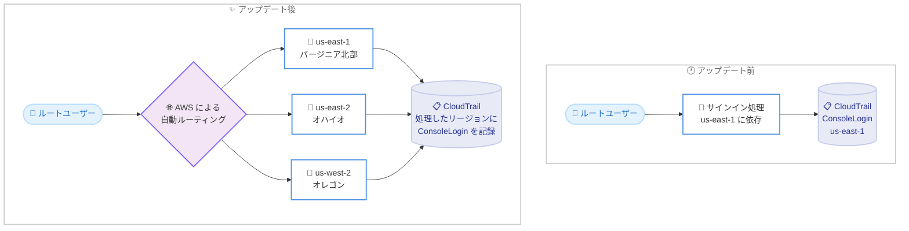

# AWS Sign-In - ルートユーザーサインインのリージョン耐障害性向上

**リリース日**: 2026 年 9 月 14 日
**サービス**: AWS Sign-In (AWS Identity and Access Management / AWS Management Console)
**機能**: ルートユーザーサインインのマルチリージョン化によるリージョン耐障害性の向上

📊 [このアップデートのインフォグラフィックを見る](https://takech9203.github.io/aws-news-summary/20260914-root-user-regional-resiliency.html)

## 概要

AWS は、ルートユーザーのサインイン処理を米国東部 (バージニア北部)、米国東部 (オハイオ)、米国西部 (オレゴン) の 3 リージョンに分散して提供するようになったことを発表しました。従来、ルートユーザーのサインインは us-east-1 (バージニア北部) に依存していましたが、今回の変更によりサインイントラフィックが 3 リージョンに分散され、サービス障害発生時の耐障害性が向上します。

この変更はすべての AWS アカウントに自動的に適用されており、ユーザー側での操作や設定変更は一切不要です。AWS がサインインリクエストをサポート対象リージョンへ自動的にルーティングするため、リージョンを選択したり、サインイン手順を変更したりする必要はありません。

一方で、セキュリティ運用チームにとって重要な注意点があります。ルートユーザーサインインの CloudTrail `ConsoleLogin` イベントは、リクエストを処理したリージョン (us-east-1、us-east-2、us-west-2 のいずれか) に記録されるようになります。ルートユーザーのサインインアクティビティを完全に可視化するには、監視とアラートの設定を 3 リージョンすべてをカバーするように更新する必要があります。

**アップデート前の課題**

- 以前はルートユーザーのサインイン処理が主に us-east-1 (バージニア北部) に依存しており、同リージョンの障害発生時にサインインが影響を受けるリスクがあった
- us-east-1 の大規模障害時には、緊急対応に必要なルートユーザーでのコンソールアクセス自体が困難になる可能性があった
- 単一リージョン依存のため、AWS の認証基盤全体としての可用性設計に単一障害点が存在していた

**アップデート後の改善**

- 今回のアップデートにより、ルートユーザーサインインが us-east-1、us-east-2、us-west-2 の 3 リージョンに分散され、us-east-1 への依存が軽減された
- サービス障害時にも他のリージョンでサインイン処理が継続できるため、耐障害性が向上した
- ユーザー側の操作変更は不要で、AWS が自動的にサポート対象リージョンへリクエストをルーティングする

## アーキテクチャ図



アップデート前はルートユーザーサインインが us-east-1 に依存していましたが、アップデート後は 3 リージョンにトラフィックが分散され、CloudTrail の `ConsoleLogin` イベントは処理したリージョンに記録されます。

## サービスアップデートの詳細

### 主要機能

1. **サインイン処理の 3 リージョン分散**
   - ルートユーザーサインインが米国東部 (バージニア北部)、米国東部 (オハイオ)、米国西部 (オレゴン) の 3 リージョンで提供される
   - サインイントラフィックは 3 リージョンすべてに分散される
   - us-east-1 への依存が軽減され、サービス障害時の耐障害性が向上する

2. **自動ルーティングによる透過的な適用**
   - AWS がサインインリクエストをサポート対象リージョンへ自動的にルーティングする
   - ユーザーがリージョンを選択する必要はなく、サインイン手順の変更も不要
   - すべての AWS アカウントで利用可能であり、有効化などの操作は不要

3. **CloudTrail イベントの記録リージョン変更**
   - ルートユーザーサインインの `ConsoleLogin` イベントは、リクエストを処理したリージョン (us-east-1、us-east-2、us-west-2 のいずれか) に記録される
   - 完全な可視性を維持するには、監視・アラート設定を 3 リージョンすべてをカバーするよう更新する必要がある

## 技術仕様

### サインイン処理リージョン

| 項目 | 詳細 |
|------|------|
| 対象 | AWS アカウントのルートユーザーサインイン |
| 処理リージョン | us-east-1 (バージニア北部)、us-east-2 (オハイオ)、us-west-2 (オレゴン) |
| トラフィック分散 | 3 リージョンすべてに分散 |
| ユーザー操作 | 不要 (自動ルーティング) |
| 適用範囲 | すべての AWS アカウントに適用済み |
| CloudTrail 記録先 | リクエストを処理したリージョン |

### CloudTrail ConsoleLogin イベントの記録リージョン

AWS CloudTrail ドキュメントによると、`ConsoleLogin` イベントに記録されるリージョンはユーザータイプとエンドポイントにより異なります。

| ユーザータイプ | 記録されるリージョン |
|------|------|
| ルートユーザー | us-east-1、us-east-2、us-west-2 のいずれか |
| IAM ユーザー (グローバルエンドポイント、アカウントエイリアス Cookie あり) | us-east-2、eu-north-1、ap-southeast-2 のいずれか |
| IAM ユーザー (グローバルエンドポイント、アカウントエイリアス Cookie なし) | us-east-1 |
| IAM ユーザー (リージョナルエンドポイント) | エンドポイントに対応するリージョン |

### ルートユーザーサインインの CloudTrail イベント例

ルートユーザーがサインインに成功した際に記録される `ConsoleLogin` イベントの例です。`awsRegion` フィールドに処理したリージョンが記録されます。

```json
{
    "eventVersion": "1.08",
    "userIdentity": {
        "type": "Root",
        "principalId": "111122223333",
        "arn": "arn:aws:iam::111122223333:root",
        "accountId": "111122223333"
    },
    "eventSource": "signin.amazonaws.com",
    "eventName": "ConsoleLogin",
    "awsRegion": "us-east-1",
    "responseElements": {
        "ConsoleLogin": "Success"
    },
    "additionalEventData": {
        "MobileVersion": "No",
        "MFAUsed": "Yes"
    },
    "eventType": "AwsConsoleSignIn",
    "recipientAccountId": "111122223333"
}
```

## 設定方法

サインイン自体に設定変更は不要ですが、ルートユーザーサインインの監視を行っている場合は、以下の手順で監視範囲を 3 リージョンに拡張することを推奨します。

### 前提条件

1. AWS CloudTrail で証跡 (Trail) が有効化されていること
2. ルートユーザーサインインを検知する監視・アラートの仕組みを運用していること (EventBridge ルール、CloudWatch アラームなど)
3. 監視設定を変更できる IAM 権限があること

### 手順

#### ステップ 1: CloudTrail 証跡がマルチリージョン対応か確認する

```bash
aws cloudtrail describe-trails \
  --query "trailList[*].{Name:Name,IsMultiRegionTrail:IsMultiRegionTrail,HomeRegion:HomeRegion}"
```

既存の証跡がマルチリージョン証跡 (`IsMultiRegionTrail: true`) であるかを確認します。マルチリージョン証跡であれば、us-east-2 や us-west-2 で記録された `ConsoleLogin` イベントも証跡に含まれます。単一リージョン証跡の場合は、マルチリージョン証跡への変更を検討します。

#### ステップ 2: ルートユーザーサインイン検知用の EventBridge ルールを 3 リージョンに展開する

```bash
# us-east-1、us-east-2、us-west-2 の各リージョンにルールを作成
for region in us-east-1 us-east-2 us-west-2; do
  aws events put-rule \
    --region "$region" \
    --name "detect-root-console-login" \
    --event-pattern '{
      "detail-type": ["AWS Console Sign In via CloudTrail"],
      "detail": {
        "userIdentity": { "type": ["Root"] },
        "eventName": ["ConsoleLogin"]
      }
    }'
done
```

EventBridge のイベントはイベントが発生したリージョンで処理されるため、ルートユーザーサインインを検知するルールを us-east-1、us-east-2、us-west-2 の 3 リージョンすべてに作成します。従来 us-east-1 のみにルールを配置していた場合、他の 2 リージョンで処理されたサインインを検知できなくなるため、この対応が特に重要です。

#### ステップ 3: 通知ターゲットを設定し、検知をテストする

```bash
# 各リージョンのルールに SNS トピックなどのターゲットを設定
for region in us-east-1 us-east-2 us-west-2; do
  aws events put-targets \
    --region "$region" \
    --rule "detect-root-console-login" \
    --targets "Id"="1","Arn"="arn:aws:sns:${region}:111122223333:root-login-alert"
done
```

各リージョンの EventBridge ルールに通知先 (SNS トピックなど) を設定します。ターゲットの SNS トピックは各リージョンに用意するか、クロスリージョンでの通知集約の仕組みを構成します。設定後、実際にルートユーザーでサインインし、いずれのリージョンで処理された場合でもアラートが届くことを確認します。

## メリット

### ビジネス面

- **可用性の向上**: us-east-1 の障害時でもルートユーザーサインインが継続でき、緊急時のアカウントアクセス手段が確保される
- **運用リスクの低減**: 障害発生時に「ルートユーザーでサインインできない」という最悪の事態を回避しやすくなり、インシデント対応の確実性が高まる
- **移行コストゼロ**: すべてのアカウントに自動適用され、ユーザー側の作業やコストは発生しない

### 技術面

- **単一障害点の排除**: サインイン基盤の us-east-1 依存が軽減され、3 リージョンへのトラフィック分散により耐障害性が向上する
- **透過的な自動ルーティング**: AWS 側でリクエストが自動的にルーティングされるため、既存のサインイン手順やブックマーク、自動化スクリプトに影響がない
- **監視の一貫性**: `ConsoleLogin` イベントのスキーマ自体は変わらないため、記録リージョンの拡張に対応すれば既存の検知ロジックを流用できる

## デメリット・制約事項

### 制限事項

- サインイン処理リージョンはユーザーが選択できず、AWS の自動ルーティングに委ねられる
- 対象はルートユーザーのサインインであり、IAM ユーザーサインインのイベント記録リージョンの挙動は従来のルール (グローバル / リージョナルエンドポイントによる違い) に従う

### 考慮すべき点

- **監視・アラートの更新が必須**: `ConsoleLogin` イベントが us-east-1、us-east-2、us-west-2 のいずれかに記録されるため、us-east-1 のみを監視している既存の検知設定ではルートユーザーサインインを見逃す可能性がある
- 単一リージョン証跡のみで CloudTrail を運用している場合、他リージョンのイベントを取得できないため、マルチリージョン証跡への移行を検討する必要がある
- SIEM やサードパーティのセキュリティツールでルートサインイン検知ルールを `awsRegion = us-east-1` に固定している場合は、条件の見直しが必要

## ユースケース

### ユースケース 1: ルートユーザーサインイン検知の 3 リージョン対応

**シナリオ**: セキュリティチームがルートユーザーのサインインを EventBridge で検知して Slack やメールに通知しているが、ルールは us-east-1 のみに配置されている。

**実装例**:
```json
{
  "detail-type": ["AWS Console Sign In via CloudTrail"],
  "detail": {
    "userIdentity": { "type": ["Root"] },
    "eventName": ["ConsoleLogin"]
  }
}
```
上記のイベントパターンを持つ EventBridge ルールを us-east-1、us-east-2、us-west-2 の 3 リージョンに展開します。

**効果**: どのリージョンでサインインが処理されても漏れなく検知でき、ルートユーザー利用の完全な可視性を維持できる。

### ユースケース 2: CloudTrail Lake / Athena によるサインイン履歴の横断分析

**シナリオ**: 監査担当者がルートユーザーのサインイン履歴を定期的にレビューしているが、クエリの対象を us-east-1 に限定していた。

**実装例**:
```sql
SELECT eventtime, awsregion, sourceipaddress,
       json_extract_scalar(responseelements, '$.ConsoleLogin') AS result
FROM cloudtrail_logs
WHERE eventname = 'ConsoleLogin'
  AND json_extract_scalar(useridentity, '$.type') = 'Root'
  AND awsregion IN ('us-east-1', 'us-east-2', 'us-west-2')
ORDER BY eventtime DESC;
```
`awsRegion` の条件を 3 リージョンに拡張してクエリします。

**効果**: 記録リージョンの分散後も、ルートユーザーサインインの監査証跡を漏れなく抽出できる。

### ユースケース 3: us-east-1 障害時の緊急オペレーション

**シナリオ**: us-east-1 で大規模なサービス障害が発生し、アカウントの緊急対応 (サポートケース起票や請求関連の操作など) のためにルートユーザーでのサインインが必要になった。

**実装例**:
```text
通常どおり https://console.aws.amazon.com/ からルートユーザーでサインインする
(AWS が正常なリージョンへ自動的にルーティングするため、特別な手順は不要)
```

**効果**: us-east-1 に依存しないサインイン経路が確保されているため、障害時でもルートユーザーによる緊急対応を実施できる可能性が高まる。

## 料金

本アップデートによる追加料金はありません。ルートユーザーサインインの機能改善であり、すべての AWS アカウントに無償で自動適用されます。なお、監視のために CloudTrail の追加証跡や EventBridge、SNS などを構成する場合は、各サービスの標準料金が適用されます。

## 利用可能リージョン

すべての AWS アカウントで利用可能です。サインイン処理は以下の 3 リージョンに分散されます。

- 米国東部 (バージニア北部) - us-east-1
- 米国東部 (オハイオ) - us-east-2
- 米国西部 (オレゴン) - us-west-2

## 関連サービス・機能

- **AWS CloudTrail**: ルートユーザーの `ConsoleLogin` イベントを記録する。今回の変更により記録先が 3 リージョンに分散されるため、マルチリージョン証跡での運用が推奨される
- **Amazon EventBridge**: `AWS Console Sign In via CloudTrail` イベントを使ったルートサインイン検知に利用。3 リージョンへのルール展開が必要
- **AWS IAM**: ルートユーザーの MFA 強制や、AWS Organizations メンバーアカウントのルートアクセス集中管理など、ルートユーザー保護のベストプラクティスを提供
- **AWS User Notifications**: CloudTrail イベントに基づく通知チャネル (メール、チャット、モバイルプッシュ) の設定に利用可能

## 参考リンク

- 📊 [インフォグラフィック](https://takech9203.github.io/aws-news-summary/20260914-root-user-regional-resiliency.html)
- [公式発表 (What's New)](https://aws.amazon.com/about-aws/whats-new/2026/09/root-user-regional-resiliency/)
- [ドキュメント: Sign in to the AWS Management Console as the root user](https://docs.aws.amazon.com/signin/latest/userguide/introduction-to-root-user-sign-in-tutorial.html)
- [ドキュメント: AWS Management Console sign-in events (CloudTrail)](https://docs.aws.amazon.com/awscloudtrail/latest/userguide/cloudtrail-event-reference-aws-console-sign-in-events.html#cloudtrail-event-reference-aws-console-sign-in-events-root)

## まとめ

ルートユーザーサインインの 3 リージョン分散は、AWS の認証基盤における us-east-1 依存を軽減する重要な耐障害性向上であり、ユーザー側の作業なしで全アカウントに適用済みです。一方で、CloudTrail の `ConsoleLogin` イベントが us-east-1、us-east-2、us-west-2 のいずれかに記録されるようになるため、ルートユーザーサインインを監視しているチームは、検知ルールとアラートを 3 リージョンすべてをカバーするよう早急に更新することを推奨します。
