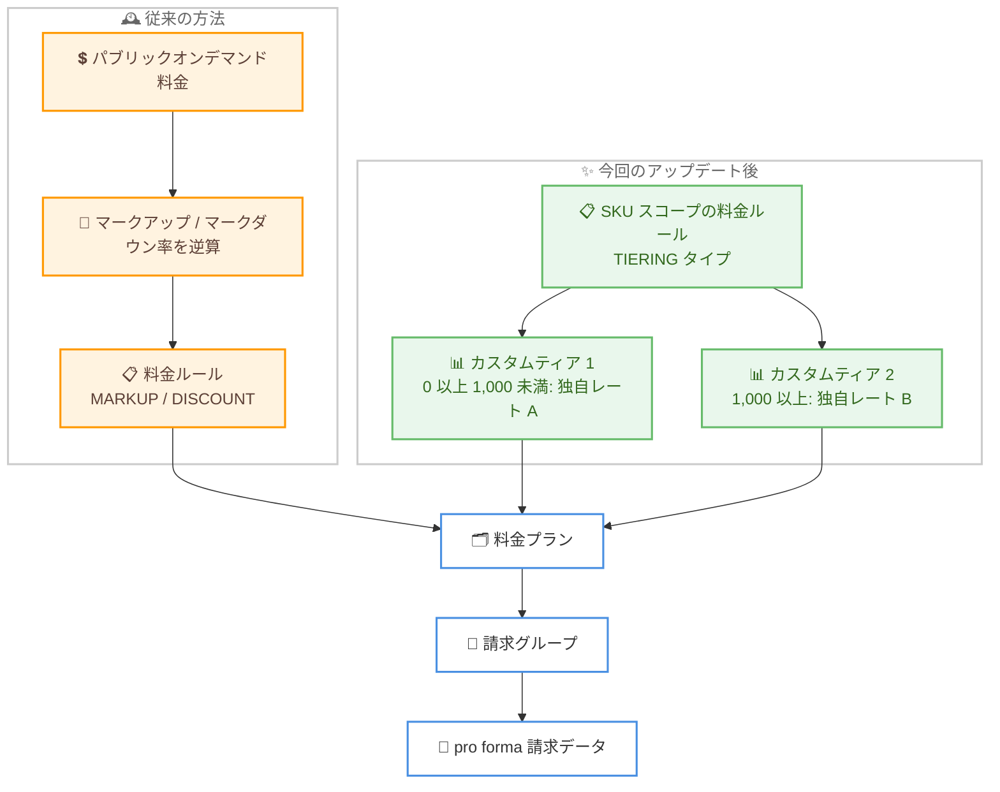

# AWS Billing Conductor - カスタムレートとカスタム使用量ティアの料金設定サポート

**リリース日**: 2026 年 9 月 15 日
**サービス**: AWS Billing Conductor
**機能**: SKU スコープ料金ルールにおけるカスタムレートおよびカスタム使用量ティアの設定

📊 [このアップデートのインフォグラフィックを見る](https://takech9203.github.io/aws-news-summary/20260915-AWS-Billing-Conductor-custom-rates-usage-tier.html)

## 概要

AWS Billing Conductor が、AWS サービスに対するカスタムレート料金の設定に対応しました。SKU スコープの料金ルールにおいて、正確なカスタムレートの入力と、使用量に応じたカスタム使用量ティア (段階料金) のしきい値設定が可能になります。

このアップデートは、子会社、関連会社、エンドカスタマーとの商用契約をモデル化するお客様や AWS パートナーに特に有用です。従来はパブリックオンデマンド料金に対するマークアップ (上乗せ) やマークダウン (割引) の割合を計算して設定する必要がありましたが、今回のアップデートにより、交渉済みの独自料金をそのまま入力して pro forma (プロフォーマ) 請求データに正確に反映できるようになりました。

**アップデート前の課題**

このアップデート以前は、独自の料金体系を pro forma 請求データに反映する際に以下の制約がありました。

- 料金ルールはパブリックオンデマンド料金に対する割合ベースのマークアップ / マークダウンのみに対応しており、独自レートを直接指定できなかった
- 交渉済みの固定単価を表現するには、パブリック料金から逆算してマークアップ / マークダウン率を計算する必要があった
- 使用量ティアは AWS が事前定義したティア構造に依存しており、独自のボリュームディスカウント構造を表現できなかった

**アップデート後の改善**

今回のアップデートにより、以下が可能になりました。

- SKU スコープの料金ルールで、正確なカスタムレート (単価) を直接入力できるようになった
- 使用量の範囲ごとに適用レートを指定するカスタム使用量ティアを定義できるようになった (1 つの料金ルールにつき最大 10 ティア)
- パブリックオンデマンド料金からの割合計算が不要になり、pro forma 請求の設定をより正確かつシンプルに管理できるようになった

## アーキテクチャ図



従来の割合ベースの料金ルールと、今回追加されたカスタムティア方式の比較です。カスタムティアでは使用量の範囲ごとに独自レートを直接指定でき、料金プランと請求グループを経由して pro forma 請求データに反映されます。

## サービスアップデートの詳細

### 主要機能

1. **カスタムレートの直接指定**
   - SKU スコープ (サービス + 使用タイプ + オペレーションの組み合わせ) の料金ルールで、独自の単価を直接入力可能
   - パブリックオンデマンド料金に対する割合計算 (マークアップ / マークダウン) が不要
   - 交渉済み料金や契約上の固定単価を正確に表現できる

2. **カスタム使用量ティアの定義**
   - 料金ルールの `Tiering` 設定に `CustomTiers` が追加され、使用量の範囲ごとに適用レートを定義可能
   - 各ティアは開始値 (`BeginRangeInclusive`、その値を含む)、終了値 (`EndRangeExclusive`、その値を含まない)、適用レート (`RateValue`) で構成
   - 終了値を省略したティアは、開始値以上のすべての使用量に適用される
   - 1 つの料金ルールにつき最小 1 個、最大 10 個のティアを定義可能

3. **既存の料金ルール管理機能との統合**
   - `CreatePricingRule`、`UpdatePricingRule`、`ListPricingRules` の各 API がカスタムティアに対応
   - 作成した料金ルールは、従来どおり料金プランに関連付けて請求グループに適用

## 技術仕様

### CustomTier データ型

| フィールド | 型 | 必須 | 説明 |
|------|------|------|------|
| `BeginRangeInclusive` | Double (0 以上) | はい | ティアが適用される使用量範囲の開始値 (この値を含む) |
| `EndRangeExclusive` | Double (0 以上) | いいえ | ティアが適用される使用量範囲の終了値 (この値を含まない)。省略時は開始値以上のすべての使用量に適用 |
| `RateValue` | Double (0 以上) | はい | このティア内の使用量に適用されるレート |

### 料金ルールの構成要素

| 項目 | 詳細 |
|------|------|
| スコープ | `GLOBAL`、`SERVICE`、`BILLING_ENTITY`、`SKU` |
| タイプ | `MARKUP`、`DISCOUNT`、`TIERING` |
| Tiering 設定 | `FreeTier` (AWS 無料利用枠の有効 / 無効)、`CustomTiers` (今回追加、1〜10 個) |
| SKU スコープの指定項目 | `Service`、`UsageType`、`Operation` |

### API 変更履歴

| 日付 | サービス | 変更内容 |
|------|----------|----------|
| 2026/09/14 | [billingconductor](https://awsapichanges.com/archive/changes/7b8c33-billingconductor.html) | 3 updated api methods - `CreatePricingRule`、`UpdatePricingRule`、`ListPricingRules` にカスタムボリュームティア (`Tiering.CustomTiers`) のサポートを追加 |

### API リクエスト例

```json
{
  "Name": "CustomTierPricingRule",
  "Scope": "SKU",
  "Type": "TIERING",
  "Service": "AmazonS3",
  "UsageType": "APN1-TimedStorage-ByteHrs",
  "Operation": "StandardStorage",
  "Tiering": {
    "CustomTiers": [
      {
        "BeginRangeInclusive": 0,
        "EndRangeExclusive": 51200,
        "RateValue": 0.024
      },
      {
        "BeginRangeInclusive": 51200,
        "RateValue": 0.022
      }
    ]
  }
}
```

## 設定方法

### 前提条件

1. AWS Organizations の管理アカウント、または Billing Conductor の操作権限を委任されたアカウントで操作すること
2. Billing Conductor で請求グループと料金プランを構成済み、または新規に構成すること
3. カスタムレートを適用する対象の SKU (サービス、使用タイプ、オペレーション) を特定していること

### 手順

#### ステップ 1: カスタムティア付きの料金ルールを作成

```bash
aws billingconductor create-pricing-rule \
  --name "S3StorageCustomTier" \
  --description "S3 ストレージのカスタムティア料金" \
  --scope "SKU" \
  --type "TIERING" \
  --service "AmazonS3" \
  --usage-type "APN1-TimedStorage-ByteHrs" \
  --operation "StandardStorage" \
  --tiering '{
    "CustomTiers": [
      {"BeginRangeInclusive": 0, "EndRangeExclusive": 51200, "RateValue": 0.024},
      {"BeginRangeInclusive": 51200, "RateValue": 0.022}
    ]
  }'
```

SKU スコープの料金ルールを `TIERING` タイプで作成します。この例では、使用量 0 以上 51,200 GB 未満の範囲に単価 0.024 USD、51,200 GB 以上の範囲に単価 0.022 USD を適用するカスタムティアを定義しています。

#### ステップ 2: 料金ルールを料金プランに関連付け

```bash
aws billingconductor associate-pricing-rules \
  --arn "arn:aws:billingconductor::123456789012:pricingplan/example-plan-id" \
  --pricing-rule-arns "arn:aws:billingconductor::123456789012:pricingrule/example-rule-id"
```

作成した料金ルールを既存の料金プランに関連付けます。料金プランは請求グループに適用され、カスタムティアに基づく計算結果が pro forma 請求データに反映されます。

#### ステップ 3: 設定内容の確認

```bash
aws billingconductor list-pricing-rules \
  --filters '{"Arns": ["arn:aws:billingconductor::123456789012:pricingrule/example-rule-id"]}'
```

料金ルールの一覧を取得し、レスポンスの `Tiering.CustomTiers` に定義したティアの範囲とレートが正しく設定されていることを確認します。

## メリット

### ビジネス面

- **契約条件の正確な反映**: 子会社やエンドカスタマーと交渉した独自料金を、割合計算を経由せずにそのまま pro forma 請求データへ反映できる
- **ボリュームディスカウントの表現**: 使用量に応じた段階的な独自料金体系を定義でき、パートナービジネスにおける柔軟な価格戦略を実現できる
- **請求業務の効率化**: マークアップ / マークダウン率の逆算や再計算の手間が不要になり、料金設定の運用負荷を軽減できる

### 技術面

- **API による自動化**: `CreatePricingRule` / `UpdatePricingRule` API を通じて、カスタムティア設定をコードで管理・自動化できる
- **粒度の高い制御**: SKU スコープ (サービス + 使用タイプ + オペレーション) で使用状況を特定し、SKU 単位で独自レートを適用できる
- **既存構成との統合**: 既存の料金プラン、請求グループの仕組みをそのまま利用でき、追加のアーキテクチャ変更が不要

## デメリット・制約事項

### 制限事項

- カスタムティアは 1 つの料金ルールにつき最大 10 個まで定義可能
- カスタムレートの直接入力は SKU スコープの料金ルールが対象
- 中国リージョン (北京: Sinnet 運営、寧夏: NWCD 運営) では利用不可

### 考慮すべき点

- Billing Conductor が生成するのは pro forma (見せ方を変えた) 請求データであり、AWS への実際の支払い額は変わらない
- ティアの範囲は開始値を含み終了値を含まない (半開区間) ため、範囲の境界値の設定に注意が必要
- 対象 SKU ごとに料金ルールを定義する必要があるため、適用対象が多い場合はルールの管理方法を事前に設計しておくことが望ましい

## ユースケース

### ユースケース 1: 子会社への社内請求で交渉済み固定単価を適用

**シナリオ**: 親会社が AWS の支払いを一括で行い、子会社ごとに社内で取り決めた固定単価で請求書を発行したい。従来はパブリック料金からマークダウン率を逆算しており、AWS 側の料金改定のたびに再計算が必要だった。

**実装例**:
```
1. 子会社ごとの請求グループを作成
2. 対象 SKU に対して TIERING タイプの料金ルールを作成し、
   合意済みの固定単価を RateValue に直接入力
3. 料金ルールを料金プランに関連付け、請求グループに適用
```

**効果**: 割合計算が不要になり、合意した単価をそのまま設定できるため、社内請求の正確性と運用効率が向上する。

### ユースケース 2: AWS パートナーによるボリュームディスカウント付き再販価格の設定

**シナリオ**: AWS パートナーがエンドカスタマーに対し、「月間使用量が一定量を超えた分は割引単価を適用する」という段階的な価格体系で再販している。

**実装例**:
```
CustomTiers:
  - ティア 1: 0 以上 10,000 単位未満 → 標準単価
  - ティア 2: 10,000 以上 50,000 単位未満 → 割引単価 A
  - ティア 3: 50,000 以上 → 割引単価 B
```

**効果**: 独自のボリュームディスカウント構造を pro forma 請求データで直接表現でき、エンドカスタマー向け請求の透明性が向上する。

### ユースケース 3: 料金設定の IaC 化による運用自動化

**シナリオ**: 多数のエンドカスタマーを抱えるパートナーが、契約更新のたびに料金ルールを手動で更新しており、設定ミスのリスクがあった。

**実装例**:
```
1. 契約管理システムから顧客ごとの単価・ティア情報を取得
2. UpdatePricingRule API で Tiering.CustomTiers を更新する
   スクリプトを定期実行
3. ListPricingRules API で設定内容を検証
```

**効果**: 契約条件の変更を API 経由で自動反映でき、手動運用による設定ミスを削減できる。

## 料金

AWS Billing Conductor 自体の利用には料金が発生します。単一の AWS Organizations 内で利用する場合、請求グループに配置したアカウント数に基づく段階的な料金モデルが適用されます (アカウント内のリソース使用量は課金額に影響しません)。組織をまたいで利用する Billing Transfer では、カスタマーマネージド料金プランにマッピングした AWS Organizations ごとに月額 50 USD が発生します (AWS マネージド料金プランは無料)。

カスタムレートおよびカスタム使用量ティア機能の利用による追加料金に関する記載は、公式発表にはありません。最新の料金詳細は [AWS Billing Conductor 料金ページ](https://aws.amazon.com/aws-cost-management/aws-billing-conductor/pricing/) を参照してください。

## 利用可能リージョン

以下を除くすべての AWS 商用リージョンで利用可能です。

- 中国 (北京) リージョン (Sinnet 運営)
- 中国 (寧夏) リージョン (NWCD 運営)

## 関連サービス・機能

- **AWS Organizations**: Billing Conductor は Organizations の一括請求 (コンソリデーテッドビリング) を前提とし、管理アカウントまたは委任アカウントから請求グループを構成する
- **AWS Cost and Usage Report (CUR)**: 請求グループごとの pro forma データを CUR として出力し、エンドカスタマー向けの請求分析に利用できる
- **AWS Cost Explorer**: pro forma 料金を反映したコストの可視化・分析に利用できる

## 参考リンク

- 📊 [インフォグラフィック](https://takech9203.github.io/aws-news-summary/20260915-AWS-Billing-Conductor-custom-rates-usage-tier.html)
- [公式発表 (What's New)](https://aws.amazon.com/about-aws/whats-new/2026/09/AWS-Billing-Conductor-custom-rates-usage-tier)
- [AWS Billing Conductor 製品ページ](https://aws.amazon.com/aws-cost-management/aws-billing-conductor/)
- [AWS Billing Conductor ユーザーガイド](https://docs.aws.amazon.com/billingconductor/latest/userguide/what-is-billingconductor.html)
- [API リファレンス: CreatePricingRule](https://docs.aws.amazon.com/billingconductor/latest/APIReference/API_CreatePricingRule.html)
- [API リファレンス: CustomTier](https://docs.aws.amazon.com/billingconductor/latest/APIReference/API_CustomTier.html)
- [料金ページ](https://aws.amazon.com/aws-cost-management/aws-billing-conductor/pricing/)

## まとめ

AWS Billing Conductor の SKU スコープ料金ルールで、カスタムレートの直接入力とカスタム使用量ティアの定義が可能になり、割合ベースのマークアップ / マークダウン計算に依存しない正確な pro forma 請求設定を実現できます。子会社への社内請求やエンドカスタマーへの再販で独自の料金体系を運用しているお客様・パートナーは、既存の料金ルールをカスタムティア方式へ移行することで、料金改定時の再計算作業の削減と請求精度の向上が期待できます。
