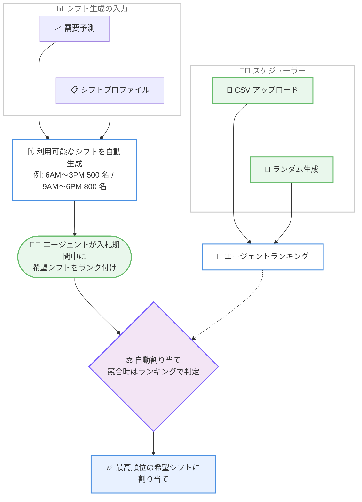

# Amazon Connect Customer - シフト入札 (Shift Bidding)

**リリース日**: 2026 年 9 月 15 日
**サービス**: Amazon Connect Customer
**機能**: エージェントによる希望シフトへの入札 (Shift Bidding)

📊 [このアップデートのインフォグラフィックを見る](https://takech9203.github.io/aws-news-summary/20260915-amazon-connect-customer-shift-bidding.html)

## 概要

Amazon Connect Customer に、コンタクトセンターのエージェントが希望するシフトに入札 (Shift Bidding) できる機能が追加されました。エージェントは提示されたシフトの選択肢を希望順にランク付けして入札でき、自身のワークスケジュールに対してより大きなコントロールを持てるようになります。

スケジューラーは、まず CSV ファイルのアップロード、またはシステムによるランダム生成のいずれかの方法でエージェントランキングを設定します。次に、システムが需要予測 (フォーキャスト) とシフトプロファイルを組み合わせて利用可能なシフトを生成し、エージェントに提示します。例えば、月曜〜金曜の 6AM〜10PM をカバーするプロファイルで 9 時間シフトを構成する場合、「6AM〜3PM (500 名)、9AM〜6PM (800 名)、1PM〜10PM (600 名)」のようなシフト群が生成されます。入札期間の終了後、システムは各エージェントを最高順位の希望シフトに自動的に割り当て、競合が発生した場合は事前に設定したエージェントランキングをタイブレーカーとして使用します。

この機能は、コンタクトセンターのワークフォースマネジメント (WFM) を担うスケジューラーと、シフト勤務するエージェントの双方に価値を提供します。エージェントには希望を反映できる構造化された仕組みを、スケジューラーには手動でのシフト割り当て作業の削減をもたらします。

**アップデート前の課題**

- 以前は、スケジューラーがエージェントの希望を個別にヒアリングし、手動でシフトを割り当てる必要があった
- エージェントが自身の勤務スケジュールに希望を反映する構造化された仕組みがなく、割り当ての透明性・公平性を担保しにくかった
- 大規模なコンタクトセンターでは、多数のエージェントの希望と需要予測を突き合わせる作業に多くの時間がかかっていた

**アップデート後の改善**

- エージェントが提示されたシフトを希望順にランク付けして入札できるようになり、スケジュールへの主体的な関与が可能になった
- 需要予測とシフトプロファイルに基づいてシステムが利用可能なシフトを自動生成し、入札期間終了後に最高順位の希望シフトへ自動割り当てされるため、手動割り当て作業が不要になった
- 事前に設定したエージェントランキングをタイブレーカーとして使用することで、競合時の割り当てルールが明確になり、公平性と透明性が向上した

## アーキテクチャ図



スケジューラーが設定したエージェントランキングと、需要予測 + シフトプロファイルから生成されたシフト群をもとに、エージェントの入札結果を自動割り当てに反映する流れを示しています。

## サービスアップデートの詳細

### 主要機能

1. **エージェントランキングの設定**
   - スケジューラーが入札の優先順位付けに使用するエージェントランキングを設定する
   - 設定方法は 2 種類: CSV ファイルのアップロード、またはシステムによるランダム生成
   - このランキングは、複数のエージェントが同じシフトを希望した場合のタイブレーカーとして機能する

2. **利用可能なシフトの自動生成**
   - システムが需要予測 (フォーキャスト) とシフトプロファイルを組み合わせて、入札対象となるシフトを自動生成する
   - 例: 月曜〜金曜 6AM〜10PM のプロファイルで 9 時間シフトを構成する場合、6AM〜3PM (500 名)、9AM〜6PM (800 名)、1PM〜10PM (600 名) のようなシフト群と必要人数が算出される

3. **エージェントによる入札とランク付け**
   - 生成されたシフトはエージェントに提示され、エージェントは入札期間 (ビッディングウィンドウ) 中に希望順にランク付けして入札する
   - エージェントは自身のスケジュールに対する希望を構造化された形で表明できる

4. **入札期間終了後の自動割り当て**
   - 入札期間が終了すると、システムが各エージェントを最高順位の希望シフトに自動的に割り当てる
   - 競合が発生した場合は、事前に設定したエージェントランキングに基づいて割り当てを決定する

## 技術仕様

### シフト入札の構成要素

| 項目 | 詳細 |
|------|------|
| エージェントランキング | CSV アップロードまたはランダム生成で設定。競合時のタイブレーカーとして使用 |
| シフト生成の入力 | 需要予測 (フォーキャスト) とシフトプロファイル (週次シフトのテンプレート) |
| 入札期間 | エージェントが希望シフトをランク付けできる期間。終了後に自動割り当てを実行 |
| 割り当てロジック | 各エージェントを最高順位の希望シフトに割り当て。競合時はランキング順 |
| 前提となる機能 | Amazon Connect Customer の予測、キャパシティプランニング、エージェントスケジューリング |

### 関連するスケジューリング機能

Amazon Connect Customer のスケジューリングは、以下の要素に基づいてエージェントスケジュールを生成・管理します ([ドキュメント](https://docs.aws.amazon.com/connect/latest/adminguide/scheduling.html)より)。

- 公開済みの短期フォーキャスト
- シフトプロファイル (週次シフトのテンプレート)
- スタッフィンググループ (特定のフォーキャストグループのコンタクトを処理できるエージェント群)
- 人事・ビジネスルール

## 設定方法

### 前提条件

1. Amazon Connect インスタンスで Amazon Connect Customer の予測、キャパシティプランニング、スケジューリング機能を有効化していること
2. ユーザーがスケジューリング機能にアクセスするための[セキュリティプロファイル権限](https://docs.aws.amazon.com/connect/latest/adminguide/required-optimization-permissions.html)を割り当て済みであること
3. シフトプロファイル、スタッフィンググループ、スタッフルールなどのスケジューリング設定が完了し、フォーキャストが公開済みであること

### 手順

#### ステップ 1: スケジューリングの基盤を準備する

[管理者ガイドの手順](https://docs.aws.amazon.com/connect/latest/adminguide/scheduling.html)に従い、ユーザーの追加、スタッフルールの作成、シフトアクティビティの作成、シフトプロファイルの作成、スタッフィンググループの作成を行います。シフト入札で提示されるシフトは、これらの設定と需要予測から生成されます。

#### ステップ 2: エージェントランキングを設定する

Connect Customer 管理 Web サイトで、CSV ファイルをアップロードするか、システムにランダム生成させてエージェントランキングを設定します。このランキングは入札競合時のタイブレーカーとして使用されます。

#### ステップ 3: 入札対象シフトを生成し、入札期間を設定する

需要予測とシフトプロファイルに基づいて利用可能なシフトを生成し、エージェントに提示します。エージェントは入札期間中に希望シフトをランク付けします。

#### ステップ 4: 自動割り当て結果を確認する

入札期間の終了後、システムが各エージェントを最高順位の希望シフトに自動割り当てします。スケジューラーは Schedule Manager で結果を確認し、スケジュールを公開します。

## メリット

### ビジネス面

- **エージェント満足度の向上**: エージェントが自身の勤務スケジュールに希望を反映できるため、ワークライフバランスの改善と定着率の向上が期待できる
- **スケジューリング業務の効率化**: 手動でのシフト割り当て作業が削減され、スケジューラーはより付加価値の高い業務に時間を使える
- **公平性と透明性**: 事前に定義されたランキングによるタイブレークで、割り当てルールが明確になり、エージェント間の不公平感を軽減できる

### 技術面

- **需要予測との統合**: 機械学習による需要予測とシフトプロファイルから入札対象シフトが自動生成されるため、必要人数と希望の両立を仕組みとして担保できる
- **自動割り当て**: 入札期間終了後の割り当てが自動化されており、大規模なエージェント数でもスケーラブルに運用できる
- **柔軟なランキング設定**: CSV アップロードにより、勤続年数やパフォーマンスなど自社の基準に基づくランキングを取り込める

## デメリット・制約事項

### 制限事項

- Amazon Connect Customer のエージェントスケジューリング機能が利用可能なリージョンでのみ使用できる
- 事前にフォーキャスト、シフトプロファイル、スタッフィンググループなどのスケジューリング設定が必要
- Connect Customer のスケジューリングは特定の法規制への準拠を保証するものではなく、労働関連法規への準拠はユーザーの責任となる

### 考慮すべき点

- ランキングの設定基準 (勤続年数、パフォーマンスなど) は組織のポリシーとして事前に合意しておく必要がある。ランダム生成を使う場合も、その方針をエージェントに周知することが望ましい
- 低順位のエージェントは希望シフトを得にくくなる可能性があるため、ランキングの更新頻度やローテーションの運用ルールを検討する
- 入札期間の長さや案内方法など、エージェントへのコミュニケーション設計が導入効果を左右する

## ユースケース

### ユースケース 1: 大規模コンタクトセンターの月次シフト編成

**シナリオ**: 数百〜数千名のエージェントを抱えるコンタクトセンターで、毎月のシフト編成に多くの工数がかかっている。

**実装例**:
```
1. 勤続年数ベースのランキングを CSV で作成しアップロード
2. 公開済みフォーキャストとシフトプロファイルから翌月のシフトを生成
   例: 6AM〜3PM に 500 名、9AM〜6PM に 800 名、1PM〜10PM に 600 名
3. 1 週間の入札期間を設けてエージェントに希望をランク付けしてもらう
4. 入札期間終了後、自動割り当て結果を確認してスケジュールを公開
```

**効果**: 手動割り当て工数を大幅に削減しつつ、エージェントの希望を反映した公平なシフト編成を実現できる。

### ユースケース 2: 繁忙期に向けた希望ベースのシフト調整

**シナリオ**: セールなどの繁忙期に向けて夜間・週末シフトの必要人数が増えるが、割り当てへの不満が発生しやすい。

**実装例**:
```
1. 繁忙期用のシフトプロファイルとフォーキャストからシフトを生成
2. エージェントが夜間・週末を含むシフトを希望順にランク付け
3. 競合時は事前設定のランキングで自動的にタイブレーク
```

**効果**: 不人気シフトの割り当てが恣意的でなくなり、透明なルールに基づく割り当てで納得感を高められる。

### ユースケース 3: 公平性を重視したランダムランキング運用

**シナリオ**: 中規模のコンタクトセンターで、特定の基準によるランキングを設けず、機会の平等を重視したい。

**実装例**:
```
1. エージェントランキングをシステムのランダム生成で設定
2. 入札サイクルごとにランキングを再生成して機会を平準化
3. エージェントは毎回の入札期間で希望シフトをランク付け
```

**効果**: 特定のエージェントが常に優先される状況を避け、長期的に公平なシフト機会を提供できる。

## 料金

今回の発表には追加料金に関する記載はありません。シフト入札は Amazon Connect Customer のエージェントスケジューリング機能の一部として提供されます。Amazon Connect の予測、キャパシティプランニング、スケジューリングの料金は、[Amazon Connect 料金ページ](https://aws.amazon.com/connect/pricing/)を参照してください。

## 利用可能リージョン

Amazon Connect Customer のエージェントスケジューリングが利用可能なすべての AWS リージョンで利用できます。リージョンごとの機能提供状況は[ドキュメント](https://docs.aws.amazon.com/connect/latest/adminguide/regions.html)を参照してください。

## 関連サービス・機能

- **Amazon Connect Customer 予測 (Forecasting)**: 過去データに基づきコンタクト量と処理時間を予測する機能。シフト入札で提示されるシフトの生成に使用される
- **Amazon Connect Customer スケジューリング**: フォーキャスト、シフトプロファイル、スタッフィンググループに基づいてエージェントスケジュールを生成・公開する機能。シフト入札はこの機能の拡張
- **Amazon Connect Customer キャパシティプランニング**: 長期的に必要なエージェント数をシナリオやサービスレベル目標に基づいて予測する機能
- **スケジュールアドヒアランス**: 公開済みスケジュールに対するエージェントの遵守状況をスーパーバイザーが監視する機能

## 参考リンク

- 📊 [インフォグラフィック](https://takech9203.github.io/aws-news-summary/20260915-amazon-connect-customer-shift-bidding.html)
- [公式発表 (What's New)](https://aws.amazon.com/about-aws/whats-new/2026/09/amazon-connect-customer-shift-bidding/)
- [ドキュメント: Forecasting & agent scheduling in Connect Customer](https://docs.aws.amazon.com/connect/latest/adminguide/forecasting-capacity-planning-scheduling.html)
- [ドキュメント: Scheduling in Connect Customer](https://docs.aws.amazon.com/connect/latest/adminguide/scheduling.html)
- [ドキュメント: リージョンごとの機能提供状況](https://docs.aws.amazon.com/connect/latest/adminguide/regions.html)
- [料金ページ](https://aws.amazon.com/connect/pricing/)

## まとめ

Amazon Connect Customer のシフト入札は、需要予測に基づくシフト生成とエージェントの希望を両立させる仕組みで、エージェント満足度とスケジューリング効率の双方を高めるアップデートです。すでに Connect Customer のエージェントスケジューリングを利用している場合は、ランキングの設定基準と入札期間の運用ルールを整理したうえで、次回のシフト編成サイクルから導入を検討することを推奨します。
