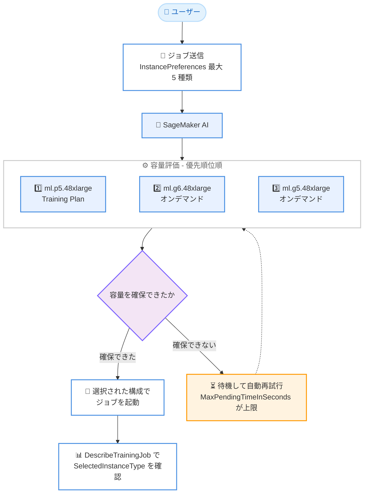

# Amazon SageMaker AI - トレーニング/処理ジョブのインスタンス優先リスト対応

**リリース日**: 2026 年 9 月 15 日
**サービス**: Amazon SageMaker AI
**機能**: トレーニングジョブおよび処理ジョブにおけるインスタンス優先リスト (Instance Preference Lists)

📊 [このアップデートのインフォグラフィックを見る](https://takech9203.github.io/aws-news-summary/20260915-amazon-sagemaker-training-processing-instance-pref-lists.html)

## 概要

Amazon SageMaker AI のトレーニングジョブおよび処理ジョブで、優先順位を付けた複数のインスタンスタイプのリストを指定できるようになりました。ジョブ送信時にインスタンスタイプと台数の組み合わせを優先順位順に最大 5 つまでリストとして指定すると、SageMaker AI がリストを順に評価し、最初に容量を確保できた構成でジョブを自動的に起動します。

容量のソースとして、オンデマンドインスタンスと事前予約型の SageMaker Flexible Training Plans の両方を単一のジョブ送信内で組み合わせて指定できます。たとえば、トレーニングプランで予約済みの ml.p5.48xlarge を第 1 優先とし、確保できない場合はオンデマンドの ml.p4d.24xlarge にフォールバックする、といった構成が可能です。

GPU インスタンスの需要が高い時期でもジョブの開始を早め、これまでユーザー側で実装していたリトライの仕組みを不要にするアップデートであり、ML エンジニアや MLOps チームにとって価値の大きい機能です。

**アップデート前の課題**

- 以前はジョブ送信ごとに単一のインスタンスタイプしか指定できず、SageMaker がその特定のインスタンスを確保するまで待つ必要があった
- 人気の GPU インスタンスの需要ピーク時には、独自のリトライ機構を構築したり、異なるインスタンスタイプで複数のジョブを並行送信して先に容量を確保できたものを採用したりする運用が必要だった
- 夜間の再トレーニングパイプラインなどが容量不足エラー (InsufficientCapacityError) で失敗し、手動での再実行が必要になることがあった

**アップデート後の改善**

- 今回のアップデートにより、優先順位付きのインスタンスタイプリスト (最大 5 種類) を 1 回のジョブ送信で指定できるようになった
- SageMaker AI がリストから最初に容量を確保できる構成でジョブを自動起動するため、独自のリトライスクリプトやポーリング処理が不要になった
- オンデマンドと Flexible Training Plans を同一リスト内で組み合わせられるようになり、予約容量を優先しつつオンデマンドへフォールバックする戦略を宣言的に構成できるようになった

## アーキテクチャ図



ユーザーが優先順位付きのインスタンスリストを指定してジョブを送信すると、SageMaker AI がリストを順に評価し、最初に容量を確保できた構成でジョブを起動します。どのタイプでも容量を確保できない場合は、`MaxPendingTimeInSeconds` を上限として自動的に再試行します。

## サービスアップデートの詳細

### 主要機能

1. **優先順位付きインスタンスリストの指定**
   - `ResourceConfig` の `InstanceType` の代わりに `InstancePreferences` を指定し、最大 5 種類のインスタンスタイプを優先順位順にリストできる
   - SageMaker AI はリスト内で最初に容量のあるタイプでジョブを起動し、以降のモニタリングや課金はそのタイプを直接指定した場合と同一
   - `CreateTrainingJob` API、AWS SDK、AWS CLI、SageMaker Python SDK、SageMaker AI コンソールから利用可能。処理ジョブは `ClusterConfig` で同じ仕組みを利用できる

2. **柔軟なインスタンス台数の指定**
   - **均一指定**: `ResourceConfig` に 1 つの `InstanceCount` を設定し、選択されたタイプに関わらず同じ台数を使用
   - **エントリごとの指定**: 各エントリに個別の `InstanceCount` を設定し、GPU 数の異なるタイプ間で合計スループットを揃えられる (例: 4 GPU の ml.g5.12xlarge と 1 GPU の ml.g5.16xlarge で台数を変える)
   - 両方に設定する、どちらにも設定しない、一部のエントリのみに設定する、といったリクエストは拒否される

3. **オンデマンドと Flexible Training Plans の組み合わせ**
   - エントリに `TrainingPlanArns` を付与すると、そのエントリはトレーニングプランの予約容量から確保される (エントリのインスタンスタイプはプランのタイプと一致する必要がある)
   - プランなしのエントリはオンデマンド容量を使用。プラン付きエントリを先頭に置くことで、予約容量を優先的に試行できる
   - 評価時点でプランに空き容量がない場合、予約を待たずに次のエントリへ進むため、オンデマンド容量で即座にジョブを開始できる
   - ジョブレベルの `TrainingPlanArn` も利用可能だが、エントリレベルの指定と併用はできない

4. **容量待機と自動再試行**
   - リスト内のどのタイプにも容量がない場合、ジョブは待機して容量の解放に応じて再試行する
   - `MaxPendingTimeInSeconds` はリスト全体での合計待機時間の上限として機能する (タイプごとではない)
   - 待機はリストに ml.p、ml.g、ml.trn などのアクセラレーテッドコンピューティングインスタンスが 1 つ以上含まれる場合のみ。CPU のみのリストは 1 回だけ評価され、容量がなければ容量エラーで失敗する

5. **選択結果の確認**
   - `DescribeTrainingJob` のレスポンスに読み取り専用の `SelectedInstanceType` と `SelectedInstanceCount` が返され、実際に選択された構成を確認できる
   - コンソールのジョブ詳細ページでは「Instance type preferences」テーブルに選択済みタイプが「Selected」として表示され、選択前は「Pending selection」と表示される

## 技術仕様

### インスタンス優先リストの仕様

| 項目 | 詳細 |
|------|------|
| 指定可能なタイプ数 | 最大 5 種類 (各タイプはリスト内に 1 回のみ) |
| 指定方法 | `ResourceConfig` の `InstancePreferences` (処理ジョブは `ClusterConfig`) |
| 台数指定 | 均一 (`ResourceConfig` の `InstanceCount`) またはエントリごと |
| 容量ソース | オンデマンド、Flexible Training Plans (トレーニングジョブのみ) |
| 待機時間の上限 | `MaxPendingTimeInSeconds` (リスト全体に適用) |
| サービスクォータ | リスト内のすべてのタイプについてクォータを検証 (不足があればリクエスト拒否) |
| 選択結果の確認 | `DescribeTrainingJob` の `SelectedInstanceType` / `SelectedInstanceCount` |
| 利用インターフェイス | API、AWS CLI、AWS SDK、SageMaker Python SDK、コンソール |

### 設定例: 均一台数での指定

`CreateTrainingJob` リクエストの `ResourceConfig` で、ml.g6.48xlarge に容量がなければ ml.g5.48xlarge にフォールバックする例です。

```json
"ResourceConfig": {
  "InstanceCount": 2,
  "VolumeSizeInGB": 500,
  "InstancePreferences": [
    { "InstanceType": "ml.g6.48xlarge" },
    { "InstanceType": "ml.g5.48xlarge" }
  ]
}
```

### 設定例: トレーニングプランとオンデマンドの組み合わせ

第 1 優先をトレーニングプランの予約容量、第 2 優先をオンデマンドとする例です。

```json
"ResourceConfig": {
  "InstanceCount": 4,
  "VolumeSizeInGB": 500,
  "InstancePreferences": [
    {
      "InstanceType": "ml.p5.48xlarge",
      "TrainingPlanArns": ["arn:aws:sagemaker:us-west-2:111122223333:training-plan/p5-plan"]
    },
    { "InstanceType": "ml.p4d.24xlarge" }
  ]
}
```

## 設定方法

### 前提条件

1. SageMaker AI のトレーニングジョブまたは処理ジョブを実行できる IAM 権限があること
2. リストに含める**すべての**インスタンスタイプについて、要求する台数を満たすサービスクォータが確保されていること (1 つでも不足するとリクエストが拒否される)
3. トレーニングコンテナがリスト内のすべてのインスタンスタイプで動作すること (SageMaker は GPU アーキテクチャ等の互換性を検証しない)

### 手順

#### ステップ 1: サービスクォータの確認

```bash
aws service-quotas list-service-quotas \
  --service-code sagemaker \
  --query "Quotas[?contains(QuotaName, 'g6.48xlarge')]"
```

リストに含める予定のインスタンスタイプごとに、トレーニングジョブ用のクォータを確認します。不足している場合は事前にクォータ引き上げをリクエストします。

#### ステップ 2: 優先リストを指定してジョブを作成

```bash
aws sagemaker create-training-job \
  --training-job-name my-training-job \
  --algorithm-specification TrainingImage=<training-image-uri>,TrainingInputMode=File \
  --role-arn arn:aws:iam::111122223333:role/SageMakerExecutionRole \
  --output-data-config S3OutputPath=s3://my-bucket/output/ \
  --resource-config '{
    "InstanceCount": 2,
    "VolumeSizeInGB": 500,
    "InstancePreferences": [
      { "InstanceType": "ml.g6.48xlarge" },
      { "InstanceType": "ml.g5.48xlarge" }
    ]
  }' \
  --stopping-condition '{
    "MaxRuntimeInSeconds": 86400,
    "MaxPendingTimeInSeconds": 1800
  }'
```

`InstanceType` の代わりに `InstancePreferences` で優先リストを指定してトレーニングジョブを作成します。`MaxPendingTimeInSeconds` により、容量待機の合計時間を 30 分に制限しています。

#### ステップ 3: 選択されたインスタンスタイプの確認

```bash
aws sagemaker describe-training-job \
  --training-job-name my-training-job \
  --query "ResourceConfig.{Selected:SelectedInstanceType,Count:SelectedInstanceCount}"
```

ジョブの詳細を取得し、実際に選択されたインスタンスタイプと台数を確認します。これらのフィールドはタイプが選択された後にのみ返され、容量待機中は含まれません。

#### ステップ 4: SageMaker Python SDK での利用 (オプション)

```python
from sagemaker.core.shapes import InstancePreference
from sagemaker.core.training.configs import Compute
from sagemaker.train.model_trainer import ModelTrainer

compute = Compute(
    volume_size_in_gb=500,
    instance_preferences=[
        InstancePreference(
            instance_type="ml.p5.48xlarge",
            instance_count=4,
            training_plan_arns=["arn:aws:sagemaker:us-west-2:111122223333:training-plan/p5-plan"],
        ),
        InstancePreference(instance_type="ml.p4d.24xlarge", instance_count=8),
    ],
)

trainer = ModelTrainer(
    training_image="<training-image-uri>",
    compute=compute,
)
trainer.train()
```

Python SDK では `ModelTrainer` の `Compute` 設定に `instance_preferences` を渡します。この例では、トレーニングプランの ml.p5.48xlarge を 4 台で優先し、確保できない場合はオンデマンドの ml.p4d.24xlarge を 8 台で起動します。

## メリット

### ビジネス面

- **ジョブ開始までの時間短縮**: 需要の高い GPU インスタンスが確保できない場合でも代替タイプで自動起動するため、モデル開発やパイプラインの停滞を減らせる
- **運用コストの削減**: 独自のリトライ機構や並行ジョブ送信といった差別化につながらない作業が不要になり、エンジニアリングリソースを本来の ML 開発に集中できる
- **予約容量の有効活用**: Flexible Training Plans の予約容量を優先しつつオンデマンドにフォールバックすることで、コミットメント割引と可用性を両立できる

### 技術面

- **宣言的なフォールバック構成**: これまでアプリケーション側で実装していた容量フォールバックのロジックを、`InstancePreferences` の 1 つの設定として表現できる
- **GPU 数の違いを台数で吸収**: エントリごとの `InstanceCount` により、タイプ間で合計 GPU 数やスループットを揃えた構成が可能
- **既存 API との統合**: 既存のトレーニング/処理ジョブ API の拡張として提供されるため、既存のワークフローへの組み込みが容易
- **可観測性**: `SelectedInstanceType` / `SelectedInstanceCount` とコンソールの優先リストテーブルにより、どの構成で起動したかを簡単に追跡できる

## デメリット・制約事項

### 制限事項

- リストに指定できるインスタンスタイプは最大 5 種類で、各タイプは 1 回しか指定できない
- `InstancePreferences` は `InstanceType`、`InstanceGroups`、`InstancePlacementConfig`、`EnableManagedSpotTraining` (マネージドスポットトレーニング) と併用できない
- リスト内のすべてのタイプについてサービスクォータが検証され、1 つでも不足するとリクエスト全体が拒否される (先頭のタイプで起動可能な場合でも同様)
- Flexible Training Plans との統合はトレーニングジョブのみで、処理ジョブでは利用できない
- ビルトインアルゴリズムを使用する場合、リスト内のすべてのタイプがそのアルゴリズムでサポートされている必要がある

### 考慮すべき点

- SageMaker AI は容量の有無のみで選択し、GPU アーキテクチャ、アクセラレータメモリ、Elastic Fabric Adapter (EFA) 対応、ドライバーバージョンなどの互換性は比較しないため、コンテナがリスト内の全タイプで動作することを事前に確認する必要がある
- CPU のみのリストは 1 回だけ評価され、容量がなければ再試行せずに失敗する (待機と再試行はアクセラレーテッドインスタンスを含む場合のみ)
- `torchrun --nproc_per_node=auto` のように、選択されたタイプの GPU 数に応じて動作を調整できるトレーニングスクリプトにしておくと、タイプ間の差異を吸収しやすい
- `VolumeSizeInGB`、`VolumeKmsKeyId`、`KeepAlivePeriodInSeconds` は選択されたタイプにそのまま適用される

## ユースケース

### ユースケース 1: GPU 需要ピーク時の大規模モデルトレーニング

**シナリオ**: 最新の H100 搭載インスタンス (ml.p5.48xlarge) でトレーニングしたいが、需要が高く容量を確保できないことが多い。A100 搭載インスタンスでも許容できる。

**実装例**:
```json
"InstancePreferences": [
  { "InstanceType": "ml.p5.48xlarge", "InstanceCount": 2 },
  { "InstanceType": "ml.p4de.24xlarge", "InstanceCount": 4 },
  { "InstanceType": "ml.p4d.24xlarge", "InstanceCount": 4 }
]
```

**効果**: 第 1 希望が確保できない場合でも代替の GPU 構成で即座にトレーニングを開始でき、エントリごとの台数指定により合計スループットも近い水準に保てる。

### ユースケース 2: 夜間の再トレーニングパイプラインの安定化

**シナリオ**: 毎晩実行される再トレーニングパイプラインが、容量不足エラーで失敗して翌朝に手動で再実行することが度々発生している。

**実装例**:
```json
"ResourceConfig": {
  "InstanceCount": 1,
  "VolumeSizeInGB": 200,
  "InstancePreferences": [
    { "InstanceType": "ml.g6.12xlarge" },
    { "InstanceType": "ml.g5.12xlarge" },
    { "InstanceType": "ml.g4dn.12xlarge" }
  ]
},
"StoppingCondition": {
  "MaxRuntimeInSeconds": 43200,
  "MaxPendingTimeInSeconds": 3600
}
```

**効果**: 複数世代の GPU タイプをフォールバック先として指定することで容量起因のパイプライン失敗を大幅に減らし、リトライ用のカスタムコードも撤去できる。

### ユースケース 3: 予約容量とオンデマンドのハイブリッド戦略

**シナリオ**: Flexible Training Plans で ml.p5.48xlarge を予約しているが、プランの容量を使い切っている期間もトレーニングを止めたくない。

**実装例**:
```json
"InstancePreferences": [
  {
    "InstanceType": "ml.p5.48xlarge",
    "TrainingPlanArns": ["arn:aws:sagemaker:us-west-2:111122223333:training-plan/p5-plan"]
  },
  { "InstanceType": "ml.p4d.24xlarge" }
]
```

**効果**: 予約済みの割引容量を最優先で使用しつつ、プランに空きがない場合は予約を待たずにオンデマンド容量へ自動フォールバックするため、コスト効率と開発速度を両立できる。

## 料金

インスタンス優先リスト機能自体に追加料金はありません。ジョブは選択されたインスタンスタイプを直接指定した場合とまったく同様に課金されます。

- **オンデマンド**: 選択されたインスタンスタイプの標準の SageMaker 料金が適用される
- **Flexible Training Plans**: プランから容量が確保された場合は、プランの事前購入済み割引料金が適用される

各リージョンで利用可能なインスタンスタイプと料金は [SageMaker AI の料金ページ](https://aws.amazon.com/sagemaker/pricing/) を参照してください。

## 利用可能リージョン

Amazon SageMaker が利用可能なすべての AWS リージョンで利用できます。

## 関連サービス・機能

- **SageMaker Flexible Training Plans**: GPU 容量を事前予約する仕組み。今回の機能により、優先リスト内のエントリ単位でプランの容量を指定し、オンデマンドと組み合わせられる
- **SageMaker Training Jobs / Processing Jobs**: 今回の機能が適用されるフルマネージドのトレーニング/データ処理ジョブ。既存の API の拡張として提供される
- **SageMaker Managed Spot Training**: スポット容量を利用した低コストトレーニング。インスタンス優先リストとは併用できない点に注意
- **AWS Service Quotas**: リスト内の全インスタンスタイプでクォータ検証が行われるため、事前のクォータ管理が重要になる

## 参考リンク

- 📊 [インフォグラフィック](https://takech9203.github.io/aws-news-summary/20260915-amazon-sagemaker-training-processing-instance-pref-lists.html)
- [公式発表 (What's New)](https://aws.amazon.com/about-aws/whats-new/2026/09/amazon-sagemaker-training-processing-instance-pref-lists/)
- [AWS Blog: Announcing instance preference lists for Amazon SageMaker AI training jobs](https://aws.amazon.com/blogs/machine-learning/announcing-instance-preference-lists-for-amazon-sagemaker-ai-training-jobs/)
- [ドキュメント: Instance preference lists for training jobs](https://docs.aws.amazon.com/sagemaker/latest/dg/train-instance-preferences.html)
- [API リファレンス: ResourceConfig](https://docs.aws.amazon.com/sagemaker/latest/APIReference/API_ResourceConfig.html)
- [料金ページ](https://aws.amazon.com/sagemaker/pricing/)

## まとめ

SageMaker AI のインスタンス優先リストは、GPU 容量の確保という ML ワークロード運用上の大きな課題を、1 つの設定変更で解決できる実用性の高いアップデートです。独自のリトライ機構を運用しているチームは、この機能への置き換えを検討することでコードの簡素化とジョブ開始時間の短縮が期待できます。導入時は、リスト内の全インスタンスタイプに対するサービスクォータの確保と、コンテナの互換性確認を忘れずに行ってください。
