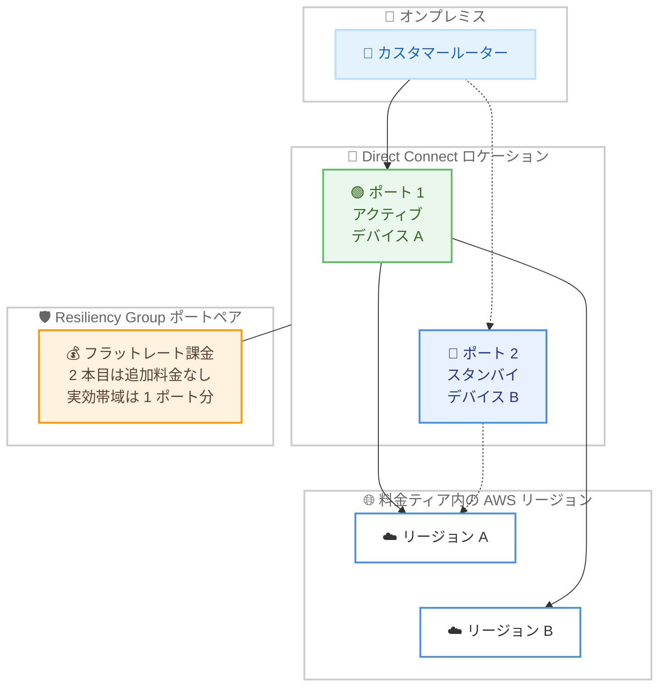

# AWS Direct Connect - 専用接続向けフラットレート料金

**リリース日**: 2026 年 9 月 15 日
**サービス**: AWS Direct Connect
**機能**: 専用接続 (Dedicated Connection) 向けフラットレート料金

📊 [このアップデートのインフォグラフィックを見る](https://takech9203.github.io/aws-news-summary/20260915-aws-direct-connect-announces-flat-rate-pricing.html)

## 概要

AWS Direct Connect が、10 Gbps および 100 Gbps の専用接続 (Dedicated Connection) 向けに、新しい課金モデルであるフラットレート料金を発表しました。選択した料金ティア内のデータ転送 (DTO: Data Transfer Out) 料金が固定月額料金に含まれるため、従量課金では予測が難しかった月額コストを事前に確定できます。料金は接続の帯域幅と、接続対象の地理的範囲を定める 5 つの料金ティア (同一メトロからグローバルまで) によって決まります。

あわせて「ポートペア」という新しい概念が導入されました。ポートペアは、異なるデバイスまたは異なるロケーションに配置された 2 つの専用接続で構成され、同じ帯域幅と料金ティアを共有します。一方の接続がトラフィックを処理し、もう一方が冗長化のためのスタンバイとして機能します。2 本目の冗長接続は追加料金なしで含まれるため、デフォルトで回復性の高いアーキテクチャを構築できます。

このアップデートは、ネットワークアーキテクト、エンタープライズ IT チーム、そして予測可能なネットワーク予算を必要とする FinOps 担当者を対象としています。課金モードは接続ごとに設定でき、従量課金 (pay-as-you-go) とフラットレートをいつでも切り替え可能です。

**アップデート前の課題**

- 以前はポート時間料金に加えて GB 単位の DTO 料金が発生し、トラフィック量が多いワークロードでは月額コストの予測が困難だった
- 大量のデータ転送を行う場合、月ごとの請求額が変動し、ネットワーク予算の策定が難しかった
- 冗長構成を組む場合、2 本目の接続にも同額のポート料金が発生し、回復性確保のコストが 2 倍になっていた

**アップデート後の改善**

- 選択した料金ティア内の DTO 料金が固定月額料金に含まれ、コストが予測可能になった
- ポートペアにより、冗長用の 2 本目の接続が追加料金なしで含まれ、デフォルトで回復性の高い構成を実現できるようになった
- 課金モードは接続ごとに設定でき、従量課金とフラットレートを切り替えられるようになった

## アーキテクチャ図



ポートペアは異なるデバイスまたはロケーションに配置された 2 つの専用接続で構成され、Resiliency Group によってペアとして管理されます。選択した料金ティア内のリージョンへの DTO 料金は固定料金に含まれます。

## サービスアップデートの詳細

### 主要機能

1. **フラットレート課金モード**
   - 帯域幅と料金ティアに基づく固定時間料金 (1 時間単位で課金、端数は切り上げ)
   - 選択した料金ティア内のリージョンとの間の DTO 料金が固定料金に含まれる
   - プライベートトラフィックとパブリックトラフィックの両方が対象
   - 既存の従量課金モデルと並行して提供され、接続ごとに選択可能

2. **5 つの地理的料金ティア**
   - ティアは「類似した地理的距離を持つデータ転送パスのグループ」として定義される
   - 同一メトロ (Tier 1) からグローバルカバレッジ (Tier 5) までの 5 段階
   - 上位ティアは下位ティアのカバー範囲をすべて含む階層構造 (Tier 1 が最安、Tier 5 が最高額)
   - ティアは接続ごとに設定する

3. **ポートペアと Resiliency Group**
   - 異なるデバイスまたはロケーション上の 2 つの専用接続で構成され、2 本目のポートは追加料金なし
   - Resiliency Group という論理グループに 2 つの適格な接続を追加すると、AWS が自動的にポートペアとしてマッチング
   - 両方のポートが同時にトラフィックを転送できるが、実効帯域は 1 ポート分 (10 Gbps ポートペアの実効帯域は 10 Gbps であり 20 Gbps ではない)
   - ロケーションをまたいだペアリングも可能で、デバイス障害だけでなくロケーション全体の障害からも保護できる

4. **単一接続でのフラットレート利用**
   - Resiliency Group に追加せず、単一接続にフラットレート課金を設定することも可能
   - AWS Site-to-Site VPN など自前の冗長化手段を用意する場合や、2 本の接続をそれぞれフルバンド幅で独立運用したい場合に有効
   - 単一接続でも同じ帯域幅・ティアのポートペアと同額 (コスト削減にはならない点に注意)

5. **課金モードの切り替え**
   - 接続ごとに従量課金とフラットレートをいつでも切り替え可能
   - 切り替え回数は 6 か月間のローリング期間で接続あたり 3 回まで
   - 既存の従量課金接続をフラットレートに変換し、Resiliency Group に追加してポートペア化することも可能

## 技術仕様

### フラットレート課金の仕様

| 項目 | 詳細 |
|------|------|
| 対象接続タイプ | 専用接続 (Dedicated Connection) のみ。ホスト型接続は対象外 |
| 対象帯域幅 | 10 Gbps および 100 Gbps |
| 課金単位 | 1 時間単位 (端数は切り上げ) |
| 料金ティア | Tier 1〜5 の 5 段階。上位ティアは下位ティアの範囲を包含 |
| DTO 料金 | 選択ティア内のリージョンとの間は追加料金なし。ティア外は標準 DTO 料金 |
| 除外トラフィック | Transit および AWS SiteLink のトラフィックは全ティアで対象外 (標準料金を適用) |
| ポートペアの実効帯域 | 1 ポート分 (例: 10 Gbps ポートペア = 10 Gbps) |
| 課金モード切り替え | 6 か月間のローリング期間で接続あたり 3 回まで |
| 同一ロケーションの制約 | 同一アカウント・同一ロケーション内の全接続は同じ課金モードを使用する必要あり |
| LAG の制約 | LAG 内の全メンバーは同じ課金モードを使用。Resiliency Group では LAG は 1 接続として扱われる |

### API 変更履歴

| 日付 | サービス | 変更内容 |
|------|----------|----------|
| 2026/09/15 | [directconnect](https://awsapichanges.com/archive/changes/4cd222-directconnect.html) | 9 new 16 updated api methods - Resiliency Group 関連 API (`CreateResiliencyGroup`、`GetResiliencyGroup`、`ListResiliencyGroups`、`UpdateResiliencyGroup`、`DeleteResiliencyGroup`、`AssociateConnectionsToResiliencyGroup`、`DisassociateConnectionsFromResiliencyGroup`、`ListResiliencyGroupAssociations`) と課金モード変更 API (`UpdateConnectionsBillingMode`) を追加。`CreateConnection`、`CreateLag`、`DescribeConnections` など既存 API も更新 |

## 設定方法

### 前提条件

1. AWS アカウントと Direct Connect を操作できる IAM 権限があること
2. 対象の Direct Connect ロケーションで 10 Gbps または 100 Gbps の専用接続を作成できること
3. トラフィックの送信元リージョンとポートのロケーションから適切な料金ティアを選定していること

### 手順

#### ステップ 1: Resiliency Group の作成

```bash
aws directconnect create-resiliency-group \
  --resiliency-group-name my-flat-rate-group
```

ポートペアを構成するための Resiliency Group を作成します。コンソールの接続作成ウィザードでは、回復性モデルの選択時に新規作成または既存グループへの追加を選択できます。

#### ステップ 2: フラットレート課金の専用接続を作成

```bash
aws directconnect create-connection \
  --location "EqDC2" \
  --bandwidth "10Gbps" \
  --connection-name "flat-rate-connection-1"
```

Direct Connect ロケーション、帯域幅、課金モード (フラットレート)、料金ティアを指定して専用接続を作成します。帯域幅は作成後に変更できないため、異なる帯域幅が必要な場合は新しい接続を作成する必要があります。同じ手順で 2 本目の接続を別のデバイスまたはロケーションに作成します。

#### ステップ 3: 接続を Resiliency Group に関連付け

```bash
aws directconnect associate-connections-to-resiliency-group \
  --resiliency-group-id <resiliency-group-id> \
  --connection-ids <connection-id-1> <connection-id-2>
```

2 つの接続を Resiliency Group に関連付けます。同じ課金モード・料金ティア・ポート速度を持つ異なるデバイス上の 2 接続を、AWS が自動的にポートペアとしてマッチングします。ペアが成立すると、各接続の課金モードが更新されます (例: `PortPairFlatRateTier2`)。

#### ステップ 4: 既存接続の課金モード変更 (任意)

```bash
aws directconnect update-connections-billing-mode \
  --connection-ids <connection-id>
```

既存の従量課金接続をフラットレートに変換します。Resiliency Group に追加しない場合は、単一のフラットレート接続として扱われます。切り替えは 6 か月間で 3 回までの制限があるため、計画的に実行してください。

## メリット

### ビジネス面

- **コストの予測可能性**: 月額料金が固定されるため、トラフィック量の変動に左右されずネットワーク予算を策定できる
- **冗長化コストの削減**: ポートペアの 2 本目の接続が追加料金なしで含まれるため、従来 2 本分のポート料金が必要だった冗長構成のコストを大幅に削減できる
- **FinOps の簡素化**: GB 単位の DTO 料金の追跡や予測が不要になり、請求の分析・管理が容易になる

### 技術面

- **デフォルトで回復性の高い構成**: ポートペアにより、デバイス障害やメンテナンス時にも接続が維持される構成を標準で実現できる
- **ロケーションをまたぐ冗長化**: ポートペアは異なるロケーション間でも構成でき、ロケーション全体の障害にも対応できる
- **柔軟な課金モード管理**: 接続ごとに課金モードを設定でき、ワークロードの特性に応じて従量課金と使い分けられる

## デメリット・制約事項

### 制限事項

- 対象は専用接続のみで、Direct Connect パートナー経由のホスト型接続は利用できない
- 対象帯域幅は 10 Gbps と 100 Gbps のみ (1 Gbps などは対象外)
- 課金モードの切り替えは 6 か月間のローリング期間で接続あたり 3 回まで
- 同一アカウント・同一ロケーション内の全接続は同じ課金モードを使用する必要がある (混在させるには別アカウントが必要)
- Transit および AWS SiteLink のトラフィックは全ティアで対象外となり、標準料金が適用される
- 中国リージョンでは利用できない

### 考慮すべき点

- ポートペアの実効帯域は 1 ポート分であり、2 本目のポートはスループットを追加しない。20 Gbps が必要な場合は 10 Gbps ポートペアを 2 組プロビジョニングする必要がある
- 選択ティア外のリージョンとのトラフィックには標準 DTO 料金が発生する。Direct Connect Gateway や AWS Cloud WAN などマルチリージョンリソースを接続する場合は、ティア外リージョンへのトラフィックが発生しないかティア選定時に確認が必要
- 低トラフィックのパスには下位ティア + 標準料金、全パスをカバーするには上位ティアという料金トレードオフの検討が必要
- トラフィック量が少ないワークロードでは、従量課金の方が安価になる可能性がある

## ユースケース

### ユースケース 1: 大容量データ転送ワークロードのコスト固定化

**シナリオ**: メディア企業がオンプレミスと AWS の間で毎月数百 TB のデータを転送しており、DTO 料金が高額かつ月ごとに変動するため予算管理が困難

**実装例**:
```
1. トラフィックの大部分が単一リージョン宛てであることを確認
2. 該当リージョンをカバーする Tier 1 の 100 Gbps ポートペアを作成
3. 既存の従量課金接続からトラフィックを移行し、課金モードを切り替え
```

**効果**: DTO 料金が固定料金に含まれ、転送量が増加しても月額コストが変わらないため、予算超過のリスクを排除できる

### ユースケース 2: 追加コストなしでの冗長構成の標準化

**シナリオ**: 金融機関が可用性要件を満たすために Direct Connect の冗長構成を必須としているが、2 本分のポート料金が負担になっている

**実装例**:
```
1. Resiliency Group を作成
2. 異なるロケーションに 10 Gbps のフラットレート接続を 2 本作成
3. 両接続を Resiliency Group に関連付けてポートペアを構成
```

**効果**: 2 本目の接続が追加料金なしで含まれるため、従来の約半分のポートコストでロケーション障害にも耐える高可用性構成を実現できる

### ユースケース 3: 単一接続の高利用率運用と VPN バックアップ

**シナリオ**: コスト最適化を重視する企業が、1 本の接続を高い利用率で運用し、バックアップには AWS Site-to-Site VPN を使用したい

**実装例**:
```
1. 10 Gbps のフラットレート接続を 1 本作成 (Resiliency Group には追加しない)
2. バックアップ経路として Site-to-Site VPN を構成
3. BGP 設定で Direct Connect を優先経路、VPN をバックアップ経路に設定
```

**効果**: 単一接続のフルバンド幅を DTO 料金の心配なく活用しつつ、VPN による冗長化で回復性を確保できる

## 料金

フラットレート料金は、接続の帯域幅 (10 Gbps または 100 Gbps) と料金ティア (Tier 1〜5) に基づく固定時間料金です。課金は 1 時間単位 (端数は切り上げ) で行われます。

**固定料金に含まれるもの**

- ポート時間料金 (ポートペアの場合は 2 本目のポートも含む)
- 選択した料金ティア内のリージョンとの間の DTO 料金 (プライベート・パブリックトラフィックの両方)

**固定料金に含まれないもの**

- 選択ティア外のリージョンとの間のトラフィック (標準 DTO 料金を適用)
- Transit および AWS SiteLink のトラフィック (全ティアで対象外)

**料金ティアの考え方**

- Tier 1 (同一メトロ、最安) から Tier 5 (グローバルカバレッジ、最高額) までの 5 段階
- 上位ティアは下位ティアがカバーするリージョンをすべて含む
- ティアの選定は、VPC トラフィックの送信元リージョンとポートの Direct Connect ロケーションの組み合わせで決まる

### 料金例

| 構成 | 時間料金 | 月額料金 (730 時間換算) |
|--------|------------------|------------------|
| 10 Gbps ポートペア、Tier 1 (Ashburn ポート、us-east-1 宛てトラフィック) | 10.96 USD | 約 8,000 USD |
| 100 Gbps ポートペア、Tier 3 (San Francisco ポート、us-east-1 と eu-central-1 宛てトラフィック) | 219.18 USD | 約 160,000 USD |

単一のフラットレート接続は、同じ帯域幅・ティアのポートペアと同額です。掲載されていない帯域幅とティアの組み合わせについては、AWS のアカウントチームへの問い合わせが案内されています。最新の料金は [Direct Connect フラットレート料金ページ](https://aws.amazon.com/directconnect/pricing/flat-rate/) を参照してください。

## 利用可能リージョン

中国リージョンを除くすべての商用 AWS リージョンの、すべての Direct Connect ロケーションで利用可能です。

## 関連サービス・機能

- **AWS Direct Connect Gateway**: 複数リージョンの VPC への接続を集約する。マルチリージョン構成ではティア外リージョンへのトラフィックが発生し得るため、ティア選定時の確認が必要
- **AWS Cloud WAN**: グローバルネットワークの構築・管理サービス。Direct Connect と組み合わせる場合、フラットレートのティアカバレッジの確認が必要
- **AWS Site-to-Site VPN**: 単一のフラットレート接続を運用する場合のバックアップ経路として利用できる
- **Link Aggregation Group (LAG)**: 複数接続の帯域集約。LAG 内の全メンバーは同じ課金モードを使用する必要があり、Resiliency Group では 1 接続として扱われる

## 参考リンク

- 📊 [インフォグラフィック](https://takech9203.github.io/aws-news-summary/20260915-aws-direct-connect-announces-flat-rate-pricing.html)
- [公式発表 (What's New)](https://aws.amazon.com/about-aws/whats-new/2026/09/aws-direct-connect-announces-flat-rate-pricing/)
- [ドキュメント: Flat-rate billing for dedicated connections](https://docs.aws.amazon.com/directconnect/latest/UserGuide/flat-rate-connections.html)
- [ドキュメント: Direct Connect Pricing Guide - Flat-rate](https://docs.aws.amazon.com/directconnect/latest/PricingGuide/pricing-flat-rate.html)
- [料金ページ: Direct Connect Flat-Rate Pricing](https://aws.amazon.com/directconnect/pricing/flat-rate/)

## まとめ

AWS Direct Connect のフラットレート料金は、これまで予測が難しかった DTO コストを固定化し、追加料金なしの冗長ポートによってコストと回復性の両面で大きな改善をもたらすアップデートです。大容量データ転送を行うワークロードや冗長構成を必須とする環境では、現在の DTO コストと料金ティアを比較し、フラットレートへの切り替えを検討することを推奨します。切り替え回数の制限 (6 か月で 3 回) があるため、事前のトラフィック分析とティア選定を十分に行ってください。
