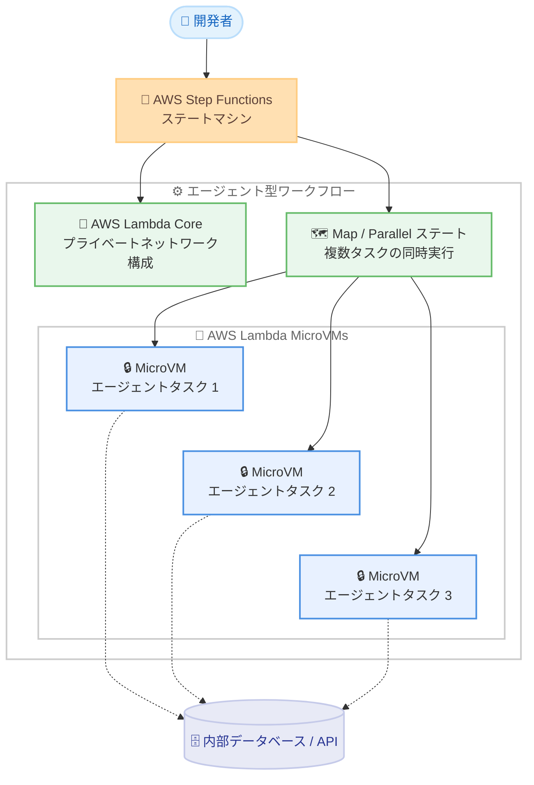

# AWS Step Functions - 新しい AWS サービス統合の自動追加 (AWS Lambda MicroVMs から開始)

**リリース日**: 2026 年 9 月 15 日
**サービス**: AWS Step Functions
**機能**: AWS SDK サービス統合の自動追加 (AWS Lambda MicroVMs、AWS Lambda Core ほか)

📊 [このアップデートのインフォグラフィックを見る](https://takech9203.github.io/aws-news-summary/20260915-aws-step-functions-integrations.html)

## 概要

AWS Step Functions が、新しくリリースされた AWS サービスおよび機能の AWS SDK 統合を、リリースから数週間以内に自動的に追加するようになりました。第一弾として AWS Lambda MicroVMs、AWS Lambda Core などの統合が追加されています。これにより、ユーザーは手動の統合アップデートを待つことなく、最新の AWS サービスをワークフローからオーケストレーションできます。

Step Functions は 220 以上の AWS サービスをオーケストレーションできるビジュアルワークフローサービスであり、大規模な分散アプリケーションの構築に使用されています。今回のアップデートにより、Lambda MicroVMs を利用したエージェント型ワークフローを、独自の調整コードなしで構築できるようになります。あわせて AWS Partner Central Revenue Measurement、AWS Resilience Hub V2、AWS Support Authorization、Amazon SageMaker Job Runtime の統合も追加されています。

また、プロセス面の変更として、今後は新しいサービスが設定不要で自動的に統合として追加され、AWS は SDK 統合の更新について個別の What's New 投稿を公開しない方針となります。

**アップデート前の課題**

このアップデート以前に存在していた課題や制限は以下のとおりです。

- 新しい AWS サービスがリリースされても、Step Functions の SDK 統合として利用可能になるまで待つ必要があった
- 統合が提供されるまでの間、Lambda 関数などを介した回避策や独自の調整コードが必要だった
- エージェント型ワークフローで隔離された実行環境を扱う場合、起動・リトライ・終了の管理を自前で実装する必要があった

**アップデート後の改善**

今回のアップデートにより可能になったことは以下のとおりです。

- 新しい AWS サービスの SDK 統合が、リリースから数週間以内に自動的に Step Functions へ追加されるようになった
- Lambda MicroVMs を Step Functions から直接起動し、エージェントタスクごとに隔離されたセキュアな実行環境を利用できるようになった
- 環境の起動失敗時の組み込みリトライ、タスク完了時の環境の自動終了が利用できるようになった
- 同一ワークフロー内で AWS Lambda Core により、MicroVM 環境が内部データベースや API に到達するためのプライベートネットワークを構成できるようになった

## アーキテクチャ図



Step Functions が Lambda MicroVMs をエージェントタスクごとに起動し、Map / Parallel ステートで複数タスクを同時実行する構成です。Lambda Core により MicroVM 環境から内部データベースや API へのプライベートネットワーク接続を同一ワークフロー内で構成できます。

## サービスアップデートの詳細

### 主要機能

1. **新規 AWS サービス統合の自動追加**
   - 新しくリリースされた AWS サービスや機能の SDK 統合が、リリースから数週間以内に Step Functions へ自動的に追加される
   - ユーザー側の設定は不要で、新しいサービスが自動的に統合として利用可能になる
   - 今後、SDK 統合の更新に関する個別の What's New 投稿は公開されない (更新はドキュメントの統合リリース履歴で確認)

2. **AWS Lambda MicroVMs 統合**
   - エージェントタスクごとに隔離されたセキュアな実行環境を Step Functions から起動できる
   - 環境の起動に失敗した場合の組み込みリトライを利用できる
   - Parallel / Map ステートにより複数タスクを同時実行でき、タスク完了時に環境は自動的に終了する

3. **AWS Lambda Core 統合**
   - MicroVM 環境が内部データベースや API に到達するために必要なプライベートネットワークを構成できる
   - MicroVM の起動とネットワーク構成を同一ワークフロー内で完結できる

4. **その他の新規統合**
   - AWS Partner Central Revenue Measurement
   - AWS Resilience Hub V2
   - AWS Support Authorization
   - Amazon SageMaker Job Runtime

## 技術仕様

### 統合の仕組み

| 項目 | 詳細 |
|------|------|
| 統合方式 | AWS SDK サービス統合 (Task ステートから対象サービスの API を直接呼び出し) |
| 追加タイミング | 新サービスのリリースから数週間以内に自動追加 |
| ユーザー側の設定 | 不要 |
| 更新情報の確認方法 | ドキュメントの統合リリース履歴ページ |
| 対応サービス数 | 220 以上の AWS サービス |

### Task ステートの記述例

AWS SDK 統合では、Task ステートの `Resource` フィールドに `arn:aws:states:::aws-sdk:{serviceName}:{apiAction}` 形式でサービス名と API アクションを指定します。利用可能なサービス名と API アクションは [サポートされている AWS SDK サービス統合](https://docs.aws.amazon.com/step-functions/latest/dg/supported-services-awssdk.html) で確認してください。

```json
{
  "Type": "Task",
  "Resource": "arn:aws:states:::aws-sdk:{serviceName}:{apiAction}",
  "Parameters": {
    "...": "対象 API のリクエストパラメータ"
  }
}
```

## 設定方法

### 前提条件

1. AWS Step Functions のステートマシンを作成できる IAM 権限があること
2. ステートマシンの実行ロールに、呼び出す対象サービスの API アクションを許可する IAM ポリシーが付与されていること
3. 対象サービス (例: AWS Lambda MicroVMs) が利用するリージョンで提供されていること

### 手順

#### ステップ 1: 利用可能な統合の確認

ドキュメントの [サポートされている AWS SDK サービス統合](https://docs.aws.amazon.com/step-functions/latest/dg/supported-services-awssdk.html) および [統合リリース履歴](https://docs.aws.amazon.com/step-functions/latest/dg/awssdk-release-history.html) で、利用したいサービスの統合が追加されているかを確認します。今後は What's New 投稿ではなくこのページが更新情報の確認先となります。

#### ステップ 2: ステートマシンの定義

Workflow Studio または ASL (Amazon States Language) で、Task ステートの `Resource` に AWS SDK 統合の ARN を指定してステートマシンを定義します。複数のエージェントタスクを同時実行する場合は Map または Parallel ステートを使用します。

#### ステップ 3: IAM ロールの設定と実行

```bash
# ステートマシンの実行例
aws stepfunctions start-execution \
  --state-machine-arn arn:aws:states:ap-northeast-1:123456789012:stateMachine:MyAgentWorkflow \
  --input '{"task": "example"}'
```

ステートマシンの実行ロールに対象サービスの API を許可するポリシーを付与した上で、ステートマシンを実行します。上記コマンドは指定したステートマシンの実行を入力データ付きで開始します。

## メリット

### ビジネス面

- **最新サービスの即時活用**: 新しい AWS サービスをリリース後数週間以内にワークフローへ組み込めるため、新機能を活用したソリューションを迅速に市場投入できる
- **開発コストの削減**: 統合提供までの回避策や独自の調整コードの実装・保守が不要になる
- **運用負荷の軽減**: MicroVM 環境の起動リトライや自動終了が組み込みで提供され、環境管理の運用負荷が減る

### 技術面

- **設定不要の統合追加**: ユーザー側の設定変更なしで新しいサービス統合が利用可能になる
- **エージェントワークフローの簡素化**: 隔離された実行環境の起動・並列実行・終了を Step Functions のステート定義だけで表現できる
- **ネットワーク構成の一体化**: Lambda Core により、プライベートネットワークの構成を同一ワークフロー内で完結できる

## デメリット・制約事項

### 制限事項

- 統合の追加は新サービスのリリースから「数週間以内」であり、リリース当日から利用できるとは限らない
- 特定のサービスおよび API アクションの利用可否は、対象サービスのリージョン提供状況に依存する
- 今後 SDK 統合の更新は What's New 投稿として公開されないため、更新情報はドキュメントの統合リリース履歴で確認する必要がある

### 考慮すべき点

- 新しい統合を利用する際は、ステートマシンの実行ロールに対象サービスの API アクションを許可する IAM ポリシーの追加が必要
- 自動追加された統合を本番ワークフローに組み込む前に、対象 API の入出力仕様をドキュメントで確認することを推奨

## ユースケース

### ユースケース 1: エージェント型 AI ワークフローのオーケストレーション

**シナリオ**: 複数の AI エージェントタスクをそれぞれ隔離された環境で安全に実行し、結果を集約したい。

**実装例**:
```
Map ステートで入力配列の各エージェントタスクに対して Lambda MicroVM を起動し、
タスク完了後に環境を自動終了。起動失敗時は組み込みリトライで再試行。
```

**効果**: 独自の調整コードなしで、タスクごとに隔離されたセキュアな実行環境を利用したエージェントワークフローを構築できます。

### ユースケース 2: 内部システムと連携するワークフロー

**シナリオ**: MicroVM 内のタスクから、社内のプライベートなデータベースや API にアクセスする必要がある。

**実装例**:
```
ワークフローの前段で Lambda Core によりプライベートネットワークを構成し、
後続の MicroVM タスクから内部データベースや API へ接続。
```

**効果**: ネットワーク構成と実行環境の起動を同一ワークフロー内で完結でき、構成管理がシンプルになります。

### ユースケース 3: 新サービスを利用したワークフローの迅速な構築

**シナリオ**: リリースされたばかりの AWS サービス (例: Amazon SageMaker Job Runtime) をワークフローに組み込みたい。

**実装例**:
```
統合リリース履歴で対象サービスの統合追加を確認し、
Task ステートの Resource に aws-sdk 統合の ARN を指定して呼び出す。
```

**効果**: 手動の統合アップデートを待つことなく、最新サービスを含むワークフローを迅速に構築できます。

## 料金

今回の発表に料金に関する記載はありません。Step Functions の状態遷移および対象サービスの利用に応じた通常の料金が適用されます。詳細は [AWS Step Functions の料金ページ](https://aws.amazon.com/step-functions/pricing/) を確認してください。

## 利用可能リージョン

AWS Step Functions が提供されているすべての AWS リージョンで一般提供されています。ただし、特定のサービスおよび API アクションの利用可否は、対象サービスのリージョン提供状況に依存します。

## 関連サービス・機能

- **AWS Lambda MicroVMs**: エージェントタスクごとに隔離されたセキュアな実行環境を提供。今回の統合により Step Functions から直接起動可能
- **AWS Lambda Core**: MicroVM 環境が内部リソースへ到達するためのプライベートネットワークを構成
- **Amazon SageMaker Job Runtime**: 今回あわせて統合が追加されたサービスの 1 つ
- **AWS Resilience Hub V2 / AWS Support Authorization / AWS Partner Central Revenue Measurement**: 今回あわせて統合が追加されたサービス

## 参考リンク

- 📊 [インフォグラフィック](https://takech9203.github.io/aws-news-summary/20260915-aws-step-functions-integrations.html)
- [公式発表 (What's New)](https://aws.amazon.com/about-aws/whats-new/2026/06/aws-step-functions-integrations/)
- [AWS Step Functions 製品ページ](https://aws.amazon.com/step-functions/)
- [開発者ガイド - サービス統合](https://docs.aws.amazon.com/step-functions/latest/dg/integrate-services.html)
- [サポートされている AWS SDK サービス統合](https://docs.aws.amazon.com/step-functions/latest/dg/supported-services-awssdk.html)
- [統合リリース履歴](https://docs.aws.amazon.com/step-functions/latest/dg/awssdk-release-history.html)

## まとめ

Step Functions の新しい AWS サービス統合が自動追加される仕組みに変わり、最新サービスをリリース後数週間以内にワークフローへ組み込めるようになりました。特に AWS Lambda MicroVMs と Lambda Core の統合により、エージェント型ワークフローを独自の調整コードなしで構築できます。今後 SDK 統合の更新は What's New では告知されないため、ドキュメントの統合リリース履歴を定期的に確認することを推奨します。
