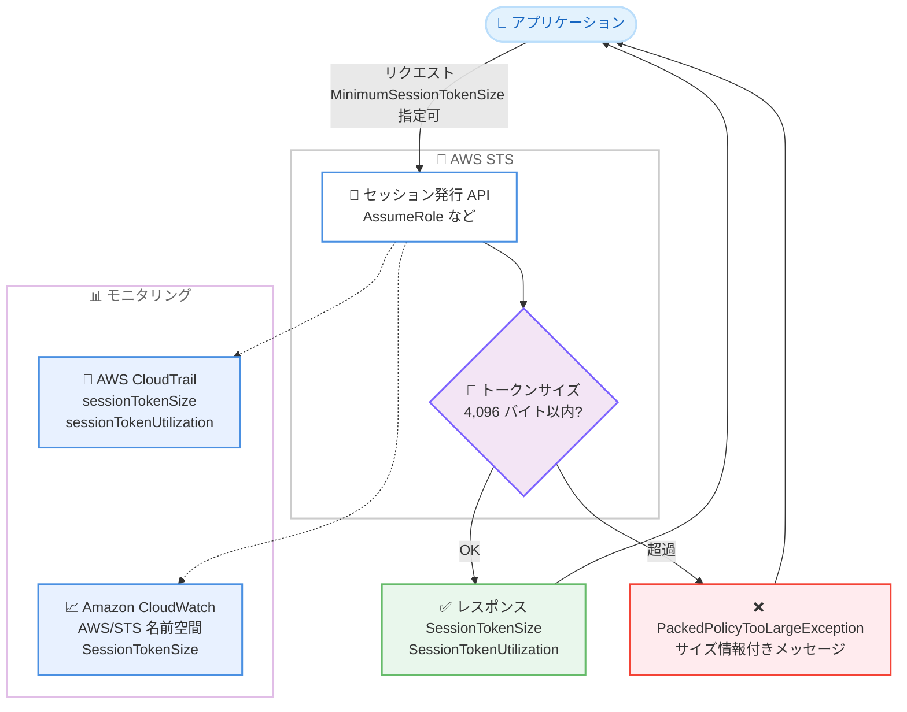

# AWS STS - セッショントークンサイズ制限の簡素化とサイズモニタリング機能

**リリース日**: 2026 年 9 月 15 日
**サービス**: AWS Security Token Service (AWS STS)
**機能**: セッショントークンサイズ制限の統一とセッショントークンサイズモニタリング

📊 [このアップデートのインフォグラフィックを見る](https://takech9203.github.io/aws-news-summary/20260915-aws-sts.html)

## 概要

AWS Security Token Service (AWS STS) は、セッショントークンのサイズ制限を簡素化し、セッショントークンサイズをモニタリングする機能を追加しました。従来、STS はセッショントークン自体のサイズ制限に加えて、インラインポリシー、マネージドポリシー、セッションタグなどの渡されるパラメータに対する「パックドポリシー」サイズ制限を個別に維持していました。今回のアップデートにより、これらの制限は「組み立てられたセッショントークン全体が 4,096 バイトに収まること」という単一の制限に統一され、より大きなセッションポリシーとセッションタグの組み合わせを柔軟に利用できるようになりました。

また、STS の API レスポンスにセッショントークンのサイズと制限に対する使用率を示す要素が追加され、同じ情報が AWS CloudTrail に記録されるとともに、対応するメトリクスが Amazon CloudWatch に発行されるようになりました。さらに、新しいオプションの API パラメータ `MinimumSessionTokenSize` を使用して、最大 4,096 バイトまでの大きなセッショントークンを意図的に生成し、アプリケーションやインフラストラクチャが大きなトークンを処理できるかを検証できます。

このアップデートは、セッションポリシーやセッションタグを多用する ID フェデレーション環境や、マルチテナント SaaS で属性ベースのアクセス制御 (ABAC) を実装しているユーザーにとって特に重要です。なお、AWS Security Blog によると、4,096 バイトという上限は「現時点での最大値であり恒久的な上限ではない」とされており、耐量子署名やより豊富な監査メタデータへの対応などにより、将来的に拡大される可能性があります。

**アップデート前の課題**

- 以前はセッショントークン自体の制限と、セッションポリシーやセッションタグに対するパックドポリシー制限という 2 つの独立した制限が存在し、どちらに抵触しても同じ `PackedPolicyTooLargeException` が返されるため、原因の切り分けが困難だった
- 以前はセッショントークンの実際のサイズを確認する手段がなく、制限にどの程度近づいているかを把握できなかった
- 以前は大きなセッショントークンに対するアプリケーションやインフラストラクチャの耐性を、本番相当の条件で事前にテストする方法がなかった

**アップデート後の改善**

- 今回のアップデートにより、制限が「セッショントークン全体で 4,096 バイト」という単一の制限に統一され、より大きなセッションポリシーとセッションタグの組み合わせが利用可能になった
- 今回のアップデートにより、API レスポンス、CloudTrail ログ、CloudWatch メトリクスを通じてセッショントークンサイズと使用率を継続的にモニタリングできるようになった
- 今回のアップデートにより、`MinimumSessionTokenSize` パラメータで大きなトークンを生成し、システムの受け入れ可能なトークンサイズを事前に検証できるようになった
- エラーメッセージが改善され、`PackedPolicyTooLargeException` にトークンサイズと最大許容サイズがバイト単位で含まれるようになった (エラーハンドリングコードの変更は不要)

## アーキテクチャ図



セッション発行 API がトークンサイズを単一の 4,096 バイト制限で検証し、成功時はレスポンスにサイズ情報を含めて返却するとともに、CloudTrail と CloudWatch にサイズ情報を記録するフローを示しています。

## サービスアップデートの詳細

### 主要機能

1. **セッショントークンサイズ制限の統一**
   - 従来の「パックドポリシーサイズ制限」と「トークン全体の制限」という 2 つの制限を廃止し、「組み立てられたセッショントークンが 4,096 バイトに収まること」という単一の制限に統一
   - セッションポリシーとセッションタグのより大きな組み合わせが利用可能になり、従来失敗していたリクエストの一部が成功するようになる
   - 制限超過時の例外は従来と同じ `PackedPolicyTooLargeException` のため、既存のエラーハンドリングコードの変更は不要
   - エラーメッセージにトークンサイズと最大許容サイズがバイト単位で含まれるようになり、トラブルシューティングが容易に

2. **セッショントークンサイズのモニタリング**
   - API レスポンスに `SessionTokenSize` (バイト単位のサイズ) と `SessionTokenUtilization` (制限に対する使用率) が追加
   - 後方互換性のため `PackedPolicySize` フィールドは維持され、`SessionTokenUtilization` と同じ使用率を返却
   - CloudTrail のセッション発行イベントの `responseElements` に `sessionTokenSize`、`sessionTokenUtilization`、`packedPolicySize` が記録される
   - CloudWatch の `AWS/STS` 名前空間に `SessionTokenSize` と `SessionTokenMaxSize` メトリクスが発行される

3. **大きなトークンの生成によるテスト機能**
   - 新しいオプションパラメータ `MinimumSessionTokenSize` により、指定サイズ以上 (最大 4,096 バイト) にパディングされたトークンを生成可能
   - アプリケーション、ロードバランサー、プロキシ、データベースなどが大きなトークンを処理できるかを事前に検証できる
   - 最新の AWS SDK、AWS CLI、AWS Tools for PowerShell で利用可能

## 技術仕様

### 対象 API

| API | 用途 |
|------|------|
| `AssumeRole` | IAM ロールの引き受け |
| `AssumeRoleWithSAML` | SAML フェデレーションによるロールの引き受け |
| `AssumeRoleWithWebIdentity` | Web ID フェデレーションによるロールの引き受け |
| `GetSessionToken` | 一時的な認証情報の取得 |
| `GetFederationToken` | フェデレーションユーザー向け一時認証情報の取得 |

### モニタリング関連の要素

| 項目 | 詳細 |
|------|------|
| レスポンス要素 `SessionTokenSize` | セッショントークンのサイズ (バイト) |
| レスポンス要素 `SessionTokenUtilization` | 4,096 バイト制限に対する使用率 (%) |
| レスポンス要素 `PackedPolicySize` | 後方互換用。`SessionTokenUtilization` と同じ使用率を返却 |
| CloudWatch 名前空間 | `AWS/STS` |
| CloudWatch メトリクス | `SessionTokenSize`、`SessionTokenMaxSize` |
| CloudTrail 記録項目 | `responseElements` 内の `sessionTokenSize`、`sessionTokenUtilization`、`packedPolicySize` |
| テスト用パラメータ | `MinimumSessionTokenSize` (最大 4,096 バイト) |

### API変更履歴

| 日付 | サービス | 変更内容 |
|------|----------|----------|
| 2026/09/14 | [AWS Security Token Service](https://awsapichanges.com/archive/changes/7b8c33-sts.html) | 6 updated api methods - セッション発行 API へのサイズ情報レスポンス要素と `MinimumSessionTokenSize` パラメータの追加 |

## 設定方法

### 前提条件

1. AWS アカウントと STS を呼び出す IAM プリンシパル (追加の権限設定は不要)
2. レスポンスの新フィールドを参照する場合は最新の AWS SDK または AWS CLI
3. CloudWatch メトリクスや CloudTrail での確認は SDK の更新なしで利用可能

### 手順

#### ステップ1: 大きなトークンでの動作検証

```bash
aws sts assume-role \
  --role-arn arn:aws:iam::123456789012:role/MyRole \
  --role-session-name validation-test \
  --minimum-session-token-size 4096
```

`MinimumSessionTokenSize` パラメータで 4,096 バイトにパディングされたセッショントークンを生成し、アプリケーションやインフラストラクチャが最大サイズのトークンを処理できるかを検証します。システムがトークンを拒否または切り捨てる場合は、サイズを下げて許容範囲を特定し、可能な範囲でインフラストラクチャ側の制限を引き上げます。

#### ステップ2: レスポンスでのサイズ確認

```bash
aws sts assume-role \
  --role-arn arn:aws:iam::123456789012:role/MyRole \
  --role-session-name size-check \
  --query '{Size: SessionTokenSize, Utilization: SessionTokenUtilization}'
```

`AssumeRole` のレスポンスからセッショントークンのサイズ (バイト) と制限に対する使用率 (%) を取得します。使用率が高い場合は、セッションポリシーの簡素化やセッションタグの整理を検討します。

#### ステップ3: CloudWatch アラームの設定

```bash
aws cloudwatch put-metric-alarm \
  --alarm-name sts-session-token-size-alarm \
  --namespace AWS/STS \
  --metric-name SessionTokenSize \
  --statistic Maximum \
  --period 300 \
  --threshold 3500 \
  --comparison-operator GreaterThanThreshold \
  --evaluation-periods 1 \
  --alarm-actions arn:aws:sns:us-east-1:123456789012:security-alerts
```

`AWS/STS` 名前空間の `SessionTokenSize` メトリクスに対してアラームを作成し、トークンサイズがしきい値を超えた場合に通知します。AWS はしきい値として 4,096 バイトの上限値ではなく、ステップ 1 で検証した自社インフラストラクチャの許容サイズを基準にすることを推奨しています。

## メリット

### ビジネス面

- **フェデレーション設計の柔軟性向上**: セッションポリシーとセッションタグのより大きな組み合わせが利用できるため、マルチテナント SaaS や ABAC を活用したきめ細かいアクセス制御の設計余地が広がる
- **運用リスクの低減**: トークンサイズを継続的にモニタリングすることで、制限超過による認証エラーを未然に検知し、サービス停止を防止できる
- **移行コストが不要**: 既存のエラーハンドリングやワークフローを変更することなく、制限緩和の恩恵を自動的に受けられる

### 技術面

- **可観測性の向上**: API レスポンス、CloudTrail、CloudWatch の 3 つの手段でトークンサイズを把握でき、既存の監視基盤に容易に組み込める
- **事前検証が可能**: `MinimumSessionTokenSize` により、将来のトークンサイズ増大に対するシステムの耐性を本番相当の条件でテストできる
- **トラブルシューティングの改善**: エラーメッセージに実際のトークンサイズと上限が含まれるため、制限超過時の原因特定が迅速になる

## デメリット・制約事項

### 制限事項

- セッショントークン全体の上限は現時点で 4,096 バイトであり、これを超えるポリシーやタグの組み合わせは引き続き `PackedPolicyTooLargeException` となる
- レスポンスの新フィールド `SessionTokenSize` と `SessionTokenUtilization` を参照するには最新の AWS SDK / CLI が必要
- トークンの圧縮率は内容によって変動するため、入力パラメータの長さからトークンサイズを正確に見積もることはできない

### 考慮すべき点

- 4,096 バイトは恒久的な上限ではなく、耐量子署名や監査メタデータの拡充などにより将来増加する可能性があるため、上限値をハードコードしない設計が推奨される
- SDK が管理する認証情報は影響を受けないが、トークンを独自に保存・転送するシステム (ロードバランサー、プロキシ、キャッシュ、データベースの `varchar(2048)` カラムなど) は最大サイズのトークンを扱えるか監査が必要
- 過去に `PackedPolicyTooLargeException` への回避策 (ポリシーの分割など) を実装している場合、一部のリクエストが成功するようになるため回避策の見直しが有効

## ユースケース

### ユースケース1: マルチテナント SaaS での ABAC 実装の拡張

**シナリオ**: SaaS プロバイダーがテナントごとのアクセス制御にセッションタグを使用しており、従来はパックドポリシー制限によりタグ数やポリシーサイズを厳しく切り詰める必要があった。

**実装例**:
```bash
aws sts assume-role \
  --role-arn arn:aws:iam::123456789012:role/TenantAccessRole \
  --role-session-name tenant-session \
  --tags Key=TenantId,Value=tenant-a Key=Tier,Value=premium Key=Region,Value=apne1 \
  --policy file://tenant-session-policy.json
```

**効果**: 制限の統一により、より多くのセッションタグと詳細なセッションポリシーを組み合わせられるようになり、テナント分離の粒度を高められる。

### ユースケース2: トークンサイズの継続的なモニタリング

**シナリオ**: ID フェデレーション基盤の運用チームが、SAML アサーションに含まれる属性の増加に伴い、セッショントークンサイズが制限に近づいていないかを常時監視したい。

**実装例**:
```bash
aws cloudwatch get-metric-statistics \
  --namespace AWS/STS \
  --metric-name SessionTokenSize \
  --statistics Maximum \
  --start-time 2026-09-14T00:00:00Z \
  --end-time 2026-09-15T00:00:00Z \
  --period 3600
```

**効果**: トークンサイズの推移を可視化し、使用率が高まった時点でセッションポリシーやタグ設計を見直すことで、認証エラーの発生を未然に防げる。

### ユースケース3: 大きなトークンに対するインフラストラクチャの耐性テスト

**シナリオ**: 認証プロキシやセッション情報を保存するデータベースを運用しており、将来トークンサイズが増大した場合にシステムが正常に動作するかを事前に確認したい。

**実装例**:
```bash
# 最大サイズのトークンを生成して既存システムに通す
aws sts get-session-token \
  --minimum-session-token-size 4096
```

**効果**: 本番相当のサイズのトークンでエンドツーエンドの動作を確認でき、トークンの切り捨てや拒否が発生する箇所を事前に特定して修正できる。

## 料金

AWS STS の利用は無料であり、今回のアップデートによる追加料金は発生しません。CloudWatch メトリクスに対してアラームやダッシュボードを作成する場合は、CloudWatch の標準料金が適用されます。

## 利用可能リージョン

すべての AWS 商用リージョン、AWS GovCloud (US) リージョン、および AWS European Sovereign Cloud リージョンで利用可能です。

## 関連サービス・機能

- **AWS IAM**: セッションポリシーやセッションタグは IAM の一時的セキュリティ認証情報の仕組みの一部であり、今回の制限統一により設計の柔軟性が向上する
- **AWS CloudTrail**: セッション発行イベントにトークンサイズ情報が記録され、SDK の更新なしでサイズの監査が可能
- **Amazon CloudWatch**: `AWS/STS` 名前空間のメトリクスを使用して、トークンサイズのダッシュボード化やアラーム設定が可能
- **AWS IAM Identity Center**: フェデレーションによるロールセッションの発行時にセッショントークンが生成されるため、属性マッピングが多い環境ではサイズモニタリングが有効

## 参考リンク

- 📊 [インフォグラフィック](https://takech9203.github.io/aws-news-summary/20260915-aws-sts.html)
- [公式発表 (What's New)](https://aws.amazon.com/about-aws/whats-new/2026/09/aws-sts/)
- [AWS Security Blog - AWS STS simplifies session token size limits and adds session token size monitoring](https://aws.amazon.com/blogs/security/aws-sts-simplifies-session-token-size-limits-and-adds-session-token-size-monitoring/)
- [ドキュメント - 一時的セキュリティ認証情報のリクエスト (IAM ユーザーガイド)](https://docs.aws.amazon.com/IAM/latest/UserGuide/id_credentials_temp_request.html)
- [ドキュメント - AWS STS API リファレンス](https://docs.aws.amazon.com/STS/latest/APIReference/Welcome.html)

## まとめ

AWS STS のセッショントークンサイズ制限が単一の 4,096 バイト制限に統一され、サイズのモニタリングとテストの手段が整備されました。セッションポリシーやセッションタグを多用する環境では、過去の制限回避策の見直しと、`MinimumSessionTokenSize` を使用したインフラストラクチャの耐性テストを実施することを推奨します。また、トークンサイズは将来増加する可能性があるため、CloudWatch アラームによる継続的なモニタリングの導入が有効です。
