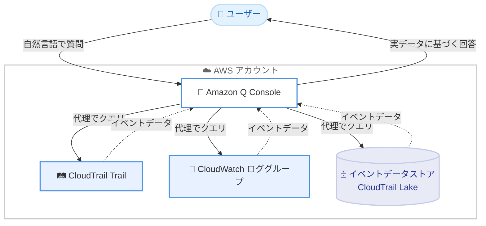

# AWS CloudTrail - Amazon Q Console による自然言語でのイベント分析

**リリース日**: 2026 年 9 月 15 日
**サービス**: AWS CloudTrail / Amazon Q
**機能**: Amazon Q Console 統合による自然言語でのアカウントアクティビティ調査

📊 [このアップデートのインフォグラフィックを見る](https://takech9203.github.io/aws-news-summary/20260915-cloudtrail-amazon-q-console.html)

## 概要

AWS CloudTrail が Amazon Q Console と統合され、自然言語でアカウントアクティビティを調査できるようになりました。これまで CloudTrail のイベント分析には SQL クエリの記述やログファイルの手動確認が必要でしたが、今回のアップデートにより、AWS マネジメントコンソール上の Amazon Q に質問するだけで、CloudTrail の設定確認、セキュリティ調査、運用トラブルシューティングを実行できます。

Amazon Q Console はユーザーに代わって trail、関連する CloudWatch ロググループ、イベントデータストアをクエリし、一般的なドキュメントベースの回答ではなく、実際のアカウントアクティビティに基づいた (grounded) 回答を返します。セキュリティ担当者、運用担当者、クラウド管理者など、CloudTrail のクエリ構文に習熟していないユーザーでも、迅速にイベント分析を行えることが大きな価値です。

**アップデート前の課題**

- CloudTrail イベントの分析には、CloudTrail Lake の SQL クエリ、CloudWatch Logs Insights のクエリ構文、または Athena のクエリの習得が必要だった
- セキュリティインシデントの初動調査 (誰が IAM ロールにアクセスしたか、VPC 設定が変更されたかなど) に時間がかかっていた
- 請求急増の原因特定やリソースの作成者/削除者の特定など、運用調査のたびにログを手動で確認する必要があった
- CloudTrail のログ記録カバレッジにギャップがないかの確認を、設定画面を横断して手動で行う必要があった

**アップデート後の改善**

- 自然言語の質問だけで、クエリを書かずにアカウントアクティビティを調査できるようになった
- trail、CloudWatch ロググループ、イベントデータストアを Amazon Q が代理でクエリし、実データに基づく回答を得られるようになった
- CloudTrail の設定確認 (trail の設定状況、ログ記録のギャップ、データイベントのソース確認) を対話形式で実行できるようになった
- セキュリティ調査と運用トラブルシューティングの初動時間を短縮できるようになった

## アーキテクチャ図



ユーザーが Amazon Q Console に自然言語で質問すると、Amazon Q がユーザーに代わって CloudTrail の trail、CloudWatch ロググループ、イベントデータストアをクエリし、実際のアカウントアクティビティに基づいた回答を返します。

## サービスアップデートの詳細

### 主要機能

1. **CloudTrail 設定の確認**
   - trail が正しく設定されているかを自然言語で確認可能
   - ログ記録カバレッジのギャップ (記録されていないリージョンやイベントタイプ) を特定
   - データイベントの記録対象ソース (S3、Lambda など) を確認

2. **セキュリティ調査**
   - 特定の IAM ロールに誰がアクセスしたかを質問形式で調査
   - VPC 設定に対して行われた変更の追跡
   - 過去 1 週間の不正アクセス試行の有無の確認

3. **運用トラブルシューティング**
   - リソースを作成/削除したユーザーの特定
   - エラーを発生させている API コールの分析
   - 特定の IP アドレスからのアクティビティの追跡
   - 請求急増の原因となったアクティビティの特定

4. **複数データソースの横断クエリ**
   - CloudTrail の trail に加えて、関連する CloudWatch ロググループ、CloudTrail Lake のイベントデータストアも Amazon Q がクエリ
   - 回答は一般的なドキュメント情報ではなく、実際のアカウントアクティビティに基づいて生成

## 技術仕様

### 対象データソース

| 項目 | 詳細 |
|------|------|
| CloudTrail Trail | trail に記録された管理イベント/データイベント |
| CloudWatch ロググループ | trail に関連付けられた CloudWatch Logs のロググループ |
| イベントデータストア | CloudTrail Lake のイベントデータストア |
| インターフェース | AWS マネジメントコンソール内の Amazon Q チャット |
| 入力形式 | 自然言語 (クエリ構文の知識は不要) |

## 設定方法

### 前提条件

1. AWS アカウントで CloudTrail が有効化されていること (trail またはイベントデータストアが存在すること)
2. Amazon Q Console がサポートされるリージョンを利用していること
3. 利用ユーザーに CloudTrail および Amazon Q の利用に必要な IAM 権限が付与されていること

### 手順

#### ステップ 1: AWS マネジメントコンソールで Amazon Q を開く

AWS マネジメントコンソール右側の Amazon Q アイコンを選択し、チャットパネルを開きます。追加のセットアップ作業は不要です。

#### ステップ 2: CloudTrail に関する質問を自然言語で入力する

```text
例:
- 「先週、production-admin ロールにアクセスしたのは誰ですか?」
- 「昨日 VPC の設定に加えられた変更を教えてください」
- 「この trail はすべてのリージョンでログを記録していますか?」
```

Amazon Q がユーザーに代わって trail、CloudWatch ロググループ、イベントデータストアをクエリし、実際のイベントデータに基づいた回答を返します。

#### ステップ 3: 回答をもとに追加調査を行う

回答に対してフォローアップの質問を続けることで、調査を深掘りできます。必要に応じて CloudTrail コンソールや CloudTrail Lake で詳細なクエリを実行します。

## メリット

### ビジネス面

- **調査時間の短縮**: セキュリティインシデントや運用問題の初動調査を自然言語で即座に開始でき、MTTR (平均復旧時間) の短縮に貢献
- **スキル要件の緩和**: SQL やクエリ構文の習得が不要になり、より多くのメンバーが CloudTrail データを活用可能
- **コスト調査の効率化**: 請求急増の原因特定を対話形式で行え、コスト管理の迅速化に貢献

### 技術面

- **実データに基づく回答**: 一般的なドキュメント回答ではなく、実際のアカウントアクティビティに基づいた回答を取得可能
- **複数データソースの統合クエリ**: trail、CloudWatch ロググループ、イベントデータストアを個別に調べる必要がない
- **追加セットアップ不要**: コンソールの Amazon Q からすぐに利用開始可能

## デメリット・制約事項

### 制限事項

- Amazon Q Console がサポートされる商用リージョンでのみ利用可能 (GovCloud や中国リージョンなどは対象外)
- クエリ対象は CloudTrail の trail、関連する CloudWatch ロググループ、イベントデータストアに限定される
- 自然言語による調査は初動調査に適しているが、複雑な相関分析には CloudTrail Lake の SQL クエリなど従来手法が引き続き有効

### 考慮すべき点

- Amazon Q がユーザーに代わってデータをクエリするため、利用ユーザーの IAM 権限設計 (最小権限の原則) を事前に確認することが望ましい
- 監査やコンプライアンス目的の正式な調査では、回答の根拠となるイベントを CloudTrail コンソールなどで裏付け確認することを推奨
- 組織の生成 AI 利用ポリシーとの整合性を確認する必要がある

## ユースケース

### ユースケース 1: セキュリティインシデントの初動調査

**シナリオ**: セキュリティチームが、特権 IAM ロールへの不審なアクセスの報告を受け、直近のアクセス状況を迅速に確認したい。

**実装例**:
```text
Amazon Q への質問:
「過去 7 日間に admin-role を引き受けたプリンシパルを一覧にしてください」
「その中に通常と異なる IP アドレスからのアクセスはありますか?」
```

**効果**: クエリを書かずに数分でアクセス状況を把握でき、インシデント対応の初動を大幅に短縮できます。

### ユースケース 2: リソース変更の原因特定

**シナリオ**: 運用チームが、本番環境のセキュリティグループ設定が変更されアプリケーションに障害が発生したため、変更者と変更内容を特定したい。

**実装例**:
```text
Amazon Q への質問:
「昨日 sg-0123456789 に対して行われた変更と、その実行者を教えてください」
「同じユーザーが他に変更したリソースはありますか?」
```

**効果**: 変更管理プロセスからの逸脱を素早く特定し、障害の根本原因分析と再発防止につなげられます。

### ユースケース 3: 請求急増の原因調査

**シナリオ**: クラウド管理者が、当月の請求額が急増したため、原因となったリソース作成アクティビティを特定したい。

**実装例**:
```text
Amazon Q への質問:
「今週、EC2 インスタンスを大量に起動したユーザーやロールはありますか?」
「そのアクティビティはどのリージョンで発生していますか?」
```

**効果**: コスト急増の原因となる API アクティビティを対話形式で特定し、迅速なコスト対策を実行できます。

## 料金

今回の発表では、この統合機能に固有の追加料金は言及されていません。Amazon Q および CloudTrail の利用料金の詳細は、各サービスの料金ページを確認してください。なお、クエリ対象となる CloudTrail Lake イベントデータストアや CloudWatch Logs には、それぞれのサービスの料金が適用されます。

## 利用可能リージョン

Amazon Q Console がサポートされるすべての AWS 商用リージョンで利用可能です。

## 関連サービス・機能

- **AWS CloudTrail Lake**: SQL ベースのイベント分析基盤。イベントデータストアが今回の統合のクエリ対象に含まれる
- **Amazon CloudWatch Logs**: trail に関連付けられたロググループが今回の統合のクエリ対象に含まれる
- **Amazon Q Developer**: AWS マネジメントコンソールでの Amazon Q チャット体験を提供する基盤サービス
- **AWS IAM**: セキュリティ調査の主要な対象であり、Amazon Q の利用権限管理にも関係する

## 参考リンク

- 📊 [インフォグラフィック](https://takech9203.github.io/aws-news-summary/20260915-cloudtrail-amazon-q-console.html)
- [公式発表 (What's New)](https://aws.amazon.com/about-aws/whats-new/2026/09/cloudtrail-amazon-q-console/)
- [ドキュメント (AWS CloudTrail ユーザーガイド)](https://docs.aws.amazon.com/awscloudtrail/latest/userguide/)
- [AWS CloudTrail 料金ページ](https://aws.amazon.com/cloudtrail/pricing/)

## まとめ

CloudTrail と Amazon Q Console の統合により、クエリ構文の知識がなくても自然言語でアカウントアクティビティを調査できるようになりました。セキュリティ調査や運用トラブルシューティングの初動時間を短縮できるため、コンソールの Amazon Q チャットから CloudTrail に関する質問を試し、チームの調査ワークフローへの組み込みを検討することを推奨します。
