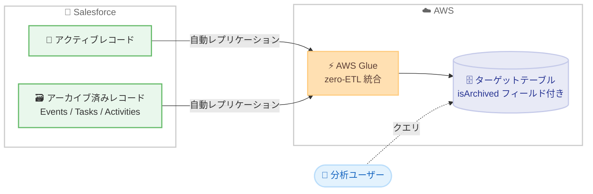

# AWS Glue - zero-ETL 統合による Salesforce アーカイブ済みレコードのキャプチャ

**リリース日**: 2026 年 9 月 15 日
**サービス**: AWS Glue
**機能**: zero-ETL 統合における Salesforce アーカイブ済みレコードの取り込み

📊 [このアップデートのインフォグラフィックを見る](https://takech9203.github.io/aws-news-summary/20260915-glue-zero-etl-archived-salesforce.html)

## 概要

AWS Glue の Salesforce 向け zero-ETL 統合が、アーカイブ済みレコードをターゲットテーブルに含められるようになりました。これにより、分析用途で Salesforce データの完全なコピーを保持できます。アーカイブ済みレコードは `isArchived` フィールドによって正確に識別・反映され、分析データが Salesforce ソースと同期された状態に保たれます。

この機能は、自動的にアーカイブされる大量データのエンティティ (Events、Tasks、Activities など) で特に有効です。これらのエンティティは Salesforce 側で一定期間経過後に自動アーカイブされるため、従来は分析基盤側でデータの欠落が発生しやすい領域でした。

既存の zero-ETL 統合に対しても自動的に適用され、再同期、再設定、スキーマ変更は不要です。既存のパイプラインは中断なく稼働を継続したまま、`isArchived` フィールドが自動的にバックフィルされます。

**アップデート前の課題**

- 以前は Salesforce 側で自動アーカイブされたレコード (Events、Tasks、Activities など) が zero-ETL 統合のターゲットテーブルに反映されず、分析データに欠落が生じていた
- 以前はアーカイブ済みデータを分析対象に含めるために、別途エクスポートやカスタム ETL パイプラインの構築が必要だった
- 以前は分析基盤側のデータと Salesforce ソースの完全な一致を保証することが困難だった

**アップデート後の改善**

- 今回のアップデートにより、アーカイブ済みレコードを含む Salesforce データの完全なコピーを分析基盤に保持できるようになった
- 今回のアップデートにより、アーカイブ済みレコードが `isArchived` フィールドで識別できるようになり、アクティブなレコードとの区別が容易になった
- 今回のアップデートにより、既存の統合では再同期や再設定なしで自動的にアーカイブ済みレコードのステータスがバックフィルされるようになった

## アーキテクチャ図



Salesforce のアクティブレコードとアーカイブ済みレコードの両方が zero-ETL 統合を通じてターゲットテーブルにレプリケートされ、アーカイブ済みレコードは `isArchived` フィールドで識別できます。

## サービスアップデートの詳細

### 主要機能

1. **アーカイブ済みレコードの自動キャプチャ**
   - Salesforce 側でアーカイブされたレコードが zero-ETL 統合のターゲットテーブルに含まれる
   - 自動アーカイブ対象となる大量データのエンティティ (Events、Tasks、Activities) で特に有効
   - 分析用途で Salesforce データの完全なコピーを保持できる

2. **isArchived フィールドによる識別**
   - アーカイブ済みレコードは `isArchived` フィールドで正確に識別・反映される
   - クエリ時にアクティブなレコードとアーカイブ済みレコードを容易に区別できる
   - 分析データが Salesforce ソースと同期された状態に保たれる

3. **既存統合への自動適用**
   - 新規統合では作成時点からアーカイブ済みレコードがキャプチャされる
   - 既存統合では AWS Glue がアーカイブ済みレコードのステータスを自動的にバックフィルする
   - 再同期、再設定、スキーマ変更は不要で、既存パイプラインは中断なく稼働を継続する

## 技術仕様

### 機能の適用条件

| 項目 | 詳細 |
|------|------|
| 対象 | AWS Glue の Salesforce 向け zero-ETL 統合 |
| 新規統合 | 統合の作成時点からアーカイブ済みレコードをキャプチャ |
| 既存統合 | 自動バックフィルにより適用 (再同期・再設定・スキーマ変更は不要) |
| 識別方法 | `isArchived` フィールド |
| 主な対象エンティティ | Events、Tasks、Activities などの自動アーカイブ対象エンティティ |
| ユーザー操作 | 不要 (自動適用) |

### API 変更履歴

| 日付 | サービス | 変更内容 |
|------|----------|----------|
| 2026/09/14 | [AWS Glue](https://awsapichanges.com/archive/changes/7b8c33-glue.html) | 1 new 3 updated api methods - 新 API `ListIntegrationTableProperties` の追加、`TargetTableConfig` への `IntegrationArn` の追加 (zero-ETL 統合関連の更新) |

なお、今回のアーカイブ済みレコードのキャプチャ機能自体は自動適用であり、ユーザー側での API 呼び出しや設定変更は不要です。

## 設定方法

### 前提条件

1. AWS Glue の Salesforce 向け zero-ETL 統合がサポートされているリージョンを利用していること
2. Salesforce への接続 (AWS Glue コネクション) が設定済みであること
3. 既存統合の場合は、追加の作業は不要 (自動適用)

### 手順

#### ステップ 1: 既存統合の確認

```bash
aws glue describe-integrations
```

既存の zero-ETL 統合の一覧と状態を確認します。既存統合ではアーカイブ済みレコードのステータスが自動的にバックフィルされるため、追加の操作は不要です。

#### ステップ 2: 新規統合の作成 (新たに統合を作成する場合)

```bash
aws glue create-integration \
  --integration-name salesforce-analytics-integration \
  --source-arn <Salesforce コネクションの ARN> \
  --target-arn <ターゲットの ARN>
```

Salesforce をソースとする zero-ETL 統合を作成します。新規統合では作成時点からアーカイブ済みレコードがキャプチャされます。

#### ステップ 3: ターゲットテーブルでのデータ確認

ターゲットテーブルに対して `isArchived` フィールドを含むクエリを実行し、アーカイブ済みレコードが取り込まれていることを確認します。

```sql
SELECT isArchived, COUNT(*)
FROM salesforce_tasks
GROUP BY isArchived;
```

アクティブなレコードとアーカイブ済みレコードの件数を集計し、データの完全性を確認します。

## メリット

### ビジネス面

- **分析の完全性向上**: アーカイブ済みレコードを含む Salesforce データの完全なコピーに基づいて、過去の営業活動やタスク履歴を含めた正確な分析が可能になる
- **運用コストの削減**: アーカイブ済みデータを取得するためのカスタムパイプラインや手動エクスポートが不要になる
- **移行作業ゼロ**: 既存統合に自動適用されるため、追加の導入コストなしで恩恵を受けられる

### 技術面

- **自動バックフィル**: 既存統合では再同期・再設定・スキーマ変更なしでアーカイブ済みレコードのステータスが反映される
- **明確なデータ識別**: `isArchived` フィールドにより、クエリレベルでアクティブ / アーカイブ済みレコードを柔軟にフィルタリングできる
- **パイプラインの継続稼働**: `isArchived` フィールドの反映中も既存パイプラインは中断なく稼働する

## デメリット・制約事項

### 制限事項

- 対象は AWS Glue の Salesforce 向け zero-ETL 統合であり、他のソースの zero-ETL 統合に関する言及はない
- Salesforce 向け zero-ETL 統合がサポートされているリージョンでのみ利用可能

### 考慮すべき点

- アーカイブ済みレコードが取り込まれることでターゲット側のデータ量が増加するため、既存のクエリでアクティブなレコードのみを対象としたい場合は `isArchived` フィールドでのフィルタリングを検討する必要がある
- 既存のダッシュボードや集計クエリがレコード件数に依存している場合、アーカイブ済みレコードの追加により集計結果が変化する可能性がある

## ユースケース

### ユースケース 1: 営業活動の長期トレンド分析

**シナリオ**: Salesforce の Tasks や Events は一定期間経過後に自動アーカイブされるため、従来は過去の営業活動データが分析基盤から欠落していた。年単位の営業活動トレンドを正確に把握したい。

**実装例**:
```sql
SELECT DATE_TRUNC('month', activityDate) AS month,
       COUNT(*) AS activity_count
FROM salesforce_tasks
GROUP BY 1
ORDER BY 1;
```

**効果**: アーカイブ済みレコードを含む完全なデータセットに基づき、過去にさかのぼった正確な営業活動のトレンド分析が可能になる。

### ユースケース 2: アクティブデータのみを対象とした既存レポートの維持

**シナリオ**: 既存のレポートはアクティブなレコードのみを前提としており、アーカイブ済みレコードの追加による集計結果の変化を避けたい。

**実装例**:
```sql
SELECT *
FROM salesforce_events
WHERE isArchived = false;
```

**効果**: `isArchived` フィールドでフィルタリングすることで、既存レポートの集計結果を維持しつつ、必要に応じてアーカイブ済みデータを活用できる。

### ユースケース 3: コンプライアンス・監査対応のためのデータ保全

**シナリオ**: 監査対応のため、Salesforce 上でアーカイブされた活動履歴を含むすべてのレコードを分析基盤に保全しておく必要がある。

**実装例**:
```sql
SELECT id, subject, activityDate, isArchived
FROM salesforce_tasks
WHERE isArchived = true
  AND activityDate BETWEEN '2024-01-01' AND '2024-12-31';
```

**効果**: Salesforce 側のアーカイブポリシーに関わらず、監査に必要な過去の活動履歴を分析基盤側で参照・保全できる。

## 料金

今回の機能に関する追加料金は発表されていません。zero-ETL 統合の利用には AWS Glue の zero-ETL 統合に関する料金が適用されます。詳細は [AWS Glue 料金ページ](https://aws.amazon.com/glue/pricing/) を参照してください。

## 利用可能リージョン

Salesforce 向け AWS Glue zero-ETL 統合がサポートされているすべての AWS 商用リージョンおよび AWS GovCloud (US) リージョンで利用可能です。

## 関連サービス・機能

- **Amazon SageMaker Lakehouse / Amazon Redshift**: zero-ETL 統合のターゲットとして、取り込んだ Salesforce データの分析基盤となる
- **AWS Glue コネクション**: Salesforce への接続設定を管理し、zero-ETL 統合のソースとして機能する
- **Amazon AppFlow**: Salesforce などの SaaS アプリケーションとのデータ連携を行う別のアプローチとして利用できる

## 参考リンク

- 📊 [インフォグラフィック](https://takech9203.github.io/aws-news-summary/20260915-glue-zero-etl-archived-salesforce.html)
- [公式発表 (What's New)](https://aws.amazon.com/about-aws/whats-new/2026/09/glue-zero-etl-archived-salesforce/)
- [ドキュメント: Zero-ETL integration sources](https://docs.aws.amazon.com/glue/latest/dg/zero-etl-sources.html)
- [料金ページ](https://aws.amazon.com/glue/pricing/)

## まとめ

AWS Glue の Salesforce 向け zero-ETL 統合がアーカイブ済みレコードをキャプチャできるようになり、Events、Tasks、Activities など自動アーカイブされるエンティティを含む完全な Salesforce データを分析基盤で保持できるようになりました。既存統合には再設定不要で自動適用されるため、ユーザー側の作業は不要です。Salesforce データを分析している場合は、`isArchived` フィールドの追加によるデータ量や集計結果への影響を確認し、必要に応じてクエリのフィルタリング条件を見直すことを推奨します。
