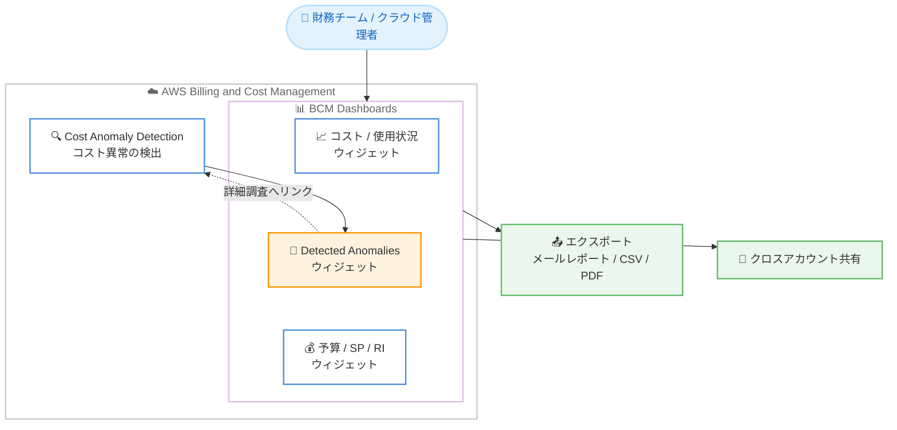

# AWS Billing and Cost Management - Detected Anomalies ウィジェット

**リリース日**: 2026 年 9 月 15 日
**サービス**: AWS Billing and Cost Management (BCM)
**機能**: BCM Dashboards の Detected Anomalies ウィジェット

📊 [このアップデートのインフォグラフィックを見る](https://takech9203.github.io/aws-news-summary/20260915-monitor-detected-anomalies-using-dashboards.html)

## 概要

AWS Billing and Cost Management (BCM) Dashboards に、新しい Detected Anomalies ウィジェットが追加されました。このウィジェットにより、AWS Cost Anomaly Detection が検出したコスト異常を、コストと使用状況のデータ、予算、コスト効率、Savings Plans / リザーブドインスタンスのカバレッジや使用率レポートと並べて、単一のダッシュボード上で確認できるようになります。

ウィジェットには、検出された異常の件数と、月初来 (MTD) の支出と比較した合計コスト影響額が表示され、各異常の規模を文脈とともに把握できます。個々の異常について、コスト影響、根本原因、継続期間を確認でき、30 日、60 日、90 日の遡及期間の選択や、重要度、サービス、アカウント、リージョンによるフィルタリングにも対応しています。財務チームやクラウド管理者にとって、支出、コミットメント、コスト異常を 1 つのカスタマイズされたダッシュボードで統合的に監視できることが主な価値です。

**アップデート前の課題**

このアップデート以前は、コスト異常の確認とその他のコスト管理データの確認が分断されていました。

- コスト異常を確認するには、BCM Dashboards とは別に Cost Anomaly Detection のコンソールへ個別に移動する必要があった
- 支出、予算、コミットメントの状況とコスト異常を 1 つの画面で横断的に把握できなかった
- 定期レポート (メール配信や CSV / PDF エクスポート) にコスト異常の情報を含めることができなかった

**アップデート後の改善**

今回のアップデートにより、コスト異常の監視が既存のコスト管理ワークフローに統合されます。

- BCM Dashboards 上でコスト異常を他のコスト指標と並べて一元的に監視できるようになった
- 異常の件数、コスト影響、根本原因、継続期間をダッシュボードから直接確認できるようになった
- ダッシュボードのエクスポート機能 (スケジュールされたメールレポート、CSV / PDF ダウンロード) やクロスアカウント共有にコスト異常の情報を含められるようになった

## アーキテクチャ図



Cost Anomaly Detection が検出したコスト異常を、BCM Dashboards 上の Detected Anomalies ウィジェットとして他のコスト指標と並べて表示し、エクスポートや共有のワークフローにも組み込める構成を示しています。

## サービスアップデートの詳細

### 主要機能

1. **コスト異常のサマリー表示**
   - 検出された異常の件数を表示
   - 月初来の支出と比較した合計コスト影響額を表示し、異常の規模を文脈とともに把握可能
   - 各異常のコスト影響、根本原因、継続期間を確認可能

2. **柔軟な遡及期間とフィルタリング**
   - 30 日、60 日、90 日の遡及期間を選択可能
   - 重要度、サービス、アカウント、リージョンによるフィルタリングに対応
   - 1 つのダッシュボードに複数の Detected Anomalies ウィジェットを追加可能

3. **既存ワークフローとの統合**
   - ウィジェットから Cost Anomaly Detection コンソールへ直接リンクし、詳細調査や評価の記録が可能
   - ダッシュボードのエクスポート機能と完全に連携し、スケジュールされたメールレポートへの掲載や CSV / PDF のダウンロードに対応
   - クロスアカウントのダッシュボード共有にも含まれる

## 技術仕様

### ウィジェットの仕様

| 項目 | 詳細 |
|------|------|
| 表示内容 | 異常の件数、合計コスト影響額 (MTD 支出との比較)、各異常のコスト影響 / 根本原因 / 継続期間 |
| 遡及期間 | 30 日、60 日、90 日 |
| フィルター | 重要度、サービス、アカウント、リージョン |
| 配置 | 1 つのダッシュボードに複数ウィジェットを配置可能 |
| エクスポート | スケジュールされたメールレポート、CSV、PDF |
| 共有 | クロスアカウントのダッシュボード共有に対応 |
| 詳細調査 | Cost Anomaly Detection コンソールへの直接リンク |

## 設定方法

### 前提条件

1. AWS Cost Anomaly Detection でコストモニターが設定されていること
2. BCM Dashboards へアクセスできる IAM 権限があること
3. クロスアカウント共有を利用する場合は、ダッシュボード共有の設定が完了していること

### 手順

#### ステップ 1: BCM Dashboards を開く

AWS マネジメントコンソールで Billing and Cost Management を開き、ナビゲーションペインから [Dashboards] を選択します。新規ダッシュボードを作成するか、既存のダッシュボードを編集します。

#### ステップ 2: Detected Anomalies ウィジェットを追加する

ウィジェットの追加メニューから Detected Anomalies ウィジェットを選択し、ダッシュボードに配置します。遡及期間 (30 / 60 / 90 日) と、重要度、サービス、アカウント、リージョンのフィルターを必要に応じて設定します。

#### ステップ 3: エクスポートや共有を設定する

必要に応じて、ダッシュボードのスケジュールされたメールレポートや CSV / PDF エクスポート、クロスアカウント共有を設定します。ウィジェット上の異常から Cost Anomaly Detection コンソールへ移動し、詳細調査や評価の記録を行えます。

## メリット

### ビジネス面

- **コスト監視の一元化**: 支出、コミットメント、コスト異常を単一のダッシュボードで統合的に把握でき、コストガバナンスが向上する
- **異常への迅速な対応**: 日常的に参照するダッシュボード上で異常に気付けるため、想定外のコスト増加への対応が早くなる
- **レポーティングの効率化**: 定期メールレポートや CSV / PDF エクスポートに異常情報を含められ、経営層や財務チームへの報告が容易になる

### 技術面

- **文脈のある異常把握**: 月初来支出との比較により、異常のコスト影響の規模を相対的に評価できる
- **柔軟な絞り込み**: 重要度、サービス、アカウント、リージョンでのフィルタリングと複数ウィジェットの配置により、チームごとの監視ビューを構築できる
- **シームレスな調査フロー**: ウィジェットから Cost Anomaly Detection コンソールへ直接遷移でき、検知から調査までの流れが途切れない

## デメリット・制約事項

### 制限事項

- 遡及期間は 30 日、60 日、90 日の 3 種類から選択する仕様である
- 異常の検出自体は Cost Anomaly Detection のコストモニター設定に依存するため、モニターが未設定の場合はウィジェットに表示するデータがない

### 考慮すべき点

- 異常検出の精度や粒度は Cost Anomaly Detection 側のモニター構成 (サービス単位、アカウント単位など) に依存する
- クロスアカウント共有を利用する場合は、共有先に表示される情報の範囲を事前に確認することが望ましい

## ユースケース

### ユースケース 1: 財務チームによる月次コストレビュー

**シナリオ**: 財務チームが月次のコストレビューで、支出の推移と併せて想定外のコスト増加がなかったかを確認したい。

**実装例**:
```
1. BCM Dashboards にコスト / 使用状況ウィジェットと Detected Anomalies ウィジェットを配置
2. 遡及期間を 30 日に設定
3. スケジュールされたメールレポートで毎月自動配信
```

**効果**: コンソールに個別ログインすることなく、月次レビューに必要な支出と異常の情報が 1 つのレポートで揃う。

### ユースケース 2: マルチアカウント環境での組織横断的な異常監視

**シナリオ**: 管理アカウントの管理者が、組織内の複数アカウントで発生したコスト異常を横断的に監視したい。

**実装例**:
```
1. Detected Anomalies ウィジェットを複数配置し、アカウントやリージョンごとにフィルターを設定
2. 重要度フィルターで影響の大きい異常を優先表示
3. クロスアカウント共有で各アカウントの担当者にダッシュボードを共有
```

**効果**: 組織全体の異常状況を俯瞰しつつ、各担当者が自分の担当範囲の異常を同じダッシュボードで確認できる。

### ユースケース 3: サービス別コスト異常の詳細調査

**シナリオ**: クラウド管理者が特定サービスのコスト急増に気付き、原因を特定して対応を記録したい。

**実装例**:
```
1. Detected Anomalies ウィジェットでサービスフィルターを設定し、遡及期間を 90 日に設定
2. 表示された異常のコスト影響、根本原因、継続期間を確認
3. ウィジェットのリンクから Cost Anomaly Detection コンソールへ移動し、詳細調査と評価を記録
```

**効果**: 検知から根本原因の把握、対応記録までを一連のフローとして実施できる。

## 料金

Detected Anomalies ウィジェットは追加料金なしで利用できます。BCM Dashboards および Cost Anomaly Detection の利用にも追加料金は発生しません。

## 利用可能リージョン

すべての AWS 商用リージョンで利用可能です。

## 関連サービス・機能

- **AWS Cost Anomaly Detection**: 機械学習によりコスト異常を検出するサービス。本ウィジェットのデータソースであり、詳細調査の遷移先
- **BCM Dashboards**: コストと使用状況、予算、コスト効率、Savings Plans / RI のカバレッジや使用率などを可視化するダッシュボード機能
- **AWS Budgets**: 予算のしきい値超過を監視する機能。ダッシュボード上で異常検出と組み合わせた監視が可能
- **AWS Cost Explorer**: コストと使用状況の詳細分析ツール。異常の背景にあるコスト推移の深掘りに活用可能

## 参考リンク

- 📊 [インフォグラフィック](https://takech9203.github.io/aws-news-summary/20260915-monitor-detected-anomalies-using-dashboards.html)
- [公式発表 (What's New)](https://aws.amazon.com/about-aws/whats-new/2026/09/monitor-detected-anomalies-using-dashboards)
- [ドキュメント (BCM Dashboards User Guide)](https://docs.aws.amazon.com/cost-management/latest/userguide/dashboards.html)
- [AWS Cost Anomaly Detection](https://aws.amazon.com/aws-cost-management/aws-cost-anomaly-detection/)

## まとめ

BCM Dashboards の Detected Anomalies ウィジェットにより、コスト異常の監視を既存のコスト管理ダッシュボードに追加料金なしで統合できるようになりました。Cost Anomaly Detection のコストモニターを設定済みの環境では、ダッシュボードへ本ウィジェットを追加し、定期レポートやクロスアカウント共有と組み合わせて異常監視のワークフローを整備することを推奨します。
