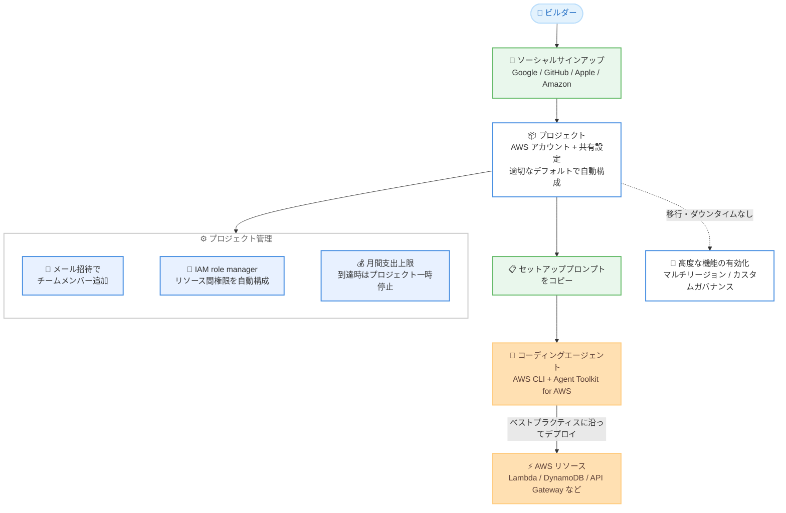

# AWS - ビルダー向け新しい AWS エクスペリエンス

**リリース日**: 2026 年 9 月 16 日
**サービス**: AWS (アカウント・サインアップエクスペリエンス)
**機能**: New AWS Builder Experience (ビルダー向け簡素化されたスタート体験)

📊 [このアップデートのインフォグラフィックを見る](https://takech9203.github.io/aws-news-summary/20260916-New-AWS-Builder-Experience.html)

## 概要

AWS は、アイデアを素早く動くコードに変えるための、新しい簡素化されたエクスペリエンスを発表しました。従来、新しいプロジェクトを始めるビルダーは、豊富な設定オプションの中から選択を行い、AWS 環境を構成してから開発を始める必要がありました。新しいエクスペリエンスでは、サインアップが簡素化され、適切なデフォルト設定 (sensible defaults) で初期プロジェクトが自動構成されるため、ビルダーはすぐにアイデアの実装を開始できます。

サインアップには Google、GitHub、Apple、Amazon の既存の認証情報を利用でき、ほとんどの新規顧客はクレジットカードの登録が不要です。AWS 無料利用枠の一部として、最大 200 ドルの無料クレジットを受け取れます (サインアップ時に 100 ドル、その後のアクティビティに応じて追加)。サインアップ完了後は、1 つのプロンプトを貼り付けるだけでコーディングエージェントを AWS に接続でき、AWS CLI と Agent Toolkit for AWS が自動インストールされます。エージェントは組み込みのガイダンスに従い、ベストプラクティスに沿ってリソースをデプロイします。

プロジェクトの拡大に応じて、メールアドレスだけでチームメンバーを招待でき、アクセス権限は自動構成されます。また、新しい IAM role manager 機能がプロジェクトで有効化されているため、作成した AWS リソースの多くは他の AWS サービスのリソースへ自動的にアクセスできます。有料プランへのアップグレード時にはプロジェクトごとに月間支出上限 (spend limit) を設定でき、上限に達するとその月はプロジェクトが一時停止されます。さらに、マルチリージョンやカスタムガバナンス制御などの高度な機能は、移行やダウンタイムなしでいつでも有効化できます。

**アップデート前の課題**

新しいプロジェクトを始めるビルダーには、開発着手前に多くの準備作業が必要でした。

- 開発を始める前に、多数の設定オプションの中から選択して AWS 環境を構成する必要があった
- サインアップにクレジットカードの登録が必要で、IAM や IAM Identity Center の学習なしにはチームメンバーへのアクセス付与が難しかった
- サービス間のリソースアクセス権限を手動で設定・トラブルシューティングする必要があった
- 想定外のコスト増加を防ぐには、予算アラートなどの仕組みを自分で構成する必要があった

**アップデート後の改善**

新しいエクスペリエンスにより、セットアップの手間が大幅に削減されました。

- Google、GitHub、Apple、Amazon の既存認証情報でサインアップでき、ほとんどの場合クレジットカードが不要になった
- 適切なデフォルト設定で初期プロジェクトが自動構成され、すぐに開発を開始できるようになった
- 1 つのプロンプトでコーディングエージェントを AWS に接続し、ベストプラクティスに沿ったデプロイが可能になった
- メール招待によるチームコラボレーションと、IAM role manager によるリソース間権限の自動構成が可能になった
- プロジェクトごとの月間支出上限により、予算超過を防止できるようになった

## アーキテクチャ図



サインアップからコーディングエージェント接続、リソースデプロイ、プロジェクト管理までの流れを示しています。ビルダーは環境構成の作業なしに、プロジェクト作成後すぐに開発を開始できます。

## サービスアップデートの詳細

### 主要機能

1. **簡素化されたサインアップ**
   - Google、GitHub、Apple、Amazon の既存の認証情報でサインアップ可能
   - ほとんどの新規顧客はクレジットカードの登録が不要
   - AWS 無料利用枠の一部として最大 200 ドルの無料クレジットを提供 (サインアップ時に 100 ドル、Lambda 関数のデプロイなどのアクティビティで追加クレジットを獲得)

2. **プロジェクトベースの自動構成**
   - サインアップと同時に、AWS アカウントと共有設定を含む「プロジェクト」が自動作成される
   - 適切なデフォルト設定と追加のセキュリティ制御が適用済みの状態でスタート
   - 追加プロジェクトはワンクリックで作成でき、それぞれに個別の支出上限とチームメンバーを設定可能

3. **コーディングエージェントとのワンプロンプト連携**
   - サインイン後に表示されるプロンプトをコーディングエージェントに貼り付けるだけで接続が完了
   - AWS CLI と Agent Toolkit for AWS が自動インストールされ、AWS へのログインも自動実行
   - エージェントは組み込みガイダンス (CLAUDE.md などのガイダンスファイル) に従い、ベストプラクティスに沿ってリソースをデプロイ

4. **メール招待によるチームコラボレーション**
   - メールアドレスだけでチームメンバーを招待可能
   - 招待の承諾時にプロジェクトへのアクセス権限が自動構成され、IAM ユーザーの作成や IAM Identity Center の学習が不要
   - 招待されたメンバーは指定されたプロジェクトのみにアクセス可能

5. **IAM role manager によるリソース間権限の自動構成**
   - 新しい IAM role manager 機能がプロジェクトで有効化されている
   - 作成した AWS リソースの多くが、他の AWS サービスのリソースへ自動的にアクセス可能
   - コンソールワークフローとコーディングエージェントの両方で、サポート対象サービス間の権限が自動構成される

6. **月間支出上限によるコスト管理**
   - 有料プランへのアップグレード時に、使用パターンに基づいてプロジェクトごとの月間支出上限を設定可能 (20 ドル/月から)
   - 上限に近づくと通知を受け取り、上限に達するとその月はプロジェクトが一時停止 (課金の蓄積を防止)
   - 上限を引き上げることでプロジェクトを再開可能。実際の使用分のみが課金される

7. **高度な機能への移行レスなアップグレード**
   - マルチリージョンや AWS Organizations のカスタムポリシーなどの高度な機能を、追加コストなしでいつでも有効化可能
   - 移行やダウンタイムは不要で、以前の設定はすべて保持され、基盤となる AWS サービスに反映される
   - ベストプラクティスに従って構成された AWS Organization に移行される

## 技術仕様

### 新しいエクスペリエンスの構成要素

| 項目 | 詳細 |
|------|------|
| サインアップ方法 | Google、GitHub、Apple、Amazon の既存認証情報、またはメールアドレス |
| クレジットカード | ほとんどの新規顧客は登録不要 |
| 無料クレジット | 最大 200 ドル (サインアップ時 100 ドル + アクティビティによる追加) |
| プロジェクト構造 | AWS アカウント + チーム共有設定 + セキュリティ制御 |
| エージェント連携 | AWS CLI + Agent Toolkit for AWS を自動インストール |
| 権限管理 | IAM role manager によるリソース間権限の自動構成 |
| 支出上限 | プロジェクトごとに月額 20 ドルから設定可能。到達時はプロジェクト一時停止 |
| 高度な機能 | マルチリージョン、カスタムガバナンスなどを移行・ダウンタイムなしで有効化 |

### 支出上限の動作例

| シナリオ | 動作 |
|----------|------|
| 上限 50 ドル、実際の使用 32 ドル | 32 ドル (+ 税) のみ課金 |
| 使用量が上限に近づいた場合 | 通知を受信 |
| 使用量が上限に達した場合 | プロジェクトがその月は一時停止され、課金の蓄積を防止 |
| 上限を引き上げた場合 | プロジェクトを再開可能 |

## 設定方法

### 前提条件

1. 新規の AWS アカウント作成であること (新しいエクスペリエンスは新規顧客向けに段階的に展開中)
2. Google、GitHub、Apple、Amazon のいずれかのアカウント、またはメールアドレス
3. コーディングエージェント連携を利用する場合は、対応するコーディングエージェント

### 手順

#### ステップ 1: 新しいエクスペリエンスでサインアップする

aws.amazon.com にアクセスし、[Create account] を選択します。Google、GitHub、Apple、Amazon のいずれかの既存認証情報でサインインするか、メールアドレスで登録します。ほとんどの場合クレジットカードは不要で、サインアップ完了と同時に最初のプロジェクトが自動作成されます。

#### ステップ 2: コーディングエージェントを接続する

サインイン後に表示されるセットアッププロンプトをコピーし、使用しているコーディングエージェントに貼り付けます。エージェントが AWS CLI と Agent Toolkit for AWS のインストール、AWS へのログイン、ガイダンスファイルの作成を自動的に実行します。

#### ステップ 3: アプリケーションを構築・デプロイする

コーディングエージェントに構築したい内容を指示します。たとえば「リクエストごとに一意の連番 ID を返す API を構築して」と指示すると、エージェントが Lambda 関数、DynamoDB テーブル、API Gateway API を作成してデプロイします。リソース間の権限設定は自動構成されるため、手動での設定は不要です。

#### ステップ 4: チームメンバーの招待と支出上限の設定を行う

プロジェクトの [Members] ページからメールアドレスでチームメンバーを招待します。有料プランへのアップグレード時には、使用状況に基づく推奨値を参考に、プロジェクトごとの月間支出上限を設定します。

## メリット

### ビジネス面

- **市場投入までの時間短縮**: 環境構成の作業なしに開発を即座に開始でき、アイデアを素早く形にできる
- **初期コストゼロでの検証**: クレジットカード不要かつ最大 200 ドルの無料クレジットにより、リスクなくアイデアを検証できる
- **予算超過の防止**: プロジェクトごとの支出上限により、実験的なプロジェクトでも予期しない課金を回避できる

### 技術面

- **ベストプラクティスの自動適用**: 適切なデフォルト設定とセキュリティ制御が最初から適用され、エージェントもベストプラクティスに沿ってデプロイする
- **権限管理の自動化**: IAM role manager とメール招待により、IAM の詳細な知識なしにセキュアな権限管理を実現できる
- **スケールへの拡張性**: 高度な機能の有効化により、移行やダウンタイムなしでフル機能の AWS 環境 (AWS Organizations ベース) へ拡張できる

## デメリット・制約事項

### 制限事項

- 新規顧客向けに段階的にロールアウト中であり、すべての新規顧客がすぐに利用できるとは限らない
- 新しいエクスペリエンスは新規アカウント作成時が対象で、既存アカウントの移行については言及されていない
- 初期状態では単一リージョンでの利用が前提であり、マルチリージョンの利用には高度な機能の有効化が必要

### 考慮すべき点

- 支出上限に達するとプロジェクトが一時停止されるため、本番ワークロードでは上限値の設定に注意が必要
- リソース間権限の自動構成 (IAM role manager) の対象はサポート対象サービスに限られる
- エンタープライズで求められる詳細なガバナンス制御が必要な場合は、高度な機能の有効化を検討する必要がある

## ユースケース

### ユースケース 1: 個人開発者によるプロトタイプの高速構築

**シナリオ**: 個人開発者が新しい Web API のアイデアを思いつき、すぐに動くプロトタイプを作りたい。AWS の環境構成に時間をかけたくない。

**実装例**:
```text
1. Google アカウントで AWS にサインアップ (クレジットカード不要)
2. 表示されたプロンプトをコーディングエージェントに貼り付けて接続
3. エージェントに「リクエストごとに一意の ID を返す API を作って」と指示
4. Lambda + DynamoDB + API Gateway が自動デプロイされ、数分で公開エンドポイントが完成
```

**効果**: 環境構成ゼロで、無料クレジットの範囲内で数分以内にプロトタイプを公開できる。

### ユースケース 2: スタートアップの小規模チームでのコラボレーション

**シナリオ**: 創業初期のスタートアップが、IAM の専門知識を持つメンバーがいない状態で、複数人での開発を始めたい。

**実装例**:
```text
1. 創業者がプロジェクトを作成し、[Members] ページから共同創業者をメールで招待
2. 招待の承諾と同時にプロジェクトへのアクセス権限が自動構成される
3. 有料プラン移行時に、プロジェクトに月 50 ドルの支出上限を設定
4. トラクションが出てきたプロジェクトの上限を引き上げ、実験用プロジェクトは低い上限を維持
```

**効果**: IAM ユーザー管理や権限設計の学習コストなしにセキュアなコラボレーションを実現し、プロジェクト単位で予算を管理できる。

### ユースケース 3: 成長したプロジェクトのエンタープライズ環境への拡張

**シナリオ**: 簡素化されたエクスペリエンスで始めたプロジェクトが成長し、複数リージョンでの展開とガバナンス制御が必要になった。

**実装例**:
```text
1. プロジェクト設定から高度な機能を有効化 (追加コストなし)
2. ベストプラクティスに従って構成された AWS Organization へ移行なしで切り替わる
3. 複数の AWS リージョンの利用と AWS Organizations のカスタムポリシーを適用
4. 以前の設定はすべて保持され、ダウンタイムなしで運用を継続
```

**効果**: 小さく始めたプロジェクトを、再構築や移行作業なしにエンタープライズグレードの環境へシームレスに拡張できる。

## 料金

新しいエクスペリエンス自体に追加料金はありません。AWS 無料利用枠の一部として、ほとんどの新規顧客はクレジットカード不要で最大 200 ドルの無料クレジット (サインアップ時に 100 ドル、アクティビティに応じて追加) を受け取れます。

有料プランでは、プロジェクトごとに月間支出上限 (20 ドル/月から) を設定でき、実際に使用した分のみが課金されます。高度な機能の有効化にも追加コストはかかりません。

### 料金例

| 使用量 | 月額料金 (概算) |
|--------|------------------|
| 無料クレジット範囲内での利用 | 0 ドル |
| 支出上限 50 ドル、実使用 32 ドル | 32 ドル (+ 税) |
| 支出上限到達時 | 上限額まで。以降はプロジェクト一時停止により課金なし |

## 利用可能リージョン

新規顧客向けに段階的にロールアウト中です。初期状態では単一リージョンでの利用が前提であり、高度な機能を有効化することで複数の AWS リージョンを利用できます。

## 関連サービス・機能

- **AWS Free Tier**: 最大 200 ドルの無料クレジットは AWS 無料利用枠の一部として提供される
- **Agent Toolkit for AWS**: コーディングエージェントが AWS と連携するためのツールキット。セットアッププロンプトにより自動インストールされる
- **AWS IAM / IAM Identity Center**: 新しいエクスペリエンスではこれらの詳細を意識せずにアクセス管理が可能。IAM role manager がリソース間権限を自動構成する
- **AWS Organizations**: 高度な機能の有効化により、ベストプラクティスに従って構成された AWS Organization へ移行なしで拡張できる
- **AWS CLI**: エージェント接続時に自動インストールされ、リソースのデプロイに利用される

## 参考リンク

- 📊 [インフォグラフィック](https://takech9203.github.io/aws-news-summary/20260916-New-AWS-Builder-Experience.html)
- [公式発表 (What's New)](https://aws.amazon.com/about-aws/whats-new/2026/09/New-AWS-Builder-Experience)
- [AWS Blog: AWS reimagines the getting started experience](https://aws.amazon.com/blogs/aws/aws-reimagines-the-getting-started-experience)
- [AWS Security Blog: How AWS IAM role manager rethinks the starting point for IAM roles](https://aws.amazon.com/blogs/security/how-aws-iam-role-manager-rethinks-the-starting-point-for-iam-roles/)
- [Agent Toolkit for AWS](https://aws.amazon.com/products/developer-tools/agent-toolkit-for-aws/)
- [AWS 無料利用枠](https://aws.amazon.com/free/)

## まとめ

今回のアップデートは、AWS のスタート体験を根本から再設計するものであり、環境構成の負担なしにアイデアの実装へ即座に取りかかれる点で、個人開発者やスタートアップにとって大きな価値があります。ソーシャルサインアップ、コーディングエージェント連携、支出上限、IAM role manager による権限自動構成という一連の仕組みにより、AI 時代の開発スピードに合わせた開発体験が実現されています。新規プロジェクトの立ち上げを検討している場合は、新しいエクスペリエンスでのアカウント作成を試すことを推奨します。
