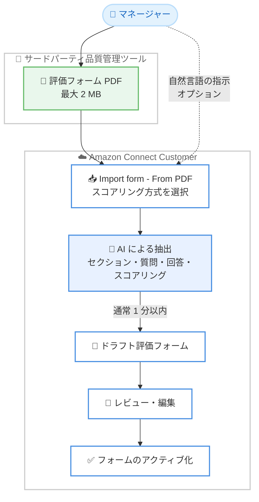

# Amazon Connect Customer - AI による評価フォーム PDF インポート

**リリース日**: 2026 年 9 月 16 日
**サービス**: Amazon Connect Customer
**機能**: AI を使用した評価フォーム PDF のインポート

📊 [このアップデートのインフォグラフィックを見る](https://takech9203.github.io/aws-news-summary/20260916-amazon-connect-customer-import-evaluation-form-PDF.html)

## 概要

Amazon Connect Customer で、サードパーティの品質管理 (QM) ツールで使用していた評価フォームの PDF をアップロードすると、AI が自動的に Connect 上の評価フォームとして再構築できるようになりました。マネージャーは PDF をアップロードするだけで、AI がセクション、質問、回答オプション、スコアリングを抽出し、ドラフトの評価フォームを生成します。

この機能は、既存の品質管理プログラムを Amazon Connect に移行する際の作業を大幅に簡素化します。従来は他システムのフォームを質問ごとに手作業で再作成する必要がありましたが、今回のアップデートによりインポートが数分以内 (通常 1 分程度) で完了します。インポート時にはパーセンテージベースまたはポイントベースのスコアリング方式を選択でき、さらに自然言語の指示によって抽出処理をガイドすることも可能です。

**アップデート前の課題**

- 他の品質管理ツールから移行する場合、既存の評価フォームを質問ごとに手作業で再作成する必要があった
- セクション、質問、回答オプション、スコアリング設定の転記に時間がかかり、入力ミスのリスクがあった
- フォーム数が多い組織では、移行作業がコンタクトセンターの品質管理プログラム刷新のボトルネックになっていた

**アップデート後の改善**

- 評価フォームの PDF をアップロードするだけで、AI がセクション、質問、回答オプション、スコアリングを抽出してドラフトフォームを自動生成できるようになった
- 「幅広い質問をよりシンプルな質問に分割する」といった自然言語の指示でインポート処理をガイドでき、インポート後の手動編集を削減できるようになった
- インポート時にパーセンテージベース、ポイントベース、スコアリングなしから採点方式を選択できるようになった

## アーキテクチャ図



サードパーティの品質管理ツールからエクスポートした評価フォーム PDF をアップロードすると、AI が内容を抽出してドラフトフォームを生成し、レビュー・編集を経てアクティブ化する流れを示しています。

## サービスアップデートの詳細

### 主要機能

1. **AI による PDF からのフォーム抽出**
   - 任意の品質管理システムの評価フォーム PDF (最大 2 MB) をアップロード可能
   - AI がセクション、質問、回答オプション、スコアリングを自動的に抽出
   - 抽出結果はドラフトの評価フォームとして作成され、レビューと編集が可能
   - インポートは通常 1 分以内に完了

2. **スコアリング方式の選択**
   - インポート時に **Points-based** (ポイントベース)、**Percentage-based** (パーセンテージベース)、**Not scored** (スコアリングなし) から選択可能
   - 選択した方式に基づいて、抽出されたスコアリング設定がフォームに反映される

3. **自然言語によるインポートのガイド**
   - インポート時にオプションで指示を入力し、抽出処理にコンテキストを提供可能
   - 例: 「このフォームはアウトバウンドセールスコール用です。アップセルに関する質問に注目してください」
   - 幅広い質問をシンプルな質問に分割するといった調整も指示でき、インポート後の手動編集を削減

## 技術仕様

### インポート機能の仕様

| 項目 | 詳細 |
|------|------|
| 対応ファイル形式 | PDF |
| 最大ファイルサイズ | 2 MB |
| スコアリング方式 | ポイントベース / パーセンテージベース / スコアリングなし |
| 指示の入力 | 自然言語による任意入力 (オプション) |
| 処理時間 | 通常 1 分以内 |
| インポート結果 | ドラフトの評価フォーム (レビュー・編集後にアクティブ化) |

### 必要な権限

Connect Customer 管理 Web サイトで評価フォームを作成するには、以下のセキュリティプロファイル権限が必要です。

| 権限カテゴリ | 権限 |
|------|------|
| Analytics and Optimization | Evaluation forms - manage form definitions - Create |

## 設定方法

### 前提条件

1. Amazon Connect Customer インスタンスが利用可能リージョンに存在すること
2. ユーザーアカウントに評価フォームの作成権限 (**Analytics and Optimization** - **Evaluation forms - manage form definitions** - **Create**) が付与されていること
3. インポート対象の評価フォームが PDF 形式 (最大 2 MB) で用意されていること

### 手順

#### ステップ 1: 評価フォームページへ移動

Connect Customer 管理 Web サイトにログインし、**Analytics and optimization** から **Evaluation forms** を選択します。

#### ステップ 2: PDF からのインポートを開始

**Evaluation forms** ページで **Import form** を選択し、**From PDF** を選択します。

#### ステップ 3: インポート設定を入力

**Import evaluation form with AI** ダイアログで以下を設定し、**Import** を選択します。

- **Evaluation form PDF**: PDF ファイル (最大 2 MB) を選択
- **Scoring method**: **Points-based**、**Percentage-based**、**Not scored** のいずれかを選択
- **Instructions (optional)**: 抽出をガイドするコンテキストを自然言語で入力 (例: 「このフォームはアウトバウンドセールスコール用です」)

インポートは通常 1 分以内に完了します。

#### ステップ 4: ドラフトフォームのレビューとアクティブ化

インポート完了後、フォームはドラフトとして表示されます。セクション、質問、スコアリングが正しく抽出されているかを確認し、必要に応じて編集した後、フォームをアクティブ化します。

## メリット

### ビジネス面

- **移行コストの削減**: 他社の品質管理ツールからの移行時に、フォームを 1 から再作成する工数を大幅に削減できる
- **品質管理プログラムの早期立ち上げ**: 既存の評価基準をそのまま持ち込めるため、Amazon Connect 上での品質管理を迅速に開始できる
- **移行時の一貫性維持**: 既存フォームの構成やスコアリングを引き継ぐことで、移行前後の評価基準の一貫性を保ちやすい

### 技術面

- **AI による自動抽出**: セクション、質問、回答オプション、スコアリングを自動抽出し、転記ミスを防止できる
- **自然言語によるカスタマイズ**: 指示を与えることで抽出結果を調整でき、インポート後の手動編集を削減できる
- **既存機能との統合**: インポートしたフォームは通常の評価フォームと同様に、条件付き質問、自動評価 (生成 AI、コンタクトカテゴリ、メトリクス) などの機能を利用できる

## デメリット・制約事項

### 制限事項

- PDF ファイルのサイズは最大 2 MB に制限される
- インポート結果はドラフトとして作成されるため、アクティブ化の前に人によるレビューと検証が必要
- 利用可能リージョンは 7 リージョンに限定される (2026 年 9 月時点)

### 考慮すべき点

- AI による抽出結果が元のフォームと完全に一致するとは限らないため、セクション、質問、スコアリングの内容を必ず確認する
- スコアリング方式 (ポイントベース / パーセンテージベース) はインポート時に選択するため、移行元フォームの採点方法を事前に把握しておく
- 既存フォームの JSON エクスポート / インポート機能 (Connect インスタンス間の移行) とは用途が異なる点に注意する

## ユースケース

### ユースケース 1: サードパーティ品質管理ツールからの移行

**シナリオ**: 他社の品質管理ツールで運用していた評価フォームを Amazon Connect Customer に移行し、品質管理プログラムを Connect 上に統合する。

**実装例**:
```text
1. 既存ツールから評価フォームを PDF としてエクスポート
2. Connect Customer の Evaluation forms ページで Import form - From PDF を選択
3. スコアリング方式 (移行元と同じ方式) を選択してインポート
4. ドラフトをレビューし、自動評価 (生成 AI やコンタクトカテゴリ) を設定してアクティブ化
```

**効果**: 質問ごとの手作業による再作成が不要になり、移行期間を短縮できる。

### ユースケース 2: 紙ベース・Excel ベースの評価シートのデジタル化

**シナリオ**: PDF 化された既存の評価シートを Connect 上の評価フォームとして取り込み、コンタクトセンターの評価業務をデジタル化する。

**実装例**:
```text
1. 既存の評価シートを PDF に変換 (最大 2 MB)
2. インポート時に「Yes / No で回答できる形式に整理してください」など自然言語で指示
3. 生成されたドラフトを確認し、必要な質問に自動評価を設定
```

**効果**: 手動評価から自動評価への移行の第一歩として、既存の評価基準を活かしながらデジタル化できる。

### ユースケース 3: 部門ごとの評価フォームの一括整備

**シナリオ**: 事業部門やキューごとに異なる評価フォームを運用しており、複数のフォームを短期間で Connect 上に整備する。

**実装例**:
```text
1. 部門ごとの評価フォーム PDF を用意
2. 各 PDF をインポートし、部門の特性に応じた指示 (例: アウトバウンドセールス向け) を付与
3. ドラフトをレビュー後、タグを設定してアクセス制御を行いアクティブ化
```

**効果**: 複数フォームの整備を並行して短期間で完了でき、部門ごとの品質管理を早期に開始できる。

## 料金

評価フォームの PDF インポート機能は、Amazon Connect Customer の会話分析 (Conversational Analytics) およびパフォーマンス評価機能の一部として提供されます。料金の詳細は [Amazon Connect Customer の料金ページ](https://aws.amazon.com/products/connect/customer/pricing/) を参照してください。

## 利用可能リージョン

以下の 7 リージョンで利用可能です。

- 米国東部 (バージニア北部)
- 米国西部 (オレゴン)
- カナダ (中部)
- アジアパシフィック (シンガポール)
- アジアパシフィック (シドニー)
- アジアパシフィック (東京)
- 欧州 (フランクフルト)

## 関連サービス・機能

- **Amazon Connect Customer 会話分析**: 評価フォームの質問を、会話分析のインサイトやメトリクス (センチメントスコア、保留時間など) を使って自動回答できる
- **生成 AI によるパフォーマンス評価**: 評価フォームの質問を生成 AI が自動回答し、評価の完全自動化 (最大 100% のコンタクト) にも対応
- **評価フォームの JSON インポート / エクスポート**: Connect インスタンス間 (テスト環境から本番環境など) でのフォーム移行に使用する既存機能

## 参考リンク

- 📊 [インフォグラフィック](https://takech9203.github.io/aws-news-summary/20260916-amazon-connect-customer-import-evaluation-form-PDF.html)
- [公式発表 (What's New)](https://aws.amazon.com/about-aws/whats-new/2026/09/amazon-connect-customer-import-evaluation-form-PDF/)
- [ドキュメント: Import an evaluation form from a PDF using AI](https://docs.aws.amazon.com/connect/latest/adminguide/create-evaluation-forms.html#import-form-pdf)
- [Amazon Connect Customer 会話分析](https://aws.amazon.com/products/connect/customer/conversational-analytics/)
- [料金ページ](https://aws.amazon.com/products/connect/customer/pricing/)

## まとめ

今回のアップデートにより、サードパーティの品質管理ツールで使用していた評価フォームを、PDF のアップロードだけで Amazon Connect Customer に移行できるようになりました。既存の品質管理プログラムを Connect に統合したい組織にとって、移行の最大の障壁であったフォーム再作成の工数を大幅に削減できる重要な機能です。移行を検討している場合は、まず既存フォームの PDF を用意し、東京リージョンを含む対応リージョンでインポートを試すことを推奨します。
