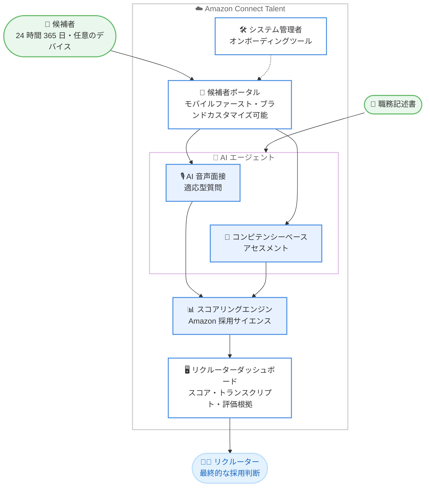

# Amazon Connect Talent - 一般提供開始

**リリース日**: 2026 年 9 月 16 日
**サービス**: Amazon Connect Talent
**機能**: AI 搭載採用ソリューションの一般提供開始 (GA)

📊 [このアップデートのインフォグラフィックを見る](https://takech9203.github.io/aws-news-summary/20260916-amazon-connect-talent.html)

## 概要

Amazon Connect Talent が一般提供開始 (GA) となりました。Amazon Connect Talent は、大規模採用を管理する人材獲得リーダー向けの AI 搭載採用ソリューションです。Amazon が毎年数十万人規模の採用で培ってきた数十年にわたる採用サイエンスに基づいて構築されており、AI エージェントが構造化された音声面接の実施、エビデンスベースのアセスメント、一貫した候補者スコアリングを担当します。これにより、リクルーターは雇用主ブランディングや採用マネージャーとの関係構築といった戦略的な意思決定に集中できます。

候補者は任意のデバイスから 24 時間 365 日いつでも面接を受けられ、リクルーターは AI が生成したスコア、トランスクリプト、詳細な候補者評価をレビューして、一貫した客観性で迅速な採用判断を下せます。数百人の候補者を同時に評価できるスケーラビリティを備えており、季節的な採用の急増にも契約の再交渉なしで対応可能です。

なお、Amazon Connect はコンタクトセンター向けの Amazon Connect Customer を含む、ビジネスユーザー向けのエージェント型 AI ソリューションファミリーとして展開されており、Connect Talent は同様の AI 会話技術を採用ワークフローに適用したものです。

**アップデート前の課題**

大規模採用における従来の課題は以下のとおりです。

- 大規模採用は手作業が多く分断されており、リクルーターは求人掲載、応募者スクリーニング、面接調整、経歴確認のために複数のツールを使い分ける必要があった
- 面接のスケジュール調整に時間がかかり、応募からオファーまで数週間を要し、優秀な人材を競合他社に奪われる原因となっていた
- 面接官による評価のばらつきや人間の先入観により、職務との不適合、早期離職、コストのかかる再採用サイクルが発生していた
- 採用の急増期に面接・評価のキャパシティを迅速にスケールさせることが困難だった

**アップデート後の改善**

今回の GA により、以下が可能になりました。

- 職務記述書を指定するだけで、AI エージェントが要件をカスタマイズされたアセスメントと構造化面接に自動変換 (手動設定不要)
- AI エージェントが 24 時間 365 日オンデマンドで音声面接を実施し、スケジュール調整の遅延を解消。応募からオファーまで数日に短縮
- Amazon の採用サイエンスに基づく一貫したスコアリングにより、1 人目でも 1,000 人目でも同じ基準で客観的に評価
- 数百人の候補者を同時に評価でき、採用の急増に即座にスケール

## アーキテクチャ図



職務記述書から AI エージェントがアセスメントと構造化面接を自動生成し、候補者はモバイルファーストのポータルから 24 時間 365 日面接を完了できます。AI によるスコアリング結果はトランスクリプトと評価根拠付きでリクルーターダッシュボードに集約され、最終的な採用判断は人間が行います。

## サービスアップデートの詳細

### 主要機能

1. **コンピテンシーベースのアセスメント**
   - 候補者の仕事への取り組み方や問題解決能力など、複数のコンピテンシーをテストするデータ駆動型のカスタマイズされた評価
   - 職務固有の評価問題を AI が生成・採点
   - Amazon の数十年にわたる採用データとサイエンスに基づき、候補者の成功を予測するよう設計
   - アセスメントの文言と体験は、AI の支援を受けながらユーザーが最終承認する形でカスタマイズ可能

2. **適応型質問による AI 主導の音声面接**
   - AI エージェントが 24 時間 365 日利用可能な構造化音声面接を実施
   - 候補者の回答に応じて質問を動的に生成し、全候補者を一貫して評価
   - 面接時間は職務要件と評価するコンピテンシーによるが、通常 10 ～ 20 分
   - 採用マネージャーは面接開始前に AI 生成のコンピテンシーと質問を修正し、職務要件や組織のニーズに合わせて調整可能
   - リクルーターはトランスクリプト、録音、AI スコアリングをいつでも確認でき、すべての採用における決定権を保持

3. **ブランドカスタマイズ可能なモバイルファーストの候補者ポータル**
   - 雇用主のブランドに合わせてカスタマイズ可能な候補者向けインターフェース
   - モバイルデバイスからシームレスなウェブ体験で評価と面接を完了可能
   - スケジュール調整不要で、営業時間外でも都合の良いタイミングで面接を受けられる

4. **システム管理者オンボーディングツール**
   - 採用ワークフローの設定・管理を容易にする管理者向けツール
   - 複雑なセットアップや学習コストなしで導入可能

5. **会話型インサイトとリクルーターダッシュボード**
   - 候補者のスコアと結果に一元的にアクセスできるダッシュボード
   - AI に質問するだけで面接の詳細確認や候補者の比較が可能
   - すべてのスコアに完全な監査証跡と職務関連の評価根拠が付属

## 技術仕様

### サービス仕様

| 項目 | 詳細 |
|------|------|
| 提供形態 | フルマネージドのエージェント型 AI 採用ソリューション |
| 面接方式 | 構造化音声面接 (適応型質問、24 時間 365 日対応) |
| 面接時間 | 通常 10 ～ 20 分 (職務要件・コンピテンシーにより変動) |
| 対応言語 | 英語、ポルトガル語、フランス語、イタリア語、ドイツ語、スペイン語 |
| 同時評価 | 数百人の候補者を同時に評価可能 |
| 監査対応 | 全候補者とのやり取りを記録、監査ログとドキュメント機能を内蔵 |
| セキュリティ | AWS インフラ上に構築されたエンタープライズグレードのセキュリティ管理とデータプライバシー保護 |

### AI コンプライアンスへの対応

FAQ によると、Amazon と外部弁護士が独立系の産業組織心理学の専門企業を起用し、AI 主導面接の代表的なユースケースを包括的に評価しています。説明可能性、透明性、人間による監督などの主要なコンプライアンス原則を考慮した、職務関連の構造化面接コンテンツを生成することが示されており、この評価は製品とともに継続的に進化するとされています。

## 設定方法

### 前提条件

1. AWS アカウントを保有していること
2. US East (N. Virginia) または US West (Oregon) リージョンを利用できること
3. 採用対象の職務記述書を準備していること

### 手順

#### ステップ 1: コンソールから開始

AWS マネジメントコンソールで Amazon Connect Talent にアクセスします。製品ページからは us-west-2 リージョンのコンソールへのリンクが提供されています。システム管理者向けオンボーディングツールに従って、組織の採用ワークフローを設定します。

#### ステップ 2: 職務記述書からアセスメントと面接を作成

職務記述書を指定すると、AI エージェントが要件をカスタマイズされたアセスメントと構造化面接に自動変換します。採用マネージャーは面接開始前に AI 生成のコンピテンシーと質問をレビューし、必要に応じて修正・最終承認します。

#### ステップ 3: 候補者ポータルのカスタマイズと候補者の招待

候補者ポータルを自社ブランドに合わせてカスタマイズし、候補者を招待します。候補者は任意のデバイスから都合の良いタイミングでアセスメントと AI 音声面接を完了します。

#### ステップ 4: 結果のレビューと採用判断

リクルーターダッシュボードで AI が生成したスコア、トランスクリプト、評価根拠をレビューし、最終的な採用判断を行います。会話型インサイトを使用して、AI に質問しながら候補者を比較することも可能です。

## メリット

### ビジネス面

- **採用リードタイムの大幅短縮**: 従来数週間かかっていた応募からオファーまでのプロセスを数日に短縮。優秀な人材を競合他社に奪われるリスクを低減
- **採用急増への即応**: 数百人の候補者を同時に評価でき、季節需要などの採用ピークに契約再交渉なしで即座にスケール
- **リクルーターの生産性向上**: 評価の実施、構造化面接、スコアリングといった時間のかかる作業を AI エージェントが処理し、リクルーターは戦略的業務に集中可能
- **採用品質の向上**: Amazon の採用サイエンスに基づくエビデンスベースの評価により、職務との不適合や早期離職、再採用コストを削減

### 技術面

- **一貫性と客観性**: 全候補者に同じ基準の評価を適用し、人間の先入観を低減。職務関連の明確な評価理由を含む完全な監査証跡を提供
- **セットアップ不要の AI ワークフロー**: 職務記述書からアセスメントと面接を自動生成し、複雑な手動設定や学習コストが不要
- **エンタープライズグレードの基盤**: ミッションクリティカルなシステムを支える AWS インフラ上に構築され、セキュリティ管理とデータプライバシー保護が初日から組み込み
- **人間による最終判断の担保**: AI はスコアリングと根拠の提示までを担当し、採用の決定権は常に人間が保持

## デメリット・制約事項

### 制限事項

- 利用可能リージョンは US East (N. Virginia) と US West (Oregon) の 2 リージョンのみ (顧客の需要に応じて追加予定)
- 対応言語は英語、ポルトガル語、フランス語、イタリア語、ドイツ語、スペイン語の 6 言語で、日本語は現時点で未対応 (追加言語は AWS アカウントチームへの相談が可能)
- 大規模採用 (数日から数週間で数十～数百名) を主な対象としており、少人数の専門職採用が主目的の組織には過剰な場合がある

### 考慮すべき点

- AI による候補者評価は、国・地域によって雇用関連法規制 (AI 面接の利用に関する規制など) の対象となる場合があるため、導入前に自社の法務・コンプライアンス部門との確認が推奨される
- 候補者評価 1 件あたり $20.00 の従量課金のため、大量の候補者を評価する場合はコストを事前に試算しておく必要がある
- 最終的な採用判断は人間が行う設計であり、AI スコアをどのように意思決定プロセスへ組み込むかの社内ルール整備が必要

## ユースケース

### ユースケース 1: 小売業の季節採用

**シナリオ**: 大手小売企業がホリデーシーズンに向けて、数週間で数百名の店舗スタッフを採用する必要がある。従来は面接官の確保とスケジュール調整がボトルネックとなり、採用が間に合わないことがあった。

**実装例**:
```
1. 店舗スタッフの職務記述書を Connect Talent に登録
2. AI がコンピテンシーベースのアセスメントと面接プランを自動生成
3. 応募者に候補者ポータルの URL を案内
4. 応募者は夜間や週末でも都合の良い時間に AI 音声面接を完了
5. リクルーターはダッシュボードでスコア順に候補者をレビューし、オファーを決定
```

**効果**: 面接官のキャパシティに依存せず数百名を同時に評価でき、応募からオファーまでを数日に短縮。ピーク採用の機会損失を防止。

### ユースケース 2: コンタクトセンターの大量採用

**シナリオ**: BPO 企業が新規クライアント獲得に伴い、複数拠点でコンタクトセンターのオペレーターを大量採用する。拠点ごとに面接品質がばらつき、早期離職率が課題となっている。

**実装例**:
```
1. オペレーター職のコンピテンシー (顧客対応力、問題解決力など) を定義
2. 採用マネージャーが AI 生成の質問をレビュー・調整して全拠点で共通化
3. 全候補者に同一基準の構造化面接とアセスメントを実施
4. 監査証跡付きのスコアと評価根拠で拠点横断の採用判断を標準化
```

**効果**: 拠点間で一貫した客観的な評価を実現し、職務との不適合による早期離職と再採用コストを削減。監査ログにより採用プロセスの説明責任も担保。

### ユースケース 3: 物流業の繁忙期に向けたシフトワーカー採用

**シナリオ**: 物流企業が繁忙期に向けて倉庫・配送スタッフを地域ごとに採用する。応募者の多くはモバイル端末しか持たず、平日日中の面接参加が難しい。

**実装例**:
```
1. 候補者ポータルを自社ブランドにカスタマイズし、求人応募フローに組み込み
2. 応募者はスマートフォンから 10 ～ 20 分の AI 音声面接を完了
3. リクルーターは会話型インサイトで「この地域の上位候補者は?」と
   AI に質問しながら候補者を比較
4. 地域・シフト要件に合う候補者へ迅速にオファー
```

**効果**: モバイルファーストの体験により応募完了率を向上させ、24 時間 365 日対応でスケジュール調整の遅延を解消。地域密着型採用とシフトマッチングを加速。

## 料金

候補者評価 (AI 面接 + 候補者アセスメントの組み合わせ) が完了するごとに $20.00 の従量課金です。以下の特徴があります。

- 評価が完了した時点でのみ課金され、候補者が途中で離脱した場合は課金されない
- 固定月額料金、年間契約、リクルーターごとのシートライセンス、最低利用コミットメント、プラットフォーム利用料はいずれも不要
- AI 面接のみ、またはアセスメントのみを個別に実行することも可能
- AWS 無料利用枠の対象で、新規顧客は $200 の無料クレジットを利用可能

### 料金例

| 使用量 | 月額料金 (概算) |
|--------|------------------|
| ピークシーズン: 候補者評価 1,000 件 | $20,000 |
| オフピーク: 候補者評価 200 件 | $4,000 |

最新の料金は [料金ページ](https://aws.amazon.com/products/connect/talent/pricing/) を参照してください。

## 利用可能リージョン

- US East (N. Virginia)
- US West (Oregon)

顧客の需要に応じてリージョンを追加予定とされています。

## 関連サービス・機能

- **Amazon Connect Customer**: 同じ Amazon Connect ファミリーのコンタクトセンター向けソリューション。エンタープライズレベルのインフラとセキュリティを共有し、Connect Customer は顧客エンゲージメント (音声、チャットなど) に、Connect Talent は採用ワークフローに AI 会話技術を適用
- **Amazon Connect**: 従業員と AI エージェントの協働を実現する、ビジネスユーザー向けのエージェント型 AI ソリューションファミリー。カスタマーエクスペリエンス、採用、ヘルスケア、サプライチェーンの領域をカバー

## 参考リンク

- 📊 [インフォグラフィック](https://takech9203.github.io/aws-news-summary/20260916-amazon-connect-talent.html)
- [公式発表 (What's New)](https://aws.amazon.com/about-aws/whats-new/2026/09/amazon-connect-talent/)
- [Amazon Connect Talent 製品ページ](https://aws.amazon.com/products/connect/talent/)
- [料金ページ](https://aws.amazon.com/products/connect/talent/pricing/)
- [FAQ](https://aws.amazon.com/products/connect/talent/faqs/)

## まとめ

Amazon Connect Talent の GA により、Amazon の採用サイエンスに基づく AI 主導の音声面接とアセスメントを、従量課金で自社の大規模採用に組み込めるようになりました。コンタクトセンター、小売、物流など大量採用を行う業界では、採用リードタイムの短縮と評価の一貫性向上に大きな効果が期待できます。現時点では米国 2 リージョン・日本語未対応のため、国内での本格活用にはリージョンと言語の拡大を注視しつつ、まずは無料クレジットを利用した評価から始めることを推奨します。
