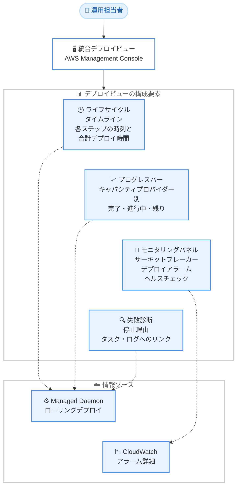

# Amazon ECS - ECS Managed Daemons のデプロイ可観測性ビュー (AWS Management Console)

**リリース日**: 2026 年 9 月 16 日
**サービス**: Amazon Elastic Container Service (Amazon ECS)
**機能**: ECS Managed Daemons の統合デプロイビュー (AWS Management Console)

📊 [このアップデートのインフォグラフィックを見る](https://takech9203.github.io/aws-news-summary/20260916-amazon-ecs-daemon-deployment-console.html)

## 概要

Amazon ECS が、AWS Management Console 上で ECS Managed Daemons の統合デプロイビューの提供を開始しました。このビューにより、デーモンのデプロイがどこまで進行しているか、何が失敗しているか、そして何がデプロイを停止させうるかを単一の画面で確認できるようになります。

ECS Managed Daemons は、Amazon ECS Managed Instances 上のコンテナインフラストラクチャ全体に、セキュリティ、可観測性、ネットワーキングなどのソフトウェアエージェントをデプロイ・管理するための機能です。デーモンのライフサイクル管理をアプリケーション運用から分離し、ワークロードの再デプロイやサービス間の変更調整なしに、エージェントを独立してデプロイ・更新・監視できます。デーモンを新しいタスク定義リビジョンに更新すると、Amazon ECS は関連するキャパシティプロバイダーの全インスタンスに対してローリングデプロイを実行します。

今回のアップデートにより、このローリングデプロイの状況を一目で監視し、ロールアウトの進行中でも完了後のレビューでも、問題を迅速にトラブルシューティングできるようになりました。複数のソースからデプロイステータス情報を収集して組み合わせる必要がなくなります。

**アップデート前の課題**

このアップデート以前は、デーモンデプロイの状況把握に手間がかかっていました。

- デプロイの進行状況、失敗内容、停止要因を確認するには、複数のソースから情報を収集して組み合わせる必要があった
- デーモンタスクが失敗した場合、停止理由の特定やログの確認のために複数の画面を行き来する必要があった
- サーキットブレーカー、デプロイアラーム、コンテナヘルスチェックの状態を個別に確認する必要があり、どの要素がデプロイを停止させうるかを把握しにくかった

**アップデート後の改善**

今回のアップデートにより、デプロイ状況の確認が大幅に効率化されました。

- デプロイの進行状況、失敗内容、停止しうる要因を単一のビューで確認できるようになった
- 各ステップのタイムスタンプと合計デプロイ時間を含むライフサイクルタイムラインで、デプロイの流れ (中断時のロールバックパスを含む) を追跡できるようになった
- デーモンタスクの失敗時に、停止理由、タスク・ログへのリンク、該当するトラブルシューティングガイドが該当キャパシティプロバイダーに直接表示されるようになった

## アーキテクチャ図



統合デプロイビューは、これまで複数のソースに分散していたデプロイ進行状況、モニタリング状態、失敗診断情報を単一の画面に集約して表示します。

## サービスアップデートの詳細

### 主要機能

1. **ライフサイクルタイムライン**
   - デプロイの各ステップのタイムスタンプと合計デプロイ時間を表示
   - デプロイが中断された場合のロールバックパスも表示
   - デプロイがどのフェーズにあるかを時系列で把握可能

2. **キャパシティプロバイダーごとのプログレスバー**
   - 完了済み、進行中、残りのインスタンス数を追跡
   - キャパシティプロバイダーがデーモンから削除された場合の、ドレイン中および置換中のインスタンスも追跡
   - キャパシティプロバイダー単位でロールアウトの進捗を可視化

3. **モニタリングパネル**
   - デプロイサーキットブレーカー、デプロイアラーム、コンテナヘルスチェックの状態を一覧表示
   - ライブの CloudWatch アラーム詳細を表示
   - それぞれの要素がデプロイを停止させうるかどうかを表示

4. **失敗診断**
   - デーモンタスクが失敗すると、影響を受けたキャパシティプロバイダーに停止理由を表示
   - 失敗したタスク、そのログ、該当するトラブルシューティングガイドへのリンクを提供
   - ロールバックをトリガーした失敗も含めて表示

5. **リビジョンとデプロイ設定の詳細**
   - ターゲットリビジョンとソースリビジョンをインスタンス数とともに表示
   - ドレイン率 (同時にドレインするインスタンスの割合) とベイク時間を表示

## 技術仕様

### デプロイビューで確認できる情報

| 項目 | 詳細 |
|------|------|
| ライフサイクルタイムライン | 各ステップのタイムスタンプ、合計デプロイ時間、ロールバックパス |
| プログレスバー | キャパシティプロバイダーごとの完了・進行中・残りインスタンス数 |
| モニタリングパネル | サーキットブレーカー、デプロイアラーム、コンテナヘルスチェックの状態と CloudWatch アラーム詳細 |
| 失敗診断 | 停止理由、タスク・ログ・トラブルシューティングガイドへのリンク |
| リビジョン情報 | ターゲット・ソースリビジョンとインスタンス数 |
| デプロイ設定 | ドレイン率、ベイク時間 |

### ECS Managed Daemons のデプロイの仕組み

| 項目 | 詳細 |
|------|------|
| デプロイ方式 | 関連するキャパシティプロバイダーの全インスタンスに対するローリングデプロイ |
| ドレイン率 | 同時にドレインするインスタンスの割合を設定可能 |
| サーキットブレーカー | 組み込みのサーキットブレーカー保護によりデプロイ失敗時に自動対応 |
| ベイク時間 | 全インスタンスの更新後にデプロイを監視する時間を設定可能 |
| CloudWatch アラーム | アラームに基づく自動ロールバックを設定可能 |
| criticality | critical (デフォルト) は失敗時にインスタンスをドレイン・置換、non-critical はアプリケーションタスクを継続 |

## 設定方法

### 前提条件

1. Amazon ECS Managed Instances キャパシティプロバイダーを使用するクラスターがあること
2. ECS Managed Daemons を作成し、クラスターと 1 つ以上のキャパシティプロバイダーに関連付けていること
3. AWS Management Console へのアクセス権限と、Amazon ECS リソースを参照できる IAM 権限があること

### 手順

#### ステップ 1: デーモンタスク定義の登録とデーモンの作成

```bash
# デーモンタスク定義を登録
aws ecs register-task-definition \
  --cli-input-json file://daemon-task-definition.json
```

コンテナイメージなどデーモンを構成するコンテナを記述したタスク定義を登録します。その後、コンソールまたは CLI からデーモンを作成し、クラスターとキャパシティプロバイダーに関連付けます。

#### ステップ 2: デーモンの更新によるローリングデプロイの開始

新しいタスク定義リビジョンを登録し、デーモンを更新すると、Amazon ECS が関連するキャパシティプロバイダーの全インスタンスに対してローリングデプロイを実行します。ドレイン率、ベイク時間、CloudWatch アラームは事前に設定しておきます。

#### ステップ 3: コンソールでデプロイビューを確認

Amazon ECS コンソールで対象クラスターのデーモンを選択し、デプロイビューを開きます。ライフサイクルタイムライン、キャパシティプロバイダーごとのプログレスバー、モニタリングパネルを確認し、失敗が発生した場合は表示された停止理由とタスク・ログへのリンクから調査します。

## メリット

### ビジネス面

- **障害対応時間の短縮**: デプロイの失敗時に停止理由とログへのリンクが直接表示されるため、問題の特定から解決までの時間を短縮できる
- **運用負荷の軽減**: 複数のソースから情報を収集・突合する作業が不要になり、運用チームの負荷が下がる
- **追加コストなし**: 追加料金なしで利用でき、既存の ECS Managed Daemons ユーザーはすぐに活用できる

### 技術面

- **単一画面での状況把握**: 進行状況、失敗内容、停止要因を 1 か所で確認でき、デプロイの全体像を把握しやすい
- **ロールバックの可視化**: デプロイ中断時のロールバックパスやロールバックをトリガーした失敗がタイムライン上で確認できる
- **安全機構の透明性**: サーキットブレーカー、デプロイアラーム、ヘルスチェックのどれがデプロイを停止させうるかが明示され、デプロイ設定の妥当性を判断しやすい

## デメリット・制約事項

### 制限事項

- コンソール限定のビューであり、API や CLI から同等の統合ビューを取得する機能ではない
- 対象は ECS Managed Daemons のデプロイであり、Amazon ECS Managed Instances 上での利用が前提となる (従来の EC2 起動タイプの DAEMON スケジューリング戦略とは別の機能)

### 考慮すべき点

- モニタリングパネルを最大限活用するには、デプロイアラーム用の CloudWatch アラームやコンテナヘルスチェックを適切に設定しておく必要がある
- 自動化やプログラムからの監視が必要な場合は、EventBridge イベントやサービスアクションログなど既存の仕組みと組み合わせて利用する

## ユースケース

### ユースケース 1: セキュリティエージェントの全クラスター更新の監視

**シナリオ**: セキュリティチームの要請により、全インスタンスで稼働するセキュリティエージェントを新バージョンへ更新する。更新の進捗と安全性をリアルタイムで確認したい。

**実装例**:
```
1. セキュリティエージェントの新しいタスク定義リビジョンを登録
2. デーモンを更新してローリングデプロイを開始
3. コンソールのデプロイビューでキャパシティプロバイダーごとの
   プログレスバーとモニタリングパネルを監視
```

**効果**: 完了・進行中・残りのインスタンス数が一目でわかり、CloudWatch アラームの状態もライブで確認できるため、大規模な更新でも安心してロールアウトを進められる。

### ユースケース 2: デプロイ失敗時の迅速なトラブルシューティング

**シナリオ**: 可観測性エージェントのデプロイ中に一部のキャパシティプロバイダーでデーモンタスクが起動に失敗した。原因を特定して修正したい。

**実装例**:
```
1. デプロイビューで影響を受けたキャパシティプロバイダーを確認
2. 表示された停止理由を確認
3. リンクから失敗したタスクとログに直接移動
4. 該当するトラブルシューティングガイドを参照して修正
```

**効果**: 複数の画面を行き来せずに停止理由からログ、トラブルシューティングガイドまで一直線にたどれるため、原因特定にかかる時間を大幅に短縮できる。

### ユースケース 3: ロールバック発生後の事後レビュー

**シナリオ**: 夜間に実施したデーモン更新が CloudWatch アラームにより自動ロールバックされた。翌朝、何が起きたかをレビューして再発防止策を検討したい。

**実装例**:
```
1. デプロイビューのライフサイクルタイムラインを開く
2. 各ステップのタイムスタンプとロールバックパスを確認
3. ロールバックをトリガーした失敗とアラームの詳細を確認
4. ドレイン率やベイク時間などのデプロイ設定を見直す
```

**効果**: デプロイ完了後でも中断・ロールバックの経緯を時系列で振り返ることができ、根拠に基づいた再発防止策の立案につながる。

## 料金

このデプロイビューは追加料金なしで利用できます。Amazon ECS Managed Instances など、基盤となるリソースには通常の料金が適用されます。

## 利用可能リージョン

すべての AWS 商用リージョンで利用可能です。

## 関連サービス・機能

- **Amazon ECS Managed Instances**: ECS Managed Daemons の前提となるフルマネージドなコンピューティングオプション。デーモンはこのキャパシティプロバイダー経由でプロビジョニングされる EC2 インスタンス上で稼働する
- **Amazon CloudWatch**: デプロイアラームの評価に使用され、モニタリングパネルにライブのアラーム詳細が表示される
- **Amazon EventBridge**: デーモンタスクの起動失敗時にイベントが発行され、プログラムによる検知・自動化に利用できる
- **ECS デプロイサーキットブレーカー**: デプロイ失敗を検知して自動的にロールアウトを停止・ロールバックする組み込みの保護機構

## 参考リンク

- 📊 [インフォグラフィック](https://takech9203.github.io/aws-news-summary/20260916-amazon-ecs-daemon-deployment-console.html)
- [公式発表 (What's New)](https://aws.amazon.com/about-aws/whats-new/2026/09/amazon-ecs-daemon-deployment-console/)
- [ドキュメント: Amazon ECS Managed Daemons](https://docs.aws.amazon.com/AmazonECS/latest/developerguide/managed-daemons.html)
- [Amazon ECS 製品ページ](https://aws.amazon.com/ecs/)

## まとめ

ECS Managed Daemons の統合デプロイビューにより、デーモンのローリングデプロイの進行状況、失敗内容、停止要因を単一の画面で確認できるようになりました。ECS Managed Instances と Managed Daemons を利用しているチームは、追加設定なしにコンソールから新しいビューを利用できるため、次回のデーモン更新時にライフサイクルタイムラインとモニタリングパネルを確認することをおすすめします。あわせて、デプロイアラームやヘルスチェックを整備しておくことで、このビューの価値を最大限に引き出せます。
