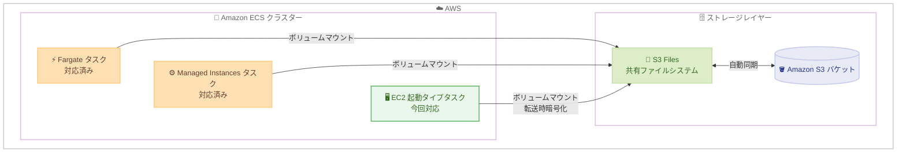

# Amazon ECS - Amazon S3 Files の EC2 起動タイプ対応

**リリース日**: 2026 年 9 月 16 日
**サービス**: Amazon Elastic Container Service (Amazon ECS)
**機能**: Amazon S3 Files の Amazon EC2 起動タイプサポート

📊 [このアップデートのインフォグラフィックを見る](https://takech9203.github.io/aws-news-summary/20260916-amazon-ecs-s3-files-ec2.html)

## 概要

Amazon ECS が、EC2 起動タイプを使用するタスクで Amazon S3 Files をサポートしました。これにより、EC2 インスタンス上で実行されるコンテナ化されたアプリケーションが、S3 のデータに共有ファイルシステムとして直接接続できるようになります。

Amazon S3 Files は Amazon EFS を基盤として構築された共有ファイルシステムで、AWS のコンピューティングリソースと S3 のデータを直接接続します。データを S3 の外に出すことなく、完全なファイルシステムセマンティクスと低レイテンシーのパフォーマンスを提供します。S3 バケット内の新規データと既存データの両方に対応するため、データ移行は不要です。

S3 Files のサポートは、これまで AWS Fargate と Amazon ECS Managed Instances で利用可能でしたが、今回のアップデートで EC2 起動タイプにも拡大されました。これにより、ECS の 3 つの起動タイプすべてで一貫した S3 データアクセスが実現します。ファイルベースのアプリケーション、AI エージェント、データ処理ワークロードなどが、コードを変更することなく、ファイルの複製やステージングなしで S3 データを直接操作できます。

**アップデート前の課題**

- EC2 起動タイプの ECS タスクから S3 データをファイルとして扱うには、事前に S3 からファイルをダウンロード (ステージング) するか、アプリケーションを S3 API に対応させる改修が必要だった
- Fargate や Managed Instances では S3 Files を利用できたが、EC2 起動タイプでは利用できず、起動タイプ間で構成が統一できなかった
- ファイルシステム前提のレガシーアプリケーションを EC2 上のコンテナで動かす場合、S3 データの複製によるストレージコストや同期の複雑さが発生していた

**アップデート後の改善**

- EC2 起動タイプのタスク定義で S3 Files ボリュームをマウントし、標準的なファイル操作で S3 バケットのデータを読み書きできるようになった
- Fargate、Managed Instances、EC2 の 3 つの起動タイプすべてで S3 Files を利用でき、一貫したアーキテクチャを構成できるようになった
- コード変更やファイルの複製・ステージングが不要になり、S3 の既存データをそのまま活用できるようになった

## アーキテクチャ図



ECS の 3 つの起動タイプすべてのタスクが S3 Files ボリュームをマウントでき、S3 Files がファイルシステムと S3 バケットを自動的に同期します。今回のアップデートで EC2 起動タイプ (緑色) が新たに対応しました。

## サービスアップデートの詳細

### 主要機能

1. **EC2 起動タイプでの S3 Files ボリュームマウント**
   - タスク定義で S3 ファイルシステムをボリュームとして定義し、コンテナから S3 バケットのデータに直接ファイルシステムアクセスできる
   - 標準的なファイル・ディレクトリ操作でデータの読み取り、書き込み、整理が可能
   - S3 Files がファイルシステムと S3 バケットの同期を自動的に維持する

2. **全起動タイプでの一貫したサポート**
   - Fargate: 完全サポート (対応済み)
   - Amazon ECS Managed Instances: 完全サポート (対応済み)
   - Amazon EC2: 完全サポート (今回のアップデートで追加)

3. **コード変更不要のデータアクセス**
   - ファイルベースのアプリケーション、AI エージェント、データ処理ワークロードがコード変更なしで S3 データを操作可能
   - ファイルの複製や事前ステージングが不要
   - S3 バケット内の新規・既存データの両方に対応し、データ移行は不要

4. **セキュリティの自動適用**
   - 転送時暗号化 (transit encryption) は必須であり、自動的に適用される (無効化オプションなし)
   - タスク IAM ロールも必須であり、自動的に適用される (無効化オプションなし)

## 技術仕様

### s3filesVolumeConfiguration パラメータ

タスク定義では専用の `s3filesVolumeConfiguration` パラメータを使用します。

| パラメータ | 型 | 必須 | 説明 |
|------|------|------|------|
| `fileSystemArn` | String | はい | マウントする S3 ファイルシステムの完全な ARN |
| `rootDirectory` | String | いいえ | ボリュームのルートとしてマウントするディレクトリ。デフォルトは `/` |
| `transitEncryptionPort` | Integer | いいえ | ECS ホストと S3 ファイルシステム間の暗号化データ送信に使用するポート。転送時暗号化自体は常に有効 |
| `accessPointArn` | String | いいえ | 使用する S3 Files アクセスポイントの完全な ARN。アプリケーション固有のアクセス制御を適用する場合に指定 |

### ファイルシステム ARN の形式

S3 ファイルシステムの識別には完全な ARN が必要です。

```text
arn:{partition}:s3files:{region}:{account-id}:file-system/fs-xxxxx
```

### タスク定義の設定例

```json
{
  "family": "s3files-ec2-task",
  "requiresCompatibilities": ["EC2"],
  "taskRoleArn": "arn:aws:iam::123456789012:role/ecsS3FilesTaskRole",
  "volumes": [
    {
      "name": "s3-data",
      "s3filesVolumeConfiguration": {
        "fileSystemArn": "arn:aws:s3files:ap-northeast-1:123456789012:file-system/fs-xxxxx",
        "rootDirectory": "/"
      }
    }
  ],
  "containerDefinitions": [
    {
      "name": "app",
      "image": "my-app:latest",
      "mountPoints": [
        {
          "sourceVolume": "s3-data",
          "containerPath": "/mnt/s3data",
          "readOnly": false
        }
      ]
    }
  ]
}
```

## 設定方法

### 前提条件

1. **S3 ファイルシステムとマウントターゲット**: S3 バケットに関連付けられた S3 ファイルシステムを作成済みであること
2. **タスク IAM ロール**: S3 ファイルシステムへの接続・操作権限、および S3 オブジェクトの読み取り権限を持つタスク IAM ロールをタスク定義に含めること (必須)
3. **VPC とセキュリティグループの設定**: ECS タスクが実行される VPC およびサブネットから S3 ファイルシステムにアクセスできること
4. **(オプション) S3 Files アクセスポイント**: アプリケーション固有のアクセス制御を適用する場合は、アクセスポイントを作成して ARN をタスク定義に指定すること

### 手順

#### ステップ 1: S3 ファイルシステムの作成

S3 コンソールまたは AWS CLI で、対象の S3 バケットに関連付けた S3 ファイルシステムを作成します。作成方法の詳細は [Amazon S3 Files ユーザーガイド](https://docs.aws.amazon.com/AmazonS3/latest/userguide/) を参照してください。

#### ステップ 2: タスク IAM ロールの準備

S3 ファイルシステムへの接続と S3 オブジェクトの読み取りを許可する IAM ロールを作成します。詳細な権限設定は [S3 Files の前提条件ドキュメント](https://docs.aws.amazon.com/AmazonS3/latest/userguide/s3-files-prereq-policies.html#s3-files-prereq-iam-compute-role) を参照してください。

#### ステップ 3: タスク定義への S3 Files ボリュームの追加

```bash
aws ecs register-task-definition \
  --cli-input-json file://task-definition.json
```

`s3filesVolumeConfiguration` を含むタスク定義 JSON (前述の設定例を参照) を指定して、新しいタスク定義を登録します。

#### ステップ 4: EC2 起動タイプでのタスク実行

```bash
aws ecs run-task \
  --cluster my-cluster \
  --launch-type EC2 \
  --task-definition s3files-ec2-task
```

EC2 起動タイプを指定してタスクを実行します。コンテナ内の `mountPoints` で指定したパスから S3 データにファイルとしてアクセスできます。

## メリット

### ビジネス面

- **既存アプリケーションの活用**: ファイルシステム前提のレガシーアプリケーションをコード変更なしでコンテナ化し、S3 データと連携できるため、モダナイゼーションのコストを削減できる
- **ストレージコストの最適化**: S3 からのファイル複製やステージングが不要になり、重複データの保持コストと同期運用の手間を削減できる
- **移行不要の導入**: S3 バケット内の既存データをそのまま利用できるため、データ移行プロジェクトなしで導入できる

### 技術面

- **全起動タイプでの一貫性**: Fargate、Managed Instances、EC2 のすべてで同じ S3 Files ボリューム構成を利用でき、起動タイプの選択や移行が容易になる
- **低レイテンシーのファイルアクセス**: データが S3 から出ることなく、完全なファイルシステムセマンティクスと低レイテンシーのパフォーマンスを利用できる
- **セキュリティの標準適用**: 転送時暗号化とタスク IAM ロールが必須として自動適用されるため、セキュアな構成が保証される

## デメリット・制約事項

### 制限事項

- S3 ファイルシステムの指定には完全な ARN が必要 (ファイルシステム ID のみでは指定不可)
- 転送時暗号化は必須であり、無効化するオプションはない
- タスク IAM ロールは必須であり、省略できない

### 考慮すべき点

- 事前に S3 ファイルシステムとマウントターゲットを作成し、S3 バケットと関連付けておく必要がある
- ECS タスクが実行される VPC・サブネットから S3 ファイルシステムへのネットワーク到達性 (セキュリティグループ設定を含む) を確保する必要がある
- アプリケーションごとにアクセス制御を分離したい場合は、S3 Files アクセスポイントの設計が必要になる

## ユースケース

### ユースケース 1: レガシーなファイルベースアプリケーションのコンテナ化

**シナリオ**: ローカルファイルシステムへの読み書きを前提とした既存のバッチアプリケーションを、EC2 ベースの ECS クラスターでコンテナとして実行し、入出力データは S3 で管理したい。

**実装例**:
```json
{
  "volumes": [
    {
      "name": "batch-data",
      "s3filesVolumeConfiguration": {
        "fileSystemArn": "arn:aws:s3files:ap-northeast-1:123456789012:file-system/fs-batch01",
        "rootDirectory": "/batch"
      }
    }
  ]
}
```

**効果**: アプリケーションコードを変更せずに S3 のデータを直接読み書きでき、S3 の耐久性とスケーラビリティを活用しながらコンテナ化を実現できる。

### ユースケース 2: AI エージェントによる S3 データの直接操作

**シナリオ**: EC2 起動タイプの ECS 上で動作する AI エージェントが、S3 に蓄積されたドキュメントや成果物をファイルとして参照・生成する。

**実装例**:
```json
{
  "mountPoints": [
    {
      "sourceVolume": "agent-workspace",
      "containerPath": "/workspace",
      "readOnly": false
    }
  ]
}
```

**効果**: エージェントは通常のファイル操作で S3 データにアクセスでき、S3 API 連携の実装やファイルのステージング処理が不要になる。

### ユースケース 3: 起動タイプ混在環境でのデータ共有

**シナリオ**: GPU 搭載 EC2 インスタンス上のタスクと Fargate 上のタスクが混在するワークロードで、同一の S3 データセットを共有ファイルシステムとして参照したい。

**実装例**:
```json
{
  "s3filesVolumeConfiguration": {
    "fileSystemArn": "arn:aws:s3files:ap-northeast-1:123456789012:file-system/fs-shared01",
    "accessPointArn": "arn:aws:s3files:ap-northeast-1:123456789012:access-point/ap-xxxxx"
  }
}
```

**効果**: すべての起動タイプで同じボリューム構成を使い回せるため、ワークロードの特性に応じた起動タイプの選択とデータ共有を両立できる。

## 料金

S3 Files 機能自体に対する ECS 側の追加料金に関する記載は公式発表にはありません。EC2 起動タイプの場合、ECS 自体の追加料金はなく、使用する EC2 インスタンスなどの AWS リソースに対して課金されます。S3 Files の利用料金については [Amazon S3 の料金ページ](https://aws.amazon.com/s3/pricing/) を確認してください。

## 利用可能リージョン

すべての AWS 商用リージョンおよび AWS GovCloud (US) リージョンで利用可能です (東京・大阪リージョンを含む)。

## 関連サービス・機能

- **Amazon S3**: S3 Files の基盤となるオブジェクトストレージ。ファイルシステムと S3 バケットが自動的に同期される
- **Amazon EFS**: S3 Files が基盤として利用しているマネージドファイルシステム。既存の EFS ボリュームサポートと同様の考え方で ECS タスクにマウントできる
- **AWS Fargate / Amazon ECS Managed Instances**: 先行して S3 Files に対応していた起動タイプ。今回の EC2 対応により全起動タイプで構成が統一できる
- **AWS IAM**: S3 Files ボリュームの利用にはタスク IAM ロールが必須であり、ファイルシステムへのアクセス制御を担う

## 参考リンク

- 📊 [インフォグラフィック](https://takech9203.github.io/aws-news-summary/20260916-amazon-ecs-s3-files-ec2.html)
- [公式発表 (What's New)](https://aws.amazon.com/about-aws/whats-new/2026/09/amazon-ecs-s3-files-ec2/)
- [ドキュメント: Configuring S3 Files for Amazon ECS](https://docs.aws.amazon.com/AmazonECS/latest/developerguide/s3files-volumes.html)
- [Amazon S3 Files ユーザーガイド](https://docs.aws.amazon.com/AmazonS3/latest/userguide/)
- [Amazon ECS 製品ページ](https://aws.amazon.com/ecs/)
- [料金ページ (Amazon S3)](https://aws.amazon.com/s3/pricing/)

## まとめ

今回のアップデートにより、Amazon S3 Files が ECS の全起動タイプ (Fargate、Managed Instances、EC2) で利用可能になり、EC2 ベースのコンテナワークロードでも S3 データをコード変更なしにファイルとして直接操作できるようになりました。ファイルシステム前提のアプリケーションのコンテナ化や、AI エージェント・データ処理ワークロードでの S3 活用を検討している場合は、S3 ファイルシステムとタスク IAM ロールを準備し、タスク定義への `s3filesVolumeConfiguration` の追加を試すことを推奨します。
