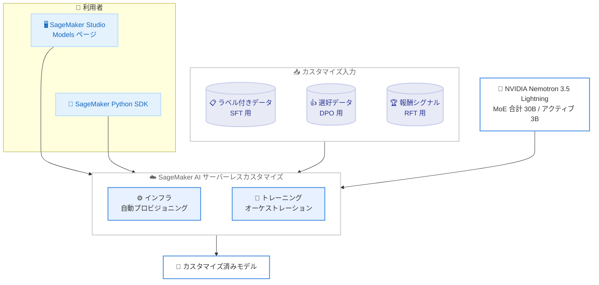

# Amazon SageMaker AI - NVIDIA Nemotron 3.5 Lightning のサーバーレスモデルカスタマイズ対応

**リリース日**: 2026 年 9 月 16 日
**サービス**: Amazon SageMaker AI
**機能**: NVIDIA Nemotron 3.5 Lightning モデルのサーバーレスモデルカスタマイズ (SFT / DPO / RFT)

📊 [このアップデートのインフォグラフィックを見る](https://takech9203.github.io/aws-news-summary/20260916-amazon-sagemaker-ft-nemotron-3-5-lightning.html)
<!-- INFOGRAPHIC_BASE_URL は環境変数から取得 -->

## 概要

Amazon SageMaker AI が、NVIDIA Nemotron 3.5 Lightning モデルのサーバーレスモデルカスタマイズに対応しました。カスタマイズ手法として、教師ありファインチューニング (SFT: Supervised Fine-Tuning)、Direct Preference Optimization (DPO)、強化ファインチューニング (RFT: Reinforcement Fine-Tuning) の 3 種類が利用できます。Nemotron 3.5 Lightning は NVIDIA の最新オープンウェイトモデルの 1 つで、アクティブパラメータ 3B、合計パラメータ 30B のハイブリッド Mixture-of-Experts (MoE) アーキテクチャを採用しています。これまで SageMaker AI 上でこのモデルをデプロイすることは可能でしたが、今回のアップデートにより、独自のドメインやワークフローに合わせてモデルを適応させられるようになりました。

モデルカスタマイズを利用すると、独自データを使って基盤モデルを調整し、小規模なモデルでも特定タスクにおいてフロンティアモデルに近い品質を実現しながら、コストとレイテンシを削減できます。ラベル付きデータを用いた SFT によるドメイン固有タスクの精度向上、選好データを用いた DPO による組織のトーンに合わせた出力調整、報酬シグナルを用いた RFT による新しいタスクの性能強化が可能です。サーバーレスカスタマイズでは、SageMaker AI がインフラのプロビジョニングとトレーニングのオーケストレーションをすべて処理するため、クラスター管理ではなくデータと評価に集中でき、利用した分だけの従量課金となります。

このアップデートは、高スループットのエージェントワークロード向けに軽量かつ高性能なモデルを求めるデータサイエンティストや機械学習エンジニア、ドメイン特化の生成 AI を低コストで運用したい企業にとって有用です。

**アップデート前の課題**

- Nemotron 3.5 Lightning は SageMaker JumpStart からデプロイ可能でしたが、独自データによるカスタマイズには対応していませんでした。
- 大規模モデルのファインチューニングには、トレーニング用クラスターのプロビジョニングや管理が必要で、運用負荷が高くなっていました。
- 汎用モデルのままでは、ドメイン固有タスクの精度や組織のトーンへの適合に限界があり、より大規模で高コストなモデルに頼る必要がありました。

**アップデート後の改善**

- 今回のアップデートにより、Nemotron 3.5 Lightning を SFT、DPO、RFT の 3 手法で独自データにカスタマイズできるようになりました。
- サーバーレス方式により、インフラのプロビジョニングとトレーニングのオーケストレーションを SageMaker AI に任せられるようになりました。
- 小規模モデルを特定タスクに適応させることで、フロンティアモデルに近い品質をより低いコストとレイテンシで実現できるようになりました。

## アーキテクチャ図



SageMaker Studio または Python SDK からカスタマイズジョブを起動すると、SageMaker AI が目的に応じたデータ (ラベル付きデータ、選好データ、報酬シグナル) を用いてインフラのプロビジョニングとトレーニングを自動で行い、Nemotron 3.5 Lightning を独自ドメインに適応させたモデルを生成します。

## サービスアップデートの詳細

### 主要機能

1. **NVIDIA Nemotron 3.5 Lightning のサーバーレスカスタマイズ**
   - アクティブパラメータ 3B、合計パラメータ 30B のハイブリッド MoE アーキテクチャを採用した NVIDIA の最新オープンウェイトモデルをカスタマイズ対象とします。
   - デプロイだけでなく、独自のドメインやワークフローへの適応が可能になりました。
   - インフラ管理を SageMaker AI に任せ、データと評価に集中できます。

2. **教師ありファインチューニング (SFT)**
   - ラベル付きデータを用いて、ドメイン固有タスクの精度を向上させます。
   - 専門用語や業務知識を必要とするタスクへの適応に活用できます。

3. **Direct Preference Optimization (DPO)**
   - 選好データ (望ましい応答と望ましくない応答のペア) を用いて、組織のトーンやスタイルに合わせた出力調整を行います。
   - 報酬モデルを別途構築することなく、人間の選好を直接学習に反映できます。

4. **強化ファインチューニング (RFT)**
   - 報酬シグナルに基づく学習により、新しいタスクへの性能を強化します。
   - 正解データの用意が難しいタスクでも、評価基準を報酬として与えることで性能を高められます。

## 技術仕様

### モデルとカスタマイズ手法

| 項目 | 詳細 |
|------|------|
| 対象モデル | NVIDIA Nemotron 3.5 Lightning (オープンウェイト) |
| アーキテクチャ | ハイブリッド Mixture-of-Experts (MoE) |
| パラメータ数 | 合計 30B / アクティブ 3B |
| カスタマイズ手法 | SFT (ラベル付きデータ)、DPO (選好データ)、RFT (報酬シグナル) |
| インフラ管理 | サーバーレス (プロビジョニング・オーケストレーションは SageMaker AI が実施) |
| 課金方式 | 従量課金 (利用した分のみ) |
| 起動方法 | SageMaker Studio の Models ページ、または SageMaker Python SDK |

### カスタマイズ手法の使い分け

| 手法 | 必要なデータ | 主な目的 |
|------|--------------|----------|
| SFT | ラベル付きデータ (入力と期待出力のペア) | ドメイン固有タスクの精度向上 |
| DPO | 選好データ (応答の優劣ペア) | 組織のトーン・スタイルへの出力調整 |
| RFT | 報酬シグナル (評価基準) | 新しいタスクにおける性能強化 |

## 設定方法

### 前提条件

1. Amazon SageMaker AI を利用可能な AWS アカウント
2. カスタマイズ手法に応じたデータ (SFT 用のラベル付きデータ、DPO 用の選好データ、RFT 用の報酬シグナル)
3. 対応リージョンでの SageMaker Studio または SageMaker Python SDK の利用環境

### 手順

#### ステップ 1: SageMaker Studio からカスタマイズジョブを起動

Amazon SageMaker Studio の Models ページに移動し、NVIDIA Nemotron 3.5 Lightning を選択してカスタマイズジョブを起動します。データセットとカスタマイズ手法 (SFT / DPO / RFT) を指定すると、SageMaker AI が自動でトレーニングを実行します。

#### ステップ 2: SageMaker Python SDK でプログラムから実行

```bash
# SageMaker Python SDK のインストール
pip install --upgrade sagemaker
```

SageMaker Python SDK をインストールまたは更新します。SDK を使うことで、ノートブックやスクリプトからプログラム的にカスタマイズジョブを定義・起動できます。詳細はモデルカスタマイズのドキュメントを参照してください。

#### ステップ 3: カスタマイズ済みモデルの評価とデプロイ

トレーニング完了後、カスタマイズ済みモデルを評価し、SageMaker AI 上にデプロイして推論エンドポイントとして利用します。

## メリット

### ビジネス面

- **コスト・レイテンシの削減**: 小規模モデルを特定タスクに適応させることで、フロンティアモデルに近い品質を低コスト・低レイテンシで実現できます。
- **運用負荷の軽減**: クラスター管理が不要になり、データ準備やモデル評価といった本質的な作業に集中できます。
- **コスト最適化**: 利用した分だけの従量課金のため、アイドル状態のインフラコストを抑えられます。

### 技術面

- **3 種類のカスタマイズ手法**: SFT、DPO、RFT に対応し、データの種類や目的に応じた最適な手法を選択できます。
- **効率的な MoE アーキテクチャ**: 合計 30B パラメータの能力をアクティブ 3B で実行する Nemotron 3.5 Lightning を、独自データでさらに最適化できます。
- **スケーラビリティ**: SageMaker AI がトレーニングのオーケストレーションを自動で行い、規模に応じたリソースを確保します。

## デメリット・制約事項

### 制限事項

- 利用可能リージョンは 4 リージョンに限られます (後述)。
- 高品質なカスタマイズには、手法に応じて適切に準備されたデータ (ラベル付きデータ、選好データ、報酬シグナル) が必要です。

### 考慮すべき点

- SFT、DPO、RFT で必要なデータ形式や評価方法が異なるため、目的に応じた手法選択が重要です。
- 従量課金のため、トレーニングデータ量やジョブ実行回数に応じたコスト見積もりが必要です。
- カスタマイズ後のモデルは、デプロイ前に評価データセットで品質を検証することが推奨されます。

## ユースケース

### ユースケース 1: ドメイン固有の精度向上 (SFT)

**シナリオ**: 医療や金融など専門用語が多い分野で、汎用モデルでは精度が不足する場合に、業界固有のラベル付きデータで SFT を実施します。

**効果**: ドメイン固有タスクにおける回答精度が向上し、大規模モデルを使わずに専門領域での実用性を高められます。

### ユースケース 2: 組織のトーンへの出力調整 (DPO)

**シナリオ**: カスタマーサポートのチャットボットで、自社のブランドガイドラインに沿った応答トーンを実現したい場合に、望ましい応答と望ましくない応答のペアからなる選好データで DPO を行います。

**効果**: ブランドに一貫した応答が可能になり、顧客体験の質が向上します。

### ユースケース 3: 高スループットエージェントのタスク特化 (RFT)

**シナリオ**: 常時稼働型のエージェントワークロードで、既存モデルが対応していない独自タスクに対し、タスクの成否を報酬シグナルとして RFT を行い性能を高めます。

**効果**: アクティブ 3B の軽量モデルで新規タスクの性能が強化され、高スループットが求められるエージェント処理を低コストで運用できます。

## 料金

サーバーレスモデルカスタマイズは従量課金制で、利用したリソース分のみが課金されます。クラスターのプロビジョニングや管理に伴う固定コストは発生しません。具体的な料金は使用量やリージョンによって異なるため、最新の料金は Amazon SageMaker AI の料金ページを参照してください。

## 利用可能リージョン

NVIDIA Nemotron 3.5 Lightning のサーバーレスモデルカスタマイズは、以下のリージョンで利用可能です。

- 米国東部 (バージニア北部)
- 米国西部 (オレゴン)
- アジアパシフィック (東京)
- 欧州 (アイルランド)

## 関連サービス・機能

- **Amazon SageMaker Studio**: Models ページからカスタマイズジョブを起動する統合開発環境です。
- **SageMaker Python SDK**: プログラムからカスタマイズジョブを定義・実行するための SDK です。
- **Amazon SageMaker JumpStart**: Nemotron 3.5 Lightning のデプロイ元となるモデルカタログです (2026 年 8 月に提供開始)。
- **NVIDIA Nemotron 3 Nano**: 2026 年 6 月にサーバーレスカスタマイズ対応した先行モデルで、今回の対象モデル拡大の前例です。

## 参考リンク

- 📊 [インフォグラフィック](https://takech9203.github.io/aws-news-summary/20260916-amazon-sagemaker-ft-nemotron-3-5-lightning.html)
- [公式発表 (What's New)](https://aws.amazon.com/about-aws/whats-new/2026/09/amazon-sagemaker-ft-nemotron-3-5-lightning/)
- [ドキュメント (モデルカスタマイズ)](https://docs.aws.amazon.com/sagemaker/latest/dg/customizing-models.html)
- [SageMaker Python SDK](https://sagemaker.readthedocs.io/)

## まとめ

今回のアップデートにより、ハイブリッド MoE アーキテクチャの NVIDIA Nemotron 3.5 Lightning を SFT / DPO / RFT の 3 手法でサーバーレスにカスタマイズできるようになり、インフラ管理の負担なく軽量かつ高性能なドメイン特化モデルを構築できます。東京リージョンでも利用可能なため、低コスト・低レイテンシの生成 AI 活用を検討している場合は、SageMaker Studio の Models ページまたは Python SDK からカスタマイズジョブを試してみることをお勧めします。
