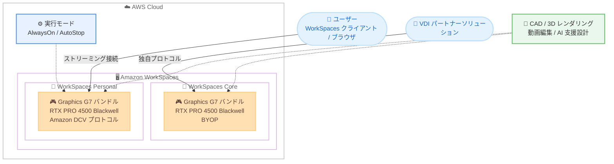

# Amazon WorkSpaces - NVIDIA Blackwell GPU 搭載 Graphics G7 バンドルのサポート

**リリース日**: 2026 年 9 月 16 日
**サービス**: Amazon WorkSpaces (Personal / Core)
**機能**: Graphics G7 バンドル (NVIDIA RTX PRO 4500 Blackwell Server Edition GPU) のサポート

📊 [このアップデートのインフォグラフィックを見る](https://takech9203.github.io/aws-news-summary/20260916-amazon-workspaces-nvidia-blackwell-gpu-instances.html)

## 概要

Amazon WorkSpaces Personal および WorkSpaces Core が、NVIDIA RTX PRO 4500 Blackwell Server Edition GPU と Intel Xeon 6 プロセッサを搭載した Graphics G7 バンドルをサポートしました。Graphics G7 バンドルは、前世代の Graphics G6 バンドルと比較して、グラフィックス集約型ワークロードで最大 2.1 倍のパフォーマンス向上を実現します。

バンドルサイズは 4 種類が提供され、8 vCPU / 32 GB メモリ / 1 GPU から、48 vCPU / 192 GB メモリ / 2 GPU までの範囲から選択できます。各 GPU は 32 GB の GDDR7 GPU メモリを搭載しており、より大規模で複雑な 3D シーンやモデルの処理に対応します。CAD/CAM、3D レンダリング、科学技術可視化、動画編集、AI 支援設計といった高負荷なプロフェッショナルアプリケーションを、より高い忠実度とフレームレートで利用できます。

Graphics G7 バンドルは Windows (BYOL を含む) で利用でき、AlwaysOn と AutoStop の両方の実行モードをサポートします。WorkSpaces コンソールでワークスペース作成時に Graphics G7 バンドルを選択するか、WorkSpaces Core パートナーソリューション経由で利用を開始できます。なお、2026 年 9 月 3 日には Amazon WorkSpaces Applications (旧 AppStream 2.0) でも Graphics G7 インスタンスがサポートされており、今回のアップデートで永続的な仮想デスクトップである WorkSpaces Personal でも最新世代 GPU が利用可能になりました。

**アップデート前の課題**

- WorkSpaces で利用できる最上位の GPU バンドルは Graphics G6 世代 (NVIDIA L4 GPU、GPU メモリ 24 GiB) までであり、最新世代 GPU の性能を活用できなかった
- 大規模な 3D シーンや高解像度モデルを扱う場合、GPU メモリ容量がボトルネックとなり、フレームレートや描画品質が制限されることがあった
- 既存の GPU バンドルは 1 GPU 構成までであり、マルチ GPU を必要とするワークロードに対応できなかった

**アップデート後の改善**

- NVIDIA Blackwell アーキテクチャの RTX PRO 4500 GPU により、Graphics G6 比で最大 2.1 倍のグラフィックス性能を利用可能になった
- GPU あたり 32 GB の GDDR7 メモリにより、より大規模で複雑な 3D シーン・モデルを扱えるようになった
- 8 vCPU / 32 GB / 1 GPU から 48 vCPU / 192 GB / 2 GPU までの 4 サイズから、ワークロード規模に応じた柔軟な選択が可能になった

## アーキテクチャ図



WorkSpaces Personal では Amazon DCV プロトコル、WorkSpaces Core では BYOP (Bring Your Own Protocol) を通じて、Graphics G7 バンドル上の高負荷アプリケーションをユーザーに配信する構成です。ユーザーはローカルに高性能 GPU を持たなくても、Blackwell GPU の性能を仮想デスクトップとして利用できます。

## サービスアップデートの詳細

### 主要機能

1. **NVIDIA RTX PRO 4500 Blackwell Server Edition GPU の採用**
   - 前世代 Graphics G6 バンドル比で、グラフィックス集約型ワークロードにおいて最大 2.1 倍のパフォーマンス向上を実現
   - GPU あたり 32 GB の GDDR7 メモリを搭載し、より大規模で複雑な 3D シーン・モデルの処理に対応
   - CPU には Intel Xeon 6 プロセッサを採用

2. **4 種類のバンドルサイズの提供**
   - Graphics.g7.2xlarge (8 vCPU / 32 GB / 1 GPU) から Graphics.g7.12xlarge (48 vCPU / 192 GB / 2 GPU) までを提供
   - 12xlarge は WorkSpaces の GPU バンドルとして初のマルチ GPU (2 GPU / 64 GB GPU メモリ) 構成
   - Windows Server 2022、Windows Server 2025、Windows 11 をサポート

3. **WorkSpaces Personal と WorkSpaces Core の両方に対応**
   - WorkSpaces Personal では Amazon DCV プロトコルで利用可能
   - WorkSpaces Core では BYOP (Bring Your Own Protocol) として VDI パートナーソリューションと組み合わせて利用可能
   - Windows の BYOL (Bring Your Own License) に対応し、AlwaysOn / AutoStop の両実行モードをサポート

## 技術仕様

### Graphics G7 バンドルの仕様

| バンドル | vCPU | メモリ | GPU 数 | GPU メモリ |
|------|------|------|------|------|
| Graphics.g7.2xlarge | 8 | 32 GiB | 1 | 32 GiB |
| Graphics.g7.4xlarge | 16 | 64 GiB | 1 | 32 GiB |
| Graphics.g7.8xlarge | 32 | 128 GiB | 1 | 32 GiB |
| Graphics.g7.12xlarge | 48 | 192 GiB | 2 | 64 GiB |

### 既存 GPU バンドルとの比較

| 項目 | Graphics G6 | Graphics G7 |
|------|------|------|
| GPU | NVIDIA L4 | NVIDIA RTX PRO 4500 Blackwell Server Edition |
| CPU | 第 3 世代 AMD EPYC (Milan) | Intel Xeon 6 |
| GPU メモリ | 24 GiB | GPU あたり 32 GiB (GDDR7) |
| 最大 GPU 数 | 1 | 2 |
| 性能 | 基準 | 最大 2.1 倍 |
| フラクショナル GPU | あり (G6f / Gr6f) | なし |

### 利用形態

| 項目 | 詳細 |
|------|------|
| 対応サービス | WorkSpaces Personal、WorkSpaces Core |
| プロトコル | Amazon DCV (Personal)、BYOP (Core) |
| 対応 OS | Windows Server 2022、Windows Server 2025、Windows 11 (BYOL 対応) |
| 実行モード | AlwaysOn、AutoStop |
| 対象ワークロード | グラフィックデザイン、CAD/CAM、3D レンダリング、動画トランスコード、ゲームストリーミング、ML モデルトレーニング / AI 推論 |

## 設定方法

### 前提条件

1. AWS アカウントと WorkSpaces の利用環境 (ディレクトリ設定済み) があること
2. 利用リージョンが Graphics G7 の提供リージョン (バージニア北部、オハイオ、オレゴン) であること
3. WorkSpaces Personal の場合は Amazon DCV プロトコルを使用すること (Graphics G7 は PCoIP 非対応)

### 手順

#### ステップ 1: バンドルの確認

```bash
# 利用可能な Graphics G7 バンドルを一覧表示
aws workspaces describe-workspace-bundles \
  --owner AMAZON \
  --query "Bundles[?contains(Name, 'Graphics.g7')]" \
  --region us-east-1
```

Amazon 提供のバンドル一覧から、名前に「Graphics.g7」を含むバンドルを抽出して、バンドル ID と仕様を確認しています。

#### ステップ 2: Graphics G7 ワークスペースの作成

```bash
# Graphics G7 バンドルでワークスペースを作成する例
aws workspaces create-workspaces \
  --workspaces '[{
    "DirectoryId": "d-xxxxxxxxxx",
    "UserName": "designer01",
    "BundleId": "wsb-xxxxxxxxx",
    "WorkspaceProperties": {
      "RunningMode": "AUTO_STOP",
      "RunningModeAutoStopTimeoutInMinutes": 60
    }
  }]' \
  --region us-east-1
```

ステップ 1 で確認した Graphics G7 バンドルの ID を指定してワークスペースを作成しています。実行モードに AutoStop を指定し、未使用時に自動停止させることでコストを最適化しています。WorkSpaces コンソールから作成する場合は、ワークスペース作成ウィザードで Graphics G7 バンドルを選択します。

#### ステップ 3: クライアントからの接続確認

ユーザーは WorkSpaces クライアントまたは Web ブラウザから接続し、CAD や 3D レンダリングなどのアプリケーションの動作とパフォーマンスを確認します。WorkSpaces Core を利用する場合は、パートナーの VDI ソリューション側でプロビジョニングと接続を行います。

## メリット

### ビジネス面

- **ハイエンドワークステーションの集約**: 高価な物理 GPU ワークステーションを配布することなく、最新世代 GPU の性能を永続的な仮想デスクトップとしてリモートユーザーへ提供できる
- **生産性の向上**: 大規模 3D モデルの読み込みや描画が高速化され、設計者・エンジニアの待ち時間を削減できる
- **コストの柔軟性**: AutoStop 実行モードにより、未使用時間帯の課金を抑えながら高性能 GPU 環境を提供できる

### 技術面

- **最大 2.1 倍の性能向上**: Graphics G6 比でグラフィックス性能が大幅に向上し、高フレームレート・高忠実度の描画が可能
- **大容量 GPU メモリ**: GPU あたり 32 GB の GDDR7 メモリにより、従来の 24 GiB では扱いにくかった大規模シーンの処理に対応
- **マルチ GPU 構成**: Graphics.g7.12xlarge では 2 GPU / 64 GB GPU メモリ構成が選択でき、GPU 性能を強く要求するワークロードに対応

## デメリット・制約事項

### 制限事項

- 提供リージョンは現時点でバージニア北部、オハイオ、オレゴンの 3 リージョンのみ (東京リージョンは未対応、今後拡大予定)
- 対応 OS は Windows 系 (Windows Server 2022 / 2025、Windows 11) のみで、Linux ベースのバンドルは提供されていない
- WorkSpaces Personal では Amazon DCV プロトコルのみの対応であり、PCoIP プロトコルでは利用できない
- Graphics G6 の G6f / Gr6f のようなフラクショナル GPU 構成は G7 では提供されていない

### 考慮すべき点

- 上位 GPU バンドルは時間あたり / 月額の料金が高くなるため、実行モード (AlwaysOn / AutoStop) の選択によるコスト管理が重要
- 既存の Graphics G6 で性能要件を満たしているワークロードでは、G7 への移行によるコスト増と性能向上のバランスを評価する必要がある
- 既存ワークスペースからの移行にはバンドル変更またはマイグレーション手順の検討が必要

## ユースケース

### ユースケース 1: 製造業における大規模 CAD/CAM モデルの設計環境

**シナリオ**: 自動車や航空機の設計部門で、大規模なアセンブリモデルを扱う CAD アプリケーションを、専用の仮想デスクトップとしてリモート拠点や在宅勤務の設計者に提供したい。

**実装例**:
```
1. Graphics.g7.8xlarge (32 vCPU / 128 GiB / 1 GPU) のワークスペースを設計者ごとに作成
2. CAD アプリケーションと設計データへのアクセス環境をセットアップ
3. 設計者は自宅の WorkSpaces クライアントから高精細なモデルを操作
```

**効果**: 32 GB の GPU メモリにより従来は分割が必要だった大規模モデルをそのまま扱え、永続的なデスクトップ環境として個人の設定やデータを維持しながら快適な設計作業が可能になる。

### ユースケース 2: 映像制作・動画編集のリモートワークステーション

**シナリオ**: 映像制作会社が、4K 動画編集や 3D レンダリングのワークステーションを社外の編集者にセキュアに提供し、素材データを社外に持ち出させたくない。

**実装例**:
```
1. Graphics.g7.4xlarge のワークスペースを編集者ごとに作成し、AutoStop モードで運用
2. 素材データは Amazon S3 / Amazon FSx に保管し、ワークスペースからのみアクセス
3. 編集者はブラウザまたはクライアントから接続して編集作業を実施
```

**効果**: Blackwell GPU の性能によりプレビューやエンコードの待ち時間を削減しつつ、素材データを AWS 内に留めたセキュアな編集環境を実現できる。AutoStop により作業時間外のコストを抑制できる。

### ユースケース 3: ML モデル開発・AI 推論を伴う開発環境

**シナリオ**: AI 支援設計ツールや ML モデルの開発・検証を行うエンジニアに、GPU 付きの常設開発環境を提供したい。マルチ GPU での検証も必要になる。

**実装例**:
```
1. 通常の開発者には Graphics.g7.2xlarge を割り当て
2. マルチ GPU 検証が必要なエンジニアには Graphics.g7.12xlarge (2 GPU) を割り当て
3. 開発ツールと推論ランタイムをセットアップして利用
```

**効果**: ワークロードに応じて 1 GPU から 2 GPU までのバンドルを使い分けることで、ローカル GPU マシンを調達することなく、ML モデルトレーニングや AI 推論の開発環境を迅速に提供できる。

## 料金

WorkSpaces Personal の料金体系に従い、月額料金または月額基本料金 + 時間料金 (AutoStop モード) で課金されます。Windows ライセンス込みの料金と BYOL の料金が選択できます。WorkSpaces Core は、パートナーソリューションと組み合わせた別体系の料金が適用されます。Graphics G7 バンドルの具体的な料金は、料金ページで利用リージョンを選択して確認してください。

- AlwaysOn (月額課金): 常時実行され、月額固定料金で利用
- AutoStop (時間課金): 月額基本料金 + 利用時間に応じた時間料金。未使用時は自動停止

詳細は [Amazon WorkSpaces Personal 料金ページ](https://aws.amazon.com/workspaces/desktop-as-a-service/pricing/) および [WorkSpaces Core 料金ページ](https://aws.amazon.com/workspaces/vdi-partners/pricing/) を参照してください。

## 利用可能リージョン

- 米国東部 (バージニア北部)
- 米国東部 (オハイオ)
- 米国西部 (オレゴン)

追加リージョンへは今後順次拡大される予定です。

## 関連サービス・機能

- **Amazon EC2 G7 インスタンス**: Graphics G7 バンドルの基盤となる EC2 インスタンスファミリー。NVIDIA RTX PRO 4500 Blackwell GPU と Intel Xeon 6 プロセッサを搭載
- **Amazon WorkSpaces Applications**: 非永続的なアプリケーションストリーミングを提供するサービス。2026 年 9 月 3 日に Graphics G7 インスタンスをサポート済みで、永続デスクトップの WorkSpaces Personal と使い分ける
- **Amazon WorkSpaces Core**: VDI パートナーソリューションと組み合わせて利用できるマネージドインフラストラクチャ。BYOP で Graphics G7 を利用可能
- **Amazon DCV**: WorkSpaces Personal での Graphics G7 のストリーミングを支える高性能プロトコル

## 参考リンク

- 📊 [インフォグラフィック](https://takech9203.github.io/aws-news-summary/20260916-amazon-workspaces-nvidia-blackwell-gpu-instances.html)
- [公式発表 (What's New)](https://aws.amazon.com/about-aws/whats-new/2026/09/amazon-workspaces-nvidia-blackwell-gpu-instances/)
- [WorkSpaces Personal バンドルオプション (ドキュメント)](https://docs.aws.amazon.com/workspaces/latest/adminguide/bundle-options.html)
- [Amazon EC2 G7 インスタンスタイプ](https://aws.amazon.com/ec2/instance-types/g7/)
- [Amazon WorkSpaces Personal 料金ページ](https://aws.amazon.com/workspaces/desktop-as-a-service/pricing/)
- [Amazon WorkSpaces Core 料金ページ](https://aws.amazon.com/workspaces/vdi-partners/pricing/)

## まとめ

Amazon WorkSpaces Personal および WorkSpaces Core が NVIDIA Blackwell 世代の Graphics G7 バンドルに対応し、Graphics G6 比で最大 2.1 倍のグラフィックス性能と GPU あたり 32 GB の GDDR7 メモリを備えた仮想デスクトップが利用可能になりました。CAD/CAM、3D レンダリング、動画編集、AI 推論などの高負荷ワークロードを仮想デスクトップで提供している場合は、対象リージョンでワークスペース作成時に Graphics G7 バンドルを選択し、性能とコストのバランスを検証することを推奨します。
