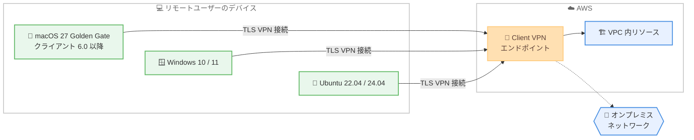

# AWS Client VPN - macOS 27 Golden Gate サポート

**リリース日**: 2026 年 9 月 16 日
**サービス**: AWS Client VPN
**機能**: デスクトップクライアントによる macOS 27 Golden Gate サポート

📊 [このアップデートのインフォグラフィックを見る](https://takech9203.github.io/aws-news-summary/20260916-aws-client-vpn-macos-golden-gate.html)

## 概要

AWS Client VPN のデスクトップクライアントが、クライアントバージョン 6.0 以降で macOS 27 Golden Gate をサポートしました。AWS Client VPN は、リモートワークフォースを AWS 上のネットワークやオンプレミスネットワークへ安全に接続するためのマネージド型 VPN サービスです。

今回のアップデートにより、最新の macOS へアップグレードしたユーザーも、公式デスクトップクライアントを利用して引き続き安全に社内リソースへアクセスできます。デスクトップクライアントは無料で提供されており、[ダウンロードページ](https://aws.amazon.com/vpn/client-vpn-download/)から入手できます。

**アップデート前の課題**

macOS 27 Golden Gate のリリースに伴い、以下の課題がありました。

- 公式クライアントが macOS 27 を正式サポートしておらず、OS アップグレード後の動作が保証されなかった
- 企業の IT 管理者は、公式サポートが提供されるまで従業員の OS アップグレードを保留する必要があった
- 最新 OS の利用と VPN 接続の安定性を両立できなかった

**アップデート後の改善**

今回のアップデートにより、以下が可能になりました。

- クライアントバージョン 6.0 以降で macOS 27 Golden Gate 上での動作が正式にサポートされた
- 従業員が最新の macOS へ安心してアップグレードできるようになった
- IT 管理者は macOS 27 を社内標準環境として計画的に展開できるようになった

## アーキテクチャ図



macOS 27 Golden Gate を含む各対応 OS のデスクトップクライアントから Client VPN エンドポイントへ接続し、VPC 内リソースやオンプレミスネットワークへ安全にアクセスする構成です。

## サービスアップデートの詳細

### 主要機能

1. **macOS 27 Golden Gate の正式サポート**
   - AWS Client VPN デスクトップクライアントのバージョン 6.0 以降で対応
   - 最新の macOS 環境でも公式サポートのもとで VPN 接続が可能
   - クライアントは無料でダウンロード可能

2. **幅広い OS サポートの継続**
   - macOS: 13.0、14.0、15.0、26.0 に加えて 27.0 をサポート
   - Windows: Windows 10 (x64) および Windows 11 (Arm64 / x64) をサポート
   - Linux: Ubuntu 22.04 LTS および 24.04 LTS をサポート

## 技術仕様

### サポート対象プラットフォーム

| プラットフォーム | サポートバージョン |
|------|------|
| macOS | 13.0 / 14.0 / 15.0 / 26.0 / 27.0 (27.0 はクライアント 6.0 以降) |
| Windows | Windows 10 (x64)、Windows 11 (Arm64 / x64) |
| Linux | Ubuntu 22.04 LTS、24.04 LTS |

## 設定方法

### 前提条件

1. AWS Client VPN エンドポイントが構築済みであること
2. 接続に必要なクライアント設定ファイル (.ovpn) が配布されていること
3. macOS 27 Golden Gate を実行する Mac 端末

### 手順

#### ステップ 1: クライアントのダウンロード

[AWS Client VPN ダウンロードページ](https://aws.amazon.com/vpn/client-vpn-download/)から macOS 用クライアントのバージョン 6.0 以降をダウンロードします。

#### ステップ 2: クライアントのインストール

ダウンロードしたインストーラーを実行し、画面の指示に従ってインストールします。既存のバージョンを利用している場合は、6.0 以降へアップデートします。

#### ステップ 3: プロファイルの設定と接続

クライアントを起動し、管理者から配布されたクライアント設定ファイルを取り込んでプロファイルを作成し、接続します。詳細な手順は[ユーザーガイド](https://docs.aws.amazon.com/vpn/latest/clientvpn-user/client-vpn-user-what-is.html)を参照してください。

## メリット

### ビジネス面

- **最新 OS への移行を促進**: 従業員が macOS 27 Golden Gate へ安心してアップグレードでき、最新 OS のセキュリティ強化の恩恵を受けられる
- **IT 管理負荷の軽減**: 公式サポートにより、OS アップグレードに伴う VPN 接続トラブルの問い合わせ対応を削減できる
- **追加コスト不要**: デスクトップクライアントは無料で提供される

### 技術面

- **公式サポートによる安定性**: macOS 27 上での動作が正式にサポートされ、動作保証のない環境で利用するリスクを回避できる
- **マルチプラットフォーム対応**: macOS、Windows、Linux を横断して同一のマネージド VPN サービスを利用できる
- **マネージドサービス**: VPN 基盤の運用は AWS に任せ、クライアント側の更新のみで最新 OS に対応できる

## デメリット・制約事項

### 制限事項

- macOS 27 Golden Gate で利用するには、クライアントバージョン 6.0 以降が必要
- 6.0 未満のクライアントでは macOS 27 の公式サポート対象外となる

### 考慮すべき点

- 組織で古いバージョンのクライアントを配布している場合、macOS 27 への移行前にクライアントの更新計画が必要
- OpenVPN 互換のサードパーティクライアントを利用している場合は、それぞれのベンダーのサポート状況を別途確認する必要がある

## ユースケース

### ユースケース 1: 全社的な macOS アップグレード計画

**シナリオ**: 情報システム部門が、社内の Mac 端末を macOS 27 Golden Gate へ一斉にアップグレードする計画を進めている。

**実装例**:
```
1. MDM 等で AWS Client VPN クライアント 6.0 以降を全 Mac 端末へ配布
2. クライアント更新の完了を確認後、macOS 27 へのアップグレードを許可
3. アップグレード後の VPN 接続を検証
```

**効果**: VPN 接続の中断なく、計画的に最新 OS への移行を完了できる。

### ユースケース 2: リモートワーカーの最新端末対応

**シナリオ**: macOS 27 がプリインストールされた新しい Mac を購入したリモートワーカーが、社内ネットワークへ接続する必要がある。

**実装例**:
```
1. ダウンロードページからクライアント 6.0 以降を入手してインストール
2. 管理者から配布された .ovpn 設定ファイルを取り込み
3. Client VPN エンドポイントへ接続
```

**効果**: 新規端末でも追加の回避策なしに、公式サポートのもとで安全に社内リソースへアクセスできる。

### ユースケース 3: セキュリティポリシーによる最新 OS 必須化

**シナリオ**: セキュリティポリシーで OS を常に最新バージョンへ保つことが義務付けられている組織が、VPN 接続環境を維持したい。

**実装例**:
```
1. クライアントバージョンを 6.0 以降に統一
2. macOS の自動アップデートを有効化し、macOS 27 へ更新
3. コンプライアンスレポートで OS とクライアントのバージョンを確認
```

**効果**: セキュリティポリシーの遵守と VPN 接続の安定運用を両立できる。

## 料金

デスクトップクライアントは無料で提供されます。AWS Client VPN サービス自体の料金は、エンドポイントとサブネットの関連付け時間および接続時間に基づく従量課金です。詳細は[料金ページ](https://aws.amazon.com/vpn/pricing/)を参照してください。

## 利用可能リージョン

本アップデートはクライアントソフトウェアの対応 OS 追加であり、公式発表にリージョンに関する記載はありません。クライアントはダウンロードページから誰でも入手できます。

## 関連サービス・機能

- **AWS Site-to-Site VPN**: 拠点間を接続する VPN サービス。Client VPN がリモートユーザー向けであるのに対し、ネットワーク間の接続に利用する
- **AWS Directory Service**: Client VPN の Active Directory 認証と連携し、既存の ID 基盤でユーザー認証を実現する
- **AWS Certificate Manager**: Client VPN の相互 TLS 認証で使用するサーバー証明書・クライアント証明書の管理に利用する

## 参考リンク

- 📊 [インフォグラフィック](https://takech9203.github.io/aws-news-summary/20260916-aws-client-vpn-macos-golden-gate.html)
- [公式発表 (What's New)](https://aws.amazon.com/about-aws/whats-new/2026/09/aws-client-vpn-macos-golden-gate/)
- [AWS Client VPN 製品ページ](https://aws.amazon.com/vpn/)
- [管理者ガイド](https://docs.aws.amazon.com/vpn/latest/clientvpn-admin/what-is.html)
- [ユーザーガイド](https://docs.aws.amazon.com/vpn/latest/clientvpn-user/client-vpn-user-what-is.html)
- [クライアントダウンロードページ](https://aws.amazon.com/vpn/client-vpn-download/)
- [料金ページ](https://aws.amazon.com/vpn/pricing/)

## まとめ

AWS Client VPN のデスクトップクライアントが macOS 27 Golden Gate に正式対応し、最新の macOS 環境でも安心して VPN 接続を利用できるようになりました。macOS 27 への移行を予定している組織は、事前にクライアントをバージョン 6.0 以降へ更新することを推奨します。
