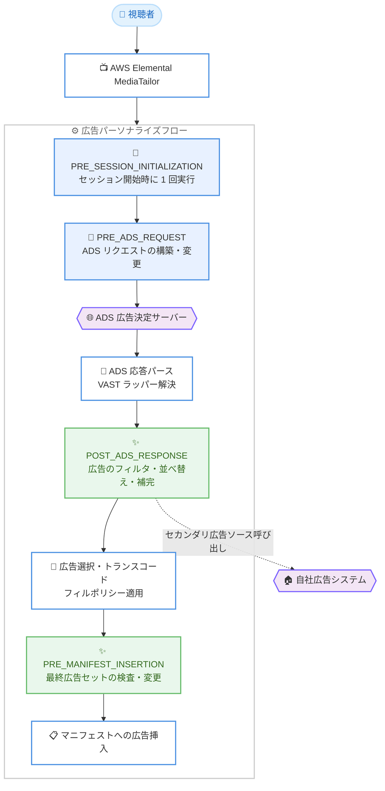

# AWS Elemental MediaTailor - Monetization Functions の広告応答フック追加

**リリース日**: 2026 年 9 月 16 日
**サービス**: AWS Elemental MediaTailor
**機能**: Monetization Functions - Ad Response Hooks (POST_ADS_RESPONSE / PRE_MANIFEST_INSERTION)

📊 [このアップデートのインフォグラフィックを見る](https://takech9203.github.io/aws-news-summary/20260916-aws-elemental-mediatailor-functions-ad-response-hooks.html)

## 概要

AWS Elemental MediaTailor の Monetization Functions に、新しい 2 つのライフサイクルフック「POST_ADS_RESPONSE (ADS 応答後フック)」と「PRE_MANIFEST_INSERTION (マニフェスト挿入前フック)」が追加されました。Monetization Functions は、広告パーソナライズされた再生セッションの特定のタイミングで、ユーザー独自のロジックを JSONata 式として実行できる機能です。今回の追加により、MediaTailor と ADS (広告決定サーバー) の間にミドルウェア層を構築することなく、ADS 応答の後処理や広告挿入直前の最終チェックを実装できるようになりました。

POST_ADS_RESPONSE フックは、MediaTailor が ADS 応答をパースし、すべての VAST (Video Ad Serving Template) ラッパーを解決した後、広告選択とトランスコードの前に実行されます。PRE_MANIFEST_INSERTION フックは、広告ポッドが視聴者に返される直前の最終ポイントで実行され、新しくパーソナライズされたすべての広告ブレイクを 1 回の呼び出しで受け取ります。

このアップデートは、広告収益の最大化やブランドセーフティの確保が求められる放送事業者、OTT 配信事業者、広告テクノロジーチームにとって重要な機能強化です。

**アップデート前の課題**

このアップデート以前に存在していた課題や制限は以下のとおりです。

- Monetization Functions のフックは ADS リクエスト前 (PRE_SESSION_INITIALIZATION、PRE_ADS_REQUEST) に限られており、ADS から返された広告の内容に基づく処理ができなかった
- プライマリ ADS が広告ブレイクを埋めきれない場合に、セカンダリ広告ソースを呼び出すには MediaTailor と ADS の間にプロキシなどのミドルウェア層を独自に構築・運用する必要があった
- コンテンツポリシーやブランドポリシーに違反する広告のフィルタリング、自社ハウス広告の挿入といった応答側の制御には、追加のインフラ開発が必要だった

**アップデート後の改善**

今回のアップデートにより可能になったことは以下のとおりです。

- POST_ADS_RESPONSE フックにより、ADS 応答のパース後・広告選択前に、広告のフィルタリング、並べ替え、補完が可能になった
- プライマリ ADS のアンダーフィル時にセカンダリ広告ソースを呼び出したり、自社マーケティングシステムからハウス広告やプロモーションを挿入したりできるようになった
- PRE_MANIFEST_INSERTION フックにより、視聴者に返却される直前の広告コンテンツを最終チェックし、埋めきれないブレイクにパーソナライズされたスレートを追加できるようになった
- ミドルウェア層のデプロイ・管理が不要になり、MediaTailor のマネージド機能のみで広告応答の制御が完結するようになった

## アーキテクチャ図



MediaTailor の広告パーソナライズフローにおける 4 つのライフサイクルフックの位置付けを示しています。緑色の 2 つが今回追加された広告応答フックで、ADS 応答のパース後と、マニフェスト挿入直前に実行されます。

## サービスアップデートの詳細

### 主要機能

1. **POST_ADS_RESPONSE フック (ADS 応答後フック)**
   - MediaTailor が ADS 応答を受信・パースし、VAST ラッパーのリダイレクトをすべて解決した後、広告選択とトランスコードの前に実行される
   - `adsResponse.ads` 配列を通じて、広告 ID、再生時間、広告システム、クリエイティブ ID、メディアファイル、トラッキングイベントなどの情報にアクセスできる
   - 主なユースケース: プライマリ ADS のアンダーフィル時のセカンダリ広告ソース呼び出し、コンテンツ・ブランドポリシー違反広告のフィルタリング、自社マーケティングシステムからのハウス広告・プロモーション挿入

2. **PRE_MANIFEST_INSERTION フック (マニフェスト挿入前フック)**
   - 広告ブレイクのパーソナライズの最終段階、つまり広告選択・トランスコードチェック・フィルポリシー適用の後、マニフェストへの広告書き込みの直前に実行される
   - 新しくパーソナライズされたすべての広告ブレイクを 1 回の呼び出しで受け取り、`avails.avails` 配列を通じてフィル率 (`fillRate`)、フィル時間、スキップされた広告とその理由などを参照できる
   - 主なユースケース: 配信直前の広告コンテンツの最終チェック、埋めきれないブレイクへのパーソナライズされたスレートの追加

3. **コンソールのビルトインレシピ**
   - MediaTailor コンソールに、これらのユースケースの出発点となるビルトインレシピが用意されている
   - JSONata 式の記述を一から行わなくても、代表的なパターンから実装を開始できる

4. **フェイルオープン設計**
   - 両フックともフェイルオープンで動作し、タイムアウト、式のエラー、リソース制限が発生した場合、MediaTailor は関数の出力を破棄してデフォルトの広告挿入処理を継続する
   - 関数の障害が視聴者の再生体験を妨げないよう設計されている

## 技術仕様

### ライフサイクルフックの比較

| 項目 | POST_ADS_RESPONSE | PRE_MANIFEST_INSERTION |
|------|-------------------|------------------------|
| 実行タイミング | ADS 応答のパース・VAST ラッパー解決後、広告選択の前 | 広告選択・トランスコードチェック・フィルポリシー適用後、マニフェスト書き込みの直前 |
| 実行単位 | ADS 応答ごと | 新しくパーソナライズされた全広告ブレイクを 1 回の呼び出しで処理 |
| 主な入力 | `adsResponse.ads` (広告 ID、時間、広告システム、メディアファイルなど)、`adsRequest.*` | `avails.avails` (フィル率、フィル時間、挿入広告、スキップ広告と理由など) |
| セッションフィールド形式 | camelCase (例: `session.clientIp`) | camelCase (例: `session.clientIp`) |
| 主な用途 | 広告のフィルタ・並べ替え・補完、セカンダリ広告ソース呼び出し | 最終広告セットの検査、スレート追加 |

### 実行時間の制約

| 項目 | 詳細 |
|------|------|
| フックごとのタイムアウト | 各フック 2,000 ms |
| 共有実行バジェット | PRE_ADS_REQUEST、POST_ADS_RESPONSE、PRE_MANIFEST_INSERTION は単一リクエストにつき合計 2,000 ms のバジェットを共有 |
| バジェット枯渇時の動作 | 残りバジェットが尽きた場合、MediaTailor はそのフックをスキップして処理を継続 |
| 障害時の動作 | フェイルオープン: タイムアウト・式エラー・リソース制限時は関数出力を破棄し、デフォルトの広告挿入で再生を継続 |
| 式言語 | JSONata (JSON データ用の軽量クエリ・変換言語) |

### PRE_MANIFEST_INSERTION の入力例 (主要フィールド)

```json
{
  "avails": {
    "avails": [
      {
        "availId": "example-avail-id",
        "durationSeconds": 90,
        "fillDurationSeconds": 60,
        "fillRate": 0.67,
        "mediaProtocol": "HLS",
        "streamingMode": "LIVE",
        "mutable": true,
        "ads": [
          {
            "vastAdId": "ad-123",
            "creativeId": "creative-456",
            "durationSeconds": 30,
            "adSystem": "ExampleAdServer"
          }
        ],
        "skippedAds": [
          {
            "vastAdId": "ad-789",
            "durationSeconds": 15,
            "reason": "TRANSCODE_NOT_READY"
          }
        ]
      }
    ]
  }
}
```

## 設定方法

### 前提条件

1. AWS Elemental MediaTailor の再生設定 (Playback Configuration) が構成済みであること
2. ADS (広告決定サーバー) との連携が設定済みであること
3. JSONata 式の基本的な知識 (コンソールのビルトインレシピを利用する場合は最小限で可)

### 手順

#### ステップ 1: 関数の作成

MediaTailor コンソールの Monetization Functions セクションで関数を作成します。ビルトインレシピから開始するか、JSONata 式を直接記述します。

```
例: fillRate が 1 未満の場合にスレート広告を追加する PRE_MANIFEST_INSERTION 用の式
avails.avails[fillRate < 1] を検出し、残り時間に応じたスレートを ads 配列に追加
```

コンソールのレシピは、アンダーフィル検出、広告フィルタリング、ハウス広告挿入などの代表的なユースケースの出発点を提供します。

#### ステップ 2: 関数マッピングの作成

作成した関数をライフサイクルフック (POST_ADS_RESPONSE または PRE_MANIFEST_INSERTION) と再生設定に関連付けます。

```bash
# 再生設定の確認 (AWS CLI)
aws mediatailor get-playback-configuration \
  --name my-playback-config
```

このコマンドは、対象の再生設定の現在の構成を取得し、関数マッピングを追加する前の状態を確認します。

#### ステップ 3: 動作確認とモニタリング

テストセッションを開始し、フックが期待どおりに動作することを確認します。CloudWatch メトリクスとログで関数の実行状況、タイムアウト、エラーを監視します。フェイルオープン設計のため、関数にエラーがあっても再生は継続しますが、その場合は関数の出力が反映されない点に注意してください。

## メリット

### ビジネス面

- **広告収益の最大化**: プライマリ ADS のアンダーフィル時にセカンダリ広告ソースやハウス広告で広告枠を埋めることで、未販売在庫による機会損失を削減できる
- **ブランドセーフティの強化**: コンテンツポリシーやブランドポリシーに違反する広告を配信前にフィルタリングし、視聴者体験とブランド価値を保護できる
- **運用コストの削減**: MediaTailor と ADS の間のミドルウェア層が不要になり、独自インフラの開発・運用コストを削減できる

### 技術面

- **サーバーレスで完結**: JSONata 式による関数をマネージドサービス内で実行するため、カスタムインフラのデプロイ・管理が不要
- **フェイルオープン設計**: 関数の障害時もデフォルトの広告挿入で再生が継続し、視聴者体験への影響を最小化できる
- **豊富なコンテキスト情報**: フィル率、スキップされた広告とその理由、VAST 広告メタデータなど、広告応答の詳細な情報に基づいたロジックを実装できる

## デメリット・制約事項

### 制限事項

- PRE_ADS_REQUEST、POST_ADS_RESPONSE、PRE_MANIFEST_INSERTION は単一リクエストにつき合計 2,000 ms の実行バジェットを共有するため、複数フックを併用する場合は外部 API 呼び出しの応答時間に注意が必要
- POST_ADS_RESPONSE の `avail` 名前空間は単一広告ブレイクの応答時のみ存在し、マルチブレイク (VMAP) 応答やプリフェッチ応答では利用できない
- PRE_MANIFEST_INSERTION の `adId` は内部プレースメント識別子であり、広告ブレイクやフックをまたいだ同一性チェックには `vastAdId` または `creativeId` を使用する必要がある
- DASH VOD ストリームでは、PRE_MANIFEST_INSERTION フックで `adTitle` と `adSystem` が null になる

### 考慮すべき点

- 新しい 2 つのフックはセッションフィールドを camelCase (例: `session.clientIp`) で公開するのに対し、既存の 2 つのフックは snake_case (例: `session.client_ip`) を使用するため、式の移植時に注意が必要
- フェイルオープン設計のため、関数のエラーは再生を止めない一方で、意図した広告制御が適用されない可能性がある。CloudWatch によるモニタリングが重要

## ユースケース

### ユースケース 1: アンダーフィル時のセカンダリ広告ソース呼び出し

**シナリオ**: ライブスポーツ配信で 90 秒の広告ブレイクが発生したが、プライマリ ADS が 60 秒分の広告しか返さなかった。残り 30 秒を自社のセカンダリ VAST エンドポイントで埋めたい。

**実装例**:
```
POST_ADS_RESPONSE フックで adsResponse.ads の合計時間と
広告ブレイクの時間を比較し、不足分がある場合はセカンダリ
VAST エンドポイントを外部 API 呼び出しで照会して広告を補完
```

**効果**: 未販売の広告枠をハウス広告やセカンダリソースで埋め、広告収益と視聴体験の両方を改善できます。

### ユースケース 2: ブランドポリシーに基づく広告フィルタリング

**シナリオ**: 特定の広告システムや競合他社の広告を、自社チャンネルの配信から除外したい。

**実装例**:
```
POST_ADS_RESPONSE フックで adsResponse.ads を
adSystem や creativeId でフィルタリングし、
ポリシー違反の広告を除外した配列を出力
```

**効果**: ミドルウェアなしでコンペティティブセパレーションやブランドセーフティポリシーを適用できます。

### ユースケース 3: 埋めきれないブレイクへのパーソナライズドスレート追加

**シナリオ**: フィルポリシー適用後も広告ブレイクに空き時間が残る場合、無音・黒画面ではなく視聴者属性に応じた自社プロモーションスレートを表示したい。

**実装例**:
```
PRE_MANIFEST_INSERTION フックで avails.avails[].fillRate を確認し、
1 未満のブレイクに対して session.playerParams の視聴者属性に
応じたスレート広告を ads 配列に追加
```

**効果**: 最終段階での品質チェックにより、広告ブレイクの空き時間を排除し、プロフェッショナルな視聴体験を維持できます。

## 料金

Monetization Functions の広告応答フック自体に関する個別の追加料金は、今回の発表には記載されていません。MediaTailor の料金は広告挿入 (Ad Insertion) の使用量などに基づきます。詳細は [MediaTailor 料金ページ](https://aws.amazon.com/mediatailor/pricing/) を参照してください。

## 利用可能リージョン

AWS Elemental MediaTailor が利用可能なすべての AWS リージョンで提供されています。最新のリージョン一覧は [AWS リージョン別サービス一覧](https://aws.amazon.com/about-aws/global-infrastructure/regional-product-services/) を参照してください。

## 関連サービス・機能

- **AWS Elemental MediaLive / MediaPackage**: ライブ配信ワークフローで MediaTailor と組み合わせて使用されるエンコード・パッケージングサービス
- **Elemental Inference**: PRE_ADS_REQUEST フックから IAB コンテンツ分類や GARM ブランドセーフティシグナルを取得し、コンテキスト広告ターゲティングに活用できる
- **Amazon CloudWatch**: 関数の実行状況、タイムアウト、エラーのモニタリングに使用

## 参考リンク

- 📊 [インフォグラフィック](https://takech9203.github.io/aws-news-summary/20260916-aws-elemental-mediatailor-functions-ad-response-hooks.html)
- [公式発表 (What's New)](https://aws.amazon.com/about-aws/whats-new/2026/09/aws-elemental-mediatailor-functions-ad-response-hooks)
- [ドキュメント: Monetization Functions](https://docs.aws.amazon.com/mediatailor/latest/ug/monetization-functions.html)
- [ドキュメント: Functions ライフサイクルフック](https://docs.aws.amazon.com/mediatailor/latest/ug/monetization-functions-hooks.html)
- [料金ページ](https://aws.amazon.com/mediatailor/pricing/)

## まとめ

MediaTailor Monetization Functions への POST_ADS_RESPONSE と PRE_MANIFEST_INSERTION フックの追加により、ADS 応答後の広告制御がミドルウェアなしのマネージド機能として実現できるようになりました。アンダーフィル対策、ブランドセーフティ、スレート挿入といった広告運用の課題を抱えるチームは、コンソールのビルトインレシピから評価を開始することを推奨します。導入時は 2,000 ms の共有実行バジェットとフェイルオープン動作を考慮した設計とモニタリングが重要です。
