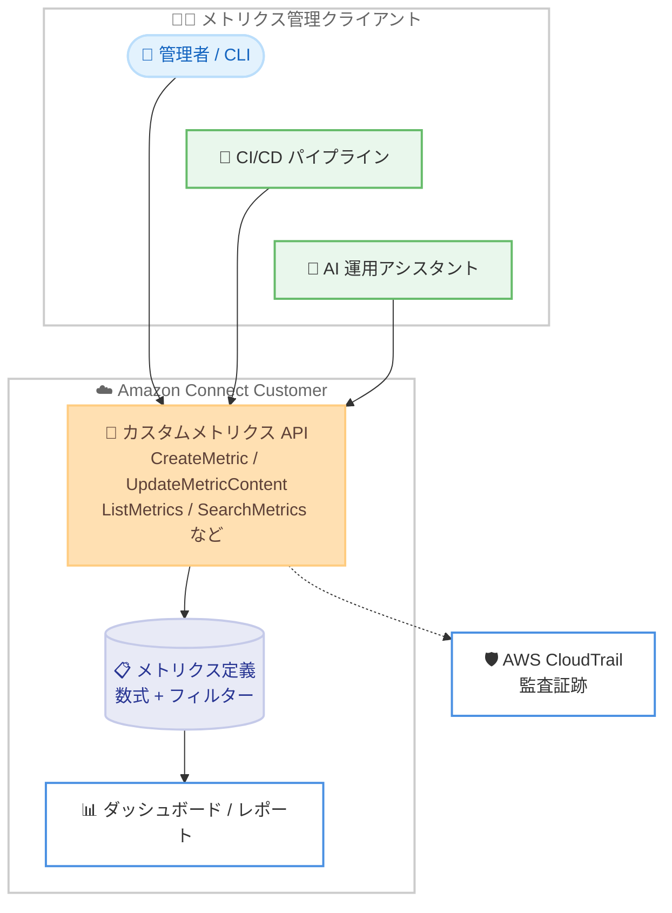

# Amazon Connect Customer - カスタムメトリクス管理 API

**リリース日**: 2026 年 9 月 16 日
**サービス**: Amazon Connect Customer
**機能**: カスタムメトリクスの作成・管理・検索 API

📊 [このアップデートのインフォグラフィックを見る](https://takech9203.github.io/aws-news-summary/20260916-connect-customer-custom-metrics-apis.html)

## 概要

Amazon Connect Customer で、カスタムメトリクスを API 経由で作成・管理・検索できるようになりました。新たに 7 つの API オペレーション (CreateMetric、DeleteMetric、DescribeMetric、ListMetrics、SearchMetrics、UpdateMetricContent、UpdateMetricMetadata) が追加され、ビジネス固有の測定指標をプログラムから一元的に定義・管理できます。

Amazon Connect Customer は標準メトリクスのライブラリを提供していますが、カスタムメトリクスを使用するとビジネス独自の測定指標を定義できます。しかし、複数のインスタンスにまたがってカスタムメトリクスを手動で管理すると、定義が徐々にずれていき、数値の整合性が失われるという課題がありました。信頼できないメトリクスは、人がそれに基づいて意思決定を続けるため、メトリクスがない状態よりも悪影響を及ぼします。

今回のアップデートにより、メトリクスを一度定義すれば API を通じてプログラム的に管理できるため、キュー、チーム、環境をまたいでスケールしても定義の一貫性を維持できます。すべての変更は AWS CloudTrail に記録され、完全な監査証跡が得られます。コンタクトセンターの運用管理者、DevOps チーム、AI を活用した運用自動化を進める組織が主な対象ユーザーです。

**アップデート前の課題**

- カスタムメトリクスの管理はコンソールでの手動操作が中心で、複数インスタンスへの展開に手間がかかった
- インスタンスごとに手動でメトリクスを管理すると、定義が徐々にずれて数値の整合性が失われた
- メトリクス定義の作成・更新を CI/CD パイプラインや自動化ツールに組み込むことができなかった

**アップデート後の改善**

- 7 つの API オペレーションにより、カスタムメトリクスのライフサイクル全体 (作成、参照、検索、更新、削除) をプログラムから管理できるようになった
- メトリクスを一度定義して各環境へプログラム的に展開できるため、定義のずれ (ドリフト) を防止できるようになった
- AI を活用した運用アシスタントなどからメトリクスを自動作成し、モニタリングダッシュボードへ公開する運用が可能になった
- すべての変更が AWS CloudTrail に記録され、完全な監査証跡を取得できるようになった

## アーキテクチャ図



管理者、CI/CD パイプライン、AI 運用アシスタントなどのクライアントがカスタムメトリクス API を呼び出し、メトリクス定義を一元管理します。定義はダッシュボードやレポートで利用され、すべての API 操作は AWS CloudTrail に記録されます。

## サービスアップデートの詳細

### 主要機能

1. **カスタムメトリクスのプログラムによる作成・更新・削除**
   - CreateMetric でメトリクス名、数式 (Calculation)、単位、説明などを指定してカスタムメトリクスを作成
   - UpdateMetricContent で計算内容を、UpdateMetricMetadata でメタデータを個別に更新
   - DeleteMetric で不要になったメトリクスを削除

2. **メトリクスの参照・検索**
   - DescribeMetric で個別メトリクスの詳細を取得
   - ListMetrics でインスタンス内のメトリクス一覧を取得
   - SearchMetrics で条件を指定したメトリクスの検索が可能

3. **数式とフィルターによる柔軟な定義**
   - AWS マネージドの標準メトリクス (メトリクスプリミティブ) を数式で組み合わせてカスタムメトリクスを定義
   - コンポーネントごとにフィルター (数値条件、文字列条件、真偽値条件) を適用可能
   - 例: `100 * SUM(M1) / SUM(M2)` のような数式で「キュー投入から 60 秒以内に処理されたコンタクトの割合」を定義

4. **監査証跡**
   - すべての変更が AWS CloudTrail に記録され、いつ誰がどのメトリクスを変更したかを追跡可能

## 技術仕様

### 追加された API オペレーション

| API | 用途 |
|------|------|
| CreateMetric | カスタムメトリクスの新規作成 |
| DeleteMetric | カスタムメトリクスの削除 |
| DescribeMetric | メトリクス定義の詳細取得 |
| ListMetrics | メトリクス一覧の取得 |
| SearchMetrics | 条件指定によるメトリクス検索 |
| UpdateMetricContent | メトリクスの計算内容の更新 |
| UpdateMetricMetadata | メトリクスのメタデータの更新 |

### CreateMetric の主要パラメータ

| 項目 | 詳細 |
|------|------|
| InstanceId | 対象の Connect Customer インスタンス ID (必須) |
| Name | メトリクス名。1〜128 文字 (必須) |
| MetricCalculation | 数式 (Calculation) と参照するコンポーネントメトリクスの定義 (必須) |
| Unit | 表示単位。INTEGER / DOUBLE / PERCENT / SECONDS (必須) |
| Status | 公開状態。PUBLISHED (ダッシュボードで利用可能) / SAVED (下書き) |
| PositiveTrendIndicator | 値の増加の解釈。POSITIVE / NEGATIVE / NEUTRAL |
| Description | メトリクスの説明。最大 500 文字 |
| Tags | リソースのタグ。最大 50 個 |

### リクエスト例

```json
{
    "Name": "example-metric",
    "MetricCalculation": {
        "CalculationComponents": [
            {
                "Alias": "M1",
                "MetricName": "CONTACTS_HANDLED",
                "MetricFilters": [
                    {
                        "MetricFilterKey": "QUEUE_TIME_MS",
                        "NumberCondition": {"Comparison": "LESSER_OR_EQUAL", "Values": [60.0]}
                    }
                ]
            },
            {
                "Alias": "M2",
                "MetricName": "CONTACTS_QUEUED"
            }
        ],
        "Calculation": "100 * SUM(M1) / SUM(M2)"
    },
    "Unit": "PERCENT",
    "Status": "PUBLISHED",
    "Description": "Percentage of contacts handled within 60 seconds.",
    "PositiveTrendIndicator": "POSITIVE"
}
```

キュー投入から 60 秒以内に処理されたコンタクトの割合を算出するカスタムメトリクスの定義例です。

## 設定方法

### 前提条件

1. Amazon Connect Customer インスタンスが作成済みであること
2. カスタムメトリクス API を呼び出すための IAM 権限が付与されていること
3. AWS CLI または AWS SDK が最新バージョンに更新されていること

### 手順

#### ステップ 1: カスタムメトリクスの作成

```bash
aws connect create-metric \
  --instance-id <インスタンス ID> \
  --name "handled-within-60s-rate" \
  --unit PERCENT \
  --status PUBLISHED \
  --description "60 秒以内に処理されたコンタクトの割合" \
  --metric-calculation '{
    "CalculationComponents": [
      {
        "Alias": "M1",
        "MetricName": "CONTACTS_HANDLED",
        "MetricFilters": [
          {
            "MetricFilterKey": "QUEUE_TIME_MS",
            "NumberCondition": {"Comparison": "LESSER_OR_EQUAL", "Values": [60.0]}
          }
        ]
      },
      {"Alias": "M2", "MetricName": "CONTACTS_QUEUED"}
    ],
    "Calculation": "100 * SUM(M1) / SUM(M2)"
  }'
```

指定したインスタンスに、数式とフィルターを組み合わせたカスタムメトリクスを作成し、PUBLISHED 状態でダッシュボードから利用可能にします。レスポンスとして MetricId と MetricArn が返されます。

#### ステップ 2: メトリクスの一覧確認

```bash
aws connect list-metrics --instance-id <インスタンス ID>
```

インスタンス内に定義されているメトリクスの一覧を取得し、作成したカスタムメトリクスが登録されていることを確認します。

#### ステップ 3: メトリクス定義の更新

```bash
aws connect update-metric-metadata \
  --instance-id <インスタンス ID> \
  --metric-id <メトリクス ID> \
  --description "更新後の説明文"
```

メトリクスのメタデータ (説明文など) を更新します。計算内容自体を変更する場合は update-metric-content を使用します。

## メリット

### ビジネス面

- **意思決定の信頼性向上**: 全環境で同一のメトリクス定義を維持できるため、数値のずれによる誤った意思決定を防止できる
- **運用工数の削減**: コンソールでの手動作業が不要になり、メトリクス管理の作業を自動化できる
- **ガバナンスの強化**: CloudTrail による完全な監査証跡で、メトリクス定義の変更を追跡できる

### 技術面

- **Infrastructure as Code との統合**: メトリクス定義を CI/CD パイプラインに組み込み、コードとして管理できる
- **AI エージェントとの連携**: AI を活用した運用アシスタントからメトリクスを自動作成・公開する運用が可能
- **柔軟なメトリクス定義**: 数式とフィルターの組み合わせにより、標準メトリクスでは表現できないビジネス固有の指標を定義できる

## デメリット・制約事項

### 制限事項

- メトリクス名は 1〜128 文字、説明は最大 500 文字の制限がある
- 単位は INTEGER / DOUBLE / PERCENT / SECONDS の 4 種類から選択する必要がある
- 同名のメトリクスを作成しようとすると DuplicateResourceException が発生する
- LimitExceededException が示すとおり、リソース数には上限がある

### 考慮すべき点

- カスタムメトリクスの数式は AWS マネージドのメトリクスプリミティブを参照して構成するため、利用可能なプリミティブと対応する統計 (SUM、AVG、MIN、MAX) を事前に確認する必要がある
- 既存のカスタムメトリクスを API 管理に移行する場合は、環境間の定義の差異を洗い出してから一元化することが望ましい

## ユースケース

### ユースケース 1: セルフサービス完了率の低下検知への迅速な対応

**シナリオ**: カスタマーエクスペリエンス責任者がセルフサービス完了率の低下に気づき、顧客が離脱して 90 秒以内に有人対応を要求したインタラクションの割合を追跡したい。

**実装例**:
```
AI 運用アシスタントが CreateMetric API を呼び出してカスタムメトリクスを自動作成し、
Status を PUBLISHED に設定してモニタリングダッシュボードへ公開する。
```

**効果**: コンソールでの手動作業なしにメトリクスを即座に定義・公開でき、環境間の定義ドリフトも発生しない。

### ユースケース 2: マルチ環境でのメトリクス定義の一元管理

**シナリオ**: 開発、ステージング、本番の複数インスタンスを運用しており、KPI メトリクスの定義を全環境で統一したい。

**実装例**:
```
メトリクス定義を JSON ファイルとしてリポジトリで管理し、
CI/CD パイプラインから CreateMetric / UpdateMetricContent を呼び出して各環境へ展開する。
```

**効果**: メトリクス定義をコードとして管理でき、環境間で数値の整合性が保たれる。

### ユースケース 3: メトリクス変更の監査対応

**シナリオ**: コンプライアンス要件により、KPI 定義の変更履歴を追跡・報告する必要がある。

**実装例**:
```
CloudTrail で UpdateMetricContent / UpdateMetricMetadata / DeleteMetric の
イベント履歴を検索し、変更者・変更日時・変更内容をレポートする。
```

**効果**: すべてのメトリクス変更が自動的に記録され、監査対応の工数を削減できる。

## 料金

今回の発表では、カスタムメトリクス API の利用に伴う追加料金についての言及はありません。Amazon Connect の料金体系の詳細は料金ページを確認してください。

## 利用可能リージョン

Amazon Connect Customer が提供されているすべての AWS リージョンで利用可能です。

## 関連サービス・機能

- **AWS CloudTrail**: カスタムメトリクスに対するすべての API 操作が記録され、監査証跡として利用できる
- **Amazon Connect ダッシュボード / レポート**: PUBLISHED 状態のカスタムメトリクスをダッシュボードやレポートで可視化できる
- **メトリクスプリミティブ**: カスタムメトリクスの構成要素となる AWS マネージドの標準メトリクス。Contact、Agent、Flow、Bot の 4 カテゴリに分類される

## 参考リンク

- 📊 [インフォグラフィック](https://takech9203.github.io/aws-news-summary/20260916-connect-customer-custom-metrics-apis.html)
- [公式発表 (What's New)](https://aws.amazon.com/about-aws/whats-new/2026/09/connect-customer-custom-metrics-apis/)
- [CreateMetric API リファレンス](https://docs.aws.amazon.com/connect/latest/APIReference/API_CreateMetric.html)
- [カスタムメトリクスプリミティブ (管理者ガイド)](https://docs.aws.amazon.com/connect/latest/adminguide/metric-primitive-definitions.html)
- [Amazon Connect 料金ページ](https://aws.amazon.com/connect/pricing/)

## まとめ

カスタムメトリクスのライフサイクル全体を API で管理できるようになったことで、コンタクトセンターの KPI 定義をコードとして扱い、複数環境で一貫性を保ちながらスケールできるようになりました。複数インスタンスを運用している組織や、メトリクス管理の自動化を検討している組織は、既存のカスタムメトリクス定義を棚卸しし、API ベースの一元管理への移行を検討することを推奨します。
