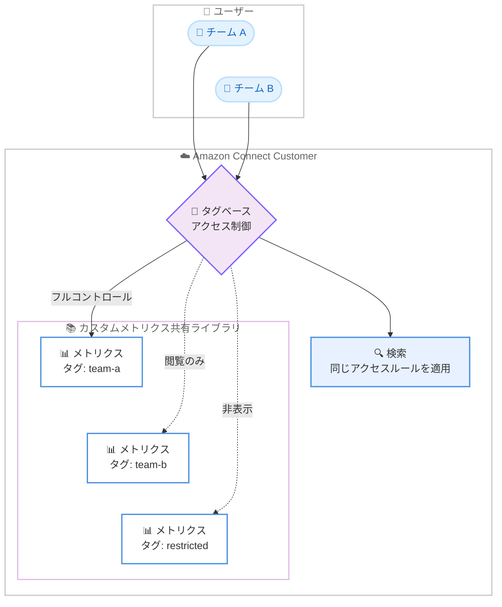

# Amazon Connect Customer - カスタムメトリクスのタグベースアクセス制御

**リリース日**: 2026 年 9 月 16 日
**サービス**: Amazon Connect Customer
**機能**: カスタムメトリクスのタグベースアクセス制御 (Tag-based Access Control)

📊 [このアップデートのインフォグラフィックを見る](https://takech9203.github.io/aws-news-summary/20260916-connect-customer-custom-metrics-tag.html)

## 概要

Amazon Connect Customer のカスタムメトリクスがタグベースアクセス制御に対応しました。これにより、どのユーザーやロールが各カスタムメトリクスを閲覧、作成、変更できるかを、メトリクスに付与したタグに基づいて制御できるようになります。

組織内でカスタムメトリクスを利用するチームが増えると、複数のチームが同じ共有ライブラリを編集することになります。アクセス制御がない状態では、あるユーザーの変更が、他のチームが依存しているメトリクスに影響を与えるリスクがありました。今回のアップデートにより、各メトリクスにタグを付与し、そのタグを使ってチームごとに「フルコントロール」「閲覧のみ」「非表示」といったアクセスレベルを設定できます。検索結果にも同じアクセスルールが適用されるため、ユーザーは自分が閲覧または管理を許可されたメトリクスのみを参照できます。

**アップデート前の課題**

タグベースアクセス制御が導入される前は、以下の課題がありました。

- カスタムメトリクスの共有ライブラリに対する編集権限を細かく制御できず、あるユーザーが他チームの依存するメトリクスを変更してしまうリスクがあった
- 一般的な回避策は少数のユーザーにのみカスタムメトリクスの権限を付与することだったが、これでは他のチームがカスタムメトリクスを活用できなくなっていた
- チームごとにメトリクスの可視性を分離する仕組みがなかった

**アップデート後の改善**

今回のアップデートにより、以下が可能になりました。

- 各カスタムメトリクスにタグを付与し、タグに基づいてユーザーやロールごとのアクセス (閲覧、作成、変更) を制御できるようになった
- チームは自チームのメトリクスをフルコントロールで管理しつつ、他チームのメトリクスには閲覧のみのアクセスを設定し、制限したメトリクスは非表示にできるようになった
- 検索にも同じアクセスルールが適用され、許可されたメトリクスのみが検索結果に表示されるようになった

## アーキテクチャ図



各カスタムメトリクスに付与したタグに基づいて、ユーザーやロールごとに「フルコントロール」「閲覧のみ」「非表示」のアクセスレベルを制御する構成を示しています。検索結果にも同じアクセスルールが適用されます。

## サービスアップデートの詳細

### 主要機能

1. **タグによるメトリクス単位のアクセス制御**
   - 各カスタムメトリクスにタグを付与し、そのタグを使ってユーザーやロールごとのアクセスを設定できる
   - 閲覧 (view)、作成 (create)、変更 (modify) の操作を制御可能
   - メトリクス単位できめ細かなガバナンスを実現できる

2. **チームごとのアクセスレベル設定**
   - 自チームのメトリクスにはフルコントロールを付与
   - 他チームのメトリクスには閲覧のみのアクセスを設定
   - 制限対象のメトリクスは非表示にできる

3. **検索へのアクセスルール適用**
   - 検索結果にも同じアクセス制御が適用される
   - ユーザーは閲覧または管理を許可されたメトリクスのみを検索結果で参照できる

## 技術仕様

### アクセス制御の概要

| 項目 | 詳細 |
|------|------|
| 制御対象 | Amazon Connect Customer のカスタムメトリクス |
| 制御方法 | メトリクスに付与したタグに基づくアクセス制御 |
| 制御可能な操作 | 閲覧、作成、変更 |
| アクセスレベルの例 | フルコントロール、閲覧のみ、非表示 |
| 検索への適用 | 検索結果にも同じアクセスルールが適用される |

### タグの設定例

```json
{
  "Tags": {
    "Team": "sales",
    "Environment": "production"
  }
}
```

メトリクス作成時にタグを付与する例です。詳細な API 仕様は [CreateMetric API リファレンス](https://docs.aws.amazon.com/connect/latest/APIReference/API_CreateMetric.html)を参照してください。

## 設定方法

### 前提条件

1. Amazon Connect Customer のインスタンスが作成済みであること
2. カスタムメトリクスを利用していること、または利用を計画していること
3. タグ設計 (チーム名、環境名などのキーと値) が決定していること

### 手順

#### ステップ 1: タグ設計の策定

チームや用途ごとにタグのキーと値を定義します。例えば `Team: sales`、`Team: support` のように、アクセス制御の単位となるタグを設計します。

#### ステップ 2: カスタムメトリクスへのタグ付与

カスタムメトリクスの作成時または既存メトリクスに対してタグを付与します。API の詳細は [Amazon Connect Customer API リファレンス](https://docs.aws.amazon.com/connect/latest/APIReference/API_CreateMetric.html)を参照してください。

#### ステップ 3: タグに基づくアクセス権限の設定

付与したタグを条件として、ユーザーやロールごとに閲覧、作成、変更の権限を設定します。設定の詳細は [Amazon Connect Customer 管理者ガイド](https://docs.aws.amazon.com/connect/latest/adminguide/metric-primitive-definitions.html)を参照してください。

#### ステップ 4: アクセス制御の動作確認

各チームのユーザーで、許可されたメトリクスのみが表示・編集可能であること、検索結果にもアクセスルールが適用されていることを確認します。

## メリット

### ビジネス面

- **ガバナンスの強化**: チームごとにメトリクスの管理責任を明確化し、意図しない変更による分析基盤への影響を防止できる
- **利用拡大の促進**: 権限を少数に絞る必要がなくなり、より多くのチームが安心してカスタムメトリクスを活用できる
- **情報の適切な分離**: 機密性の高いメトリクスを特定のユーザーのみに限定して公開できる

### 技術面

- **メトリクス単位のきめ細かな制御**: タグに基づいて閲覧、作成、変更の各操作を個別に制御できる
- **検索との一貫性**: 検索結果にも同じアクセスルールが適用され、権限設定と表示内容が常に一致する
- **既存のタグ運用との親和性**: AWS の標準的なタグ付けの考え方に沿って運用できる

## デメリット・制約事項

### 制限事項

- 本機能は Amazon Connect Customer のカスタムメトリクスが対象であり、他のリソースのアクセス制御は別途設計が必要
- タグ設計が不適切な場合、意図したアクセス分離が実現できない可能性がある

### 考慮すべき点

- 事前にチーム構成や運用に合わせたタグ設計 (キーと値の命名規則) を策定する必要がある
- 既存のカスタムメトリクスに対しては、タグ付与とアクセス権限設定の移行作業を計画する必要がある
- 権限を厳しくしすぎると、他チームの有用なメトリクスの再利用が妨げられる可能性があるため、閲覧のみのアクセスを適切に活用することが望ましい

## ユースケース

### ユースケース 1: 複数部門でのカスタムメトリクス共有ライブラリの運用

**シナリオ**: 営業部門とサポート部門がそれぞれ独自のカスタムメトリクスを作成しており、共有ライブラリ上でお互いのメトリクスを誤って変更してしまうリスクがある。

**実装例**:
```
1. 営業部門のメトリクスに Team: sales タグを付与
2. サポート部門のメトリクスに Team: support タグを付与
3. 各部門のユーザーには自部門タグのメトリクスへのフルコントロールを付与
4. 他部門タグのメトリクスには閲覧のみのアクセスを設定
```

**効果**: 各部門が自部門のメトリクスを自由に管理しつつ、他部門のメトリクスを参照して再利用できる。誤変更のリスクを排除できる。

### ユースケース 2: 機密性の高い経営指標メトリクスの限定公開

**シナリオ**: 経営層向けのカスタムメトリクスは一般のスーパーバイザーには非表示にしたい。

**実装例**:
```
1. 経営指標のメトリクスに Confidential: executive タグを付与
2. 経営企画チームのロールにのみ該当タグのメトリクスへのアクセスを許可
3. その他のユーザーには該当メトリクスを非表示に設定
```

**効果**: 機密性の高いメトリクスは許可されたユーザーの検索結果にのみ表示され、情報の適切な分離を実現できる。

### ユースケース 3: カスタムメトリクス利用の全社展開

**シナリオ**: これまで誤変更を防ぐためにカスタムメトリクスの権限を管理者数名に限定していたが、各チームにも作成・編集を開放したい。

**実装例**:
```
1. チームごとのタグ体系を策定 (Team: xxx)
2. 各チームに自チームタグのメトリクスに対する作成・変更権限を付与
3. 共通メトリクスは管理者チームのタグで管理し、他チームは閲覧のみに設定
```

**効果**: 少数の管理者に依存する運用から脱却し、各チームが自律的にカスタムメトリクスを活用できる体制を実現できる。

## 料金

今回の発表では、本機能に関する追加料金の記載はありません。Amazon Connect の料金体系については[料金ページ](https://aws.amazon.com/connect/pricing/)を参照してください。

## 利用可能リージョン

Amazon Connect Customer が提供されているすべての AWS リージョンで利用可能です。

## 関連サービス・機能

- **Amazon Connect**: クラウド型コンタクトセンターサービス。Amazon Connect Customer はその顧客体験向けの提供形態
- **AWS Identity and Access Management (IAM)**: タグベースアクセス制御の基盤となる権限管理サービス
- **AWS リソースタグ**: AWS リソースの整理とアクセス制御に利用されるメタデータの仕組み

## 参考リンク

- 📊 [インフォグラフィック](https://takech9203.github.io/aws-news-summary/20260916-connect-customer-custom-metrics-tag.html)
- [公式発表 (What's New)](https://aws.amazon.com/about-aws/whats-new/2026/09/connect-customer-custom-metrics-tag/)
- [Amazon Connect Customer API リファレンス - CreateMetric](https://docs.aws.amazon.com/connect/latest/APIReference/API_CreateMetric.html)
- [Amazon Connect Customer 管理者ガイド - メトリクス定義](https://docs.aws.amazon.com/connect/latest/adminguide/metric-primitive-definitions.html)
- [Amazon Connect Customer 製品ページ](https://aws.amazon.com/products/connect/customer/)
- [料金ページ](https://aws.amazon.com/connect/pricing/)

## まとめ

Amazon Connect Customer のカスタムメトリクスがタグベースアクセス制御に対応し、チームごとにメトリクスの閲覧、作成、変更の権限をきめ細かく管理できるようになりました。複数チームでカスタムメトリクスを利用している組織は、タグ設計を策定した上で本機能を導入することで、誤変更のリスクを排除しつつカスタムメトリクスの活用を全社に広げることができます。まずは既存メトリクスの棚卸しとタグ体系の設計から着手することを推奨します。
