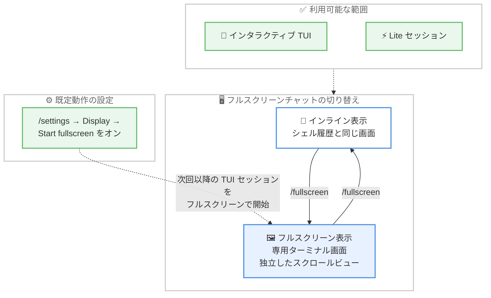

# Kiro - フルスクリーンチャットと合理化されたセッションダッシュボード

**リリース日**: 2026 年 9 月 16 日
**サービス**: Kiro (CLI)
**機能**: Fullscreen Chat and Streamlined Sessions (Kiro CLI 2.22.0)

📊 [このアップデートのインフォグラフィックを見る](https://takech9203.github.io/aws-news-summary/20260916-kiro-changelog-2026-09-16.html)

## 概要

2026 年 9 月 16 日、AWS が提供する AI 搭載 IDE「Kiro」の CLI バージョン 2.22.0 がリリースされました。本バージョンでは、チャットを専用のターミナル画面に拡大できるフルスクリーンチャット、検索・フィルター・ソート・グルーピングの各コントロールをセッション一覧から分離した合理化された V3 セッションダッシュボード、そして長時間実行作業における信頼性向上という 3 つの主要な改善が導入されました。

フルスクリーンチャットは `/fullscreen` と入力するだけで、現在の会話をシェル履歴から独立した専用のターミナル画面へ移動できます。インタラクティブな TUI セッションと Lite セッションの両方で利用でき、V2 と V3 の両ハーネスに対応しています。また、V3 の `/sessions` ダッシュボードは操作コントロールとセッション一覧が分離され、最終利用日時順のフラットな一覧として開き、ソート条件を記憶するようになりました。さらに、自動コンパクション中の表示継続、大きなツール結果のコンテキスト節約、サブエージェント活動時のメモリ使用量削減など、長時間セッションを確実に実行し続けるための改善が多数含まれています。

**アップデート前の課題**

このアップデート以前には、以下の課題や制限がありました。

- チャットの表示がシェル履歴と同じインライン画面に限定され、長い会話のスクロールや参照がシェルの他の出力と混在していた
- `/sessions` ダッシュボードは検索・フィルターなどのコントロールとセッション一覧が一体化しており、ソート条件の選択肢や選択の記憶が限定的だった
- 自動コンパクションの実行中は進行中の応答や Thinking インジケーターの表示が中断される場合があった
- V3 で大きなツール結果がそのままコンテキストを消費し、長時間セッションでコンテキストを圧迫していた
- 重いサブエージェント活動中に TUI のメモリ使用量が増大していた

**アップデート後の改善**

今回のアップデートにより、以下が可能になりました。

- `/fullscreen` で会話を専用のターミナル画面に拡大し、シェル履歴から独立したスクロール可能なビューで閲覧できるようになった
- V3 の `/sessions` が操作コントロールとセッション一覧を分離し、最終利用日時・セッション名・メッセージ数によるソートと選択の記憶に対応した
- 自動コンパクション中もアクティブな応答と Thinking インジケーターが表示され続け、キューに入れたプロンプトはコンパクション後も継続されるようになった
- V3 では大きなツール結果をセッションと共に保存し、モデルには短いプレビューのみを渡すことで、完全な出力を失わずにコンテキスト使用量を削減できるようになった
- 重いサブエージェント活動中の TUI のメモリ使用量が削減された

## アーキテクチャ図



`/fullscreen` コマンドによるインライン表示とフルスクリーン表示の相互切り替えと、`/settings` による既定動作の設定を示しています。フルスクリーンチャットはインタラクティブな TUI セッションと Lite セッションの両方で、V2 と V3 の両ハーネスに対応しています。

## サービスアップデートの詳細

### 主要機能

1. **フルスクリーンチャット**
   - `/fullscreen` と入力すると、現在の会話がシェル履歴から独立した専用のターミナル画面へ移動し、独自のスクロール可能なビューで表示される
   - もう一度 `/fullscreen` と入力するとインライン表示に戻る
   - インタラクティブな TUI セッションと Lite セッションの両方で利用でき、V2 と V3 の両方に対応
   - マウス、タッチパッド、キーボードでスクロールでき、クリックしてドラッグすることで選択したテキストをコピーできる
   - 今後のインタラクティブ TUI セッションをフルスクリーンで開始するには、`/settings` を開いて「Display」を選択し、「Start fullscreen」をオンにする

2. **合理化されたセッションダッシュボード (V3)**
   - `/sessions` が検索、フィルター、ソート、グルーピングの各コントロールをセッション一覧から分離した
   - 最終利用日時順のフラットな一覧として開く
   - 最終利用日時、セッション名、メッセージ数によるソートに対応し、選択したソート条件を記憶する
   - Tab キーでコントロールと結果の間を移動できる

3. **長時間実行作業の信頼性向上 (Improvements)**
   - **コンパクションの継続性**: 自動コンパクションの実行中もアクティブな応答と Thinking インジケーターが表示され続け、キューに入れたプロンプトはコンパクション後も継続される
   - **大きなツール結果 (V3)**: Kiro が大きな結果をセッションと共に保存し、モデルには短いプレビューを渡すことで、完全な出力を失わずにコンテキスト使用量を削減する
   - **固定パスインストール**: インストール済みバイナリが固定パスに留まるストレージ制約のある環境向けに `KIRO_SKIP_BINARY_PINNING=1` を設定できる。セッション中にインストーラーがバイナリを置換または削除する可能性がある場合は使用しない
   - **長時間セッション**: 重いサブエージェント活動中の TUI のメモリ使用量が削減された

4. **修正 (Fixes)**
   - `--require-mcp-startup` が、非インタラクティブな V3 実行の開始前に設定済み MCP サーバーの起動を待機し、起動に失敗した場合は終了コード 3 で終了する
   - モデル応答が停止する直前に完全なツール呼び出しが到着した場合でも、V3 がターンを継続する
   - 設定されたプロキシが認証情報を要求する場合、V3 がプロキシ認証の失敗を直接報告する
   - Configuration Sync カードは同期が有効な場合のみ表示され、V3 セッションの再開時に前のターンとは分離して表示される
   - シンボリックリンクされた V3 エージェント設定が、相対パスの `file://` プロンプトを設定ファイルの場所から解決する
   - V3 の `/context` が、フロントマターのないグローバルおよびワークスペースの Steering ファイルを含める
   - V3 のカスタムエージェントが Git ワーキングツリー内のコマンドで正しい作業ディレクトリを使用する
   - `/settings` 画面から戻ると前の行が復元され、Status line から Esc を押すと Display に戻る
   - リプレイおよび再開されたトランスクリプトで、余分な空行なしにターンの区切り線が配置される
   - Thinking の後にツール呼び出しが続く場合、空のアシスタント応答マーカーなしで描画される
   - 長いシェルコマンドで、コマンドテキストとメタデータに対して `Ctrl+O` のヒントが 1 つだけ表示される
   - ファイル拡張子が正しくない場合でも、画像添付ファイルは検出されたフォーマットで扱われる

## 技術仕様

### フルスクリーンチャット

| 項目 | 詳細 |
|------|------|
| 対象バージョン | Kiro CLI 2.22.0 |
| 切り替えコマンド | `/fullscreen` (再入力でインライン表示に戻る) |
| 対象セッション | インタラクティブ TUI セッション、Lite セッション |
| 対応ハーネス | V2 および V3 |
| 操作 | マウス / タッチパッド / キーボードでスクロール、クリックとドラッグでテキストコピー |
| 既定動作の設定 | `/settings` → Display → Start fullscreen (TUI セッションをフルスクリーンで開始) |

### セッションダッシュボード (V3)

| 項目 | 詳細 |
|------|------|
| コマンド | `/sessions` |
| レイアウト | 検索・フィルター・ソート・グルーピングのコントロールをセッション一覧から分離 |
| 初期表示 | 最終利用日時順のフラットな一覧 |
| ソート条件 | 最終利用日時、セッション名、メッセージ数 (選択を記憶) |
| キーボード操作 | Tab でコントロールと結果の間を移動 |

### 信頼性向上に関する設定

| 項目 | 詳細 |
|------|------|
| `KIRO_SKIP_BINARY_PINNING=1` | 固定パスにバイナリが留まるストレージ制約環境向けの環境変数。インストーラーがセッション中にバイナリを置換・削除しうる場合は使用しない |
| `--require-mcp-startup` | 非インタラクティブな V3 実行の開始前に MCP サーバーの起動を待機。起動失敗時は終了コード 3 |
| 大きなツール結果の扱い (V3) | 完全な結果はセッションと共に保存し、モデルには短いプレビューのみを提供 |

## 設定方法

### 前提条件

1. Kiro CLI がインストールされていること
2. Kiro CLI 2.22.0 以降にアップデートされていること
3. セッションダッシュボードの改善は V3 が対象であること

### 手順

#### ステップ 1: フルスクリーンチャットに切り替える

```bash
# Kiro CLI のチャット内でフルスクリーン表示に切り替える
/fullscreen
```

現在の会話が専用のターミナル画面へ移動し、シェル履歴から独立したスクロール可能なビューで表示されます。もう一度 `/fullscreen` と入力するとインライン表示に戻ります。

#### ステップ 2: TUI セッションを常にフルスクリーンで開始する

```bash
# 設定メニューを開く
/settings
```

`/settings` を開き、「Display」を選択して「Start fullscreen」をオンにします。以降のインタラクティブ TUI セッションはフルスクリーンで開始されます。

#### ステップ 3: 合理化されたセッションダッシュボードを使う

```bash
# セッションダッシュボードを開く
/sessions
```

最終利用日時順のフラットな一覧が表示されます。Tab キーで検索・フィルター・ソート・グルーピングのコントロールと結果の間を移動し、最終利用日時、セッション名、メッセージ数のいずれかでソートできます。選択したソート条件は記憶されます。

#### ステップ 4: 非インタラクティブ実行で MCP サーバーの起動を保証する

```bash
# MCP サーバーの起動を待ってから V3 の非インタラクティブ実行を開始する
kiro-cli chat --require-mcp-startup "プロンプト"
```

`--require-mcp-startup` を指定すると、設定済みの MCP サーバーが起動するまで実行の開始を待機し、起動に失敗した場合は終了コード 3 で終了します。CI/CD などの自動化環境で MCP ツールへの依存を確実にできます。

## メリット

### ビジネス面

- **長い会話のレビュー効率向上**: フルスクリーンチャットにより、長いエージェントの応答やコードレビューをシェル出力と混在させずに閲覧でき、内容確認の時間を短縮できる
- **過去セッションへのアクセス改善**: ソート条件の選択と記憶に対応したセッションダッシュボードにより、目的のセッションを素早く再開でき、コンテキストスイッチのコストを削減できる
- **自動化パイプラインの信頼性向上**: `--require-mcp-startup` の終了コードにより、MCP サーバー起動失敗を CI/CD で確実に検知でき、不完全な状態での実行を防止できる

### 技術面

- **コンテキスト効率の向上**: V3 では大きなツール結果の完全な出力をセッション側に保存しつつ、モデルには短いプレビューのみを渡すため、長時間セッションでもコンテキスト消費を抑えられる
- **コンパクション中の作業継続**: 自動コンパクション中もアクティブな応答と Thinking インジケーターが見え、キューに入れたプロンプトが継続されるため、長時間実行タスクの流れが途切れない
- **リソース使用量の削減**: 重いサブエージェント活動中の TUI メモリ使用量が削減され、長時間セッションの安定性が向上

## デメリット・制約事項

### 制限事項

- 合理化されたセッションダッシュボードは V3 が対象
- 大きなツール結果の保存とプレビュー化は V3 のみの動作
- `KIRO_SKIP_BINARY_PINNING=1` は、セッション中にインストーラーがバイナリを置換または削除する可能性がある環境では使用できない

### 考慮すべき点

- フルスクリーンチャットは専用画面に移動するため、シェルの他の出力と並べて参照したい場合はインライン表示との使い分けが必要
- `--require-mcp-startup` を使用する場合、MCP サーバーの起動失敗が終了コード 3 として返るため、既存の自動化スクリプトの終了コード処理を確認する必要がある

## ユースケース

### ユースケース 1: 長いコードレビューをフルスクリーンで確認する

**シナリオ**: エージェントに大規模なリファクタリングを依頼し、複数ファイルにわたる長い差分の説明が返ってきた。シェル履歴と混ざった画面ではスクロールしながらの確認が難しい。

**実装例**:
```
/fullscreen で専用画面に切り替え
マウスやキーボードでスクロールしながら確認し、必要な箇所をドラッグしてコピー
確認後、/fullscreen でインライン表示に戻る
```

**効果**: シェル履歴から独立したスクロール可能なビューで長い応答を落ち着いて確認でき、必要なテキストのコピーも容易になる。

### ユースケース 2: 多数のセッションから目的の作業を素早く再開する

**シナリオ**: 複数のプロジェクトで多数のセッションを並行して使っており、メッセージ数の多い主要セッションや直近使ったセッションを素早く見つけたい。

**実装例**:
```
/sessions でダッシュボードを開く
Tab でソートコントロールに移動し、メッセージ数または最終利用日時でソート
選択したソート条件は次回以降も記憶される
```

**効果**: フラットな一覧と記憶されるソート条件により、目的のセッションを探す手間が減り、作業の再開が速くなる。

### ユースケース 3: MCP ツールに依存する自動化ジョブを確実に実行する

**シナリオ**: CI/CD パイプラインで Kiro CLI の非インタラクティブ実行 (V3) を使っており、MCP サーバー経由のツールが利用できない状態でジョブが進行してしまうことを防ぎたい。

**実装例**:
```bash
kiro-cli chat --require-mcp-startup "テスト結果を分析してレポートを作成して"
# 終了コード 3 の場合は MCP サーバーの起動失敗としてジョブを失敗させる
```

**効果**: MCP サーバーの起動完了を待ってから実行が開始され、起動失敗は終了コード 3 で検知できるため、不完全な状態での自動実行を防止できる。

## 利用可能リージョン

Kiro はグローバルに提供されるサービスであり、リージョンの制約はありません。

## 関連サービス・機能

- **Kiro IDE**: Kiro CLI と同じエコシステムを構成する AI 搭載 IDE。スペック駆動開発やエージェントフックなどの機能を提供
- **Kiro CLI セッション管理**: `/sessions` によるセッションの一覧、検索、再開機能。今回のアップデートでダッシュボードのレイアウトとソートが合理化された
- **MCP (Model Context Protocol)**: Kiro CLI が外部ツールと連携するためのプロトコル。今回の修正で `--require-mcp-startup` による起動待機と失敗検知が改善された

## 参考リンク

- 📊 [インフォグラフィック](https://takech9203.github.io/aws-news-summary/20260916-kiro-changelog-2026-09-16.html)
- [Kiro Changelog - CLI 2.22.0](https://kiro.dev/changelog/cli/2-22/)
- [Kiro Changelog](https://kiro.dev/changelog/)
- [Kiro CLI フルスクリーンドキュメント](https://kiro.dev/docs/cli/fullscreen)
- [Kiro CLI セッション管理ドキュメント](https://kiro.dev/docs/cli/chat/session-management)

## まとめ

Kiro CLI 2.22.0 は、`/fullscreen` による専用画面での会話閲覧、コントロールと一覧を分離した V3 セッションダッシュボード、そしてコンパクション継続性や大きなツール結果のプレビュー化といった長時間実行の信頼性向上を組み合わせた、日々の CLI 利用体験を高めるアップデートです。長い応答を扱う機会が多いユーザーは、まず `/fullscreen` を試し、常用する場合は `/settings` の Display で「Start fullscreen」を有効化することを推奨します。
