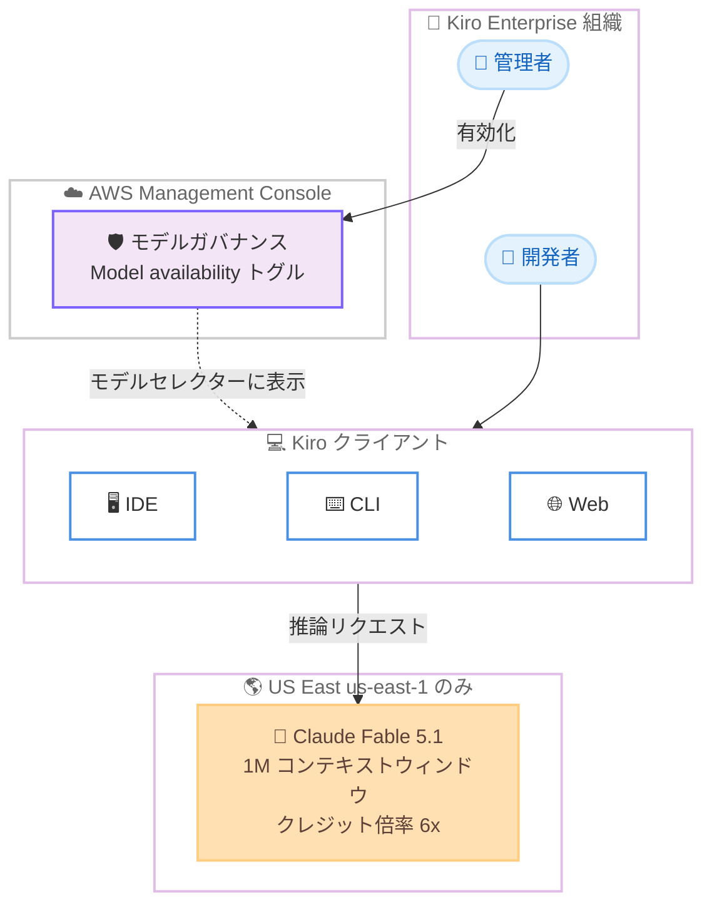

# Kiro - Claude Fable 5.1 が利用可能に

**リリース日**: 2026 年 9 月 16 日
**サービス**: Kiro (kiro.dev)
**機能**: Claude Fable 5.1 モデルの提供 (Kiro Enterprise 向け Preview)

📊 [このアップデートのインフォグラフィックを見る](https://takech9203.github.io/aws-news-summary/20260916-kiro-fable-5-1.html)

## 概要

AWS の AI 搭載 IDE である Kiro において、Anthropic の最新モデル Claude Fable 5.1 が Kiro Enterprise 組織向けに Preview として利用可能になりました。Fable 5.1 は Anthropic の最も高性能なエージェンティックコーディングモデルであり、長時間かつコンテキストの多いエージェンティックセッションにおいて新しい水準を打ち立てるモデルです。問題の症状を表面的に報告するのではなく、コード内の根本原因まで追跡し、複雑なタスク全体を通じてコンテキストと意図を維持し続ける点が特徴です。

Fable 5.1 は 1M (100 万) トークンのコンテキストウィンドウを備え、クレジット倍率は 6x です。Preview ロールアウト中は利用が制限されており、アクセス可能な組織はモデルガバナンス (Model Governance) を通じて Fable 5.1 を有効化できます。推論は US East (N. Virginia、us-east-1) リージョンのみで実行される点に注意が必要です。

**アップデート前の課題**

Fable 5.1 の提供以前は、以下のような課題がありました。

- 長時間の自律実行や大規模リファクタリングにおいて、セッション終盤でコンテキストや当初の計画を見失い、タスクが完走しないことがあった
- モデルが問題の根本原因ではなく表面的な症状への対処にとどまり、修正の手戻りが発生することがあった
- 成功見込みのないタスクでも反復を続けてしまい、クレジットを浪費するケースがあった
- サイバーセキュリティ関連の分類器が正当な防御的セキュリティ作業まで遮断し、作業が中断されることがあった

**アップデート後の改善**

- インタラクティブなコーディングセッション (バグ修正、関数のリファクタリング、PR のブロック解除など) で意図の理解精度が向上し、より少ないやり取りで目的を達成できるようになった
- 大規模リファクタリングや長時間の自律実行において、Kiro のスペック駆動ワークフローがセッション全体を通じて計画を保持し、より確実に完走できるようになった
- 大規模なコードベース全体の推論を要するセキュリティ作業やシステムレベルの作業で、難問への収束性が向上した
- タスクが成功しないと判断した場合は早期に停止し、無駄なクレジット消費を回避するようになった
- サイバーセキュリティのセーフガードが更新され、防御的セキュリティ作業と実際の脅威をより正確に区別することで、正当なタスクでの中断が減少した

## アーキテクチャ図



管理者が AWS Management Console のモデルガバナンスで Fable 5.1 を有効化すると、組織内のすべての Kiro クライアント (IDE / CLI / Web) のモデルセレクターに Fable 5.1 が表示されます。推論は us-east-1 リージョンのみで実行されます。

## サービスアップデートの詳細

### 主要機能

1. **根本原因の追跡とコンテキスト維持**
   - 問題の症状を表面的に報告するのではなく、コード内の根本原因まで追跡して特定する
   - 複雑なタスクの全工程を通じてコンテキストと意図を維持する
   - セッションが長くなるほど効率が向上するように設計されている

2. **3 種類の作業での性能向上**
   - **インタラクティブタスク**: バグ修正、関数のリファクタリング、PR のブロック解除といった高速な対話型セッションでより正確になり、より少ないステップで目的を達成
   - **長時間のマルチステップタスク**: 大規模リファクタリングや長時間の自律実行において、Kiro のスペック駆動ワークフローがコンテキストを失ったり終盤で脱線したりせず、より確実に完走
   - **セキュリティ / システムレベルの複雑なタスク**: 大規模なコードベース全体の推論を要する難問への収束性が向上

3. **クレジット効率の向上**
   - Kiro のスペック駆動アプローチと組み合わせることで、タスクが成功しないと判断した場合に早期停止し、行き詰まった反復によるクレジット浪費を回避
   - マルチファイルリファクタリング、長時間の自律実行、ツール使用の多いセッションといった高度にエージェンティックな作業に適する

4. **更新されたサイバーセキュリティセーフガード**
   - 分類器がチューニングされ、防御的セキュリティ作業と実際の脅威をより正確に区別し、正当なタスクでの中断が減少
   - ソフトウェア脆弱性の発見に利用可能になった
   - エクスプロイト生成、バイナリベースの脆弱性スキャン、ペネトレーションテストなどのタスクは、引き続き Kiro 内で Opus クラスのモデルにリダイレクトされる

## 技術仕様

### モデル仕様

| 項目 | 詳細 |
|------|------|
| モデル名 | Claude Fable 5.1 (Anthropic) |
| 提供対象 | Kiro Enterprise 組織 (Preview、段階的ロールアウト) |
| コンテキストウィンドウ | 1M (100 万) トークン |
| クレジット倍率 | 6x |
| 推論リージョン | US East (N. Virginia、us-east-1) のみ |
| 有効化の前提 | AWS Management Console でのモデルガバナンスの有効化 |
| 対応クライアント | Kiro IDE、CLI、Web |
| データ保持 | 不正利用検出のため AWS がトラフィックを 30 日間保持。フラグ付けされたトラフィックは人によるレビューの対象 |

## 設定方法

### 前提条件

1. Kiro Enterprise 組織であること (Preview ロールアウト中はアクセス可能な組織が制限される)
2. AWS Management Console でモデルガバナンス (Model Governance) が有効化されていること
3. Kiro クライアント (IDE / CLI) が最新バージョンであること

### 手順

#### ステップ 1: AWS Management Console で Kiro 設定を開く

AWS Management Console にサインインし、Kiro の設定ページを開きます。モデルガバナンスが未設定の場合は、先に有効化します。

#### ステップ 2: Fable 5.1 を有効化する

Model availability トグルをオンにし、モデルリストから Fable 5.1 を選択します。有効化すると、組織内のすべてのユーザーの Kiro クライアントのモデルセレクターに Fable 5.1 が表示されます。この際、AWS が不正利用検出のためトラフィックを 30 日間保持し、フラグ付けされたトラフィックは人によるレビューの対象となる旨のデータ保持通知が表示されます。

#### ステップ 3: クライアントを更新してモデルを選択する

Kiro をダウンロードするか、IDE または CLI を再起動して最新のモデルリストを取得します。Web ユーザーはブラウザを更新します。その後、モデルセレクターから Fable 5.1 を選択して利用を開始します。

なお、組織でアクセスを制限する必要がある場合は、同じモデル設定ページからいつでも Fable 5.1 を無効化できます。

## メリット

### ビジネス面

- **プロダクションレディなコードの提供**: 手直しが必要な下書きやスタブではなく、本番投入可能なコードを生成するという Kiro の目標を、より高い水準で実現できる
- **クレジットの有効活用**: 成功見込みのないタスクの早期停止により、行き詰まった反復への無駄な支出を回避できる
- **ガバナンスと統制**: モデルガバナンスによる組織単位での有効化 / 無効化により、エンタープライズのコンプライアンス要件に沿ったモデル管理ができる

### 技術面

- **1M コンテキストウィンドウ**: 大規模なコードベース全体を踏まえた推論が可能になり、マルチファイルリファクタリングや横断的な変更の品質が向上する
- **長時間セッションの信頼性**: スペック駆動ワークフローと組み合わせて、長時間の自律実行を終盤の脱線なく完走できる
- **セキュリティ作業との親和性**: 更新されたセーフガードにより、防御的セキュリティ作業や脆弱性発見といった正当なタスクを中断少なく実行できる

## デメリット・制約事項

### 制限事項

- Kiro Enterprise 組織のみが対象で、個人プラン (Free / Pro など) では利用できない
- Preview の段階的ロールアウト中であり、アクセス可能な組織が制限されている
- 推論は us-east-1 (IAD) のみで実行されるため、データレジデンシー要件がある組織は確認が必要
- エクスプロイト生成、バイナリベースの脆弱性スキャン、ペネトレーションテストなどのタスクは Opus クラスのモデルにリダイレクトされる
- 利用にはモデルガバナンスの有効化が必須

### 考慮すべき点

- クレジット倍率が 6x と高いため、日常的な軽量タスクでは他のモデルとの使い分けを検討する価値がある
- 不正利用検出のため AWS がトラフィックを 30 日間保持し、フラグ付けされたトラフィックは人によるレビューの対象となる点を、組織のデータ取り扱いポリシーと照らして確認する必要がある
- 最新のモデルリストを取得するには、IDE / CLI の再起動またはブラウザの更新が必要

## ユースケース

### ユースケース 1: 大規模なマルチファイルリファクタリング

**シナリオ**: レガシーコードベース全体にまたがる技術的負債の解消として、共通ライブラリの API 変更に伴う数十ファイルの一括リファクタリングを実施する。

**実装例**:
```
1. Kiro のスペック駆動ワークフローでリファクタリング計画をスペックとして定義
2. モデルセレクターで Fable 5.1 を選択
3. 1M コンテキストウィンドウを活用し、関連ファイル群を踏まえた一貫性のある変更を自律実行
```

**効果**: セッション終盤でも計画を見失わず、一貫性のある変更を完走できる。行き詰まった場合は早期停止するため、クレジットの浪費も抑えられる。

### ユースケース 2: 根本原因が不明瞭なバグの調査と修正

**シナリオ**: 複数モジュールにまたがる再現条件の複雑なバグについて、症状への対症療法ではなく根本原因を特定して修正したい。

**実装例**:
```
1. バグの再現手順とログを Kiro に提示
2. Fable 5.1 がコードベースを横断して根本原因を追跡
3. 原因箇所の修正と回帰テストの追加までを一連のセッションで実施
```

**効果**: 表面的な症状ではなくコード内の根本原因に到達するため、手戻りや再発を減らせる。少ないやり取りで修正まで到達できる。

### ユースケース 3: 防御的セキュリティ作業と脆弱性の発見

**シナリオ**: 自社プロダクトのコードベースに対して、セキュリティレビューと既知パターンの脆弱性調査を実施する。

**実装例**:
```
1. モデルガバナンスで Fable 5.1 を有効化
2. 大規模コードベース全体を対象にセキュリティ観点のコードレビューを依頼
3. 発見された脆弱性候補について修正案の生成まで実施
```

**効果**: 更新されたセーフガードにより正当な防御的セキュリティ作業での中断が減り、ソフトウェア脆弱性の発見にもモデルを活用できる。

## 料金

Fable 5.1 の利用はクレジット倍率 6x が適用されます。Kiro のクレジットベースの料金体系の中では最も高コストな部類のモデルであるため、長時間の自律実行や複雑なタスクなど、モデルの能力が活きる場面での利用が適しています。なお、成功見込みのないタスクを早期停止する挙動により、無駄なクレジット消費は抑制されます。

詳細は [Kiro の料金ページ](https://kiro.dev/pricing/) を参照してください。

## 利用可能リージョン

Kiro はグローバルに利用可能なサービスです。ただし、Fable 5.1 の推論は Preview 期間中、US East (N. Virginia、us-east-1) リージョンのみで実行されます。また、Preview の段階的ロールアウト中はアクセス可能な Kiro Enterprise 組織が制限されています。

## 関連サービス・機能

- **Kiro モデルガバナンス**: AWS Management Console から組織単位で利用可能なモデルを管理する機能。Fable 5.1 の有効化 / 無効化に必須
- **Kiro スペック駆動開発**: 要件をスペックとして定義し、実装を計画的に進めるワークフロー。Fable 5.1 の長時間実行の信頼性向上と組み合わせることで効果を発揮
- **Amazon Bedrock**: AWS 上で Anthropic Claude ファミリーを含む基盤モデルを利用できるサービス。アプリケーションへのモデル組み込みにはこちらを利用

## 参考リンク

- 📊 [インフォグラフィック](https://takech9203.github.io/aws-news-summary/20260916-kiro-fable-5-1.html)
- [公式ブログ: Claude Fable 5.1 is now available in Kiro](https://kiro.dev/blog/fable-5-1/)
- [Kiro Changelog](https://kiro.dev/changelog/)
- [Kiro 料金ページ](https://kiro.dev/pricing/)
- [Kiro ドキュメント](https://kiro.dev/docs/)

## まとめ

Anthropic の最も高性能なエージェンティックコーディングモデルである Claude Fable 5.1 が、Kiro Enterprise 組織向けに Preview として利用可能になりました。1M コンテキストウィンドウと長時間セッションでの信頼性向上により、大規模リファクタリングや自律実行といった高度なエージェンティック作業の完遂率を高められます。Kiro Enterprise を利用中の組織は、モデルガバナンスの設定を確認し、推論リージョンが us-east-1 に限定される点とクレジット倍率 6x を踏まえたうえで、複雑なタスクから試験的に導入することを推奨します。
