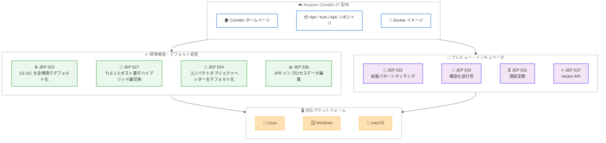

# Amazon Corretto - Corretto 27 一般提供開始

**リリース日**: 2026年09月17日
**サービス**: Amazon Corretto
**機能**: Corretto 27 (OpenJDK 27 対応 Feature Release) の一般提供

📊 [このアップデートのインフォグラフィックを見る](https://takech9203.github.io/aws-news-summary/20260917-amazon-corretto-27-generally-available.html)
<!-- INFOGRAPHIC_BASE_URL は環境変数から取得 -->

## 概要

2026 年 9 月 17 日、Amazon Corretto 27 が一般提供 (GA) となり、[ダウンロード](https://aws.amazon.com/corretto)可能になりました。Corretto 27 は OpenJDK 27 に対応した Feature Release (FR) 版で、Linux、Windows、macOS 向けに提供されます。Amazon Corretto は、無料で、マルチプラットフォームに対応した、本番環境対応の OpenJDK ディストリビューションであり、オープンソースライセンス (GPLv2 with Classpath Exception) で配布されます。

Corretto 27 では、G1 がすべての環境でデフォルトのガベージコレクタになる変更 (JEP 523)、TLS 1.3 におけるポスト量子ハイブリッド鍵交換 (JEP 527)、コンパクトオブジェクトヘッダーのデフォルト有効化 (JEP 534)、JDK Flight Recorder (JFR) のインプロセスデータ編集 (JEP 536) など、パフォーマンス、セキュリティ、メモリ効率、可観測性にわたる強化が含まれます。また、拡張パターンマッチング (JEP 532)、構造化並行性 (JEP 533)、遅延定数 (JEP 531) の各プレビュー機能と、Vector API のインキュベータ (JEP 537) も継続して提供されます。

Corretto 27 は Feature Release であり、サポート期間は 2027 年 4 月までです。最新の Java 言語機能をいち早く評価・検証したい開発者やチームが主な対象であり、長期運用が前提の本番環境には LTS 版 (Corretto 25 など) の利用が引き続き推奨されます。

**アップデート前の課題**

- ポスト量子暗号への移行に向けた TLS 1.3 のハイブリッド鍵交換を、標準の JDK 機能として利用できなかった
- オブジェクトヘッダーのサイズ削減 (コンパクトオブジェクトヘッダー) は JDK 25 以降で利用可能だったが、明示的なオプション指定が必要だった
- JFR の記録に含まれる機密データを JVM の外に出る前に編集する標準的な仕組みがなかった
- OpenJDK 27 の新機能を Corretto ディストリビューションで試すことができなかった

**アップデート後の改善**

- G1 がすべての環境でデフォルトの GC となり、環境によらず一貫した性能と停止時間を得やすくなった
- TLS 1.3 で古典的アルゴリズムとポスト量子アルゴリズムを組み合わせたハイブリッド鍵交換が利用可能になり、将来の量子計算機による脅威への備えが強化された
- コンパクトオブジェクトヘッダーがデフォルトで有効になり、追加設定なしで Java オブジェクトのメモリフットプリントが削減された
- JFR のインプロセスデータ編集により、機密データを JVM 内で除去してから記録を出力できるようになった

## アーキテクチャ図



Corretto 27 に含まれる標準機能・デフォルト変更とプレビュー・インキュベータ機能が、各配布チャネルを通じて Linux、Windows、macOS の各プラットフォームに提供される構成を示しています。

## サービスアップデートの詳細

### 主要機能

1. **G1 を全環境でデフォルトガベージコレクタに (JEP 523)**
   - これまで環境 (CPU 数やメモリ量) によっては Serial GC が選択されていたが、Corretto 27 ではすべての環境で G1 がデフォルトになる
   - 環境の差異によらず、より一貫したパフォーマンスと停止時間を実現
   - 小規模なコンテナ環境などでも、明示的な GC 指定なしで G1 の特性を利用可能

2. **TLS 1.3 のポスト量子ハイブリッド鍵交換 (JEP 527)**
   - 古典的な鍵交換アルゴリズムとポスト量子アルゴリズムを組み合わせたハイブリッド方式を TLS 1.3 でサポート
   - 将来の量子計算機による「今収集して後で解読する」タイプの攻撃 (harvest now, decrypt later) への耐性を強化
   - JDK 標準機能として提供されるため、追加ライブラリなしで利用可能

3. **コンパクトオブジェクトヘッダーをデフォルトで有効化 (JEP 534)**
   - Java オブジェクトのヘッダーサイズを削減し、ヒープメモリのフットプリントを縮小
   - JDK 24 で実験的機能、JDK 25 で製品機能 (オプション指定が必要) として導入されたものが、JDK 27 でデフォルト有効に
   - 小さなオブジェクトを大量に扱うアプリケーションで特にメモリ効率が向上

4. **JFR インプロセスデータ編集 (JEP 536)**
   - JDK Flight Recorder の記録データに含まれる機密情報を、JVM の外部に出力される前にプロセス内で編集 (redaction) 可能
   - パスワードや個人情報などが JFR 記録ファイル経由で漏えいするリスクを低減
   - 本番環境での継続的なプロファイリングやトラブルシューティングをより安全に実施可能

5. **継続プレビュー・インキュベータ機能**
   - **拡張パターンマッチング (JEP 532、プレビュー継続)**: パターン、`instanceof`、`switch` におけるプリミティブ型サポートを拡張
   - **構造化並行性 (JEP 533、プレビュー継続)**: 関連する複数のタスクを 1 つの作業単位として扱う API を改良
   - **遅延定数 (JEP 531、プレビュー継続)**: 不変データの初期化を実際に必要になるまで遅延させる仕組み
   - **Vector API (JEP 537、インキュベータ継続)**: 最新 CPU のベクトル演算機能を活用した数値計算の高速化

## 技術仕様

### Corretto 27 の基本情報

| 項目 | 詳細 |
|------|------|
| ベース | OpenJDK 27 |
| リリース種別 | Feature Release (FR) |
| サポート期間 | 2027 年 4 月まで |
| 対応 OS | Linux、Windows、macOS |
| ライセンス | GPLv2 with Classpath Exception (オープンソース) |
| 料金 | 無料 |

### 主な JEP 一覧

| JEP | 機能 | ステータス |
|-----|------|-----------|
| JEP 523 | G1 を全環境でデフォルト GC に | 標準 |
| JEP 527 | TLS 1.3 ポスト量子ハイブリッド鍵交換 | 標準 |
| JEP 534 | コンパクトオブジェクトヘッダーのデフォルト化 | 標準 |
| JEP 536 | JFR インプロセスデータ編集 | 標準 |
| JEP 532 | 拡張パターンマッチング | プレビュー (継続) |
| JEP 533 | 構造化並行性 | プレビュー (継続) |
| JEP 531 | 遅延定数 | プレビュー (継続) |
| JEP 537 | Vector API | インキュベータ (継続) |

### LTS と Feature Release の違い

| 項目 | LTS (例: Corretto 25、21、17) | Feature Release (Corretto 27) |
|------|------------------------------|------------------------------|
| サポート期間 | 複数年の長期サポート | 次の Feature Release までの短期間 (2027 年 4 月まで) |
| 主な用途 | 本番環境での長期運用 | 最新機能の評価・検証、早期採用 |
| アップデート | 四半期アップデートと CSPU を長期に提供 | サポート期間内のみ提供 |

## 設定方法

### 前提条件

1. Linux、Windows、または macOS 環境
2. インストールに必要な管理者権限
3. (プレビュー機能を使う場合) `--enable-preview` フラグの指定

### 手順

#### ステップ1: Corretto 27 のダウンロードとインストール

[Corretto ダウンロードページ](https://docs.aws.amazon.com/corretto/latest/corretto-27-ug/downloads-list.html)から、プラットフォームに応じたインストーラーまたはアーカイブを取得します。

```bash
# apt の例 (Debian/Ubuntu)
wget -O- https://apt.corretto.aws/corretto.key | sudo gpg --dearmor -o /usr/share/keyrings/corretto-keyring.gpg
echo "deb [signed-by=/usr/share/keyrings/corretto-keyring.gpg] https://apt.corretto.aws stable main" | sudo tee /etc/apt/sources.list.d/corretto.list
sudo apt-get update
sudo apt-get install -y java-27-amazon-corretto-jdk
```

上記のコマンドは、Corretto の署名キーを登録して apt リポジトリを追加し、Corretto 27 の JDK をインストールしています。

#### ステップ2: バージョンの確認

```bash
java -version
```

このコマンドで、インストールされた Corretto 27 のバージョン情報が表示されることを確認します。

#### ステップ3: プレビュー機能の有効化 (必要な場合)

```bash
# 構造化並行性などのプレビュー機能を使用してコンパイル・実行
javac --release 27 --enable-preview Main.java
java --enable-preview Main
```

プレビュー機能 (JEP 531、532、533) を使用するには、コンパイル時と実行時の両方で `--enable-preview` フラグの指定が必要です。Vector API (JEP 537) はインキュベータモジュールのため、`--add-modules jdk.incubator.vector` を指定します。

## メリット

### ビジネス面

- **無料で最新の Java を利用可能**: ライセンス費用なしで OpenJDK 27 ベースの本番環境対応ディストリビューションを商用利用できる
- **将来のセキュリティ要件への先行対応**: ポスト量子ハイブリッド鍵交換により、量子計算機時代を見据えた暗号移行の検証を早期に開始できる
- **インフラコストの削減余地**: コンパクトオブジェクトヘッダーのデフォルト化により、メモリ使用量の削減とそれに伴うインスタンスサイズの最適化が期待できる

### 技術面

- **一貫した GC 動作**: G1 が全環境でデフォルトとなり、開発・テスト・本番の環境差による GC 挙動の違いが減少する
- **安全な本番プロファイリング**: JFR のインプロセスデータ編集により、機密データを除去したうえで記録を収集・共有できる
- **最新言語機能の早期検証**: 拡張パターンマッチング、構造化並行性、遅延定数、Vector API を LTS 到達前に評価し、将来の移行に備えられる

## デメリット・制約事項

### 制限事項

- Corretto 27 は Feature Release であり、サポートは 2027 年 4 月までの短期間に限られる
- JEP 531、532、533 はプレビュー機能、JEP 537 はインキュベータ機能であり、将来のリリースで仕様が変更される可能性がある
- プレビュー機能を有効にしてビルドしたクラスファイルは、同じバージョンの JVM でのみ実行できる

### 考慮すべき点

- 長期運用が前提の本番環境では、LTS 版 (Corretto 25 など) の利用が引き続き推奨される
- G1 デフォルト化により、これまで Serial GC が自動選択されていた小規模環境では GC 挙動が変化するため、性能特性の再確認が必要
- コンパクトオブジェクトヘッダーのデフォルト化は、オブジェクトヘッダーのレイアウトに依存する一部のエージェントやツールとの互換性確認が必要

## ユースケース

### ユースケース1: ポスト量子暗号移行の事前検証

**シナリオ**: 金融機関や公共系システムで、将来の量子計算機による脅威に備え、TLS 通信のポスト量子暗号対応を検証する

**実装例**:
```
Corretto 27 環境で TLS 1.3 のハイブリッド鍵交換 (JEP 527) を有効にし、
既存のクライアント・サーバー間で TLS ハンドシェイクの互換性と
性能への影響を測定する
```

**効果**: 追加ライブラリなしで JDK 標準機能としてポスト量子ハイブリッド鍵交換を検証でき、本格移行に向けた課題を早期に洗い出せる

### ユースケース2: メモリ集約型アプリケーションのフットプリント削減検証

**シナリオ**: 大量の小さなオブジェクトを扱うキャッシュサーバーやデータ処理アプリケーションで、メモリ使用量の削減効果を確認する

**実装例**:
```bash
# Corretto 27 ではコンパクトオブジェクトヘッダーがデフォルト有効
java -Xlog:gc* -jar myapp.jar

# 比較のために無効化して測定する場合
java -XX:-UseCompactObjectHeaders -Xlog:gc* -jar myapp.jar
```

**効果**: 追加設定なしでヒープメモリのフットプリントが削減され、同一ワークロードでのメモリ使用量やコンテナのメモリ上限を見直せる

### ユースケース3: 本番環境での安全な継続的プロファイリング

**シナリオ**: 本番環境の Java アプリケーションで JFR による継続的プロファイリングを行いたいが、記録に機密データが含まれるリスクが懸念される

**実装例**:
```
JFR インプロセスデータ編集 (JEP 536) を構成し、パスワードや
個人情報を含むイベントデータを JVM 内で編集してから記録を出力。
編集済みの記録ファイルを分析基盤へ安全に転送する
```

**効果**: 機密データの漏えいリスクを抑えながら、本番環境の性能分析やトラブルシューティングに JFR を活用できる

## 料金

Amazon Corretto は完全に無料で、ライセンス費用は発生しません。オープンソースライセンス (GPLv2 with Classpath Exception) のもとで配布され、商用利用にも追加費用は不要です。

## 利用可能リージョン

Amazon Corretto はソフトウェアディストリビューションであり、すべての AWS リージョンおよびオンプレミス環境で利用可能です。Linux、Windows、macOS 向けのビルドが提供されています。

## 関連サービス・機能

- **AWS Lambda**: Java ランタイムでのサーバーレス関数実行 (最新言語機能の検証結果を将来の LTS 採用時に活用)
- **Amazon EC2**: Java アプリケーションのホスティング環境
- **Amazon ECS/EKS**: Corretto 公式 Docker イメージを利用したコンテナ実行環境
- **AWS CodeBuild**: Corretto を使用した Java アプリケーションのビルド
- **Amazon Corretto 25 (LTS)**: 長期運用向けの直近 LTS 版。本番環境での長期利用にはこちらを推奨

## 参考リンク

- 📊 [インフォグラフィック](https://takech9203.github.io/aws-news-summary/20260917-amazon-corretto-27-generally-available.html)
- [公式発表 (What's New)](https://aws.amazon.com/about-aws/whats-new/2026/09/amazon-corretto-27-generally-available/)
- [Corretto ホームページ](https://aws.amazon.com/corretto)
- [Corretto 27 ダウンロード](https://docs.aws.amazon.com/corretto/latest/corretto-27-ug/downloads-list.html)
- [OpenJDK 27 プロジェクトページ](https://openjdk.org/projects/jdk/27/)
- [AWS Open Source Blog - Amazon Corretto](https://aws.amazon.com/blogs/opensource/amazon-corretto-no-cost-distribution-of-openjdk-with-long-term-support/)
- [GitHub - Corretto](https://github.com/corretto)

## まとめ

Amazon Corretto 27 は、OpenJDK 27 に対応した Feature Release 版として一般提供が開始され、G1 のデフォルト化、TLS 1.3 のポスト量子ハイブリッド鍵交換、コンパクトオブジェクトヘッダーのデフォルト有効化、JFR インプロセスデータ編集など、性能・セキュリティ・メモリ効率・可観測性にわたる強化が含まれます。サポートは 2027 年 4 月までの短期間であるため、最新機能の評価・検証用途に活用し、本番環境の長期運用には LTS 版 (Corretto 25 など) を利用する使い分けが推奨されます。
