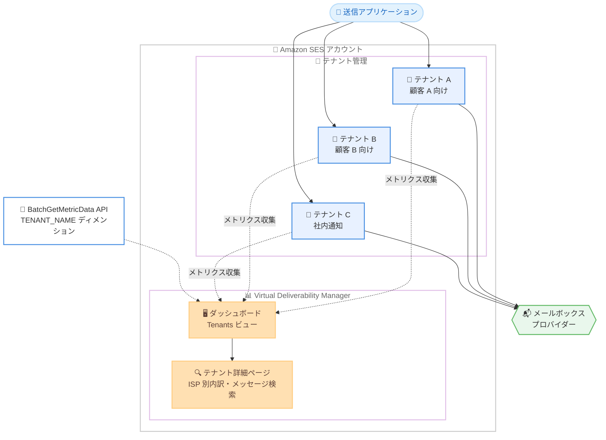

# Amazon SES - テナントレベルの到達性インサイト

**リリース日**: 2026 年 9 月 17 日
**サービス**: Amazon Simple Email Service (SES)
**機能**: Virtual Deliverability Manager によるテナントレベルの到達性インサイト

📊 [このアップデートのインフォグラフィックを見る](https://takech9203.github.io/aws-news-summary/20260917-amazon-ses-vdm-tenants.html)

## 概要

Amazon SES が、Virtual Deliverability Manager (VDM) におけるテナントレベルの到達性インサイトをサポートしました。SES のテナント管理機能は、顧客、ビジネスユニット、アプリケーションごとにメール送信を分離するための機能です。今回のアップデートにより、テナントを利用し VDM を有効化しているお客様は、個々のテナント単位で到達性メトリクスを追跡できるようになりました。

VDM ダッシュボードに新しく追加された「Tenants」ビューでは、テナントごとの送信数、配信数、バウンス、苦情、開封、クリックの各メトリクスを確認できます。テナントの詳細ページでは、メールボックスプロバイダー別の内訳、関連付けられた送信 ID や設定セットの確認、送信メッセージの検索とエクスポートが可能です。また、`BatchGetMetricData` API に追加された `TENANT_NAME` ディメンションにより、プログラムからテナント別メトリクスを取得できます。

このアップデートは、ISV (独立系ソフトウェアベンダー) や複数のビジネスユニットを持つ企業など、1 つの SES アカウントで複数の送信元を管理するお客様にとって特に有用です。到達性の問題を引き起こしているテナントを特定し、他のテナントに影響を与えることなく対処できます。

**アップデート前の課題**

- VDM のメトリクスは、アカウント、ISP、送信 ID、設定セットの各レベルでのみ提供されており、テナント単位の到達性を可視化できなかった
- テナント単位のメトリクスは CloudWatch の送信数、バウンス、苦情に限られ、開封率やクリック率などのエンゲージメント指標をテナント別に確認できなかった
- 到達性の問題が発生した際に、どのテナントが原因かを特定するには、送信 ID や設定セットからテナントとの対応関係を手動で突き合わせる必要があった

**アップデート後の改善**

- VDM ダッシュボードの新しい Tenants ビューで、テナントごとの送信数、配信数、バウンス、苦情、開封、クリックを一覧で確認できるようになった
- テナント詳細ページで、メールボックスプロバイダー別の内訳、関連する送信 ID と設定セット、レピュテーション検出結果までドリルダウンできるようになった
- `BatchGetMetricData` API の `TENANT_NAME` ディメンションにより、テナント別メトリクスをプログラムから取得し、独自の監視やレポーティングに組み込めるようになった
- 問題のあるテナントをピンポイントで特定し、他のテナントに影響を与えずに対処できるようになった

## アーキテクチャ図



各テナントの送信アクティビティが VDM に集約され、ダッシュボードの Tenants ビューからテナント単位の到達性メトリクスを確認し、詳細ページでドリルダウンできる構成を示しています。

## サービスアップデートの詳細

### 主要機能

1. **VDM ダッシュボードの Tenants ビュー**
   - テナントごとに送信数、配信数、一時的・恒久的バウンス、苦情、開封、クリックの各メトリクスを表形式で表示
   - 「Compare tenants」検索ボックスで特定のテナントをフィルタリングして比較可能
   - 送信ステータスによるフィルタリングにも対応し、同じステータスのテナントを一覧表示できる
   - 表示中のデータは CSV ファイルとしてエクスポート可能

2. **テナント詳細ページへのドリルダウン**
   - Tenants ビューでテナント名を選択すると、配信率、苦情、バウンス、開封率・クリック率のカードと時系列グラフを表示
   - テナントが送信した宛先のメールボックスプロバイダー ISP 別のメトリクス内訳を表示
   - テナントに関連付けられた送信 ID、設定セット、レピュテーション検出結果の一覧を表示

3. **テナント送信メッセージの検索とエクスポート**
   - VDM ダッシュボードの Messages タブで、テナント名を条件に送信メッセージを検索可能
   - 各メッセージの配信・エンゲージメントステータス、イベント履歴、メールボックスプロバイダーからの応答を確認できる
   - 検索結果は CSV としてエクスポート可能。`CreateExportJob` API の `MessageInsightsDataSource` でも `TenantName` によるフィルタリングに対応

4. **BatchGetMetricData API の TENANT_NAME ディメンション**
   - SES API v2 の `BatchGetMetricData` オペレーションに新しい `TENANT_NAME` ディメンションが追加
   - テナント単位の到達性メトリクスをプログラムから取得し、独自のダッシュボードや監視システムに統合可能

## 技術仕様

### VDM で確認できるメトリクスのディメンション

| ディメンション | 説明 | 提供時期 |
|------|------|------|
| アカウント | アカウント全体の到達性・レピュテーション統計 | 従来から提供 |
| ISP | メールボックスプロバイダー別のメトリクス | 従来から提供 |
| 送信 ID | 送信ドメイン・メールアドレス別のメトリクス | 従来から提供 |
| 設定セット | 設定セット別のメトリクス | 従来から提供 |
| テナント | テナント別のメトリクス | **今回追加** |

### テナント別に確認できるメトリクス

| メトリクス | 説明 |
|------|------|
| Send volume | テナントの総送信数 |
| Delivered | 配信に成功したメール数 |
| Transient / Permanent bounces | 一時的・恒久的バウンス数と率 |
| Complaints | 苦情 (スパム報告) 数と率 |
| Opens / Clicks | 開封数・クリック数と率 (エンゲージメントトラッキング有効時) |

### BatchGetMetricData の利用例

```json
{
  "Queries": [
    {
      "Id": "Retrieve-Tenant-Sends",
      "Namespace": "VDM",
      "Metric": "SEND",
      "Dimensions": {
        "TENANT_NAME": "MyTenant"
      },
      "StartDate": "2026-09-10T00:00:00",
      "EndDate": "2026-09-17T00:00:00"
    }
  ]
}
```

## 設定方法

### 前提条件

1. Amazon SES アカウントでテナント管理機能を利用していること (テナントの作成と、送信 ID・設定セットの関連付けが完了していること)
2. Virtual Deliverability Manager がアカウントで有効化されていること
3. メール送信時に API の `TenantName` パラメータまたは SMTP ヘッダー `X-SES-TENANT` でテナントを指定していること

### 手順

#### ステップ 1: Virtual Deliverability Manager を有効化する

```bash
aws sesv2 put-account-vdm-attributes \
    --vdm-attributes '{
        "VdmEnabled": "ENABLED",
        "DashboardAttributes": {"EngagementMetrics": "ENABLED"},
        "GuardianAttributes": {"OptimizedSharedDelivery": "ENABLED"}
    }'
```

アカウントレベルで VDM を有効化し、開封・クリックなどのエンゲージメントメトリクスの収集を有効にするコマンドです。SES コンソールの Virtual Deliverability Manager メニューからも有効化できます。

#### ステップ 2: テナントを指定してメールを送信する

```bash
aws sesv2 send-email \
  --tenant-name "MyTenant" \
  --from-email-address "sender@example.com" \
  --destination "ToAddresses=recipient@example.com" \
  --content "Simple={Subject={Data='Test Subject',Charset=utf-8},Body={Text={Data='Test email body',Charset=utf-8}}}" \
  --configuration-set-name "MyConfigSet"
```

`--tenant-name` パラメータでテナントを指定してメールを送信するコマンドです。SES は指定されたテナントに送信 ID と設定セットが関連付けられていることを検証し、テナント単位でメトリクスを記録します。

#### ステップ 3: VDM ダッシュボードでテナント別メトリクスを確認する

1. SES コンソール (https://console.aws.amazon.com/ses) を開く
2. 左ナビゲーションペインの Virtual Deliverability Manager 配下にある [Dashboard] を選択する
3. [Tenants] タブを選択し、テナントごとの送信数、配信数、バウンス、苦情、開封、クリックを確認する
4. テナント名を選択して詳細ページに移動し、ISP 別の内訳、関連する送信 ID・設定セット、レピュテーション検出結果を確認する

#### ステップ 4: API でテナント別メトリクスを取得する

```bash
aws sesv2 batch-get-metric-data --cli-input-json file://tenant-sends.json
```

`BatchGetMetricData` オペレーションで、`TENANT_NAME` ディメンションを指定した入力ファイルを使用してテナント別メトリクスを取得するコマンドです。取得したデータは独自の監視システムやレポーティングに活用できます。

## メリット

### ビジネス面

- **テナント単位の問題切り分けによる影響最小化**: 到達性の問題を引き起こしているテナントをピンポイントで特定し、他のテナントの送信に影響を与えることなく対処できる
- **マルチテナント SaaS の運用品質向上**: ISV やサービスプロバイダーが顧客ごとの到達性を可視化し、顧客への説明責任やサポート対応の品質を高められる
- **問題の早期発見**: テナント別のトレンドを継続的に監視することで、配信遅延やブロックなどの大きな問題に発展する前に兆候を捉えられる

### 技術面

- **エンゲージメント指標のテナント別可視化**: CloudWatch では確認できなかった開封率・クリック率などのエンゲージメント指標をテナント単位で追跡できる
- **API によるプログラマティックアクセス**: `BatchGetMetricData` の `TENANT_NAME` ディメンションにより、独自のダッシュボードや自動化ワークフローに統合できる
- **統合されたドリルダウン体験**: テナント詳細ページから ISP 別内訳、関連リソース、レピュテーション検出結果、メッセージ検索まで一貫して調査できる

## デメリット・制約事項

### 制限事項

- テナントレベルのインサイトを利用するには、テナント管理機能の利用に加えて VDM の有効化が必要 (それぞれ追加料金が発生)
- テナントはリージョン単位のリソースであり、複数リージョンから送信する場合はリージョンごとに個別の設定と監視が必要
- VDM は受信者が 1 人のメールのみをメトリクスの対象とするため、複数受信者宛のメールはダッシュボードのメトリクスに含まれない
- 開封率・クリック率はエンゲージメントトラッキングが有効な HTML メールのみが対象

### 考慮すべき点

- テナント別メトリクスを取得するには、送信時に API の `TenantName` パラメータまたは SMTP ヘッダー `X-SES-TENANT` でテナントを明示的に指定する必要がある
- Apple Mail のプライバシー保護 (MPP) の影響により開封数が実際より多く計上される場合があるため、絶対値ではなくトレンドの変化に注目することが推奨される
- テナントの送信品質が悪化するとアカウント全体のレピュテーションにも影響し得るため、テナント別メトリクスの定期的なレビューが重要

## ユースケース

### ユースケース 1: ISV による顧客別の到達性監視

**シナリオ**: マーケティングプラットフォームを提供する ISV が、数百の顧客をそれぞれテナントとして分離し、SES 経由でメールを送信している。特定の顧客のバウンス率が上昇した際に、迅速に特定して対処したい。

**実装例**:
```
1. 顧客ごとにテナントを作成し、送信 ID と設定セットを関連付け
2. VDM ダッシュボードの Tenants ビューでバウンス率の高いテナントをソートして特定
3. テナント詳細ページで ISP 別内訳を確認し、問題の発生先を絞り込み
4. 該当顧客にリストハイジーンの改善を依頼し、必要に応じてテナントを一時停止
```

**効果**: 問題のある顧客のみに対処し、他の顧客の送信を保護しながらプラットフォーム全体の到達性を維持できる。

### ユースケース 2: 企業内ビジネスユニット別のメール品質管理

**シナリオ**: 複数のビジネスユニット (マーケティング、トランザクション通知、社内通知など) が 1 つの SES アカウントを共有している企業で、部門ごとのメール送信品質を可視化し、ガバナンスを強化したい。

**実装例**:
```
1. ビジネスユニットごとにテナントを作成
2. BatchGetMetricData の TENANT_NAME ディメンションで部門別メトリクスを定期取得
3. 社内 BI ダッシュボードに部門別の配信率・苦情率を可視化
4. しきい値を超えた部門に対して改善アクションを実施
```

**効果**: 部門別の送信品質を定量的に把握し、アカウント全体のレピュテーション悪化を未然に防止できる。

### ユースケース 3: 到達性問題発生時の原因調査

**シナリオ**: 特定の顧客から「メールが届かない」という問い合わせを受けたサポートチームが、該当テナントの送信状況を調査したい。

**実装例**:
```
1. VDM ダッシュボードの Messages タブでテナント名を条件に検索
2. 該当メッセージのイベント履歴とメールボックスプロバイダーの応答コードを確認
3. テナント詳細ページで ISP 別のバウンス率を確認し、特定 ISP での問題か全体的な問題かを切り分け
4. 調査結果を CSV でエクスポートし、顧客への報告資料として活用
```

**効果**: メッセージ単位の詳細な配信状況に基づいた、迅速かつ正確なサポート対応が可能になる。

## 料金

テナントレベルの到達性インサイト自体に追加料金はありませんが、前提となるテナント管理と Virtual Deliverability Manager にはそれぞれ料金が発生します。

### 料金例 (à la carte、米国東部)

| 項目 | 料金 |
|--------|------------------|
| VDM SES deliverability | $0.07/1,000 通 (月間 0〜1,000 万通)、$0.05/1,000 通 (1,000 万〜1 億通)、$0.02/1,000 通 (1 億通超) |
| VDM クエリ | $0.0005/1,000 クエリ (月間 5,000 クエリまで無料) |
| テナント管理 | $0.005/月/テナント + $0.005/1,000 通 |

SES の料金プラン (Essentials、Pro、Enterprise) を利用している場合、VDM SES deliverability は全プランに含まれます。テナント管理は Enterprise プランに含まれ (アカウント・リージョンあたり 1,000 テナントまで)、Essentials と Pro ではアドオンとして利用できます。詳細は [SES 料金ページ](https://aws.amazon.com/ses/pricing/) を参照してください。

## 利用可能リージョン

Virtual Deliverability Manager は、Amazon SES が利用可能なすべての AWS リージョンで利用できます。

## 関連サービス・機能

- **Amazon SES テナント管理**: 今回のアップデートの前提となる機能。テナント単位でのリソース分離、レピュテーション監視、レピュテーションポリシーによる自動送信停止を提供
- **Amazon CloudWatch**: テナント別の送信数、バウンス、苦情メトリクスを `AWS/SES` 名前空間で提供。VDM はこれに加えて開封・クリックなどのエンゲージメント指標とドリルダウン分析を提供
- **Amazon EventBridge**: テナントのレピュテーション検出結果や送信ステータス変更をイベントとして受信し、アラートや自動対応を構築可能
- **Amazon SES Deliverability Advisor**: 到達性に影響するレピュテーション検出結果を提供し、テナント詳細ページからも確認可能

## 参考リンク

- 📊 [インフォグラフィック](https://takech9203.github.io/aws-news-summary/20260917-amazon-ses-vdm-tenants.html)
- [公式発表 (What's New)](https://aws.amazon.com/about-aws/whats-new/2026/09/amazon-ses-vdm-tenants/)
- [ドキュメント: テナント管理](https://docs.aws.amazon.com/ses/latest/dg/tenants.html)
- [ドキュメント: Virtual Deliverability Manager ダッシュボード](https://docs.aws.amazon.com/ses/latest/dg/vdm-dashboard.html)
- [API リファレンス: BatchGetMetricData](https://docs.aws.amazon.com/ses/latest/APIReference-V2/API_BatchGetMetricData.html)
- [料金ページ](https://aws.amazon.com/ses/pricing/)

## まとめ

Amazon SES の Virtual Deliverability Manager がテナントレベルの到達性インサイトに対応し、マルチテナント構成での到達性監視がアカウント・ISP・送信 ID・設定セットに加えてテナント単位まで拡張されました。ISV や複数のビジネスユニットでメール送信を管理しているお客様は、問題のあるテナントを迅速に特定し、他のテナントに影響を与えずに対処できるようになります。テナント管理と VDM を利用中のお客様は、SES コンソールの VDM ダッシュボードで新しい Tenants ビューを確認することをお勧めします。
