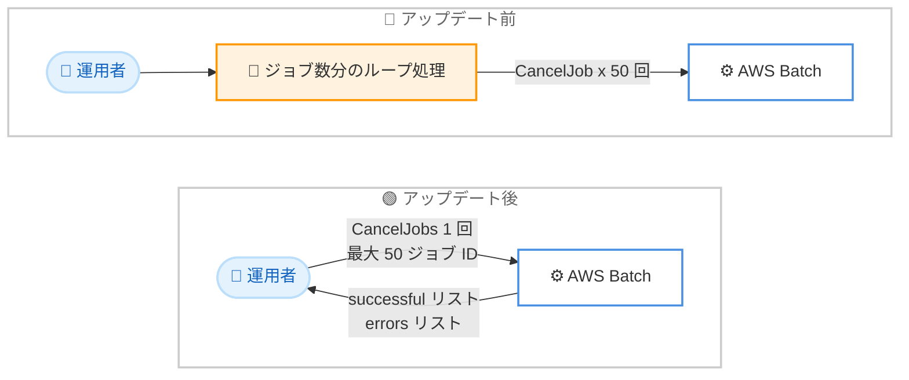

# AWS Batch - 一括ジョブキャンセル・終了のサポート

**リリース日**: 2026 年 9 月 17 日
**サービス**: AWS Batch
**機能**: 一括ジョブキャンセル・終了 (CancelJobs / TerminateJobs / TerminateServiceJobs API)

📊 [このアップデートのインフォグラフィックを見る](https://takech9203.github.io/aws-news-summary/20260917-aws-batch-bulk-cancellation.html)

## 概要

AWS Batch が、単一の API コールで最大 50 ジョブのキャンセルまたは終了を実行できる一括操作をサポートしました。新たに追加された CancelJobs、TerminateJobs、TerminateServiceJobs の 3 つの API により、ジョブグループに対する一括操作が可能になり、単一のレスポンスでジョブごとの成功・失敗の結果を取得できます。

また、ListJobs API のレスポンスに isCancelled と isTerminated フィールドが、ListServiceJobs API のレスポンスに isTerminated フィールドが追加され、ジョブのライフサイクル状態の追跡が容易になりました。

大規模なバッチワークロードを運用するユーザーにとって、多数のジョブを停止する際の API コール数が大幅に削減され、運用の複雑さが軽減されます。ゲノム解析、金融シミュレーション、機械学習など、数百から数千のジョブを一度に投入するワークロードで特に有効です。

**アップデート前の課題**

- 以前は CancelJob および TerminateJob API が 1 回の呼び出しで 1 ジョブしか処理できず、多数のジョブを停止するにはジョブ数分の API コールが必要だった
- 大量のジョブを停止する際、呼び出し回数の増加により API スロットリングを考慮したリトライ処理やスクリプトの実装が必要だった
- 各ジョブの操作結果を個別に確認する必要があり、結果の集約処理を自前で実装する必要があった
- ジョブがキャンセル・終了リクエストを受け付けたかどうかを一覧 API から直接確認する手段がなかった

**アップデート後の改善**

- 単一の API コールで最大 50 ジョブのキャンセルまたは終了が可能になり、API コール数が最大 50 分の 1 に削減された
- 単一のレスポンスでジョブごとの結果 (成功リストとエラーリスト) を取得できるようになり、結果集約の実装が不要になった
- ListJobs の isCancelled / isTerminated フィールド、ListServiceJobs の isTerminated フィールドにより、ジョブのライフサイクル状態を一覧取得時に確認できるようになった
- 個別ジョブと配列ジョブの両方に対応し、SageMaker Training ジョブなどのサービスジョブも TerminateServiceJobs で一括終了できるようになった

## アーキテクチャ図



アップデート前は 50 ジョブの停止に 50 回の API コールとループ処理が必要でしたが、アップデート後は 1 回の API コールで一括操作でき、ジョブごとの結果も単一レスポンスで取得できます。

## サービスアップデートの詳細

### 主要機能

1. **CancelJobs API (新規)**
   - SUBMITTED、PENDING、RUNNABLE 状態のジョブを最大 50 件まで一括キャンセル
   - リクエストはジョブ ID のリスト (`jobs`) とキャンセル理由 (`reason`) を受け付ける
   - レスポンスは成功したジョブ ID のリスト (`successful`) と、失敗したジョブごとのエラー情報 (`errors`: job、code、message) を返す

2. **TerminateJobs API (新規)**
   - STARTING や RUNNING を含む任意の状態のジョブを最大 50 件まで一括終了
   - 実行中のジョブを強制的に停止する場合に使用
   - リクエスト・レスポンス構造は CancelJobs と同一

3. **TerminateServiceJobs API (新規)**
   - SageMaker Training ジョブなどのサービスジョブを任意の状態で最大 50 件まで一括終了
   - リクエスト・レスポンス構造は CancelJobs / TerminateJobs と同一

4. **List API のレスポンス拡張**
   - ListJobs のジョブサマリーに isCancelled と isTerminated のブール値フィールドが追加
   - ListServiceJobs のジョブサマリーに isTerminated のブール値フィールドが追加
   - キャンセル・終了リクエストを受け付けたジョブを一覧から識別でき、ライフサイクル状態の追跡が容易に

## 技術仕様

### 新 API の比較

| 項目 | CancelJobs | TerminateJobs | TerminateServiceJobs |
|------|------------|---------------|----------------------|
| 対象ジョブ | 通常ジョブ・配列ジョブ | 通常ジョブ・配列ジョブ | サービスジョブ |
| 対象状態 | SUBMITTED、PENDING、RUNNABLE | 任意の状態 (STARTING、RUNNING 含む) | 任意の状態 |
| 最大ジョブ数 / コール | 50 | 50 | 50 |
| リクエストパラメータ | jobs、reason | jobs、reason | jobs、reason |
| レスポンス | successful、errors | successful、errors | successful、errors |
| アクセス方法 | AWS CLI / SDK | AWS CLI / SDK | AWS CLI / SDK |

### API 変更履歴

| 日付 | サービス | 変更内容 |
|------|----------|----------|
| 2026/09/11 | [AWS Batch](https://awsapichanges.com/archive/changes/45d607-batch.html) | 3 new 2 updated api methods - 一括ジョブ操作 API (CancelJobs、TerminateJobs、TerminateServiceJobs) の追加。ListJobs、ListServiceJobs のレスポンスに isCancelled / isTerminated フィールドを追加 |

### レスポンス構造

```json
{
    "successful": [
        "job-id-1",
        "job-id-2"
    ],
    "errors": [
        {
            "job": "job-id-3",
            "code": "エラーコード",
            "message": "エラーメッセージ"
        }
    ]
}
```

一括操作の結果はジョブ単位で返されるため、一部のジョブが失敗しても成功したジョブの操作は継続されます。

## 設定方法

### 前提条件

1. AWS Batch のジョブキューとジョブが存在すること
2. AWS CLI または AWS SDK が最新バージョンに更新されていること
3. IAM ポリシーで `batch:CancelJobs`、`batch:TerminateJobs`、`batch:TerminateServiceJobs` などの必要なアクションが許可されていること

### 手順

#### ステップ1: 対象ジョブの確認

```bash
aws batch list-jobs \
    --job-queue my-job-queue \
    --job-status RUNNABLE
```

指定したジョブキュー内の RUNNABLE 状態のジョブ一覧を取得します。レスポンスの各ジョブサマリーに isCancelled と isTerminated フィールドが含まれるため、既に操作リクエスト済みのジョブを識別できます。

#### ステップ2: ジョブの一括キャンセル

```bash
aws batch cancel-jobs \
    --jobs job-id-1 job-id-2 job-id-3 \
    --reason "Deployment rollback"
```

SUBMITTED、PENDING、RUNNABLE 状態のジョブを最大 50 件まで一括キャンセルします。レスポンスの successful に成功したジョブ ID、errors に失敗したジョブとその理由が返されます。

#### ステップ3: 実行中ジョブの一括終了

```bash
aws batch terminate-jobs \
    --jobs job-id-4 job-id-5 \
    --reason "Cost control - stopping long running jobs"
```

STARTING や RUNNING を含む任意の状態のジョブを一括終了します。サービスジョブの場合は `aws batch terminate-service-jobs` を使用します。

#### ステップ4: 操作結果の確認

```bash
aws batch list-jobs \
    --job-queue my-job-queue \
    --job-status RUNNING
```

一覧取得時に isTerminated が true のジョブは終了リクエストを受け付けた状態であることを確認できます。

## メリット

### ビジネス面

- **運用負荷の軽減**: 大規模バッチワークロードにおける多数ジョブの停止作業が簡素化され、運用チームの工数を削減できる
- **迅速なコスト制御**: 不要になったジョブ群を即座に一括終了できるため、無駄なコンピューティングコストの発生を最小限に抑えられる
- **インシデント対応の高速化**: 障害時や誤投入時に大量のジョブを短時間で停止でき、影響範囲の拡大を防げる

### 技術面

- **API コール数の削減**: 最大 50 ジョブを 1 コールで処理できるため、API コール数が大幅に減り、スロットリングのリスクが低減される
- **結果集約の簡素化**: 単一レスポンスでジョブごとの成功・失敗を取得でき、自前の結果集約ロジックが不要になる
- **ライフサイクル追跡の改善**: List API の新フィールドにより、キャンセル・終了リクエストの受付状態を一覧レベルで把握できる
- **配列ジョブ・サービスジョブへの対応**: 個別ジョブだけでなく配列ジョブや SageMaker Training などのサービスジョブにも一括操作を適用できる

## デメリット・制約事項

### 制限事項

- 1 回の API コールで指定できるジョブ ID は最大 50 件
- CancelJobs は SUBMITTED、PENDING、RUNNABLE 状態のジョブにのみ有効 (STARTING や RUNNING に進んだジョブの停止には TerminateJobs が必要)
- 一括操作の結果はジョブごとに異なる可能性があるため、errors リストの確認とリトライ処理の実装が引き続き推奨される

### 考慮すべき点

- 50 件を超えるジョブを操作する場合は、ジョブ ID をバッチに分割して複数回呼び出す必要がある
- 既存の CancelJob / TerminateJob (単一ジョブ用 API) を利用する自動化スクリプトは引き続き動作するが、大量ジョブを扱う場合は新 API への移行で効率化できる
- IAM ポリシーで API 単位のアクセス制御を行っている場合、新 API のアクションを許可リストに追加する必要がある

## ユースケース

### ユースケース1: デプロイ失敗時の一括ロールバック

**シナリオ**: 新しいジョブ定義でバッチ処理パイプラインをデプロイした直後に不具合が発覚し、キュー内で待機中の多数のジョブを即座にキャンセルしたい。

**実装例**:
```bash
# RUNNABLE 状態のジョブ ID を取得して 50 件ずつ一括キャンセル
JOB_IDS=$(aws batch list-jobs \
    --job-queue my-job-queue \
    --job-status RUNNABLE \
    --query 'jobSummaryList[:50].jobId' \
    --output text)

aws batch cancel-jobs \
    --jobs $JOB_IDS \
    --reason "Rollback due to job definition bug"
```

**効果**: 従来はジョブごとに CancelJob を呼び出すループ処理が必要だったが、1 コールで最大 50 ジョブを停止でき、ロールバック時間を大幅に短縮できる。

### ユースケース2: コスト超過時の実行中ジョブの緊急停止

**シナリオ**: コスト監視アラートが発報し、長時間実行されている検証用ジョブ群を即座に停止してコストの増加を防ぎたい。

**実装例**:
```python
import boto3

batch = boto3.client("batch")

response = batch.terminate_jobs(
    jobs=["job-id-1", "job-id-2", "job-id-3"],
    reason="Cost alert - emergency stop"
)

print("成功:", response["successful"])
for error in response["errors"]:
    print(f"失敗: {error['job']} ({error['code']}): {error['message']}")
```

**効果**: RUNNING 状態のジョブも含めて一括終了でき、コスト超過への対応時間を短縮できる。ジョブごとの結果が単一レスポンスで返るため、失敗したジョブのみを対象としたリトライも容易。

### ユースケース3: SageMaker Training サービスジョブの一括終了

**シナリオ**: AWS Batch 経由で投入した複数の SageMaker Training ジョブについて、ハイパーパラメータ設定の誤りが判明したため一括で終了したい。

**実装例**:
```bash
aws batch terminate-service-jobs \
    --jobs service-job-id-1 service-job-id-2 \
    --reason "Incorrect hyperparameter configuration"

# 終了状態の確認
aws batch list-service-jobs \
    --job-queue my-sagemaker-queue \
    --query 'jobSummaryList[?isTerminated==`true`].[jobId,jobName]'
```

**効果**: サービスジョブも一括終了に対応しており、ListServiceJobs の isTerminated フィールドで終了リクエストの受付状態を確認できるため、機械学習ワークロードの運用管理が効率化される。

## 料金

AWS Batch 自体の利用に追加料金は発生しません。今回の新 API の利用による追加料金もなく、ジョブの実行に使用する EC2 インスタンス、Fargate、SageMaker などの基盤リソースに対してのみ料金が発生します。ジョブを早期にキャンセル・終了することで、不要なリソース消費を抑えられます。

## 利用可能リージョン

AWS Batch が利用可能なすべての AWS リージョンで利用できます。詳細は [AWS リージョン別サービス一覧](https://aws.amazon.com/about-aws/global-infrastructure/regional-product-services/)を参照してください。

## 関連サービス・機能

- **Amazon EC2 / AWS Fargate**: AWS Batch ジョブの実行基盤。ジョブの一括終了により、これらのコンピューティングリソースの消費を迅速に停止できる
- **Amazon SageMaker AI**: AWS Batch のサービスジョブとして Training ジョブを投入可能。TerminateServiceJobs で一括終了できる
- **Amazon EventBridge**: ジョブ状態の変化イベントを検知し、一括キャンセル・終了を組み込んだ自動化ワークフローを構築できる
- **AWS Step Functions**: バッチ処理のオーケストレーションにおいて、エラー時の一括停止処理を組み込むことでワークフローの信頼性を向上できる

## 参考リンク

- 📊 [インフォグラフィック](https://takech9203.github.io/aws-news-summary/20260917-aws-batch-bulk-cancellation.html)
- [公式発表 (What's New)](https://aws.amazon.com/about-aws/whats-new/2026/09/aws-batch-bulk-cancellation/)
- [CancelJobs API リファレンス](https://docs.aws.amazon.com/batch/latest/APIReference/API_CancelJobs.html)
- [TerminateJobs API リファレンス](https://docs.aws.amazon.com/batch/latest/APIReference/API_TerminateJobs.html)
- [TerminateServiceJobs API リファレンス](https://docs.aws.amazon.com/batch/latest/APIReference/API_TerminateServiceJobs.html)
- [AWS Batch ユーザーガイド](https://docs.aws.amazon.com/batch/latest/userguide/what-is-batch.html)
- [AWS Batch 料金ページ](https://aws.amazon.com/batch/pricing/)

## まとめ

AWS Batch の一括ジョブキャンセル・終了機能により、大規模バッチワークロードの停止操作が単一 API コールで完結し、運用の複雑さと API コール数が大幅に削減されます。多数のジョブを扱う環境では、既存のループベースの停止スクリプトを新しい CancelJobs / TerminateJobs API に移行することを推奨します。また、List API の新フィールドを活用することで、ジョブのライフサイクル状態の監視も強化できます。
