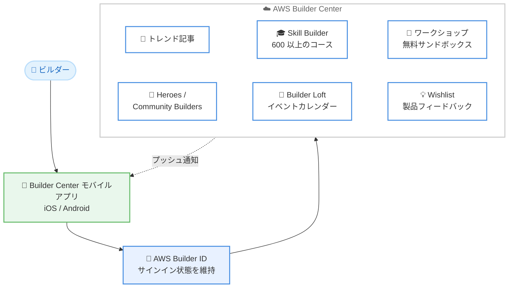

# AWS Builder Center - iOS / Android モバイルアプリ提供開始

**リリース日**: 2026 年 9 月 17 日
**サービス**: AWS Builder Center
**機能**: モバイルアプリ (iOS / Android)

📊 [このアップデートのインフォグラフィックを見る](https://takech9203.github.io/aws-news-summary/20260917-aws-builder-center-now-available-as-mobile-app.html)
<!-- INFOGRAPHIC_BASE_URL は環境変数から取得 -->

## 概要

AWS Builder Center が iOS および Android のモバイルアプリとして利用可能になりました。AWS Builder Center は、記事、ワークショップ、サンドボックス環境、イベント、学習リソースを一箇所に集めた、グローバルビルダーコミュニティ向けのプラットフォームです。従来はデスクトップと Web ブラウザからのみアクセス可能でしたが、今回のアップデートにより、モバイルデバイスからいつでもどこでもコミュニティや学習コンテンツにアクセスできるようになりました。

モバイルアプリでは AWS Builder ID でサインインし、セッションをまたいでサインイン状態が維持されます。トレンド記事の閲覧、600 以上の AWS Skill Builder コースへのアクセス、無料サンドボックス環境を使ったハンズオンワークショップの管理が可能です。さらに、AWS Heroes、Community Builders、User Group Leaders のフォロー、Builder Loft イベントカレンダーの確認、購読しているトピックやコミュニティのプッシュ通知にも対応しています。

Wishlist 機能を使えば、AWS チームへの製品フィードバックの提出と管理をモバイルアプリから直接行うこともできます。アプリは Apple App Store と Google Play Store を通じて全世界で提供されています。

**アップデート前の課題**

このアップデート以前は、AWS Builder Center の利用に以下の制約がありました。

- AWS Builder Center はデスクトップと Web ブラウザからのみアクセス可能だった
- 移動中や外出先で、コミュニティの最新記事やイベント情報を手軽に確認する手段が限られていた
- 購読しているトピックやコミュニティの更新をリアルタイムに受け取る仕組みがなかった

**アップデート後の改善**

今回のアップデートにより、以下が可能になりました。

- iOS / Android のネイティブアプリから AWS Builder Center のコンテンツにいつでもアクセスできるようになった
- プッシュ通知により、購読トピックやコミュニティの更新をリアルタイムに受け取れるようになった
- AWS Builder ID によるサインイン状態が維持され、毎回のログイン操作が不要になった
- 移動中でも Builder Loft イベントカレンダーの確認やワークショップの管理ができるようになった

## アーキテクチャ図



ビルダーがモバイルアプリから AWS Builder ID でサインインし、記事、学習コース、ワークショップ、コミュニティ、イベント、Wishlist の各機能にアクセスできる構成を示しています。購読中のトピックやコミュニティの更新はプッシュ通知でアプリに届きます。

## サービスアップデートの詳細

### 主要機能

1. **コンテンツと学習リソースへのモバイルアクセス**
   - コミュニティのトレンド記事をモバイルから閲覧可能
   - 600 以上の AWS Skill Builder コースにアクセス可能
   - 無料サンドボックス環境を使ったハンズオンワークショップをアプリから管理可能

2. **コミュニティとイベント機能**
   - AWS Heroes、Community Builders、User Group Leaders をフォロー可能
   - Builder Loft イベントカレンダーを外出先から確認可能
   - 購読しているトピックやコミュニティの更新をプッシュ通知で受信可能

3. **Wishlist による製品フィードバック**
   - AWS チームへの製品フィードバックをアプリから直接提出可能
   - 提出済みフィードバックの管理にも対応

4. **AWS Builder ID によるシームレスなサインイン**
   - AWS Builder ID でサインインし、セッションをまたいでサインイン状態を維持
   - AWS アカウント (クレジットカード登録) は不要で、無料の AWS Builder ID のみで利用可能

## 技術仕様

### アプリの提供形態

| 項目 | 詳細 |
|------|------|
| 対応プラットフォーム | iOS、Android |
| 配布方法 | Apple App Store、Google Play Store |
| 認証 | AWS Builder ID (サインイン状態を維持) |
| 通知 | 購読トピック・コミュニティのプッシュ通知 |
| 提供地域 | 全世界 |
| 料金 | 無料 |

## 設定方法

### 前提条件

1. iOS または Android デバイス
2. AWS Builder ID (未作成の場合はサインイン時に無料で作成可能)

### 手順

#### ステップ1: アプリのインストール

Apple App Store (iOS) または Google Play Store (Android) で「AWS Builder Center」を検索し、アプリをインストールします。詳細は [builder.aws.com/mobile](https://builder.aws.com/mobile) を参照してください。

#### ステップ2: AWS Builder ID でサインイン

アプリを起動し、AWS Builder ID でサインインします。AWS Builder ID を持っていない場合は、メールアドレスのみで無料で作成できます。一度サインインすると、セッションをまたいでサインイン状態が維持されます。

#### ステップ3: トピックとコミュニティの購読

興味のあるトピックやコミュニティを購読し、プッシュ通知を有効化します。これにより、フォローしている AWS Heroes や Community Builders の投稿、コミュニティの更新をリアルタイムに受け取れます。

## メリット

### ビジネス面

- **学習機会の拡大**: 通勤時間や移動中などのスキマ時間を活用して、600 以上の Skill Builder コースや記事で学習を継続できる
- **コミュニティエンゲージメントの向上**: プッシュ通知により、コミュニティの最新情報やイベントを見逃さず、参加機会を最大化できる
- **フィードバックループの強化**: Wishlist 機能により、現場で気づいた製品への要望をその場で AWS チームに届けられる

### 技術面

- **マルチデバイス対応**: デスクトップ、Web に加えてモバイルアプリが加わり、利用シーンに応じたアクセス手段を選択できる
- **シームレスな認証**: AWS Builder ID によるサインイン状態の維持により、毎回の認証操作が不要
- **ワークショップ管理のモバイル化**: 無料サンドボックス環境を使ったハンズオンワークショップの管理をモバイルから行える

## デメリット・制約事項

### 制限事項

- サンドボックス環境を使った実際のハンズオン作業 (コンソール操作やコーディング) は、画面サイズの観点からデスクトップ環境の方が適している場合がある
- アプリの利用には AWS Builder ID が必要 (IAM ユーザーや AWS アカウントの認証情報では利用しない)

### 考慮すべき点

- プッシュ通知を多数のトピック・コミュニティで有効化すると通知が増えるため、購読対象の整理が必要
- 組織のモバイルデバイス管理 (MDM) ポリシーによっては、アプリのインストールに制限がある場合がある

## ユースケース

### ユースケース1: 移動中の継続学習

**シナリオ**: 通勤時間を活用して AWS の学習を進めたい開発者が、モバイルアプリで学習を継続する。

**実装例**:
```text
1. モバイルアプリで AWS Skill Builder のコースを開く
2. 移動中にコースの動画や記事コンテンツを閲覧
3. 帰宅後、デスクトップで同じ AWS Builder ID を使い学習を再開
```

**効果**: スキマ時間の活用により学習時間を確保し、デバイスをまたいだシームレスな学習体験を実現できる。

### ユースケース2: コミュニティ情報のリアルタイムキャッチアップ

**シナリオ**: ユーザーグループの運営者が、フォローしている AWS Heroes の投稿やコミュニティの更新を見逃さないようにする。

**実装例**:
```text
1. アプリで AWS Heroes、Community Builders をフォロー
2. 関心のあるトピックとコミュニティを購読
3. プッシュ通知で新着記事やコミュニティ更新を受信
4. Builder Loft イベントカレンダーで近日開催のイベントを確認
```

**効果**: 最新のコミュニティ動向をリアルタイムに把握し、イベント参加や情報発信のタイミングを逃さない。

### ユースケース3: 現場からの製品フィードバック提出

**シナリオ**: プロジェクトの実装中に AWS サービスへの改善要望に気づいたエンジニアが、忘れないうちにフィードバックを提出する。

**実装例**:
```text
1. モバイルアプリの Wishlist 機能を開く
2. 製品への改善要望を記入して AWS チームに提出
3. 提出済みフィードバックのステータスをアプリで管理
```

**効果**: 気づいた時点で即座にフィードバックを提出でき、AWS チームへの要望伝達の障壁が下がる。

## 料金

AWS Builder Center モバイルアプリは無料で利用できます。AWS Builder ID の作成も無料で、AWS アカウントやクレジットカードの登録は不要です。

## 利用可能リージョン

Apple App Store および Google Play Store を通じて全世界で利用可能です。

## 関連サービス・機能

- **AWS Builder ID**: AWS アカウントとは独立した個人向けの無料 ID。Builder Center へのサインインに使用
- **AWS Skill Builder**: AWS の公式学習プラットフォーム。モバイルアプリから 600 以上のコースにアクセス可能
- **AWS Builder Center 無料サンドボックス環境**: 対象ワークショップで利用できる時間制限付きの無料 AWS 環境。モバイルアプリからワークショップを管理可能
- **AWS Heroes / Community Builders / User Group Leaders**: AWS コミュニティプログラム。モバイルアプリからフォローして最新情報を取得可能

## 参考リンク

- 📊 [インフォグラフィック](https://takech9203.github.io/aws-news-summary/20260917-aws-builder-center-now-available-as-mobile-app.html)
- [公式発表 (What's New)](https://aws.amazon.com/about-aws/whats-new/2026/09/aws-builder-center-now-available-as-mobile-app/)
- [AWS Builder Center モバイルページ](https://builder.aws.com/mobile)
- [AWS Builder Center](https://builder.aws.com/)

## まとめ

AWS Builder Center のモバイルアプリ提供により、記事、学習コース、ワークショップ、コミュニティ、イベントといったビルダー向けリソースに、いつでもどこからでもアクセスできるようになりました。プッシュ通知と Wishlist 機能により、コミュニティとのつながりと AWS へのフィードバックがより手軽になります。まずは App Store または Google Play Store からアプリをインストールし、AWS Builder ID でサインインして、関心のあるトピックの購読から始めることを推奨します。
