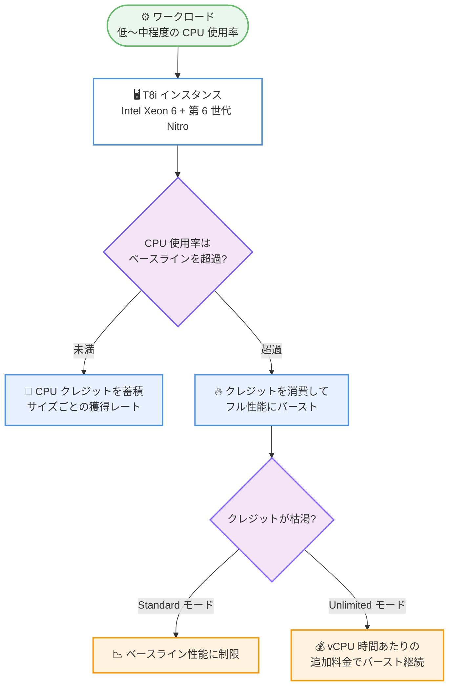

# Amazon EC2 - T8i インスタンスの一般提供開始

**リリース日**: 2026 年 9 月 17 日
**サービス**: Amazon EC2
**機能**: バースト可能な汎用インスタンス T8i の一般提供 (GA)

📊 [このアップデートのインフォグラフィックを見る](https://takech9203.github.io/aws-news-summary/20260917-ec2-t8i-instances-ga.html)

## 概要

低コストでバースト可能な Amazon EC2 T8i インスタンスが一般提供開始されました。T8i は AWS 専用にカスタマイズされた第 6 世代 Intel Xeon 6 プロセッサと、最新の第 6 世代 AWS Nitro カードを搭載した汎用インスタンスです。前世代の T3 インスタンスと比較して、最大 30% 優れた料金性能、最大 70% 高いコンピューティング性能、1.25 倍のネットワーク帯域幅、2.4 倍の EBS 帯域幅を提供します。

インスタンスサイズは nano、micro、small、medium の 4 種類で、T3 と同じ CPU クレジットシステム (Standard / Unlimited モード) を採用しています。CPU 使用率がベースライン未満のときにクレジットを蓄積し、ベースラインを超えるときにクレジットを消費してバーストする仕組みのため、低〜中程度の CPU 使用率のワークロードを低コストで実行できます。t8i.micro と t8i.small は AWS 無料利用枠の対象です。

データ処理、ログインゲートウェイ、小規模データベース、バッチ処理、イベント駆動関数、CI/CD パイプライン、マイクロサービス、低トラフィックのウェブサイトなど、常時高負荷ではないワークロードを運用するユーザーや、AWS を使い始めるユーザー、オンプレミスから移行するユーザーにとって、コスト効率の高いエントリーポイントとなります。

**アップデート前の課題**

- バースト可能な Intel 系インスタンスの最新世代は T3 であり、第 2 世代 Intel Xeon スケーラブルプロセッサをベースとした性能にとどまっていた
- T3 のネットワーク帯域幅や EBS 帯域幅では、バースト可能インスタンス上でデータ処理や小規模データベースを動かす際に I/O がボトルネックになる場合があった
- より高い性能が必要な場合、バースト型の料金メリットを手放して M 系などの汎用インスタンスへ移行する必要があった

**アップデート後の改善**

- AWS 専用のカスタム第 6 世代 Intel Xeon 6 プロセッサにより、T3 比で最大 70% 高いコンピューティング性能を利用できるようになった
- T3 比で 1.25 倍のネットワーク帯域幅 (最大 6.25 Gbps)、2.4 倍の EBS 帯域幅 (最大 5 Gbps) により、I/O 性能が大幅に向上した
- 最大 30% 優れた料金性能により、既存の T3 ユーザーは移行するだけで総所有コスト (TCO) を削減できるようになった
- CPU クレジットシステムは T3 と同一のため、既存の運用ノウハウや監視設定をそのまま活用して移行できる

## アーキテクチャ図



T8i は T3 と同じ CPU クレジットシステムを採用しており、ベースライン未満の稼働時にクレジットを蓄積し、負荷が高まったときにクレジットを消費してバーストします。クレジット枯渇時の挙動は Standard / Unlimited モードで異なります。

## サービスアップデートの詳細

### 主要機能

1. **AWS 専用カスタム第 6 世代 Intel Xeon 6 プロセッサ**
   - AWS でのみ利用可能なカスタムプロセッサを搭載
   - T3 と比較して最大 70% 高いコンピューティング性能を提供
   - T3 と比較して最大 30% 優れた料金性能を実現

2. **第 6 世代 AWS Nitro カードによる I/O 性能向上**
   - 最新の第 6 世代 AWS Nitro カード上に構築
   - T3 比 1.25 倍のネットワーク帯域幅 (最大 6.25 Gbps)
   - T3 比 2.4 倍の EBS 帯域幅 (最大 5 Gbps)

3. **T3 と同一の CPU クレジットシステム**
   - 1 クレジットは 1 vCPU を 100% 使用率で 1 分間実行できる量に相当
   - Unlimited モード (デフォルト): クレジット枯渇後もバーストを継続でき、24 時間平均の使用率がベースライン以下であれば追加料金なし。超過分は vCPU 時間あたりの少額の追加料金
   - Standard モード: クレジット枯渇後はベースライン性能に制限され、追加料金は発生しない

4. **AWS 無料利用枠への対応**
   - t8i.micro と t8i.small が AWS 無料利用枠の対象
   - AWS を使い始めるユーザーやオンプレミスからの移行ユーザーのエントリーポイントとして利用可能

## 技術仕様

### インスタンスサイズ

| サイズ | vCPU | メモリ | ベースライン性能/vCPU | クレジット獲得/時 | ネットワーク帯域幅 | EBS 帯域幅 |
|--------|------|--------|----------------------|------------------|-------------------|-----------|
| t8i.nano | 2 | 0.5 GiB | 5% | 6 | 最大 6.25 Gbps | 最大 5 Gbps |
| t8i.micro | 2 | 1 GiB | 10% | 12 | 最大 6.25 Gbps | 最大 5 Gbps |
| t8i.small | 2 | 2 GiB | 20% | 24 | 最大 6.25 Gbps | 最大 5 Gbps |
| t8i.medium | 2 | 4 GiB | 20% | 24 | 最大 6.25 Gbps | 最大 5 Gbps |

### T3 との比較

| 項目 | T3 | T8i |
|------|----|----|
| プロセッサ | 第 2 世代 Intel Xeon スケーラブル | カスタム第 6 世代 Intel Xeon 6 (AWS 専用) |
| Nitro カード | 従来世代 | 第 6 世代 |
| コンピューティング性能 | 基準 | 最大 70% 向上 |
| 料金性能 | 基準 | 最大 30% 向上 |
| ネットワーク帯域幅 | 基準 | 1.25 倍 |
| EBS 帯域幅 | 基準 | 2.4 倍 |
| CPU クレジットシステム | Standard / Unlimited | Standard / Unlimited (同一) |

## 設定方法

### 前提条件

1. AWS アカウントを保有していること
2. T8i の提供リージョン (東京リージョンなど) を利用していること
3. EC2 インスタンスを起動する IAM 権限があること

### 手順

#### ステップ1: T8i インスタンスの提供状況を確認

```bash
aws ec2 describe-instance-type-offerings \
  --location-type region \
  --filters "Name=instance-type,Values=t8i.*" \
  --region ap-northeast-1
```

対象リージョンで利用可能な T8i のインスタンスサイズ一覧を確認します。

#### ステップ2: T8i インスタンスを起動

```bash
aws ec2 run-instances \
  --image-id ami-0123456789abcdef0 \
  --instance-type t8i.micro \
  --credit-specification CpuCredits=unlimited \
  --subnet-id subnet-0123456789abcdef0 \
  --region ap-northeast-1
```

t8i.micro インスタンスを Unlimited モードで起動します。`CpuCredits=standard` を指定すると Standard モードで起動できます。

#### ステップ3: CPU クレジットの状況を監視

```bash
aws cloudwatch get-metric-statistics \
  --namespace AWS/EC2 \
  --metric-name CPUCreditBalance \
  --dimensions Name=InstanceId,Value=i-0123456789abcdef0 \
  --start-time 2026-09-17T00:00:00Z \
  --end-time 2026-09-17T23:59:59Z \
  --period 3600 \
  --statistics Average
```

CloudWatch の CPUCreditBalance メトリクスでクレジット残高を確認します。Unlimited モードの場合は CPUSurplusCreditsCharged メトリクスで追加課金対象のクレジットも監視できます。

## メリット

### ビジネス面

- **コスト削減**: T3 比で最大 30% 優れた料金性能により、既存のバースト型ワークロードの TCO を削減できる
- **無料利用枠での検証**: t8i.micro と t8i.small が AWS 無料利用枠の対象のため、新規ユーザーが低リスクで AWS を試せる
- **移行の容易さ**: T3 と同じクレジットシステムのため、追加の学習コストなしで最新世代へ移行できる

### 技術面

- **高いバースト性能**: T3 比で最大 70% 高いコンピューティング性能により、バースト時の処理をより短時間で完了できる
- **I/O 性能の向上**: 1.25 倍のネットワーク帯域幅と 2.4 倍の EBS 帯域幅により、小規模データベースやデータ処理のボトルネックを緩和できる
- **最新の Nitro System**: 第 6 世代 AWS Nitro カードにより、仮想化オーバーヘッドの低減とセキュリティの強化が図られている

## デメリット・制約事項

### 制限事項

- 提供サイズは nano、micro、small、medium の 4 種類のみで、T3 にあった large 以上のサイズは現時点で提供されていない
- 購入オプションは現時点で On-Demand と Spot のみで、Savings Plan は近日対応予定
- 提供リージョンは 16 リージョンに限定されており、すべてのリージョンでは利用できない

### 考慮すべき点

- 持続的に高い CPU 使用率が必要なワークロードには、バースト型ではなく M 系や C 系インスタンスが適している
- Unlimited モードでは、24 時間平均の使用率がベースラインを超えると vCPU 時間あたりの追加料金が発生するため、CloudWatch でのクレジット監視を推奨
- 「最大 30% の料金性能向上」「最大 70% の性能向上」はワークロードにより異なるため、移行前に実ワークロードでの検証を推奨

## ユースケース

### ユースケース1: 低トラフィックのウェブサイト・マイクロサービス

**シナリオ**: 平常時はアクセスが少なく、時間帯によってアクセスが増加する社内ポータルや小規模ウェブサイトを低コストで運用したい。

**実装例**:
```bash
aws ec2 run-instances \
  --image-id ami-0123456789abcdef0 \
  --instance-type t8i.small \
  --credit-specification CpuCredits=unlimited
```

**効果**: 平常時はベースライン性能とクレジット蓄積で低コストに運用し、アクセス増加時はバーストで対応。T3 比で最大 30% 優れた料金性能により運用コストを削減できます。

### ユースケース2: CI/CD パイプラインのビルドエージェント

**シナリオ**: コミット時のみ CPU を消費するビルド・テスト用エージェントを、アイドル時間のコストを抑えつつ高速に実行したい。

**実装例**:
```bash
# Spot インスタンスとして起動しさらにコストを削減
aws ec2 run-instances \
  --image-id ami-0123456789abcdef0 \
  --instance-type t8i.medium \
  --instance-market-options MarketType=spot
```

**効果**: アイドル時に蓄積したクレジットをビルド実行時に消費し、T3 比最大 70% 高いコンピューティング性能でビルド時間を短縮。Spot 利用でさらにコストを削減できます。

### ユースケース3: 既存 T3 ワークロードの世代更新

**シナリオ**: t3.micro / t3.small で運用中の小規模データベースやログインゲートウェイを、運用を変えずに性能向上とコスト削減を実現したい。

**実装例**:
```bash
# インスタンスタイプの変更 (停止後に実行)
aws ec2 modify-instance-attribute \
  --instance-id i-0123456789abcdef0 \
  --instance-type t8i.micro
```

**効果**: クレジットシステムが T3 と同一のため監視や運用をそのまま維持でき、EBS 帯域幅 2.4 倍により I/O 性能も向上。移行のみで TCO を削減できます。

## 料金

T8i インスタンスは On-Demand および Spot インスタンスとして購入できます。Savings Plan は近日対応予定です。

- **Unlimited モード (デフォルト)**: 24 時間の平均 CPU 使用率がベースライン以下であれば、時間料金のみで一時的なスパイクをカバー。持続的にベースラインを超える場合は vCPU 時間あたりの少額の追加料金が発生
- **Standard モード**: クレジット枯渇後はベースライン性能に制限され、追加料金は発生しない
- **無料利用枠**: t8i.micro と t8i.small は AWS 無料利用枠の対象

リージョンごとの具体的な料金は [EC2 オンデマンド料金ページ](https://aws.amazon.com/ec2/pricing/on-demand/) を参照してください。

## 利用可能リージョン

以下の 16 リージョンで利用可能です。

- **米国東部**: バージニア北部、オハイオ
- **米国西部**: オレゴン、北カリフォルニア
- **欧州**: フランクフルト、アイルランド、ロンドン、パリ
- **アジアパシフィック**: ハイデラバード、マレーシア、ムンバイ、ソウル、シンガポール、シドニー、東京
- **カナダ**: 中部

## 関連サービス・機能

- **Amazon EBS**: T8i は EBS 帯域幅が T3 比 2.4 倍に向上しており、gp3 ボリュームなどと組み合わせて小規模データベースの I/O 性能を高められる
- **Amazon CloudWatch**: CPUCreditBalance や CPUSurplusCreditsCharged メトリクスで CPU クレジットの蓄積・消費状況を監視できる
- **Amazon EC2 Auto Scaling**: T8i を起動テンプレートに指定し、低コストなバースト型インスタンスでスケーラブルな構成を組める
- **AWS 無料利用枠**: t8i.micro と t8i.small が対象で、新規ユーザーの検証環境として利用できる

## 参考リンク

- 📊 [インフォグラフィック](https://takech9203.github.io/aws-news-summary/20260917-ec2-t8i-instances-ga.html)
- [公式発表 (What's New)](https://aws.amazon.com/about-aws/whats-new/2026/09/ec2-t8i-instances-ga/)
- [Amazon EC2 T8i インスタンス製品ページ](https://aws.amazon.com/ec2/instance-types/t8i/)
- [バースト可能パフォーマンスインスタンスのドキュメント](https://docs.aws.amazon.com/AWSEC2/latest/UserGuide/burstable-performance-instances.html)
- [EC2 オンデマンド料金ページ](https://aws.amazon.com/ec2/pricing/on-demand/)
- [AWS 無料利用枠](https://aws.amazon.com/free/)

## まとめ

Amazon EC2 T8i インスタンスは、AWS 専用のカスタム第 6 世代 Intel Xeon 6 プロセッサと第 6 世代 Nitro カードにより、T3 比で最大 30% の料金性能向上と最大 70% の性能向上を実現したバースト可能インスタンスです。CPU クレジットシステムが T3 と同一のため、既存の T3 ワークロードは運用を変えずに移行するだけで TCO を削減できます。東京リージョンを含む 16 リージョンで利用可能なため、まずは無料利用枠対象の t8i.micro / t8i.small での検証から始めることを推奨します。
