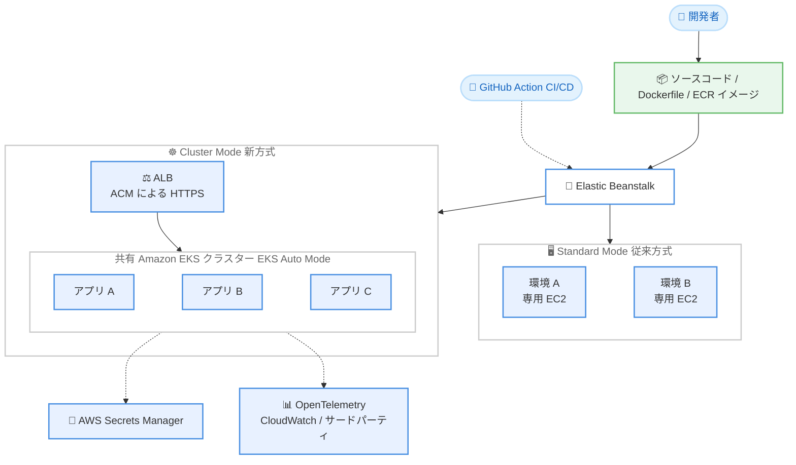

# AWS Elastic Beanstalk - Cluster Mode

**リリース日**: 2026 年 9 月 17 日
**サービス**: AWS Elastic Beanstalk
**機能**: Cluster Mode (共有インフラストラクチャ上での複数アプリケーション実行)

📊 [このアップデートのインフォグラフィックを見る](https://takech9203.github.io/aws-news-summary/20260917-elastic-beanstalk-cluster-mode.html)

## 概要

AWS Elastic Beanstalk が新しいデプロイモード「Cluster Mode」を発表しました。Cluster Mode は、アカウント内の共有 (プール型) インフラストラクチャ上で複数のアプリケーションを実行・管理できる、フルマネージドなデプロイオプションです。ソースコード、Dockerfile、または Amazon ECR のコンテナイメージを提供するだけで、Elastic Beanstalk がコンテナ化、プロビジョニング、継続的な運用までを処理します。AWS はこの価値提案を「You bring your application. AWS runs it. (アプリケーションを持ち込めば、AWS が実行する)」と表現しています。

Cluster Mode は Amazon EKS を基盤としており、アプリケーションごとに専用環境を用意する従来の方式とは異なり、複数のアプリケーションが 1 つの Kubernetes クラスターを共有します。これにより、アプリケーション数の増加やスケールの拡大に伴い、アプリケーションあたりのコンピューティングコストを削減できます。従来の体験は「Standard Mode」として引き続き提供され、.NET、Node.js、Python などすべての既存プラットフォームがサポートされます。

また、新しい Elastic Beanstalk GitHub Action が提供され、単一の YAML 設定で既存の CI/CD パイプラインからリポジトリ直接デプロイが可能になりました。デプロイはコンソール、AWS CLI、GitHub Action、エージェントスキルのいずれからでも実行できます。単一アプリケーションではなく、複数アプリケーションのポートフォリオを運用するチームに特に適したアップデートです。

**アップデート前の課題**

Cluster Mode 登場以前の Elastic Beanstalk には、以下の課題がありました。

- アプリケーションごとに専用の環境 (EC2 インスタンス、ロードバランサーなど) が作成されるため、アプリケーション数が増えるほどインフラコストが線形に増加した
- 小規模なアプリケーションでも専用のコンピューティングリソースを確保する必要があり、リソース使用率が低くコスト効率が悪かった
- コンテナベースの運用や Kubernetes の恩恵 (ビンパッキングによる集約率向上など) を受けるには、Amazon EKS を直接運用する専門知識が必要だった
- OpenTelemetry ベースのオブザーバビリティやイベント駆動オートスケーリングなどのモダンな機能を利用するには、独自の構築・運用が必要だった

**アップデート後の改善**

今回のアップデートにより、以下が可能になりました。

- 複数のアプリケーションを共有 (プール型) インフラストラクチャ上で実行し、アプリケーションあたりのコンピューティングコストを削減できるようになった
- ソースコード、Dockerfile、ECR コンテナイメージのいずれを提供しても、Elastic Beanstalk が Cloud Native Buildpacks などによりコンテナ化からプロビジョニング、運用までを自動処理するようになった
- Kubernetes の専門知識なしで Amazon EKS (EKS Auto Mode) を基盤としたモダンなコンテナ実行基盤を利用できるようになった
- イベント駆動オートスケーリング、OpenTelemetry ベースのオブザーバビリティ、AWS Secrets Manager 統合、ACM による HTTPS デフォルト対応が組み込みで利用可能になった
- 新しい GitHub Action により、CI/CD パイプラインからのリポジトリ直接デプロイが可能になった

## アーキテクチャ図



Standard Mode ではアプリケーションごとに専用の EC2 環境が作成されるのに対し、Cluster Mode では複数のアプリケーションが共有の Amazon EKS クラスター上で実行され、リソースの集約によりコスト効率が向上します。

## サービスアップデートの詳細

### 主要機能

1. **共有インフラストラクチャ上での複数アプリケーション実行**
   - 複数のアプリケーションが 1 つの Amazon EKS クラスターを共有し、単一の運用ベースラインで管理される
   - アプリケーションごとの専用環境が不要になり、アプリケーション数やスケールの増加に伴いアプリケーションあたりのコンピューティングコストが低下する
   - コンピューティングには EKS Auto Mode を使用し、ノード管理も自動化される
   - 同一サブネット群への最初のデプロイ時に EKS クラスターが作成され (約 10 分)、以降のデプロイはクラスターを再利用するため高速

2. **柔軟なアプリケーション入力形式と自動コンテナ化**
   - ソースコード (Java、.NET、Python、Node.js、PHP、Ruby、Go)、Dockerfile、ECR コンテナイメージのいずれにも対応
   - ソースコードの場合は Cloud Native Buildpacks により Dockerfile なしで自動コンテナ化される
   - コンテナイメージのビルドタイプ (docker / buildpack)、アーキテクチャ (amd64 / arm64)、CodeBuild のコンピューティングタイプなどを API で指定可能

3. **モダンな運用機能の組み込みサポート**
   - イベント駆動オートスケーリング (最小 / 最大レプリカ数を設定可能)
   - OpenTelemetry ベースのオブザーバビリティにより、CloudWatch およびサードパーティのオブザーバビリティサービスと統合
   - AWS Secrets Manager との統合によるシークレット管理
   - AWS Certificate Manager (ACM) による HTTPS のデフォルト対応
   - all-at-once、rolling、immutable、traffic-splitting のデプロイ戦略と失敗時の自動ロールバック
   - サービス側のログを収集し AI による修正推奨を生成するトラブルシューティング支援

4. **CI/CD 統合の強化**
   - 新しい Elastic Beanstalk GitHub Action により、単一の YAML 設定でリポジトリから直接デプロイ可能
   - コンソール、AWS CLI、EB CLI、SDK、エージェントスキル (Agent Toolkit for AWS) からもデプロイ可能

5. **Standard Mode との共存**
   - 従来の体験は Standard Mode として引き続き提供され、すべての既存プラットフォームをサポート
   - 1 つのアプリケーション内で両モードを共存させ、移行前検証チェックを活用しながら段階的に移行可能

## 技術仕様

### デプロイモードの比較

| 項目 | Standard Mode | Cluster Mode |
|------|---------------|--------------|
| 基盤 | Amazon EC2 (アプリごとの専用環境) | Amazon EKS + EKS Auto Mode (共有クラスター) |
| 入力形式 | ソースバンドル (既存プラットフォーム) | ソースコード、Dockerfile、ECR イメージ |
| コンテナ化 | プラットフォーム依存 | Cloud Native Buildpacks / Docker による自動化 |
| スケーリング | Auto Scaling グループ | イベント駆動オートスケーリング (レプリカ単位) |
| オブザーバビリティ | CloudWatch | OpenTelemetry ベース (CloudWatch / サードパーティ) |
| HTTPS | 手動設定 | ACM によりデフォルト対応 |
| 適した用途 | 単一アプリ、Windows / .NET Framework、非コンテナ化アプリ | 複数アプリのポートフォリオ、マイクロサービス |

### API 変更履歴

| 日付 | サービス | 変更内容 |
|------|----------|----------|
| 2026/09/16 | [elasticbeanstalk](https://awsapichanges.com/archive/changes/9da991-elasticbeanstalk.html) | 4 updated api methods - Cluster Environment の作成・管理をサポート |

主な API 変更点は以下のとおりです。

- **CreateApplicationVersion / UpdateApplicationVersion / DescribeApplicationVersions**: `ImageConfiguration` パラメータが追加され、ECR イメージの URI (`Source.Uri`) やビルド設定 (`Type: docker | buildpack`、`Architecture: amd64 | arm64`、`Buildpack`、`DockerfileLocation`、`CodeBuildServiceRole`、`ComputeType`、`TimeoutInMinutes`) を指定可能
- **DescribeEnvironmentResources**: レスポンスに `Cluster.ClusterArn` が追加され、環境が使用する EKS クラスターの ARN を取得可能

### Cluster Mode の主なオプション設定名前空間

| 名前空間 | 用途 |
|----------|------|
| `aws:elasticbeanstalk:eks` | クラスター / ノード / オブザーバビリティ用の IAM ロール、サブネットなど |
| `aws:elasticbeanstalk:eks:environment` | CPU (例: 0.5)、メモリ (例: 256Mi、上限 512Mi)、サービスポートなど |
| `aws:elasticbeanstalk:eks:environment:autoscaling` | 最小 / 最大レプリカ数 |
| `aws:elasticbeanstalk:eks:alb` | ALB スキーム (internet-facing など)、ヘルスチェックパス |

## 設定方法

### 前提条件

1. AWS アカウントおよび Elastic Beanstalk へのアクセス権限を持つ IAM プリンシパル
2. デプロイ対象のソースコード、Dockerfile、または Amazon ECR 上のコンテナイメージ
3. EKS クラスター用のサブネットと、クラスター / ノード / オブザーバビリティ用の IAM ロール
4. (CI/CD 統合を行う場合) GitHub リポジトリと Elastic Beanstalk GitHub Action の設定

### 手順

#### ステップ 1: アプリケーションの作成

```bash
aws elasticbeanstalk create-application \
  --application-name "my-microservice"
```

Elastic Beanstalk アプリケーションを作成します。Cluster Mode でも Standard Mode と同じアプリケーションの概念を使用します。

#### ステップ 2: アプリケーションバージョンの登録

```bash
aws elasticbeanstalk create-application-version \
  --application-name "my-microservice" \
  --version-label "frontend-v1" \
  --image-configuration 'Source={Uri=123456789012.dkr.ecr.ap-northeast-1.amazonaws.com/frontend:latest}'
```

新しく追加された `--image-configuration` パラメータで ECR コンテナイメージの URI を指定し、アプリケーションバージョンとして登録します。ソースコードから自動ビルドする場合は `Build` 設定で `Type` (docker / buildpack) やアーキテクチャを指定できます。

#### ステップ 3: オプション設定の準備

```json
[
  {
    "Namespace": "aws:elasticbeanstalk:eks:environment",
    "OptionName": "CPU",
    "Value": "0.5"
  },
  {
    "Namespace": "aws:elasticbeanstalk:eks:environment:autoscaling",
    "OptionName": "MinReplica",
    "Value": "2"
  },
  {
    "Namespace": "aws:elasticbeanstalk:eks:alb",
    "OptionName": "Scheme",
    "Value": "internet-facing"
  }
]
```

`aws:elasticbeanstalk:eks` 系の名前空間を使用して、IAM ロール、サブネット、CPU / メモリ、レプリカ数、ALB スキーム、ヘルスチェックパスなどを JSON のオプション設定として定義します。多くの項目はデフォルト値で動作します。

#### ステップ 4: Cluster 環境の作成

```bash
aws elasticbeanstalk create-environment \
  --application-name "my-microservice" \
  --environment-name "frontend-env" \
  --version-label "frontend-v1" \
  --tier Name=Cluster,Type=EKS \
  --option-settings file://options.json
```

`--tier Name=Cluster,Type=EKS` を指定して Cluster Mode の環境を作成します。同一サブネット群への最初のデプロイ時には EKS クラスターの作成に約 10 分かかりますが、以降のデプロイは既存クラスターを再利用するため高速です。コンソールの場合は、環境作成時に [Deployment type] で [Cluster] を選択します。

## メリット

### ビジネス面

- **アプリケーションあたりのコスト削減**: 複数のアプリケーションがプールされたインフラを共有するため、アプリケーション数やスケールの増加に伴い、アプリケーションあたりのコンピューティングコストが低下する
- **運用負荷の軽減**: コンテナ化、プロビジョニング、スケーリング、パッチ適用などのインフラ運用を AWS に任せられるため、開発チームはアプリケーション開発に集中できる
- **コンプライアンス対応**: HIPAA 適格であり、PCI DSS、SOC、FedRAMP、IRAP の対象のため、規制業界のワークロードにも追加設定なしで利用しやすい

### 技術面

- **Kubernetes の恩恵を専門知識なしで享受**: Amazon EKS (EKS Auto Mode) を基盤としながら、Kubernetes の運用知識なしで Elastic Beanstalk の使い慣れたコンソール、CLI、API から管理できる
- **モダンな機能の組み込みサポート**: イベント駆動オートスケーリング、OpenTelemetry ベースのオブザーバビリティ、Secrets Manager 統合、ACM による HTTPS デフォルト対応が最初から利用できる
- **柔軟な入力形式**: ソースコード (Buildpacks による Dockerfile 不要の自動コンテナ化)、Dockerfile、ECR イメージのいずれにも対応し、既存の開発ワークフローに合わせやすい
- **段階的な移行**: Standard Mode と Cluster Mode を 1 つのアプリケーション内で共存させ、移行前検証チェックを活用しながら段階的に移行できる

## デメリット・制約事項

### 制限事項

- Windows / .NET Framework (IIS) のワークロードは Cluster Mode ではサポートされず、Standard Mode を継続利用する必要がある
- コンテナ化できないアプリケーションは Cluster Mode の対象外
- AWS 無料利用枠の対象外 (EKS コントロールプレーン料金と EKS Auto Mode 料金が発生する)

### 考慮すべき点

- EKS コントロールプレーン料金と EKS Auto Mode のプレミアムが発生するため、月額 500 USD 未満の小規模ワークロードでは、ビンパッキングによる集約効果よりも固定費が上回り、Standard Mode の方がコスト効率が良い場合がある
- 同一サブネット群への最初のデプロイでは EKS クラスター作成に約 10 分かかる
- 基盤は EKS だが、Kubernetes API を直接操作する運用モデルではないため、細かいクラスター制御が必要な場合は EKS の直接利用を検討する

## ユースケース

### ユースケース 1: マイクロサービスポートフォリオの統合ホスティング

**シナリオ**: フロントエンド、カート、決済、配送などの複数のマイクロサービスを、サービスごとに専用の Elastic Beanstalk 環境で運用しており、環境数の増加に伴いコストと運用負荷が増大している。

**実装例**:
```bash
# 各サービスの ECR イメージをアプリケーションバージョンとして登録
for svc in frontend cart payment shipping; do
  aws elasticbeanstalk create-application-version \
    --application-name "ecommerce" \
    --version-label "${svc}-v1" \
    --image-configuration "Source={Uri=123456789012.dkr.ecr.ap-northeast-1.amazonaws.com/${svc}:latest}"
done

# 各サービスを Cluster 環境としてデプロイ (共有 EKS クラスターを利用)
aws elasticbeanstalk create-environment \
  --application-name "ecommerce" \
  --environment-name "frontend-env" \
  --version-label "frontend-v1" \
  --tier Name=Cluster,Type=EKS \
  --option-settings file://frontend-options.json
```

**効果**: 全サービスが共有 EKS クラスター上で実行され、リソースの集約によりアプリケーションあたりのコンピューティングコストを削減できる。インターネット公開が必要なフロントエンドのみ internet-facing の ALB を設定し、他のサービスは内部向けに構成できる。

### ユースケース 2: GitHub Actions による CI/CD パイプラインからの直接デプロイ

**シナリオ**: GitHub 上のリポジトリで開発しており、プッシュやマージのたびに手動で Elastic Beanstalk へデプロイしている。CI/CD パイプラインとの統合を簡素化したい。

**実装例**:
```yaml
# .github/workflows/deploy.yml (概念例)
# 新しい Elastic Beanstalk GitHub Action を使用し、
# 単一の YAML 設定でリポジトリから直接デプロイする
on:
  push:
    branches: [main]
jobs:
  deploy:
    runs-on: ubuntu-latest
    steps:
      - uses: actions/checkout@v4
      - name: Deploy to Elastic Beanstalk
        uses: aws/elastic-beanstalk-github-action # 公式 Action
```

**効果**: 単一の YAML 設定で、コミットからデプロイまでのフローを自動化できる。ソースコードのままでも Buildpacks により自動コンテナ化されるため、Dockerfile のメンテナンスが不要になる。

### ユースケース 3: Standard Mode からの段階的移行

**シナリオ**: 既存の Elastic Beanstalk 環境 (Standard Mode) で複数のアプリケーションを運用しており、コスト最適化のため Cluster Mode への移行を検討しているが、一括移行のリスクは避けたい。

**実装例**:
```
1. 既存アプリケーション内に Cluster Mode の環境を追加作成 (両モードは共存可能)
2. 移行前検証チェックでコンテナ化の可否や互換性を確認
3. トラフィックの少ないアプリケーションから順に Cluster Mode へ移行
4. Windows / .NET Framework などの非対応ワークロードは Standard Mode を継続利用
```

**効果**: 1 つのアプリケーション内で両モードを共存させながら、リスクを抑えて段階的にコスト効率の高い Cluster Mode へ移行できる。

## 料金

Cluster Mode 自体に追加料金はありません。アプリケーションが消費する AWS リソースに対してのみ料金が発生します。

- **Amazon EKS**: クラスターごとのコントロールプレーン料金
- **EKS Auto Mode**: ユーザーに代わってプロビジョニングされるコンピューティングリソースの料金 (Auto Mode の管理料金を含む)
- **その他**: Amazon ECR (イメージ保存)、Amazon CloudWatch (ログ / メトリクス) など

なお、Cluster Mode は AWS 無料利用枠の対象外です。EKS コントロールプレーンの固定費が発生するため、月額 500 USD 未満の小規模ワークロードでは Standard Mode の方がコスト効率が良い場合があります。詳細は [Elastic Beanstalk 料金ページ](https://aws.amazon.com/elasticbeanstalk/pricing/) および [Amazon EKS 料金ページ](https://aws.amazon.com/eks/pricing/) を参照してください。

## 利用可能リージョン

Elastic Beanstalk が利用可能なすべての AWS 商用リージョンで利用できます (東京、大阪リージョンを含む)。

また、Elastic Beanstalk は HIPAA 適格サービスであり、PCI DSS、SOC、FedRAMP、IRAP のコンプライアンスプログラムの対象です。

## 関連サービス・機能

- **Amazon EKS / EKS Auto Mode**: Cluster Mode の基盤となる Kubernetes 実行環境。コンピューティングのプロビジョニングとノード管理を自動化する
- **Amazon ECR**: デプロイ対象のコンテナイメージの保存先。`ImageConfiguration` で URI を指定してデプロイできる
- **AWS CodeBuild**: ソースコードや Dockerfile からのコンテナイメージビルドに使用される (ビルドのコンピューティングタイプを指定可能)
- **AWS Certificate Manager (ACM)**: Cluster Mode の HTTPS デフォルト対応に使用される証明書管理サービス
- **AWS Secrets Manager**: アプリケーションのシークレット管理との組み込み統合
- **Amazon CloudWatch / OpenTelemetry**: Cluster Mode のオブザーバビリティ基盤。サードパーティのオブザーバビリティサービスとも統合可能

## 参考リンク

- 📊 [インフォグラフィック](https://takech9203.github.io/aws-news-summary/20260917-elastic-beanstalk-cluster-mode.html)
- [公式発表 (What's New)](https://aws.amazon.com/about-aws/whats-new/2026/09/elastic-beanstalk-cluster-mode/)
- [AWS News Blog: AWS Elastic Beanstalk introduces Cluster Mode](https://aws.amazon.com/blogs/aws/aws-elastic-beanstalk-introduces-cluster-mode/)
- [AWS Elastic Beanstalk 開発者ガイド](https://docs.aws.amazon.com/elasticbeanstalk/latest/dg/)
- [AWS Elastic Beanstalk 製品ページ](https://aws.amazon.com/elasticbeanstalk/)
- [API 変更履歴 (awsapichanges.com)](https://awsapichanges.com/archive/changes/9da991-elasticbeanstalk.html)
- [Agent Toolkit for AWS - Containers スキル](https://github.com/aws/agent-toolkit-for-aws/blob/main/skills/core-skills/aws-containers/SKILL.md)

## まとめ

AWS Elastic Beanstalk の Cluster Mode は、Amazon EKS を基盤とした共有インフラストラクチャ上で複数のアプリケーションを実行し、アプリケーションあたりのコストを削減できる新しいデプロイモードです。Kubernetes の専門知識なしでコンテナ化、オートスケーリング、オブザーバビリティなどのモダンな運用機能を利用できるため、複数アプリケーションを運用するチームは、まず小規模なワークロードで Cluster Mode を試し、Standard Mode との共存を活用した段階的な移行を検討することを推奨します。
