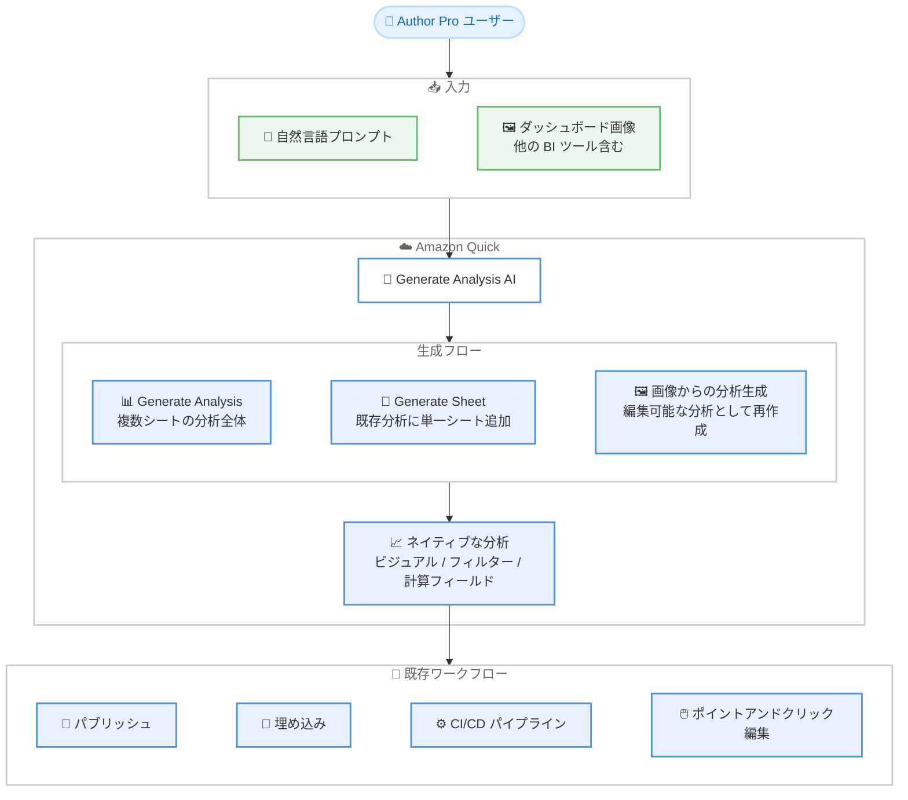

# Amazon Quick - Generate Sheet と画像からの分析生成

**リリース日**: 2026 年 9 月 17 日
**サービス**: Amazon Quick (Quick Sight)
**機能**: Generate Sheet (単一シートの AI 生成) / Generate Analysis from an Image (画像からの分析生成)

📊 [このアップデートのインフォグラフィックを見る](https://takech9203.github.io/aws-news-summary/20260917-generate-sheet-and-generate-analysis-from-an-image.html)

## 概要

Amazon Quick が Generate Analysis 機能を拡張し、ダッシュボードをより速く作成するための 2 つの新機能を発表しました。1 つ目は **Generate Sheet** で、既存の分析内に自然言語の記述だけで単一シートを生成できます。生成されるシートには、データに合わせて選択されたビジュアル、フィルターコントロール、前年比成長率や前月比較などの計算フィールドが含まれ、各ビジュアルを手作業で作成することなく分析を拡張できます。

2 つ目は**画像からの分析生成**です。他の BI ツールのダッシュボードを含む、既存ダッシュボードの画像 (スクリーンショットなど) をプロンプトに添付すると、Amazon Quick が画像を読み取り、サポートされる範囲で編集可能な分析として再作成します。他の BI ツールからの移行や、デザインモックアップからのダッシュボード構築を大幅に加速できます。

両機能で生成される出力はネイティブな Quick Sight の分析であり、既存のパブリッシュワークフロー、埋め込み (Embedding)、CI/CD パイプライン、ポイントアンドクリック編集とそのまま連携します。BI 開発者やデータアナリストにとって、分析の初期構築にかかる時間を大幅に短縮できるアップデートです。

**アップデート前の課題**

このアップデート以前には、以下の課題がありました。

- Generate Analysis は複数シートからなる分析全体の生成が対象で、既存の分析に AI でシートを 1 枚だけ追加することはできず、シート単位の拡張は手作業でビジュアルを 1 つずつ作成する必要があった
- 他の BI ツールから Amazon Quick へ移行する際、既存ダッシュボードのレイアウトやビジュアル構成を目視で確認しながら手作業で再構築する必要があり、多大な工数がかかった
- 前年比成長率や前月比較などの計算フィールドを、シート追加のたびに手動で定義する必要があった

**アップデート後の改善**

今回のアップデートにより、以下が可能になりました。

- 開いている分析内で自然言語プロンプトから単一シートを生成し、データに適したビジュアル、フィルターコントロール、計算フィールドを自動で追加できるようになった
- 既存ダッシュボードの画像をプロンプトに添付するだけで、他の BI ツールのダッシュボードも含めて編集可能な Quick Sight 分析として再作成できるようになった
- 生成物はネイティブな分析であるため、パブリッシュ、埋め込み、CI/CD パイプライン、手動編集など既存のワークフローに変更なくそのまま組み込めるようになった

## アーキテクチャ図



自然言語プロンプトまたはダッシュボード画像を入力として、AI が分析全体・単一シート・画像からの再作成という 3 つのフローで分析を生成し、生成物は既存のパブリッシュ・埋め込み・CI/CD ワークフローとそのまま連携します。

## サービスアップデートの詳細

### 主要機能

1. **Generate Sheet (単一シートの AI 生成)**
   - 開いている分析内で、シートタブ横の + (プラス) から **Interactive sheet** を選択し、**Generate** を選ぶと AI 生成フローが開始される
   - 分析にすでに含まれるデータセットから 1 つ以上を選択し、作りたいシートを自然言語プロンプトで記述して生成する
   - データに合わせて選択されたビジュアル、フィルターコントロール、前年比成長率や前月比較などの計算フィールドを含むシートが現在の分析に追加される
   - Generate は Interactive sheet でのみ利用可能 (**Add** を選ぶと従来どおり空のシートが作成される)

2. **画像からの分析生成 (Generate Analysis from an Image)**
   - 「Visualize your data with AI」のプロンプト画面で、**+ Add data** の横にある **Add image** からダッシュボードの画像を添付する
   - 他の BI ツールのダッシュボード画像にも対応しており、Amazon Quick が画像を読み取り、サポートされる範囲でシートとビジュアルを構築する
   - 生成結果は編集可能なネイティブ分析であり、生成後にポイントアンドクリックで各ビジュアルを調整できる

3. **既存ワークフローとの完全な互換性**
   - 生成される出力はネイティブな Quick Sight 分析であるため、既存のパブリッシュワークフロー、埋め込みパターン、CI/CD パイプラインと変更なく連携する
   - ダッシュボードとしてパブリッシュし、共有、アプリケーションへの埋め込み、メール配信のスケジュールが可能

## 技術仕様

### 機能比較

| 項目 | Generate Analysis (既存) | Generate Sheet (新機能) | 画像からの分析生成 (新機能) |
|------|--------------------------|--------------------------|------------------------------|
| 生成単位 | 複数シートの分析全体 | 単一シート | 分析 (画像を再現) |
| 入力 | 自然言語プロンプト + 最大 3 データセット | 自然言語プロンプト + 分析内のデータセット | ダッシュボード画像 + プロンプト |
| 開始場所 | データセットページ / Analyses ページ | 開いている分析のシートタブ + | プロンプト画面の Add image |
| 生成内容 | シート、ビジュアル、フィルターコントロール、計算フィールド | ビジュアル、フィルターコントロール、計算フィールド | サポート範囲のシートとビジュアル |
| 生成後の編集 | 可能 (ネイティブ分析) | 可能 (ネイティブ分析) | 可能 (ネイティブ分析) |

### 利用条件

| 項目 | 詳細 |
|------|------|
| 必要なサブスクリプション | Amazon Quick Enterprise サブスクリプション |
| 必要なユーザーロール | Author Pro |
| プロモーションアクセス | 組織がアクセスを制限していない場合、Author ユーザーも 2026 年 12 月まで Amazon Quick Enterprise の一部として利用可能 |
| 前提リソース | Quick Sight アカウント内に少なくとも 1 つのデータセット |

## 設定方法

### 前提条件

1. AWS アカウントを保有していること
2. Amazon Quick Enterprise サブスクリプションで、少なくとも 1 人の Author Pro ユーザーが存在すること (プロモーション期間中は Author ユーザーも利用可能)
3. Quick Sight アカウントに少なくとも 1 つのデータセットが存在すること

### 手順

#### ステップ 1: Generate Sheet で単一シートを生成する

1. 対象の分析を開き、シートタブの横にある + (プラス) を選択する
2. **New sheet** ダイアログで **Interactive sheet** を選択し、**Generate** を選ぶ
3. **Generate sheet** 画面で、分析にすでに含まれるデータセットから 1 つ以上を選択する
4. 作成したいシートの内容 (答えたいビジネス上の質問、重視するメトリクスなど) を自然言語プロンプトで記述し、**Generate** を選択する

Amazon Quick がデータに合わせたビジュアル、フィルターコントロール、計算フィールドを含むシートを現在の分析に追加します。

#### ステップ 2: 画像から分析を生成する

1. データセットページまたは Analyses ページから **Generate analysis** を選択する
2. 「Visualize your data with AI」のプロンプト画面で、**+ Add data** の横の **Add image** を選び、再現したいダッシュボードの画像を添付する
3. 必要に応じてプロンプトで補足説明を加え、生成を実行する

Amazon Quick が画像を読み取り、サポートされる範囲でシートとビジュアルを構築します。

#### ステップ 3: 生成結果の調整とパブリッシュ

生成された分析はネイティブな Quick Sight 分析のため、ポイントアンドクリックで各ビジュアルを調整できます。内容に問題がなければ **Publish** を選択してダッシュボードを作成し、共有、埋め込み、メール配信のスケジュールを設定します。

## メリット

### ビジネス面

- **ダッシュボード開発の高速化**: 自然言語や画像からの生成により、分析の初期構築にかかる時間を大幅に短縮し、インサイト提供までのリードタイムを削減できる
- **他の BI ツールからの移行加速**: 既存ダッシュボードのスクリーンショットを添付するだけで再作成の土台ができるため、移行プロジェクトの工数とコストを削減できる
- **非エキスパートの生産性向上**: ビジュアルタイプの選定や計算フィールドの定義といった BI の専門知識がなくても、意図を記述するだけで実用的なシートを作成できる

### 技術面

- **既存ワークフローとの互換性**: 生成物はネイティブ分析であるため、パブリッシュ、埋め込み、CI/CD パイプラインなど既存の運用プロセスを変更する必要がない
- **計算フィールドの自動生成**: 前年比成長率や前月比較などの定型的な計算フィールドが自動で定義され、手動実装のミスや工数を削減できる
- **段階的な拡張が可能**: 分析全体の生成 (Generate Analysis) と単一シートの生成 (Generate Sheet) を使い分けることで、既存の分析を壊さずに AI 生成を段階的に取り入れられる

## デメリット・制約事項

### 制限事項

- ローンチ時点では Enterprise サブスクリプションの Author Pro ユーザーが対象 (Author ユーザーのプロモーションアクセスは 2026 年 12 月まで)
- Generate Sheet の AI 生成は Interactive sheet でのみ利用可能
- 画像からの分析生成は、Amazon Quick がサポートするビジュアルタイプ・機能の範囲内で再作成されるため、元のダッシュボードと完全に一致しない場合がある

### 考慮すべき点

- 生成されたビジュアルや計算フィールドが業務要件と一致しているか、生成後に内容を確認・調整することが推奨される
- プロモーションアクセスで利用している Author ユーザーは、2026 年 12 月以降の利用継続に Author Pro へのアップグレードが必要になる可能性があるため、ライセンス計画を検討しておく必要がある
- 組織側でアクセス制限を設定している場合、プロモーションアクセスの対象外となる

## ユースケース

### ユースケース 1: 既存分析への KPI シート追加

**シナリオ**: 売上分析ダッシュボードを運用しているデータアナリストが、経営層向けに前年比・前月比の KPI サマリーシートを追加したい。

**実装例**:
```
1. 既存の売上分析を開き、シートタブの + から Interactive sheet → Generate を選択
2. プロンプト例: 「月次売上の推移、前年同月比成長率、前月比較、
   カテゴリ別売上構成比を示すエグゼクティブサマリーシートを作成」
3. 生成されたシートのビジュアルを確認し、必要に応じて調整
```

**効果**: 計算フィールドの手動定義やビジュアルの個別作成が不要になり、数分で KPI シートを既存分析に追加できる。

### ユースケース 2: 他の BI ツールからの移行

**シナリオ**: 他社 BI ツールから Amazon Quick への移行プロジェクトで、数十枚の既存ダッシュボードを再構築する必要がある。

**実装例**:
```
1. 移行対象ダッシュボードのスクリーンショットを取得
2. Generate analysis のプロンプト画面で Add image から画像を添付
3. 対象データセットを選択して生成を実行
4. 生成された分析をレビューし、差分をポイントアンドクリックで調整
5. 既存の CI/CD パイプラインでパブリッシュ
```

**効果**: ゼロからの再構築と比較して移行工数を大幅に削減し、レイアウトの再現性を高められる。

### ユースケース 3: デザインモックアップからのプロトタイプ作成

**シナリオ**: BI チームが業務部門と要件をすり合わせる際、ホワイトボードやデザインツールで作成したダッシュボード案を素早く動くプロトタイプにしたい。

**実装例**:
```
1. ダッシュボード案の画像をプロンプトに添付
2. 実データのデータセットを選択して分析を生成
3. 業務部門と実データを見ながらレビューし、プロンプトや手動編集で反復調整
```

**効果**: 要件定義の段階で実データに基づく動くプロトタイプを提示でき、手戻りを削減できる。

## 料金

Generate Sheet および画像からの分析生成は、Amazon Quick Enterprise サブスクリプションの Author Pro ユーザー向け機能として提供されます。追加の機能料金に関する記載はなく、Author Pro のユーザーライセンス費用に含まれます。

組織がアクセスを制限していない場合、Author ユーザーも 2026 年 12 月まで Amazon Quick Enterprise の一部としてプロモーションアクセスが可能です。最新の料金は [Amazon Quick Suite の料金ページ](https://aws.amazon.com/quicksuite/pricing/) を参照してください。

## 利用可能リージョン

Amazon Quick が利用可能なすべての AWS リージョンで一般提供されています。対象リージョンの一覧は [ドキュメントのリージョンページ](https://docs.aws.amazon.com/quick/latest/userguide/regions.html#regions-qs) を参照してください。

## 関連サービス・機能

- **Generate Analysis (既存機能)**: 自然言語プロンプトと最大 3 つのデータセットから、複数シートの分析全体を生成する機能。今回の 2 機能はこの拡張として提供される
- **Amazon Quick Suite**: Quick Sight を含む AWS の統合的な分析・BI スイート。エージェント機能やデータ統合機能と組み合わせて利用できる
- **ダッシュボードの埋め込み (Embedding)**: 生成した分析からパブリッシュしたダッシュボードを、既存の埋め込みパターンでアプリケーションに組み込める

## 参考リンク

- 📊 [インフォグラフィック](https://takech9203.github.io/aws-news-summary/20260917-generate-sheet-and-generate-analysis-from-an-image.html)
- [公式発表 (What's New)](https://aws.amazon.com/about-aws/whats-new/2026/09/generate-sheet-and-generate-analysis-from-an-image/)
- [ドキュメント: Generating an analysis with natural language prompts](https://docs.aws.amazon.com/quick/latest/userguide/generating-an-analysis.html)
- [ドキュメント: Amazon Quick 対応リージョン一覧](https://docs.aws.amazon.com/quick/latest/userguide/regions.html#regions-qs)
- [料金ページ](https://aws.amazon.com/quicksuite/pricing/)

## まとめ

Amazon Quick の Generate Analysis が、単一シートの生成と画像からの分析生成に対応し、ダッシュボード作成の高速化と他の BI ツールからの移行がより容易になりました。生成物はネイティブ分析として既存のパブリッシュ・埋め込み・CI/CD ワークフローとそのまま連携するため、導入の障壁は低いといえます。Enterprise サブスクリプションを利用中の組織は、まず既存分析への Generate Sheet によるシート追加から試し、移行プロジェクトでは画像からの分析生成の再現精度を検証することを推奨します。
