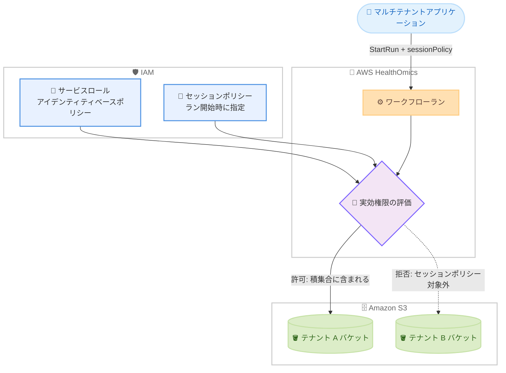

# AWS HealthOmics - IAM セッションポリシーのサポート

**リリース日**: 2026 年 9 月 17 日
**サービス**: AWS HealthOmics
**機能**: ワークフローランに対する IAM セッションポリシーのサポート

📊 [このアップデートのインフォグラフィックを見る](https://takech9203.github.io/aws-news-summary/20260917-omics-iam-session-policy.html)

## 概要

AWS HealthOmics が IAM セッションポリシーをサポートしました。これにより、複数の IAM ロールを作成・管理することなく、個々のワークフローランの権限を制限できるようになりました。

セッションポリシーはラン開始時に指定するインラインの IAM ポリシーで、基盤となるサービスロールを変更せずに、そのランの最大権限を制限します。ランの実効権限は、サービスロールのアイデンティティベースポリシーとセッションポリシーの両方で許可された権限の積集合となります。つまり、ランはサービスロールとセッションポリシーの両方が許可する操作のみ実行できます。

HealthOmics は HIPAA 対応のサービスであり、ヘルスケア・ライフサイエンス分野のバイオインフォマティクスワークフローをマネージドに実行するお客様に利用されています。ゲノムデータなどの機密性の高いデータを扱うマルチテナントアプリケーションを構築するお客様にとって、テナントごと・ランごとのアクセス分離を大幅に簡素化するアップデートです。

**アップデート前の課題**

- 単一のランの権限を動的に絞り込む方法がなかった
- テナントごと、またはランごとに個別の IAM ロールを作成・管理する必要があった
- テナント数やラン数の増加に伴い、IAM ロールの数が増大し、運用負荷とガバナンスリスクが高まっていた

**アップデート後の改善**

- ラン開始時にセッションポリシーを渡すだけで、そのランの権限を動的に制限できるようになった
- 単一のサービスロールを共有しながら、テナント固有の S3 バケットのみへのアクセス制限が可能になった
- 特定の S3 オブジェクトへの一時的なアクセス付与や、ランごとの機密リソース分離を、サービスロールを変更せずに実現できるようになった

## アーキテクチャ図



テナント A 向けのランを開始する際に、テナント A のバケットのみを許可するセッションポリシーを指定した例です。サービスロールが両テナントのバケットへのアクセスを許可していても、実効権限はセッションポリシーとの積集合となるため、テナント B のバケットへのアクセスは拒否されます。

## サービスアップデートの詳細

### 主要機能

1. **ラン単位の権限制限**
   - `StartRun` API の新しい `sessionPolicy` パラメータに、インラインポリシーを JSON 文字列として指定する
   - セッションポリシーは、サービスロールが付与する権限をランごとにさらに制限する
   - 基盤となるサービスロール自体は変更不要

2. **実効権限は積集合**
   - ランの実効権限は、サービスロールのアイデンティティベースポリシーとセッションポリシーの両方で許可された権限の積集合
   - セッションポリシーは権限を制限するのみで、サービスロールが許可していない権限を追加で付与することはできない

3. **バッチランへの適用**
   - `StartRunBatch` API の `defaultRunSetting` に `sessionPolicy` を指定することで、バッチ内のすべてのランに同じセッションポリシーを適用できる
   - `GetRun` および `GetBatch` API のレスポンスで、適用されたセッションポリシーを確認できる

## 技術仕様

### セッションポリシーの仕様

| 項目 | 詳細 |
|------|------|
| 指定方法 | `StartRun` / `StartRunBatch` API の `sessionPolicy` パラメータ (JSON 文字列) |
| 最大長 | 2,048 文字 |
| 形式 | 有効な JSON 形式の IAM ポリシードキュメント |
| 実効権限 | サービスロールのポリシーとセッションポリシーの積集合 |
| 必須の権限 | `logs:CreateLogStream` と `logs:PutLogEvents` (HealthOmics がランの認証情報でロググループへ書き込むため) |
| 権限の追加付与 | 不可 (制限のみ可能) |

### API 変更履歴

| 日付 | サービス | 変更内容 |
|------|----------|----------|
| 2026/09/08 | [Amazon Omics](https://awsapichanges.com/archive/changes/dc8510-omics.html) | 5 updated api methods - `StartRun`、`GetRun`、`StartRunBatch`、`GetBatch`、`ListBatch` に `sessionPolicy` 関連の変更を追加 |

### セッションポリシーの例

以下は、特定の S3 プレフィックスへのアクセスと、必須の CloudWatch Logs 権限のみを許可するセッションポリシーの例です (公式ドキュメントより)。

```json
{
  "Version": "2012-10-17",
  "Statement": [
    {
      "Effect": "Allow",
      "Action": [
        "s3:PutObject",
        "s3:GetObject"
      ],
      "Resource": "arn:aws:s3:::my-bucket/workflow-outputs/run-123/*"
    },
    {
      "Effect": "Allow",
      "Action": [
        "logs:CreateLogStream",
        "logs:PutLogEvents"
      ],
      "Resource": "arn:aws:logs:*:*:log-group:/aws/omics/WorkflowLog:*"
    }
  ]
}
```

## 設定方法

### 前提条件

1. AWS HealthOmics のワークフロー (Private または Ready2Run) が作成済みであること
2. `omics.amazonaws.com` を信頼するサービスロールが作成済みであること
3. サービスロールに S3、CloudWatch Logs、Amazon ECR などランに必要な権限が付与されていること

### 手順

#### ステップ1: セッションポリシーの作成

```bash
cat > session-policy.json << 'EOF'
{
  "Version": "2012-10-17",
  "Statement": [
    {
      "Effect": "Allow",
      "Action": ["s3:GetObject", "s3:PutObject"],
      "Resource": "arn:aws:s3:::tenant-a-bucket/*"
    },
    {
      "Effect": "Allow",
      "Action": ["s3:ListBucket"],
      "Resource": "arn:aws:s3:::tenant-a-bucket"
    },
    {
      "Effect": "Allow",
      "Action": ["logs:CreateLogStream", "logs:PutLogEvents"],
      "Resource": "arn:aws:logs:*:*:log-group:/aws/omics/WorkflowLog:*"
    }
  ]
}
EOF
```

ランに許可する最小限の権限を定義したセッションポリシーを JSON ファイルとして作成します。HealthOmics がランの認証情報でログを書き込むため、CloudWatch Logs の権限を必ず含めます。ポリシーは 2,048 文字以内に収める必要があります。

#### ステップ2: セッションポリシーを指定してランを開始

```bash
aws omics start-run \
  --workflow-id 1234567 \
  --role-arn arn:aws:iam::123456789012:role/OmicsServiceRole \
  --name tenant-a-run \
  --output-uri s3://tenant-a-bucket/outputs/ \
  --parameters file://run-parameters.json \
  --session-policy file://session-policy.json
```

`start-run` コマンドの `--session-policy` オプションにセッションポリシーを指定してランを開始します。このランの実効権限は、サービスロールのポリシーとセッションポリシーの積集合に制限されます。

#### ステップ3: 適用されたセッションポリシーの確認

```bash
aws omics get-run --id <run-id> --query 'sessionPolicy'
```

`get-run` コマンドでランの詳細を取得し、レスポンスの `sessionPolicy` フィールドで適用されたセッションポリシーを確認します。

## メリット

### ビジネス面

- **運用コストの削減**: テナントやランごとに IAM ロールを作成・管理する必要がなくなり、IAM 運用の負荷を大幅に削減できる
- **コンプライアンス強化**: ゲノムデータなど機密性の高いデータへのアクセスをランごとに分離でき、HIPAA などの規制要件への対応を強化できる
- **マルチテナント SaaS の実現を容易に**: テナント分離の仕組みをシンプルに実装でき、バイオインフォマティクス SaaS の開発を加速できる

### 技術面

- **動的な権限制御**: ラン開始時にプログラムからセッションポリシーを生成・付与でき、静的なロール管理から脱却できる
- **最小権限の原則の徹底**: 各ランに必要最小限の権限のみを付与でき、影響範囲 (ブラストラディウス) を最小化できる
- **サービスロールの変更不要**: 基盤となるサービスロールに手を加えずに追加のセキュリティ制御を適用できるため、既存環境への導入が容易

## デメリット・制約事項

### 制限事項

- セッションポリシーの最大長は 2,048 文字に制限される
- セッションポリシーは権限の制限のみ可能で、サービスロールにない権限を追加付与することはできない
- セッションポリシーには CloudWatch Logs の権限 (`logs:CreateLogStream`、`logs:PutLogEvents`) を必ず含める必要がある

### 考慮すべき点

- CloudWatch Logs の権限を含め忘れると、ログの書き込みに失敗するため、テンプレート化して漏れを防ぐ運用が推奨される
- 実効権限が積集合となるため、ラン失敗時のトラブルシューティングではサービスロールとセッションポリシーの両方を確認する必要がある
- コールキャッシュを使用するランでは、キャッシュ用の S3 ロケーションへの権限も考慮する必要がある

## ユースケース

### ユースケース1: マルチテナントアプリケーションでのテナント分離

**シナリオ**: 複数の顧客 (テナント) のゲノム解析を単一の HealthOmics 環境で実行する SaaS アプリケーションで、各テナントのデータへのアクセスを厳格に分離したい。

**実装例**:
```python
import json
import boto3

omics = boto3.client("omics")

def start_tenant_run(tenant_id, workflow_id, parameters):
    session_policy = {
        "Version": "2012-10-17",
        "Statement": [
            {
                "Effect": "Allow",
                "Action": ["s3:GetObject", "s3:PutObject"],
                "Resource": f"arn:aws:s3:::genomics-data-{tenant_id}/*"
            },
            {
                "Effect": "Allow",
                "Action": ["logs:CreateLogStream", "logs:PutLogEvents"],
                "Resource": "arn:aws:logs:*:*:log-group:/aws/omics/WorkflowLog:*"
            }
        ]
    }
    return omics.start_run(
        workflowId=workflow_id,
        roleArn="arn:aws:iam::123456789012:role/SharedOmicsServiceRole",
        name=f"run-{tenant_id}",
        outputUri=f"s3://genomics-data-{tenant_id}/outputs/",
        parameters=parameters,
        sessionPolicy=json.dumps(session_policy)
    )
```

**効果**: 単一の共有サービスロールを使用しながら、各ランはそのテナントの S3 バケットのみにアクセス可能となり、テナント数分の IAM ロールを管理する必要がなくなる。

### ユースケース2: 単一ランへの特定 S3 オブジェクトの一時的アクセス付与

**シナリオ**: 通常はアクセスさせない参照データセットを、特定の解析ランに限り一時的に読み取り許可したい。

**実装例**:
```json
{
  "Version": "2012-10-17",
  "Statement": [
    {
      "Effect": "Allow",
      "Action": ["s3:GetObject"],
      "Resource": [
        "arn:aws:s3:::shared-reference-data/hg38/reference.fasta",
        "arn:aws:s3:::project-bucket/inputs/*"
      ]
    },
    {
      "Effect": "Allow",
      "Action": ["s3:PutObject"],
      "Resource": "arn:aws:s3:::project-bucket/outputs/run-456/*"
    },
    {
      "Effect": "Allow",
      "Action": ["logs:CreateLogStream", "logs:PutLogEvents"],
      "Resource": "arn:aws:logs:*:*:log-group:/aws/omics/WorkflowLog:*"
    }
  ]
}
```

**効果**: サービスロールを変更することなく、そのランに限定して特定オブジェクトへのアクセスを許可でき、ラン終了後は自動的にアクセスが失効する。

### ユースケース3: バッチランでの一括権限制御

**シナリオ**: 同一プロジェクトの多数のサンプルをバッチランで一括実行する際、バッチ全体をプロジェクト専用の S3 プレフィックスに制限したい。

**実装例**:
```bash
aws omics start-run-batch \
  --batch-name project-x-batch \
  --default-run-setting '{
    "workflowId": "1234567",
    "roleArn": "arn:aws:iam::123456789012:role/SharedOmicsServiceRole",
    "outputUri": "s3://project-x-bucket/outputs/",
    "sessionPolicy": "{\"Version\":\"2012-10-17\",\"Statement\":[{\"Effect\":\"Allow\",\"Action\":[\"s3:GetObject\",\"s3:PutObject\"],\"Resource\":\"arn:aws:s3:::project-x-bucket/*\"},{\"Effect\":\"Allow\",\"Action\":[\"logs:CreateLogStream\",\"logs:PutLogEvents\"],\"Resource\":\"arn:aws:logs:*:*:log-group:/aws/omics/WorkflowLog:*\"}]}"
  }' \
  --batch-run-settings '{"s3UriSettings": "s3://project-x-bucket/batch-settings.json"}'
```

**効果**: `defaultRunSetting` の `sessionPolicy` により、バッチ内のすべてのランに同一の権限制限が適用され、プロジェクト単位のデータ分離を一括で実現できる。

## 料金

セッションポリシーの利用自体に追加料金はありません。HealthOmics のワークフローラン料金は、ランが使用するコンピューティングリソース (omics インスタンス) とストレージに基づいて課金されます。詳細は [AWS HealthOmics の料金ページ](https://aws.amazon.com/healthomics/pricing/) を参照してください。

## 利用可能リージョン

以下の AWS HealthOmics が利用可能なすべてのリージョンで利用できます。

- 米国東部 (バージニア北部、オハイオ)
- 米国西部 (オレゴン)
- 欧州 (フランクフルト、アイルランド、ロンドン)
- イスラエル (テルアビブ)
- アジアパシフィック (東京、シンガポール、ソウル)

## 関連サービス・機能

- **AWS IAM**: セッションポリシーは IAM の標準機能であり、実効権限の評価ロジック (積集合) は IAM のセッションポリシーの仕組みに準拠する
- **Amazon S3**: ランの入出力データの保存先であり、セッションポリシーによるアクセス制限の主な対象となる
- **Amazon CloudWatch Logs**: HealthOmics はランの認証情報を使用してワークフローログを書き込むため、セッションポリシーに Logs の権限が必須
- **HealthOmics バッチラン**: 2026 年 3 月に発表されたバッチラン機能でも、`defaultRunSetting` を通じてセッションポリシーを適用できる

## 参考リンク

- 📊 [インフォグラフィック](https://takech9203.github.io/aws-news-summary/20260917-omics-iam-session-policy.html)
- [公式発表 (What's New)](https://aws.amazon.com/about-aws/whats-new/2026/09/omics-iam-session-policy/)
- [ドキュメント: Service roles for AWS HealthOmics (セッションポリシーの設定方法)](https://docs.aws.amazon.com/omics/latest/dev/permissions-service.html)
- [ドキュメント: IAM Session policies](https://docs.aws.amazon.com/IAM/latest/UserGuide/access_policies.html#policies_session)
- [API 変更履歴 (awsapichanges.com)](https://awsapichanges.com/archive/changes/dc8510-omics.html)
- [料金ページ](https://aws.amazon.com/healthomics/pricing/)

## まとめ

AWS HealthOmics の IAM セッションポリシーサポートにより、テナントやランごとに IAM ロールを量産することなく、ラン単位での最小権限のアクセス制御が実現できるようになりました。特にマルチテナントのバイオインフォマティクス基盤や、機密性の高いゲノムデータを扱う環境では、セキュリティとガバナンスを大きく向上させるアップデートです。マルチテナント構成で HealthOmics を利用している場合は、テナント別 IAM ロールの構成からセッションポリシーベースの構成への移行を検討することを推奨します。
