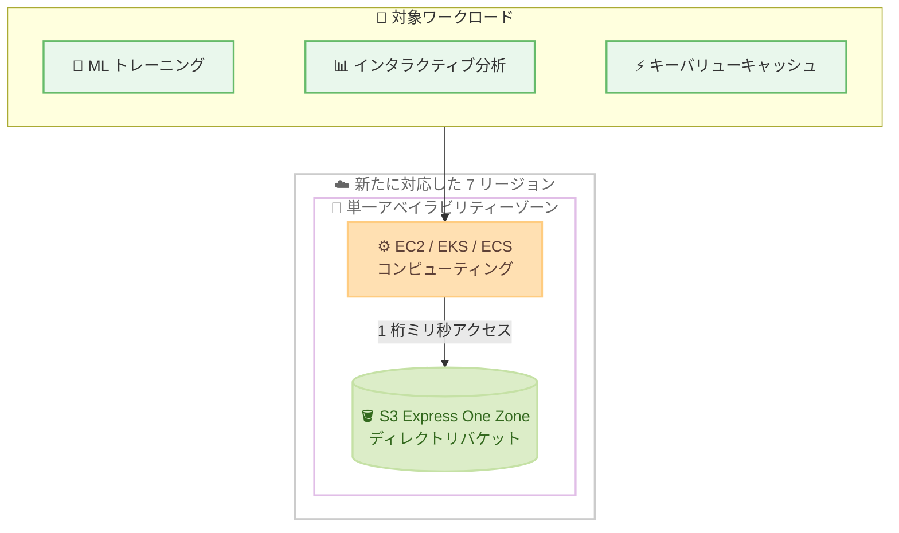

# Amazon S3 - S3 Express One Zone の 7 リージョン追加対応

**リリース日**: 2026 年 9 月 17 日
**サービス**: Amazon S3
**機能**: S3 Express One Zone ストレージクラスのリージョン拡大

📊 [このアップデートのインフォグラフィックを見る](https://takech9203.github.io/aws-news-summary/20260917-s3-express-one-zone-7-regions.html)

## 概要

Amazon S3 の高性能ストレージクラスである S3 Express One Zone が、新たに 7 つの AWS リージョンで利用可能になりました。今回追加されたのは、アジアパシフィック (シンガポール)、アジアパシフィック (シドニー)、アジアパシフィック (ソウル)、カナダ (中部)、欧州 (パリ)、南米 (サンパウロ)、米国西部 (北カリフォルニア) の各リージョンです。この拡大により、S3 Express One Zone は合計 15 の AWS リージョンで利用できるようになりました。

S3 Express One Zone は、頻繁にアクセスされるデータやレイテンシーの影響を受けやすいアプリケーション向けに設計された、単一アベイラビリティーゾーン (AZ) 構成のストレージクラスです。一貫した 1 桁ミリ秒のデータアクセスを実現し、S3 Standard と比較してデータアクセス速度は最大 10 倍高速、リクエストコストは最大 80% 低くなります。

機械学習のトレーニング、インタラクティブな分析、AI 検索エンジン向けのキーバリューキャッシュなど、高スループット・低レイテンシーが求められるワークロードを、これまで対応していなかったリージョンでも実行できるようになります。

**アップデート前の課題**

- 上記 7 リージョンでは S3 Express One Zone を利用できず、低レイテンシーストレージが必要なワークロードは対応リージョンに配置する必要があった
- データレジデンシー要件により特定リージョンでの運用が必須の場合、S3 Express One Zone の性能メリットを享受できなかった
- コンピューティングリソースと低レイテンシーストレージを同一リージョンに配置できず、リージョン間のデータ転送によるレイテンシーとコストが発生していた

**アップデート後の改善**

- 追加された 7 リージョンでディレクトリバケットを作成し、1 桁ミリ秒のデータアクセスを利用できるようになった
- アジアパシフィック、カナダ、欧州、南米の各地域でデータレジデンシー要件を満たしながら高性能ストレージを利用可能になった
- コンピューティングとストレージを同一リージョン・同一 AZ に配置し、レイテンシーを最小化できるようになった

## アーキテクチャ図



コンピューティングリソースとディレクトリバケットを同一 AZ に配置することで、1 桁ミリ秒の一貫した低レイテンシーアクセスを実現する構成を示しています。

## サービスアップデートの詳細

### 主要機能

1. **7 つの新規リージョンへの拡大**
   - アジアパシフィック (シンガポール)、アジアパシフィック (シドニー)、アジアパシフィック (ソウル) の 3 リージョンが追加され、アジアパシフィック地域でのカバレッジが強化された
   - カナダ (中部)、欧州 (パリ)、南米 (サンパウロ)、米国西部 (北カリフォルニア) も追加され、合計 15 リージョンで利用可能になった

2. **一貫した 1 桁ミリ秒のデータアクセス**
   - 頻繁にアクセスされるデータやレイテンシーの影響を受けやすいアプリケーション向けに設計された高性能ストレージクラス
   - S3 Standard と比較してデータアクセス速度は最大 10 倍高速

3. **リクエストコストの削減**
   - S3 Standard と比較してリクエストコストが最大 80% 低い
   - 大量の小さなオブジェクトへの高頻度アクセスが発生するワークロードでコスト効率が向上

## 技術仕様

### 今回追加されたリージョン

| リージョン名 | リージョンコード |
|------|------|
| アジアパシフィック (シンガポール) | ap-southeast-1 |
| アジアパシフィック (シドニー) | ap-southeast-2 |
| アジアパシフィック (ソウル) | ap-northeast-2 |
| カナダ (中部) | ca-central-1 |
| 欧州 (パリ) | eu-west-3 |
| 南米 (サンパウロ) | sa-east-1 |
| 米国西部 (北カリフォルニア) | us-west-1 |

### S3 Express One Zone の特徴

| 項目 | 詳細 |
|------|------|
| ストレージ構成 | 単一アベイラビリティーゾーン |
| バケットタイプ | ディレクトリバケット |
| データアクセス速度 | S3 Standard 比で最大 10 倍高速 |
| リクエストコスト | S3 Standard 比で最大 80% 低い |
| レイテンシー | 一貫した 1 桁ミリ秒 |
| 利用可能リージョン数 | 15 リージョン |

## 設定方法

### 前提条件

1. AWS アカウントを保有していること
2. S3 のディレクトリバケットを作成する IAM 権限があること
3. 対象リージョンで利用可能なアベイラビリティーゾーン ID を確認していること

### 手順

#### ステップ 1: 対象リージョンのアベイラビリティーゾーン ID を確認

```bash
aws ec2 describe-availability-zones \
  --region ap-southeast-1 \
  --query "AvailabilityZones[].{Name:ZoneName,Id:ZoneId}" \
  --output table
```

対象リージョン (例: シンガポール) のアベイラビリティーゾーン名と AZ ID の対応を一覧表示します。ディレクトリバケットの作成には AZ ID (例: apse1-az1) を指定します。

#### ステップ 2: ディレクトリバケットを作成

```bash
aws s3api create-bucket \
  --bucket my-express-bucket--apse1-az1--x-s3 \
  --region ap-southeast-1 \
  --create-bucket-configuration '{
    "Location": {"Type": "AvailabilityZone", "Name": "apse1-az1"},
    "Bucket": {"DataRedundancy": "SingleAvailabilityZone", "Type": "Directory"}
  }'
```

指定した AZ にディレクトリバケットを作成します。バケット名は `{ベース名}--{AZ ID}--x-s3` の命名規則に従う必要があります。

#### ステップ 3: オブジェクトのアップロードとアクセス確認

```bash
aws s3api put-object \
  --bucket my-express-bucket--apse1-az1--x-s3 \
  --key sample-data/object1 \
  --body ./object1
```

作成したディレクトリバケットにオブジェクトをアップロードし、動作を確認します。高頻度アクセスには CreateSession API によるセッションベース認証が利用され、低レイテンシーが実現されます。

## メリット

### ビジネス面

- **データレジデンシー要件への対応**: シンガポール、ソウル、パリ、サンパウロなど、データの国内保管が求められる地域で高性能ストレージを利用可能
- **コスト削減**: リクエストコストが S3 Standard 比で最大 80% 低く、高頻度アクセスワークロードの運用コストを削減
- **グローバル展開の加速**: 各地域のユーザーに近い場所で低レイテンシーなアプリケーションを提供可能

### 技術面

- **一貫した低レイテンシー**: 1 桁ミリ秒のデータアクセスにより、ML トレーニングや分析ジョブの処理時間を短縮
- **コンピューティングとの同一 AZ 配置**: EC2 や EKS などのコンピューティングリソースと同一 AZ にデータを配置し、ネットワークレイテンシーを最小化
- **高いスループット**: 大量の小さなオブジェクトへの高頻度リクエストを効率的に処理

## デメリット・制約事項

### 制限事項

- 単一 AZ 構成のため、AZ 障害時にはデータが利用できなくなる、または喪失するリスクがある
- ディレクトリバケットは汎用バケットと異なる命名規則・API 動作を持ち、一部の S3 機能に制限がある
- ストレージ単価は S3 Standard より高いため、アクセス頻度の低いデータには不向き

### 考慮すべき点

- 耐障害性が求められるデータは S3 Standard など複数 AZ 構成のストレージクラスと併用する設計が必要
- 性能を最大化するには、コンピューティングリソースをディレクトリバケットと同一 AZ に配置する必要がある

## ユースケース

### ユースケース 1: 機械学習トレーニングの高速化

**シナリオ**: ソウルリージョンで大規模な ML トレーニングを実行しており、トレーニングデータの読み込みがボトルネックになっている。

**実装例**:
```
1. ソウルリージョンの GPU インスタンスと同一 AZ にディレクトリバケットを作成
2. トレーニングデータをディレクトリバケットにコピー
3. トレーニングジョブからディレクトリバケットを直接参照
```

**効果**: データ読み込みのレイテンシーが短縮され、GPU の待機時間が減少し、トレーニング全体の時間とコストを削減できる。

### ユースケース 2: インタラクティブ分析の応答性向上

**シナリオ**: サンパウロリージョンで BI ツールによるインタラクティブなクエリ分析を提供しており、クエリ応答時間の短縮が求められている。

**実装例**:
```
1. 頻繁に参照されるホットデータをディレクトリバケットに配置
2. 分析エンジンからディレクトリバケットを参照
3. アクセス頻度の低いデータは S3 Standard に保持し階層化
```

**効果**: 高頻度アクセスデータへの 1 桁ミリ秒アクセスにより、クエリの応答時間が改善し、分析者の生産性が向上する。

### ユースケース 3: AI 検索エンジン向けキーバリューキャッシュ

**シナリオ**: シンガポールリージョンで AI 検索エンジンを運用しており、埋め込みデータや中間結果を低コスト・低レイテンシーでキャッシュしたい。

**実装例**:
```
1. 検索エンジンのコンピューティングと同一 AZ にディレクトリバケットを作成
2. キーバリュー形式のキャッシュデータをディレクトリバケットに格納
3. 高頻度の GET / PUT リクエストをディレクトリバケットで処理
```

**効果**: S3 Standard 比で最大 80% 低いリクエストコストで、大量の高頻度リクエストを低レイテンシーに処理できる。

## 料金

S3 Express One Zone では、ストレージ容量とリクエスト数に基づく料金が発生します。リクエスト料金は S3 Standard と比較して最大 80% 低く設定されていますが、ストレージ単価は S3 Standard より高くなります。リージョンごとの詳細な料金は [Amazon S3 の料金ページ](https://aws.amazon.com/s3/pricing/) を参照してください。

## 利用可能リージョン

今回の拡大により、以下の 7 リージョンが追加され、S3 Express One Zone は合計 15 の AWS リージョンで利用可能になりました。

- アジアパシフィック (シンガポール)
- アジアパシフィック (シドニー)
- アジアパシフィック (ソウル)
- カナダ (中部)
- 欧州 (パリ)
- 南米 (サンパウロ)
- 米国西部 (北カリフォルニア)

利用可能なリージョンとアベイラビリティーゾーンの最新一覧は [公式ドキュメント](https://docs.aws.amazon.com/AmazonS3/latest/userguide/s3-express-Endpoints.html) を参照してください。

## 関連サービス・機能

- **Amazon S3 Standard**: 複数 AZ 構成の汎用ストレージクラス。耐障害性が必要なデータの保管先として S3 Express One Zone と併用可能
- **Amazon EC2 / Amazon EKS / Amazon ECS**: ディレクトリバケットと同一 AZ に配置することで、低レイテンシーアクセスの効果を最大化できるコンピューティングサービス
- **Amazon SageMaker AI**: ML トレーニングデータの高速な読み込み先として S3 Express One Zone を活用可能
- **Mountpoint for Amazon S3**: ディレクトリバケットをファイルシステムとしてマウントし、ファイルベースのワークロードから利用可能

## 参考リンク

- 📊 [インフォグラフィック](https://takech9203.github.io/aws-news-summary/20260917-s3-express-one-zone-7-regions.html)
- [公式発表 (What's New)](https://aws.amazon.com/about-aws/whats-new/2026/09/s3-express-one-zone-7-regions/)
- [S3 Express One Zone 製品ページ](https://aws.amazon.com/s3/storage-classes/express-one-zone/)
- [ドキュメント: S3 Express One Zone の開始方法](https://docs.aws.amazon.com/AmazonS3/latest/userguide/s3-express-getting-started.html)
- [ドキュメント: 利用可能リージョンとエンドポイント](https://docs.aws.amazon.com/AmazonS3/latest/userguide/s3-express-Endpoints.html)
- [料金ページ](https://aws.amazon.com/s3/pricing/)

## まとめ

S3 Express One Zone の 7 リージョン追加により、アジアパシフィック、カナダ、欧州、南米の主要リージョンで 1 桁ミリ秒の低レイテンシーストレージが利用可能になりました。ML トレーニングやインタラクティブ分析などのレイテンシーの影響を受けやすいワークロードを対象リージョンで運用している場合は、コンピューティングと同一 AZ へのディレクトリバケット配置を検討することを推奨します。
