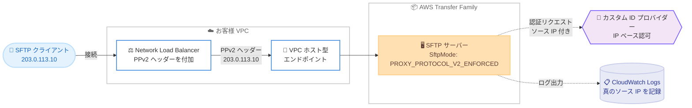

# AWS Transfer Family - NLB 配下の SFTP サーバーにおけるソース IP 保持のサポート

**リリース日**: 2026 年 9 月 17 日
**サービス**: AWS Transfer Family
**機能**: Source IP preservation for SFTP servers behind a Network Load Balancer (PROXY protocol v2)

📊 [このアップデートのインフォグラフィックを見る](https://takech9203.github.io/aws-news-summary/20260917-transfer-family-sftp-source-ip-nlb.html)

## 概要

AWS Transfer Family が、VPC ホスト型エンドポイントを使用する SFTP サーバーの前段にお客様管理の Network Load Balancer (NLB) を配置した構成において、PROXY protocol v2 (PPv2) を使用してクライアントの元のソース IP アドレスを保持できるようになりました。NLB が接続に PPv2 ヘッダーを付加し、Transfer Family がそのヘッダーを読み取ることで、クライアントの真のソース IP がエンドツーエンドで保持されます。

保持されたソース IP は、Amazon CloudWatch Logs のログエントリに記録されるほか、カスタム ID プロバイダーへの認証リクエストにも引き渡されます。これにより、IP ベースの監査、アクセス制御、コンプライアンス対応が可能になります。カスタムリスナーポートの提供などを目的に NLB を利用しているお客様にとって、これまでの大きな制約が解消されるアップデートです。

本機能はサーバーごとに個別に設定でき、コンソール、AWS CLI、API のいずれからでも有効化できます。

**アップデート前の課題**

- NLB が Transfer Family サーバーへの接続時にクライアントのソース IP を NLB 自身のプライベート IP に置き換えるため、Transfer Family のログやイベントには NLB のアドレスが記録され、真のクライアント IP を確認できなかった
- カスタム ID プロバイダーでの認証時にも NLB のプライベート IP が渡されるため、クライアントの実際の接続元アドレスに基づく IP ベースの認可を実装できなかった
- 接続元 IP を要件とする監査やコンプライアンス対応において、NLB を経由する構成が採用しづらかった

**アップデート後の改善**

- PPv2 によりクライアントの元のソース IP がエンドツーエンドで保持され、CloudWatch Logs のログエントリに記録されるようになった
- カスタム ID プロバイダーへの認証リクエストにクライアントの真のソース IP が渡され、IP ベースのアクセスポリシーを記述できるようになった
- IP ベースの監査、アクセス制御、コンプライアンス要件を満たしつつ、NLB を前段に配置した SFTP アーキテクチャを採用できるようになった

## アーキテクチャ図



NLB がクライアント接続に PPv2 ヘッダーを付加し、Transfer Family の SFTP サーバーがそのヘッダーからクライアントの真のソース IP を読み取ります。保持された IP はカスタム ID プロバイダーへの認証リクエストと CloudWatch Logs の両方で利用できます。

## サービスアップデートの詳細

### 主要機能

1. **PROXY protocol v2 によるソース IP の保持**
   - NLB のターゲットグループで `proxy_protocol_v2.enabled` 属性を有効化すると、NLB が各接続に PPv2 ヘッダーを付加する
   - Transfer Family の SFTP サーバーが PPv2 ヘッダーを読み取り、クライアントの元のソース IP を取得する
   - VPC ホスト型エンドポイントを使用する SFTP サーバーが対象

2. **カスタム ID プロバイダーへのソース IP の引き渡し**
   - Transfer Family がカスタム ID プロバイダーに送信する認証リクエストに、クライアントの真のソース IP が含まれる
   - 接続元アドレスに基づく IP ベースのアクセスポリシーを実装可能

3. **CloudWatch Logs への真のソース IP の記録**
   - ログエントリにクライアントの元のソース IP が記録され、監査やトラブルシューティングに活用できる
   - `CONNECTED` アクティビティのログで PPv2 ヘッダーの受信状況を確認可能 (構造化ログでは `proxy-protocol-v2-header` フィールド、レガシーログでは `ProxyProtocolV2Header` フィールド)

4. **サーバー単位での有効化と強制モード**
   - `ProtocolDetails` の `ProxyConfig.SftpMode` パラメータで制御し、`NONE` (デフォルト) と `PROXY_PROTOCOL_V2_ENFORCED` の 2 値を持つ
   - `PROXY_PROTOCOL_V2_ENFORCED` に設定すると、有効な PPv2 ヘッダーのないすべての SFTP 接続を拒否し、エラーを CloudWatch Logs に記録する
   - コンソール、CLI、API のいずれからでもサーバーごとに設定可能

## 技術仕様

### SftpMode の設定値

| 設定値 | 動作 |
|------|------|
| `NONE` (デフォルト) | PPv2 ヘッダーを読み取るが無視する。ヘッダーの有無にかかわらず接続を受け付ける |
| `PROXY_PROTOCOL_V2_ENFORCED` | すべての SFTP 接続に有効な PPv2 ヘッダーを要求する。ヘッダーのない接続は拒否され、エラーがログに記録される |

### ログフィールドのセマンティクス

| フィールドの状態 | 意味 |
|------|------|
| フィールドなし | 接続に PPv2 ヘッダーが含まれていなかった |
| `ignored` | `SftpMode=NONE` の状態で PPv2 ヘッダーを受信した |
| `applied` | `PROXY_PROTOCOL_V2_ENFORCED` の状態で PPv2 ヘッダーを受信し、サーバーが適用した |

### API 変更履歴

| 日付 | サービス | 変更内容 |
|------|----------|----------|
| 2026/09/15 | [AWS Transfer Family](https://awsapichanges.com/archive/changes/4cd222-transfer.html) | 3 updated api methods - NLB 配下の SFTP 接続で PPv2 によるソース IP 保持をサポート (`ProtocolDetails` に `ProxyConfig` を追加) |

## 設定方法

### 前提条件

1. VPC ホスト型エンドポイントを使用する SFTP プロトコルの Transfer Family サーバーが存在すること
2. サーバーの VPC エンドポイントをターゲットとする NLB とターゲットグループが構成されていること
3. `PROXY_PROTOCOL_V2_ENFORCED` を有効化する場合、サーバーの VPC エンドポイントのセキュリティグループを、信頼された NLB 経由のインバウンドトラフィックのみ許可するよう制限すること

### 手順

以下の 3 ステップをこの順番で実施することで、接続を拒否することなくダウンタイムなしで移行できます。

#### ステップ 1: NLB ターゲットグループで PROXY protocol v2 を有効化

```bash
aws elbv2 modify-target-group-attributes \
  --target-group-arn <your-target-group-arn> \
  --attributes Key=proxy_protocol_v2.enabled,Value=true
```

サーバーの VPC エンドポイントを指す NLB ターゲットグループで `proxy_protocol_v2.enabled` 属性を有効化し、NLB が各接続に PPv2 ヘッダーを付加するようにします。サーバーが `SftpMode=NONE` のままであればヘッダーは読み取られたうえで無視されるため、この段階で接続への影響はありません。

#### ステップ 2: すべての接続でヘッダーが到達していることを確認

```bash
aws logs filter-log-events \
  --log-group-name /aws/transfer/<your-server-id> \
  --filter-pattern '{ $.activity-type = "CONNECTED" }'
```

CloudWatch Logs の `CONNECTED` アクティビティのログエントリを確認し、構造化 (JSON) ログの場合は `proxy-protocol-v2-header` フィールドが `ignored` になっていることを確認します。フィールドが存在しないエントリがある場合、PPv2 ヘッダーなしでサーバーに到達する経路が残っているため、その状態で強制モードを有効化するとそれらの接続が拒否されます。すべての `CONNECTED` エントリでフィールドが `ignored` になるまで確認を続けます。

#### ステップ 3: PROXY protocol v2 の強制を有効化

```bash
aws transfer update-server \
  --server-id <your-server-id> \
  --protocol-details ProxyConfig={SftpMode=PROXY_PROTOCOL_V2_ENFORCED}
```

サーバーの `SftpMode` を `PROXY_PROTOCOL_V2_ENFORCED` に更新し、すべての SFTP 接続に有効な PPv2 ヘッダーを要求します。コンソールの場合は、サーバー詳細ページの [追加の詳細] で [PROXY protocol configuration] オプションを有効にします。ロールバックする場合は `SftpMode` を `NONE` に戻します。

## メリット

### ビジネス面

- **コンプライアンス対応の強化**: 接続元 IP の記録が必要な監査要件や規制要件を、NLB を経由する構成でも満たせる
- **セキュリティポリシーの一貫性**: クライアントの実際の接続元アドレスに基づくアクセス制御を実現し、組織のセキュリティポリシーを SFTP 経路にも適用できる
- **既存アーキテクチャの活用**: カスタムリスナーポートの提供などの理由で NLB を利用している既存構成を、可視性を犠牲にすることなく維持できる

### 技術面

- **IP ベース認可の実現**: カスタム ID プロバイダーが受け取る認証リクエストに真のソース IP が含まれるため、接続元に応じた許可 / 拒否ロジックを実装できる
- **トラブルシューティングの改善**: CloudWatch Logs に真のクライアント IP が記録され、接続問題の調査や不正アクセスの追跡が容易になる
- **ダウンタイムなしの移行**: `NONE` モードでは PPv2 ヘッダーを無視するため、段階的な有効化により接続断なしで強制モードへ移行できる

## デメリット・制約事項

### 制限事項

- 対象は SFTP プロトコルのみで、FTP / FTPS では NLB を前段に配置すること自体が非推奨 (コスト増加と同時接続数の減少を招くため)
- VPC ホスト型エンドポイントを使用するサーバーが対象
- `SftpMode` の設定値は `NONE` と `PROXY_PROTOCOL_V2_ENFORCED` の 2 値のみで、ヘッダーがある場合のみ適用するといった中間モードはない

### 考慮すべき点

- `PROXY_PROTOCOL_V2_ENFORCED` を有効化する場合、サーバーの VPC エンドポイントのセキュリティグループを信頼された NLB 経由のトラフィックのみに制限する必要がある (PPv2 ヘッダーは偽装され得るため)
- 強制モードでは有効な PPv2 ヘッダーのない接続がすべて拒否されるため、有効化前にすべての接続経路でヘッダーが付加されていることをログで確認する必要がある
- Transfer Family はすでに複数のポートを提供しているため、NLB 追加前にエンドポイントタイプマトリクスを確認し、NLB が本当に必要かを検討することが推奨される

## ユースケース

### ユースケース 1: カスタム ID プロバイダーによる IP ベースのアクセス制御

**シナリオ**: 金融機関が取引先ごとに許可された IP アドレスからのみ SFTP 接続を受け付けたい。カスタムポートの提供のために NLB を利用している。

**実装例**:
```python
# カスタム ID プロバイダー (Lambda) での IP ベース認可の例
ALLOWED_CIDRS = {
    "partner-a": ["203.0.113.0/24"],
    "partner-b": ["198.51.100.0/24"],
}

def lambda_handler(event, context):
    username = event["username"]
    source_ip = event["sourceIp"]  # PPv2 により真のクライアント IP が渡される

    if not is_ip_allowed(source_ip, ALLOWED_CIDRS.get(username, [])):
        return {}  # 認証拒否

    return build_auth_response(username)
```

**効果**: NLB 経由の接続でも取引先の実際の接続元 IP で認可でき、許可外のネットワークからのアクセスを認証段階でブロックできる。

### ユースケース 2: 監査要件を満たすアクセスログの取得

**シナリオ**: 規制業種の企業が、ファイル転送の全アクセスについて接続元 IP を含む監査証跡の保存を義務付けられている。

**実装例**:
```bash
# CloudWatch Logs Insights で接続元 IP ごとのアクセスを集計
aws logs start-query \
  --log-group-name /aws/transfer/<your-server-id> \
  --start-time $(date -d '7 days ago' +%s) \
  --end-time $(date +%s) \
  --query-string 'filter `activity-type` = "CONNECTED" | stats count(*) by `source-ip`'
```

**効果**: NLB のプライベート IP ではなく真のクライアント IP がログに記録されるため、接続元単位の監査レポートを作成でき、コンプライアンス要件を満たせる。

### ユースケース 3: 既存 NLB 構成のダウンタイムなしの移行

**シナリオ**: すでに NLB 配下で SFTP サーバーを運用しており、接続を止めずにソース IP 保持を有効化したい。

**実装例**:
```bash
# 1. ターゲットグループで PPv2 を有効化 (この時点では無視されるため影響なし)
aws elbv2 modify-target-group-attributes \
  --target-group-arn <tg-arn> \
  --attributes Key=proxy_protocol_v2.enabled,Value=true

# 2. ログで全接続に proxy-protocol-v2-header: ignored が付くことを確認後、強制を有効化
aws transfer update-server \
  --server-id <server-id> \
  --protocol-details ProxyConfig={SftpMode=PROXY_PROTOCOL_V2_ENFORCED}
```

**効果**: `NONE` モードで PPv2 ヘッダーの到達を検証してから強制モードに切り替えることで、接続断を発生させずに安全に移行できる。

## 料金

本機能自体に追加料金はありません。AWS Transfer Family の標準料金 (有効化したプロトコルごとの時間課金とデータ転送量に基づく課金) と、お客様管理の NLB に対する Elastic Load Balancing の料金が適用されます。

## 利用可能リージョン

AWS Transfer Family が利用可能なすべての AWS リージョンで利用できます。最新のリージョン一覧は [AWS リージョン別サービス表](https://aws.amazon.com/about-aws/global-infrastructure/regional-product-services/) を参照してください。

## 関連サービス・機能

- **Elastic Load Balancing (NLB)**: ターゲットグループの `proxy_protocol_v2.enabled` 属性で PPv2 ヘッダーの付加を制御する
- **Amazon CloudWatch Logs**: 保持されたソース IP や PPv2 ヘッダーの適用状況 (`ignored` / `applied`) がログに記録される
- **AWS Lambda / Amazon API Gateway**: カスタム ID プロバイダーの実装先として、認証リクエストに含まれる真のソース IP を使用した認可ロジックを実装できる

## 参考リンク

- 📊 [インフォグラフィック](https://takech9203.github.io/aws-news-summary/20260917-transfer-family-sftp-source-ip-nlb.html)
- [公式発表 (What's New)](https://aws.amazon.com/about-aws/whats-new/2026/09/transfer-family-sftp-source-ip-nlb/)
- [ドキュメント: Working with Network Load Balancers](https://docs.aws.amazon.com/transfer/latest/userguide/working-with-nlb.html#nlb-sftp-source-ip)
- [API リファレンス: ProtocolDetails](https://docs.aws.amazon.com/transfer/latest/APIReference/API_ProtocolDetails.html)
- [料金ページ](https://aws.amazon.com/aws-transfer-family/pricing/)

## まとめ

NLB 配下の SFTP サーバーでクライアントの真のソース IP を保持できるようになり、これまで NLB 構成のネックだった IP ベースの認可・監査・コンプライアンス対応が可能になりました。すでに NLB を利用している場合は、ターゲットグループでの PPv2 有効化、ログでのヘッダー到達確認、強制モードへの切り替えという 3 ステップでダウンタイムなしに導入できます。強制モード有効化時は、セキュリティグループを信頼された NLB 経由のトラフィックのみに制限することを忘れないでください。
