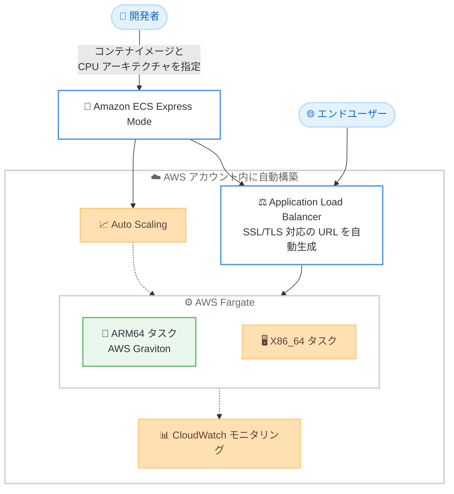

# Amazon ECS - Express Mode の AWS Graviton (ARM64) ワークロード対応

**リリース日**: 2026 年 9 月 18 日
**サービス**: Amazon Elastic Container Service (Amazon ECS)
**機能**: Amazon ECS Express Mode における ARM64 アーキテクチャのサポート

📊 [このアップデートのインフォグラフィックを見る](https://takech9203.github.io/aws-news-summary/20260918-amazon-ecs-express-mode-arm-architecture.html)

## 概要

Amazon ECS Express Mode が ARM64 アーキテクチャのワークロードに対応しました。これにより、ARM ベースのコンテナイメージを AWS Graviton ベースのコンピューティング上にデプロイできるようになり、x86 ベースと比較して最大 40% 優れた価格性能を実現できます。

Amazon ECS Express Mode は、コンテナイメージを指定するだけで、ネットワーク、ロードバランサー、Auto Scaling、デプロイの管理を AWS 側が自動的に処理し、自動生成された URL でアプリケーションを公開できる機能です。Web アプリケーションや API を、クラウドアーキテクチャの詳細を意識せずに数ステップでデプロイできます。

今回のアップデートにより、ワークロードの特性に応じて CPU アーキテクチャを選択できるようになりました。Graviton によるコスト最適化、既存フリートとのアーキテクチャ統一、ARM ネイティブでビルドされたイメージのデプロイなど、柔軟な選択が可能です。CPU アーキテクチャの設定は、新規および既存の Express Mode サービスの両方に適用でき、AWS Management Console、AWS CLI、AWS SDK、IaC ツールから設定できます。

**アップデート前の課題**

- 以前の Express Mode は x86 ベースのコンピューティングのみに対応しており、ARM64 用にビルドされたコンテナイメージをデプロイできなかった
- Graviton の価格性能メリットを活用するには、Express Mode を使わずに ECS サービスや Fargate タスクを手動で構成する必要があった
- Apple Silicon などの ARM 環境でネイティブビルドしたイメージを Express Mode で利用する場合、x86 向けにクロスビルドする手間が発生していた

**アップデート後の改善**

- Express Mode の簡単なデプロイ体験のまま、Graviton ベースの ARM64 ワークロードを実行できるようになった
- x86 ベースと比較して最大 40% 優れた価格性能を、追加のインフラ構成なしで享受できるようになった
- 新規サービスだけでなく既存の Express Mode サービスに対しても、CPU アーキテクチャを設定できるようになった

## アーキテクチャ図



Express Mode はコンテナイメージの指定だけでロードバランサーや Auto Scaling などのインフラを自動構築します。今回のアップデートで、実行基盤として ARM64 (Graviton) と X86_64 のいずれかを選択できるようになりました。

## サービスアップデートの詳細

### 主要機能

1. **ARM64 アーキテクチャの選択**
   - Express Mode サービスの実行基盤として ARM64 (AWS Graviton) を選択可能
   - ARM64 用にビルドされたコンテナイメージをそのままデプロイできる
   - x86 ベースのインスタンスと比較して最大 40% 優れた価格性能を実現

2. **新規・既存サービス両方への適用**
   - 新規に作成する Express Mode サービスで CPU アーキテクチャを指定可能
   - 既存の Express Mode サービスに対してもアーキテクチャ設定を変更可能

3. **複数の設定手段**
   - AWS Management Console、AWS CLI、AWS SDK から設定可能
   - CloudFormation や Terraform などの IaC ツールにも対応

## 技術仕様

### Express Mode の基本構成

| 項目 | 詳細 |
|------|------|
| 必要な入力 | コンテナイメージ、タスク実行ロール、インフラストラクチャロール |
| 実行基盤 | AWS Fargate (ARM64 または X86_64) |
| 自動構築されるリソース | ECS サービス、Application Load Balancer (SSL/TLS 対応)、Auto Scaling ポリシー、モニタリング、ネットワークコンポーネント |
| 公開方式 | 自動生成された URL によるパブリックまたはプライベートの HTTPS 公開 |
| 対応ユースケース | HTTP リクエストを処理するステートレスな Web アプリケーションおよび API |

### CPU アーキテクチャの指定

Express Mode サービスが利用するタスク定義では、ECS の `runtimePlatform` パラメータで CPU アーキテクチャを指定します。

```json
{
  "runtimePlatform": {
    "cpuArchitecture": "ARM64",
    "operatingSystemFamily": "LINUX"
  }
}
```

### API 変更履歴

本アップデートに伴う新規 API メソッドの追加は確認されていません。既存の ECS API における CPU アーキテクチャ指定 (`runtimePlatform` の `cpuArchitecture`) が Express Mode で利用可能になったアップデートです。

## 設定方法

### 前提条件

1. ARM64 (linux/arm64) 向けにビルドされたコンテナイメージが Amazon ECR などのレジストリに登録されていること
2. タスク実行ロールとインフラストラクチャロールが用意されていること
3. AWS CLI や IaC ツールを利用する場合は、最新バージョンに更新されていること

### 手順

#### ステップ 1: ARM64 向けコンテナイメージのビルドとプッシュ

```bash
# ARM64 向けにイメージをビルドして ECR にプッシュ
docker buildx build --platform linux/arm64 \
  -t <account-id>.dkr.ecr.<region>.amazonaws.com/my-app:latest \
  --push .
```

Docker Buildx を使用して linux/arm64 プラットフォーム向けにコンテナイメージをビルドし、Amazon ECR リポジトリへプッシュします。Apple Silicon などの ARM 環境ではネイティブビルドが可能です。

#### ステップ 2: Express Mode サービスの作成

AWS Management Console の Amazon ECS コンソールから Express Mode のワークフローを開き、以下を指定してサービスを作成します。

1. コンテナイメージの URI を指定
2. CPU アーキテクチャとして ARM64 を選択
3. タスク実行ロールとインフラストラクチャロールを指定

作成が完了すると、ロードバランサー、Auto Scaling、ネットワークが自動構成され、アプリケーションにアクセスできる URL が自動生成されます。

#### ステップ 3: 既存サービスのアーキテクチャ変更

既存の Express Mode サービスに対しても、コンソール、AWS CLI、SDK、IaC ツールから CPU アーキテクチャ設定を変更できます。変更時は、デプロイするコンテナイメージが指定したアーキテクチャに対応していることを確認してください。

## メリット

### ビジネス面

- **コスト削減**: Graviton ベースのコンピューティングにより、x86 ベースと比較して最大 40% 優れた価格性能を実現
- **市場投入の迅速化**: インフラ構成の専門知識がなくても、コスト効率の高い ARM64 環境へ迅速にデプロイ可能
- **追加料金なし**: Express Mode 自体は無料で、Fargate、ALB、CloudWatch など基盤リソースの利用料金のみ発生

### 技術面

- **アーキテクチャ選択の柔軟性**: ワークロードの特性に応じて ARM64 と X86_64 を選択可能
- **開発環境との整合性**: ARM 環境でネイティブビルドしたイメージをクロスビルドなしでデプロイ可能
- **既存フリートとの統一**: すでに Graviton を利用している環境と CPU アーキテクチャを揃えられる

## デメリット・制約事項

### 制限事項

- Express Mode は HTTP リクエストを処理するステートレスな Web アプリケーションおよび API を主な対象としている
- ARM64 を選択する場合、コンテナイメージが linux/arm64 向けにビルドされている必要がある
- x86 専用のバイナリや依存ライブラリを含むイメージはそのままでは動作しない

### 考慮すべき点

- ARM64 への移行時は、依存ライブラリやベースイメージの ARM64 対応状況を事前に確認する必要がある
- マルチアーキテクチャイメージ (multi-arch manifest) を利用すると、アーキテクチャ切り替え時の運用が容易になる
- 価格性能の改善効果はワークロードの特性により異なるため、移行前後でのベンチマーク取得を推奨

## ユースケース

### ユースケース 1: Web API のコスト最適化

**シナリオ**: Fargate 上で稼働する REST API のコンピューティングコストを削減したい。

**実装例**:
```bash
# ARM64 向けにマルチステージビルドを実行し ECR にプッシュ
docker buildx build --platform linux/arm64 -t my-api:arm64 --push .
# Express Mode サービスの CPU アーキテクチャを ARM64 に設定して更新
```

**効果**: アプリケーションコードの変更なしに、最大 40% 優れた価格性能で API を運用できる。

### ユースケース 2: ARM ネイティブ開発環境からの直接デプロイ

**シナリオ**: Apple Silicon 搭載マシンで開発しているチームが、ローカルでビルドしたイメージをそのままデプロイしたい。

**実装例**:
```bash
# ARM 環境でネイティブビルド
docker build -t my-app:latest .
docker push <account-id>.dkr.ecr.<region>.amazonaws.com/my-app:latest
```

**効果**: クロスビルドやエミュレーションが不要になり、ビルド時間の短縮と開発体験の向上を実現できる。

### ユースケース 3: 既存 Graviton フリートとのアーキテクチャ統一

**シナリオ**: EC2 や他の ECS サービスですでに Graviton を採用している組織が、Express Mode でデプロイするアプリケーションもアーキテクチャを統一したい。

**実装例**:
```json
{
  "runtimePlatform": {
    "cpuArchitecture": "ARM64",
    "operatingSystemFamily": "LINUX"
  }
}
```

**効果**: 組織全体で ARM64 に統一したビルドパイプラインとイメージ管理を維持でき、運用の一貫性が向上する。

## 料金

Amazon ECS Express Mode 自体の利用に追加料金はありません。アプリケーションの実行のために作成される以下の基盤リソースに対してのみ料金が発生します。

- AWS Fargate のコンピューティングリソース (ARM64 は x86 と比較して低い単価で提供)
- Application Load Balancer
- CloudWatch のログとメトリクス
- データ転送料金

詳細な料金は [AWS Fargate 料金ページ](https://aws.amazon.com/fargate/pricing/) を参照してください。

## 利用可能リージョン

すべての AWS 商用リージョンおよび AWS GovCloud (US) リージョンで利用可能です。

## 関連サービス・機能

- **AWS Fargate**: Express Mode サービスの実行基盤となるサーバーレスコンテナコンピューティング。ARM64 タスクは Graviton 上で実行される
- **AWS Graviton**: AWS が設計した ARM ベースのプロセッサ。x86 ベースと比較して優れた価格性能を提供
- **Elastic Load Balancing**: Express Mode が自動構成する Application Load Balancer。SSL/TLS 対応の URL を提供
- **Amazon ECR**: ARM64 向けコンテナイメージの保管に利用するコンテナレジストリ

## 参考リンク

- 📊 [インフォグラフィック](https://takech9203.github.io/aws-news-summary/20260918-amazon-ecs-express-mode-arm-architecture.html)
- [公式発表 (What's New)](https://aws.amazon.com/about-aws/whats-new/2026/09/amazon-ecs-express-mode-arm-architecture/)
- [Amazon ECS Express Mode ドキュメント](https://docs.aws.amazon.com/AmazonECS/latest/developerguide/express-service-overview.html)
- [Amazon ECS 製品ページ](https://aws.amazon.com/ecs/)
- [AWS Fargate 料金ページ](https://aws.amazon.com/fargate/pricing/)

## まとめ

Amazon ECS Express Mode の ARM64 対応により、シンプルなデプロイ体験と Graviton の価格性能メリットを同時に享受できるようになりました。Fargate 上で Web アプリケーションや API を運用しているチームは、コンテナイメージを ARM64 向けにビルドするだけで最大 40% 優れた価格性能を得られるため、依存ライブラリの ARM64 対応状況を確認のうえ、移行を検討することを推奨します。
