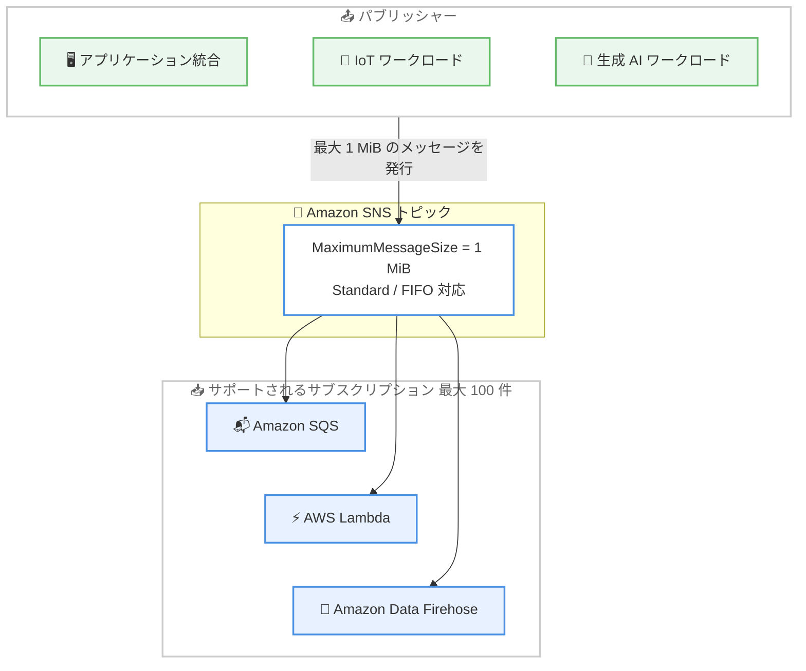

# Amazon SNS - 最大 1 MiB のメッセージペイロードサポート

**リリース日**: 2026 年 9 月 18 日
**サービス**: Amazon Simple Notification Service (Amazon SNS)
**機能**: 最大 1 MiB のメッセージペイロードサポート

📊 [このアップデートのインフォグラフィックを見る](https://takech9203.github.io/aws-news-summary/20260918-amazon-sns-1mib-support.html)

## 概要

Amazon SNS が、メッセージペイロードの最大サイズを従来の 256 KiB から 4 倍の 1 MiB (1,048,576 バイト) に拡張しました。トピック属性 `MaximumMessageSize` を設定することで、Standard トピックと FIFO トピックの両方でより大きなメッセージを発行できるようになります。

Amazon SNS は、マイクロサービスや分散システム、サーバーレスアプリケーションの疎結合化とスケーリングを実現するフルマネージドの pub/sub メッセージングサービスです。近年、アプリケーション統合、IoT、生成 AI などのワークロードでは 1 メッセージあたりのデータ量が増加しており、大きなペイロードをそのまま発行したいというニーズが高まっていました。今回のアップデートは、こうしたワークロードを持つ開発者やアーキテクトにとって、アーキテクチャの簡素化につながる重要な改善です。

**アップデート前の課題**

- 以前はメッセージペイロードの上限が 256 KiB に固定されており、それを超えるデータは発行できなかった
- 大きなペイロードを扱うには、Amazon S3 にデータを退避してメッセージには参照のみを含める (Extended Client Library の利用など) か、ペイロードを分割してから発行する必要があった
- ペイロードの退避や分割のための追加実装により、アプリケーションが複雑化し、遅延や運用負荷が増加していた

**アップデート後の改善**

- トピック属性 `MaximumMessageSize` を設定するだけで、最大 1 MiB のメッセージをそのまま発行できるようになった
- Standard トピックと FIFO トピックの両方で利用可能になった
- 256 KiB を超えるサイズを設定したトピックでは、Amazon SQS、Amazon Data Firehose、AWS Lambda のサブスクリプションがサポートされ、大きなメッセージをそのままダウンストリームに配信できるようになった

## アーキテクチャ図



`MaximumMessageSize` を 256 KiB より大きく設定したトピックでは、最大 1 MiB のメッセージを発行でき、Amazon SQS、AWS Lambda、Amazon Data Firehose の 3 種類のエンドポイントに配信できます。

## サービスアップデートの詳細

### 主要機能

1. **トピック属性 `MaximumMessageSize` による上限設定**
   - 1,024 バイトから 1,048,576 バイト (1 MiB) の範囲で任意の整数値を設定可能
   - デフォルトは従来どおり 262,144 バイト (256 KiB) で、既存トピック・新規トピックともに変更なし
   - 発行時にはメッセージ本文とメッセージ属性の合計サイズが検証され、上限を超えると `InvalidParameter` エラーが返される

2. **Standard トピックと FIFO トピックの両方をサポート**
   - メッセージ順序保証が必要なワークロードでも 1 MiB のペイロードを利用可能
   - 既存トピックに対しても `MaximumMessageSize` をいつでも増減可能

3. **256 KiB 超過時のサブスクリプション要件**
   - サポートされるエンドポイントは Amazon Data Firehose、Amazon SQS、AWS Lambda の 3 種類
   - トピックあたりのサブスクリプション数は合計 100 件まで
   - 既存トピックで上限を引き上げる場合、サブスクリプションがすべてサポート対象のエンドポイントタイプであり、かつ 100 件以下である必要がある

4. **既存 API での対応 (新規 API 不要)**
   - `CreateTopic` / `SetTopicAttributes` で `MaximumMessageSize` 属性を指定
   - `Publish` / `PublishBatch` はトピックに設定された上限に対してサイズを検証
   - `GetTopicAttributes` は属性が明示的に設定されている場合のみ値を返す

## 技術仕様

### MaximumMessageSize の仕様

| 項目 | 詳細 |
|------|------|
| 設定可能範囲 | 1,024 ~ 1,048,576 バイト |
| デフォルト値 | 262,144 バイト (256 KiB) |
| 対象トピック | Standard / FIFO |
| サイズ検証対象 | メッセージ本文 + メッセージ属性の合計 |
| 256 KiB 超過時のエンドポイント | Amazon SQS、AWS Lambda、Amazon Data Firehose |
| 256 KiB 超過時のサブスクリプション上限 | トピックあたり合計 100 件 |
| 256 KiB 以下のエンドポイント | 上記に加え HTTP/HTTPS、SMS、E メール、モバイルプッシュも利用可能 |

### 関連 API の動作

| API | 変更内容 |
|-----|----------|
| `CreateTopic` | `Attributes` パラメータで `MaximumMessageSize` を受け付け (有効範囲: 1,024 ~ 1,048,576 バイト) |
| `SetTopicAttributes` | 属性名として `MaximumMessageSize` を受け付け |
| `GetTopicAttributes` | 明示的に設定されている場合のみ `MaximumMessageSize` を返却 (未設定時はデフォルトの 256 KiB) |
| `Publish` | メッセージ本文と属性の合計サイズをトピックの上限に対して検証 |
| `PublishBatch` | バッチ内の各メッセージのサイズをトピックの上限に対して検証 |

### エンドポイントごとの配信仕様

| エンドポイント | 配信仕様 |
|----------------|----------|
| Amazon SQS | SNS トピックの `MaximumMessageSize` が実効的なサイズ上限となり、キュー側の `MaximumMessageSize` は SNS からのメッセージには適用されない |
| AWS Lambda | 非同期呼び出しで配信され、非同期呼び出しのペイロード上限は 1 MiB のため追加設定は不要 |
| Amazon Data Firehose | レコード上限は 1,000 KiB (1,024,000 バイト) で、SNS の配信メタデータを含めてこの上限を下回る必要がある。Firehose サブスクリプションを持つトピックでは `MaximumMessageSize` を低めに設定することが推奨される |

## 設定方法

### 前提条件

1. Amazon SNS トピックを作成・変更できる IAM 権限があること
2. 256 KiB を超える設定をする場合、対象トピックのサブスクリプションがすべて Amazon SQS、AWS Lambda、Amazon Data Firehose のいずれかであること
3. 対象トピックのサブスクリプション数が合計 100 件以下であること

### 手順

#### ステップ 1: 新規トピック作成時に上限を設定する

```bash
aws sns create-topic \
    --name my-large-message-topic \
    --attributes MaximumMessageSize=1048576
```

`MaximumMessageSize` 属性に 1,048,576 バイト (1 MiB) を指定して新しいトピックを作成しています。値は要件に応じて 1,024 ~ 1,048,576 の範囲で調整できます。

#### ステップ 2: 既存トピックの上限を変更する

```bash
aws sns set-topic-attributes \
    --topic-arn arn:aws:sns:us-east-1:123456789012:my-topic \
    --attribute-name MaximumMessageSize \
    --attribute-value 1048576
```

既存トピックの `MaximumMessageSize` 属性を 1 MiB に更新しています。変更後の発行リクエストから新しい上限で検証されます。

#### ステップ 3: 設定値を確認する

```bash
aws sns get-topic-attributes \
    --topic-arn arn:aws:sns:us-east-1:123456789012:my-topic
```

トピックの属性一覧を取得して `MaximumMessageSize` の現在値を確認しています。属性が明示的に設定されていない場合はレスポンスに含まれず、デフォルトの 262,144 バイト (256 KiB) が適用されます。

マネジメントコンソールから設定する場合は、SNS コンソールでトピックを選択して [編集] を開き、[Maximum message size] に希望する上限 (最大 1,024 KiB) を入力して保存します。

## メリット

### ビジネス面

- **開発コストの削減**: ペイロードの分割・退避のための独自実装が不要になり、開発・保守の工数を削減できる
- **アーキテクチャの簡素化**: S3 経由の受け渡しを省略できるケースが増え、構成要素と障害点を減らせる
- **モダンワークロードへの対応**: IoT や生成 AI など、メッセージあたりのデータ量が大きいワークロードをそのまま pub/sub パターンに載せられる

### 技術面

- **設定のみで有効化**: 新しい API を学習する必要がなく、トピック属性 `MaximumMessageSize` の設定だけで利用できる
- **Standard / FIFO 両対応**: 順序保証や重複排除が必要な FIFO ワークロードでも 1 MiB ペイロードを利用できる
- **柔軟なサイズ制御**: 1,024 バイトから 1 MiB まで任意の値を設定でき、ダウンストリームの制約 (Firehose のレコード上限など) に合わせた調整が可能

## デメリット・制約事項

### 制限事項

- 256 KiB を超える設定をしたトピックでは、サブスクリプションが Amazon SQS、AWS Lambda、Amazon Data Firehose に限定される (HTTP/HTTPS、SMS、E メール、モバイルプッシュは利用不可)
- 256 KiB を超える設定をしたトピックのサブスクリプション数は合計 100 件までに制限される
- Amazon Data Firehose のレコード上限は 1,000 KiB であり、SNS の配信メタデータを含めた配信サイズがこれを超えるとメッセージの配信に失敗する

### 考慮すべき点

- Standard トピックでは 64 KB ごとに 1 リクエストとして課金されるため、1 MiB のメッセージ 1 件の発行は 16 リクエスト分として課金される (コスト影響を事前に見積もることを推奨)
- 大きなメッセージの配信失敗に備え、すべてのサブスクリプションにデッドレターキュー (DLQ) を設定することが推奨される
- CloudWatch の `NumberOfNotificationsFailed` メトリクスにアラームを設定し、配信失敗を監視することが推奨される
- 1 MiB を超えるメッセージが必要な場合は、引き続き SNS Extended Client Library (Java / Python) による S3 経由の受け渡し (最大 2 GB) を利用する

## ユースケース

### ユースケース 1: 生成 AI パイプラインでのプロンプト・応答の配信

**シナリオ**: 生成 AI アプリケーションで、長いコンテキストを含むプロンプトや LLM の応答 (数百 KiB 規模) を複数のダウンストリーム処理 (ロギング、評価、後処理) にファンアウトする。

**実装例**:
```bash
aws sns create-topic \
    --name genai-response-fanout \
    --attributes MaximumMessageSize=1048576
```

**効果**: これまで必要だった S3 への退避と参照渡しが不要になり、SQS キューや Lambda 関数へ応答データを直接ファンアウトできるため、パイプラインの遅延と実装の複雑さを削減できる。

### ユースケース 2: IoT デバイスからのバッチテレメトリ集約

**シナリオ**: IoT ゲートウェイがデバイス群のテレメトリをまとめて送信し、SNS 経由で分析基盤 (Firehose) とリアルタイム処理 (Lambda) に同時配信する。

**実装例**:
```bash
# Firehose のレコード上限 1,000 KiB を考慮して低めに設定
aws sns set-topic-attributes \
    --topic-arn arn:aws:sns:ap-northeast-1:123456789012:iot-telemetry \
    --attribute-name MaximumMessageSize \
    --attribute-value 900000
```

**効果**: バッチ化したテレメトリを分割せずに 1 メッセージとして発行でき、メッセージ数の削減と処理の単純化を実現できる。Firehose の制約に合わせた上限設定で配信失敗も防止できる。

### ユースケース 3: FIFO トピックでの大きな業務イベントの順序配信

**シナリオ**: 注文処理システムで、明細を多数含む大きな注文イベント (最大数百 KiB) を、順序を保証しながら複数の SQS FIFO キューに配信する。

**実装例**:
```bash
aws sns create-topic \
    --name order-events.fifo \
    --attributes '{"FifoTopic":"true","MaximumMessageSize":"1048576"}'
```

**効果**: 大きな注文イベントを分割せずに順序保証付きで配信できるため、受信側での再構築処理が不要になり、整合性の担保が容易になる。

## 料金

追加機能としての新たな料金体系はなく、既存の Amazon SNS の料金モデルが適用されます。ペイロードサイズの拡大に伴う課金には以下の点に注意が必要です。

- **Standard トピック**: 発行データ 64 KB ごとに 1 リクエストとして課金される。例えば 1 MiB のペイロードを 1 回発行すると 16 リクエスト分として課金される。通知配信 (SMS を除く) も同様に 64 KB 単位でカウントされる
- **FIFO トピック**: 発行メッセージ数・配信メッセージ数に加えて、ペイロードデータ量 (GB 単位) に対して課金される。1 MiB までのメッセージは 1 メッセージとしてカウントされる (1 KB 未満は 1 KB に切り上げ)
- **S3 経由の大容量ペイロード**: Extended Client Library を利用する場合は、SNS の料金に加えて S3 の標準料金が発生する

最新の料金詳細は [Amazon SNS 料金ページ](https://aws.amazon.com/sns/pricing/) を参照してください。

## 利用可能リージョン

Amazon SNS が利用可能なすべての AWS リージョンで利用できます (東京・大阪リージョンを含む)。

## 関連サービス・機能

- **Amazon SQS**: 256 KiB 超のメッセージ配信先としてサポートされる。SNS トピックの `MaximumMessageSize` が実効上限となり、キュー側の設定は適用されない
- **AWS Lambda**: 非同期呼び出しのペイロード上限が 1 MiB のため、追加設定なしで大きなメッセージを受信できる
- **Amazon Data Firehose**: 分析基盤へのストリーミング配信先としてサポートされる。レコード上限 1,000 KiB に注意が必要
- **SNS Extended Client Library**: 1 MiB を超えるペイロード (最大 2 GB) を S3 経由で受け渡すためのライブラリ。Java 版と Python 版が提供されている

## 参考リンク

- 📊 [インフォグラフィック](https://takech9203.github.io/aws-news-summary/20260918-amazon-sns-1mib-support.html)
- [公式発表 (What's New)](https://aws.amazon.com/about-aws/whats-new/2026/09/amazon-sns-1mib-support)
- [ドキュメント: Publishing large messages with Amazon SNS](https://docs.aws.amazon.com/sns/latest/dg/large-message-payloads.html)
- [Amazon SNS 製品ページ](https://aws.amazon.com/sns/)
- [料金ページ](https://aws.amazon.com/sns/pricing/)

## まとめ

Amazon SNS のメッセージペイロード上限が 256 KiB から 1 MiB に拡張され、生成 AI や IoT などデータ量の大きいワークロードでも、ペイロードの分割や S3 への退避なしで pub/sub パターンを利用できるようになりました。既存トピックでもトピック属性 `MaximumMessageSize` の変更だけで有効化できるため、現在 Extended Client Library やペイロード分割で回避しているワークロードは、構成の簡素化を検討する価値があります。導入時は、サブスクリプションのエンドポイント制限 (SQS / Lambda / Firehose のみ、最大 100 件) と Standard トピックの 64 KB 単位課金によるコスト影響を必ず確認してください。
